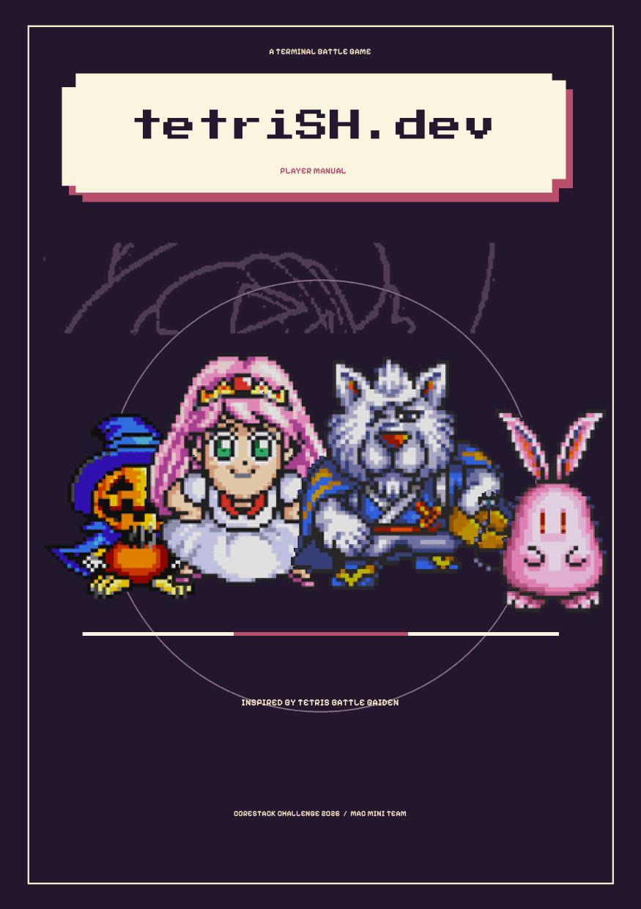
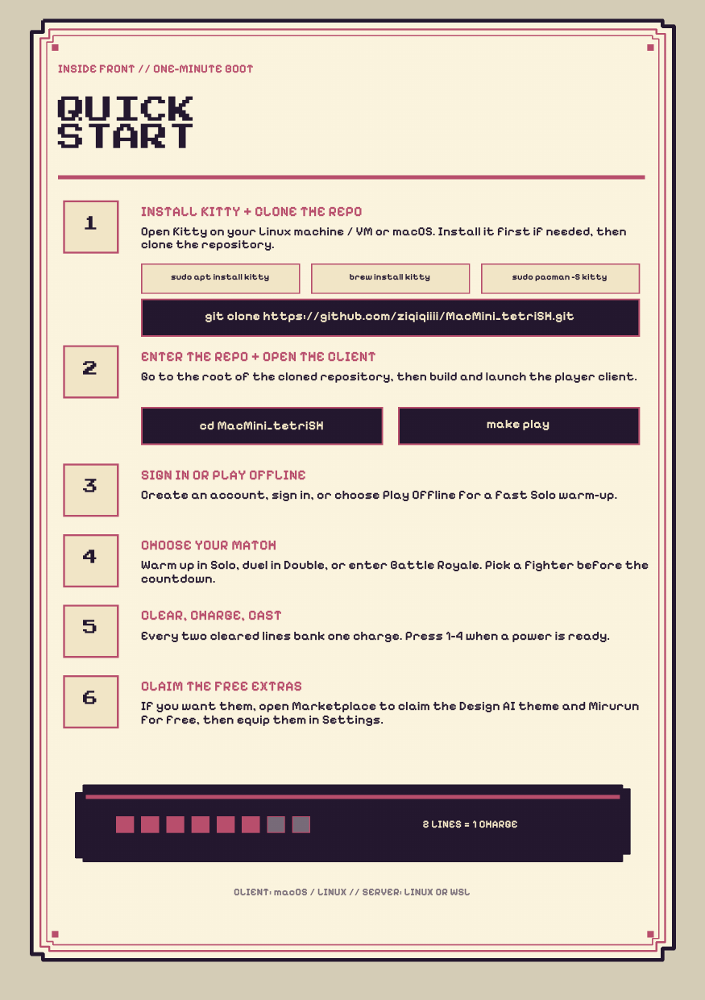

# tetriSH.dev

> A terminal-based Battle Royale Tetris system written in C. Combining a custom Unix shell, concurrent daemon processes, authenticated encrypted networking, and a bespoke application-layer protocol (HTTTP).

Part of the [ CoreStack Challenge 50.003 × 50.005 ](https://natalieagus.github.io/50005/pa/tetrish) , Singapore University of Technology and Design.

<p align="center">
  <a href="docs/manual/tetrish-player-manual.pdf"></a>
</p>

<p align="center"><em>Click the cover for the <a href="docs/manual/tetrish-player-manual.pdf">twenty-page player manual</a>.</em></p>

---

## Table of Contents

- [Features](#features)
- [Prerequisites](#prerequisites)
- [Quick Start](#quick-start)
- [Modes](#modes)
- [Controls](#controls)
- [Run the Server Yourself](#run-the-server-yourself)
- [Make Targets](#make-targets)
- [Project Structure](#project-structure)
- [Testing](#testing)
- [Documentation](#documentation)

---

## Features

### Solo
- Guideline gravity, lock delay, 7-bag randomiser, hold, and a held line-clear phase
- Server-authoritative — the same rules run locally with `--offline`
- Scores rank on your best single game, not your lifetime total

### Double
- Two players, one room; garbage crosses between them on every clear
- A character-select window opens before the boards are dealt
- Rematch returns both players to the seats they never left

### Battle Royale
- 4–99 players in one room, with a live arena of every rival's board
- Four targeting modes — Attackers, KOs, Randoms, Badges — and the mode decides how many rivals an attack reaches
- Knockout credit, shared placings, and spectating after elimination

### Abilities
- Sixteen abilities across the character roster, charged by clearing lines
- Offensive effects queue against a Target and land at that player's next piece lock
- `docs/themes.md` is the source of truth for what each one does

### Marketplace & Profile
- Characters and themes priced by the server; the wallet is earned by playing
- Buy and equip, with the updated profile returned in the same response
- Halloween is granted to every account; Mirurun is free

### Leaderboard
- Global ranking on best single game, read live from the server

### Room Chat
- One feed with two authors — what players type, and the server's own narration of joins, departures, ownership, and knockouts
- No history: a late joiner has missed what was said

### Shell
- A full REPL with builtins, pipelines, redirection, and `.tetrishrc` start-up
- System programs build into `src/tetrish/bin/` and are symlinked into `./bin`
- `tetrisctl` starts and stops the daemons from inside it

Full use-case detail is in [`docs/use_cases.md`](docs/use_cases.md); ability text lives in [`docs/themes.md`](docs/themes.md).

---

## Prerequisites

| Platform | Client | Server |
|---|---|---|
| Linux | native or container | yes |
| WSL | native or container | yes |
| macOS | native or container | no — Darwin ships no `epoll`, `timerfd` or POSIX `mqueue` |

| Dependency | Needed for | Missing means |
|---|---|---|
| GCC 15 + binutils 2.44+, `make`, `pkg-config` | everything | error — GCC 15 emits `.base64`, which an older GNU as rejects |
| OpenSSL, Readline, ncurses | shell, daemons | error |
| notcurses 3.0.5+ | `tetrisu` | error — built from source where unpackaged |
| SDL2, SDL2_mixer | `tetrisu` audio | warning; compiles out |
| Container engine — Docker on Linux, colima + `docker` CLI on macOS | `make play-image` | warning; `REQUIRE_DOCKER=1` makes it fatal |
| Valgrind | memory-safety runs | warning; `REQUIRE_VALGRIND=1` makes it fatal |

```bash
make deps                # check and install anything missing (may request sudo)
make check-deps          # check only; never modifies the system
make deps-info           # show detected OS/WSL and dependency policy
```

Install covers Linux (apt, dnf/yum, pacman, zypper, apk) and macOS (Homebrew + Xcode CLT); `AUTO_INSTALL_DEPS=0` keeps it check-only, as in CI.

---

## Quick Start

Clone, then one command from a fresh clone to a running client on the shared tetriSH server:

```bash
git clone https://github.com/ziqiqiiii/MacMini_tetriSH.git
cd MacMini_tetriSH
make play          # client built on this host
make play-image    # client built in a container instead
```

Either installs what is missing, compiles it, opens a kitty window and starts the game in it. Every step checks before it acts, so re-running is how you restart.

<p align="center">
  <a href="docs/manual/tetrish-player-manual.pdf"></a>
</p>

---

## Modes

| To play | Run |
|---|---|
| On the shared server (default) | `make play` |
| On another server | `make play HOST=tetrish.dev` |
| On a server started here | `make play PLAY_ARGS=--local` |
| With no server at all — Solo on local rules | `make play PLAY_ARGS=--offline` |
| Against a local server already up | `bash scripts/play.sh --client-only` |
| In a container, image rebuilt first | `make play-image REBUILD=1` |

Stop a local server with `bash scripts/play.sh --stop`; `bash scripts/play.sh --help` lists every flag. The shared server's address is `DEFAULT_HOST` in [`scripts/play.sh`](scripts/play.sh), overridden by `TETRISH_HOST=` or `HOST=`.

---

## Controls

Menu screens label their own keys. These are the ones they do not.

### Match

| Key | Action |
|---|---|
| `←` / `→` | Move the piece |
| `↓` | Soft drop |
| `↑` / `X` | Rotate clockwise |
| `Z` | Rotate counter-clockwise |
| `Space` | Hard drop |
| `C` | Hold |
| `1`–`4` | Use the charged ability in that slot |
| `W` `A` `S` `D` | Declare a targeting mode — KOs, Randoms, Attackers, Badges (Battle Royale only) |
| `←` `→` `↑` `↓` or `A` / `D`, then `Enter` | Cycle and lock a fighter, during the character-select window |
| `P` | Pause — Solo only |
| `R` | Restart, on the Solo game-over screen |
| `Esc` / `Q` | Leave the match |

There is deliberately no pause in a match: a key that froze your board while rivals kept playing would be worse than no key at all, so `P` does nothing there.

### Waiting Room

| Key | Action |
|---|---|
| `↑` / `↓` | Move the roster pointer |
| `PgUp` / `PgDn` | Page the roster |
| `←` / `→` | Cycle your character |
| `C` / `Enter` | Compose a chat line |
| `R` | Toggle ready |
| `S` | Start the match (owner only) |
| `B` | Add a bot (owner only, up to 4 and never past the free seats) |
| `K` | Kick the bot under the pointer (your own bots only) |
| `F1` | Fill every free seat with bots — stress tool, up to 50 |
| `+` / `-` | Volume |
| `Esc` / `L` | Leave the room |
| `Q` | Quit |

---

## Run the Server Yourself

[Quick Start](#quick-start) is the short route to a client. Run the stack by hand when working on the server (Linux or WSL only).

**1. Build and launch the shell:**
```bash
make run
```

This symlinks every built binary into `./bin`, which the shell prepends to `$PATH`, then sources `.tetrishrc`.

**2. Launch the daemons from inside the shell:**
```
tetrish$ tetrisctl start
```

`.tetrishrc` already ends with that line, so the daemons come up before the first prompt. `tetrisctl start` returns only once they are up — and non-zero, with the reason on the terminal, if one is not.

**3. Connect a client (in a separate terminal):**
```bash
./src/tetrisu/bin/tetrisu
```

On the sign-in screen, **SERVER ID** is `localhost` or `127.0.0.1` (the default), then **CHECK SERVER** before **LOGIN** or **SIGN UP**.

**4. Inspect and stop:**
```
tetrish$ tetrisctl status          # pidfile rows first, then Health from the running server
tetrish$ tetrisctl rooms           # open rooms, the same view LIST /rooms serves
tetrish$ tetrisctl players         # established connections
tetrish$ tetrisctl dropped-logs    # records the producer-side ring buffer had to drop
tetrish$ tetrisctl stop            # reverse of launch order, blocks until down
```

The last three ask a running `tetrisd` over its local-only Control channel (`TETRISD_CONTROL_PATH`), so they refuse when it is down while `start`/`status`/`stop`/`restart` still work off the pidfile alone.

Log rotation needs no verb: [`scripts/logrotate.sh`](scripts/logrotate.sh)'s rule moves the sink and its `postrotate` sends `SIGHUP` to the pid in the pidfile, which is what makes the daemon let go of the renamed inode.

---

## Make Targets

Components are matched by their `Makefile`, so the ones that have not landed yet are skipped rather than failing the build.

| Target | Description |
|---|---|
| `make` / `make all` | Install missing dependencies, then build libraries, shell, and daemons |
| `make libs` / `make shell` / `make daemons` | Build one group only |
| `make bin-link` | Symlink every built binary into `./bin` |
| `make run` | Build, then launch the shell (sources `.tetrishrc`) |
| `make certs` | Generate the development CA and server certificate `tetrisd` boots with |
| `make stack` | Build, then launch the available daemons headless for integration tests |
| `make test` | Build, then run every available component test suite |
| `make stress` | Put a fleet of players on one `tetrisd` and report the cost |
| `make clean` / `make fclean` | Remove objects; `fclean` also removes binaries and `./bin` |
| `make reset` | Stop the daemons, then `fclean` plus their runtime state (`tmp/`, `archive/`, `bin/`) — the player store survives |
| `make del-db` | Stop the daemons, then delete the player store (`TETRISD_DATA_DIR/players.log`) |
| `make re` | `fclean` + `all` |

---

## Project Structure

```
MacMini_tetriSH/
├── src/
│   ├── tetrish/       Interactive shell → macmini_shell, plus bin/ programs
│   ├── tetrisd/       Concurrent game server → tetrisd
│   ├── tetrislogd/    Separate logger process → tetrislogd
│   ├── tetrisctl/     Admin CLI owning both daemons' lifecycle → tetrisctl
│   └── tetrisu/       Terminal client → tetrisu
├── lib/               Statically linked libraries (libXXX/libXXX.a)
├── docs/              Architecture, glossary, specs, diagrams, post-mortems, player manual
├── scripts/           Dependency install, container, and play entry points
├── certs/             Development CA and server certificate (make certs)
├── .tetrishrc         Shell start-up file; the only place config keys live
└── Makefile           Umbrella build over every component
```

Each `lib/libXXX/` is self-contained — its own `Makefile`, `include/`, `src/`, and `tests/`, building an archive in place. Layers, protocol, and the full component map are in [`docs/architecture.md`](docs/architecture.md).

---

## Testing

`make test` from the root builds everything, then runs every available suite. Each component also runs on its own, and every suite takes a `FILTER` substring:

```bash
make -C lib/libtetrisbrain test FILTER=abilities
make -C src/tetrisd test FILTER=ability_matrix
make -C src/tetrish unit FILTER=lexer
make -C src/tetrish integration
```

The client's end-to-end suites drive a real `tetrisu` against a real `tetrisd` and live in `src/tetrisu/tests/integration/`:

| Suite | Covers |
|---|---|
| `test_net_session.sh` | What a session leaves behind — no leaked descriptor, `SIGNUP` binding a player, no stranded seat |
| `test_net_provider.sh` | The provider vtable behind CHECK SERVER, sign-up, login, Settings |
| `test_net_solo.sh` | `JOIN` / `START`, every gameplay action, `STATE` decoded into the Solo view model |
| `test_solo_authority.sh` | The seam above the wire — the client's 3-2-1 holding the server's clock, and the fall back to local rules when the session goes |
| `test_net_double.sh` | Two clients through one Double match on a real server |
| `test_net_arena.sh` | Four clients in one Battle Royale — a complete roster, cards filed by seat, the room's own head count |
| `test_net_store.sh` | `LIST /store`, `PROFILE`, `BUY`, `EQUIP` |
| `test_net_chat.sh` | Room chat, as the feed the server sends back |
| `test_bots.sh` | One person and three bots in a Battle Royale — seats filled from the server's pool, boards that change, the room emptied again |

Each runs on its own:

```bash
bash src/tetrisu/tests/integration/test_net_arena.sh
```

Everything compiles clean under `-Wall -Wextra -Werror`, and test binaries pass `valgrind --leak-check=full --error-exitcode=1`. Run memory-safety checks on Linux or WSL; valgrind is unreliable on current macOS.

---

## Documentation

| Path | Contents |
|---|---|
| [`docs/architecture.md`](docs/architecture.md) | Layers, binaries, libraries, HTTTP, `.tetrishrc`, project structure |
| `lib/*/README.md`, `src/*/README.md` | Each component's own scope, API, and build |
| [`docs/CONTEXT.md`](docs/CONTEXT.md) | The shared glossary — check a term here before inventing one |
| [`docs/use_cases.md`](docs/use_cases.md) | Gameplay use cases, and abilities as server-enforced effects |
| [`docs/game-economics.md`](docs/game-economics.md) | Points, pricing, rewards |
| [`docs/themes.md`](docs/themes.md) | Theme catalogue and the source of truth for ability text |
| [`docs/naming.md`](docs/naming.md) | Naming conventions; §2 is the live prefix namespace |
| [`docs/manual/`](docs/manual/tetrish-player-manual.pdf) | The twenty-page player manual, plus the cover and quick-start pages the README shows |
| [`docs/tetrisu-local-to-tetrisd.md`](docs/tetrisu-local-to-tetrisd.md) | The plan that moved Solo off local rules onto server authority — a record, written before the migration it describes |
| [`docs/test_plan.md`](docs/test_plan.md) | Cross-component test plan |
| [`docs/diagrams/`](docs/diagrams/) | Class, sequence, domain, component, and use-case diagrams |
| [`docs/bugs/`](docs/bugs/) | Post-mortems: what broke, the fix, the lesson |
| [`docs/superpowers/`](docs/superpowers/) | Completed specs and plans, kept as a record |
| [`.claude/skills/`](.claude/skills/) | Style guides for code, Makefiles, and READMEs |

---

[*50.003 × 50.005 CoreStack Challenge — SUTD, Summer 2026*](https://natalieagus.github.io/50005/pa/tetrish)
