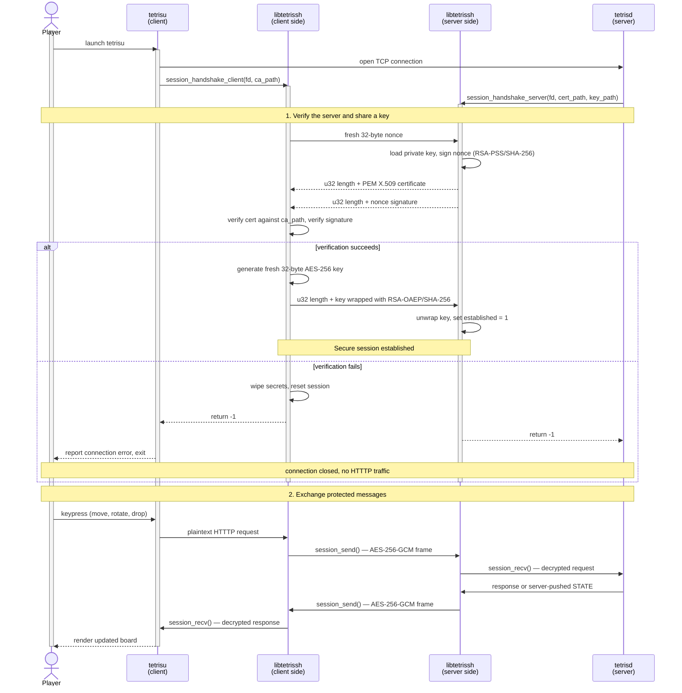

# tetriSH

> A terminal-based Battle Royale Tetris system written in C — combining a custom Unix shell, concurrent daemon processes, authenticated encrypted networking, and a bespoke application-layer protocol (HTTTP).

Part of the **CoreStack Challenge** (50.003 × 50.005), Singapore University of Technology and Design.

---

## Table of Contents

- [Status](#status)
- [Prerequisites](#prerequisites)
- [Build](#build)
- [Run](#run)
- [Components](#components)
- [Libraries](#libraries)
- [Protocol: HTTTP](#protocol-htttp)
- [Configuration: .tetrishrc](#configuration-tetrishrc)
- [Architecture](#architecture)
- [Secure Session: libtetrissh](#secure-session-libtetrissh)
- [IPC Design](#ipc-design)
- [Concurrency Model](#concurrency-model)
- [Battle Royale Mode](#battle-royale-mode)
- [Project Structure](#project-structure)
- [Testing](#testing)
- [Security Assumptions](#security-assumptions)
- [Known Limitations](#known-limitations)
- [Contribution](#contribution)

---

## Status

The project is mid-development. Sections below describe the target design; this table says what exists today.

| Component | Status |
|---|---|
| `tetrish` | Implemented — REPL, builtins, `.tetrishrc`, system programs under `bin/` |
| `tetrisu` | Partial — notcurses intro, menu, and audio; no gameplay or networking |
| `libtetrisbrain` | Implemented — six modules, unit tested |
| `libmacminidb` | Implemented — in-memory store, append-only log, catalogues, unit tested |
| `libtetrissh` | Implemented — handshake and encrypted framing, unit tested |
| `libcoreipc` | Planning — [scope document](lib/libcoreipc/README.md) only, no code |
| `libhtttp` | Planning — [design document](lib/libhtttp/README.md) only, no code |
| `tetrisd`, `tetrislogd`, `tetrisctl`| Not started — no source directory |

Anything marked planning or not started is specified here but not yet runnable.

---

## Prerequisites

GCC/binutils, `make`, `pkg-config`, OpenSSL, Readline, and ncurses. `tetrisu` also needs notcurses; SDL2 and SDL2_mixer are optional and enable its audio. Linux (apt, dnf/yum, pacman, zypper, apk) and macOS (Homebrew + Xcode Command Line Tools) are supported; where no notcurses package exists, it is built from source.

```bash
make deps                # check and install anything missing
make check-deps          # check only; never modifies the system
make deps-info           # show detected OS/WSL and dependency policy
make -C src/tetrisu deps # tetrisu render/audio deps only
```

Installation may request sudo access. Use `make AUTO_INSTALL_DEPS=0` when system changes are not allowed.

Valgrind is installed on Linux/WSL for memory-safety runs but is not needed to compile; it is unreliable on current macOS, so run those checks on Linux or WSL. `REQUIRE_VALGRIND=1 make check-deps` makes the check enforce it.

---

## Build

Clone the repository and build everything from the repo root:

```bash
git clone <repo-url>
cd MacMini_tetriSH
make
```

This runs `make deps`, builds every library under `lib/`, builds the shell, then builds whichever daemon components exist. Component directories are matched by their `Makefile`, so components that have not landed yet are skipped rather than failing the build.

| Target | Description |
|---|---|
| `make` / `make all` | Install missing dependencies, then build libraries, shell, and daemons |
| `make libs` | Build every self-contained library under `lib/` |
| `make shell` | Build `tetrish` only |
| `make daemons` | Build the daemon and client components that exist |
| `make run` | Build, then launch the shell (sources `.tetrishrc`) |
| `make stack` | Build, then launch the available daemons headless for integration tests |
| `make clean` | Remove object files from every component |
| `make fclean` | Remove object files, binaries, and `./bin` |
| `make reset` | `fclean` plus daemon runtime state (`tmp/`, `archive/`) |
| `make re` | `fclean` + `all` |

Each library is also self-contained — it owns its `Makefile` and builds and tests on its own:

```bash
make -C lib/libtetrisbrain           # build lib/libtetrisbrain/libtetrisbrain.a
make -C lib/libtetrisbrain test      # run its unit tests (formatted output)
make -C lib/libtetrisbrain clean     # remove its objects + test binaries
```

To compile your own code against a library, link the archive and add its include path:

```bash
gcc my_program.c lib/libtetrisbrain/libtetrisbrain.a -I lib/libtetrisbrain/include -o my_program
```

Networked binaries additionally link OpenSSL (`-lssl -lcrypto`); `libmacminidb` requires `-lpthread`.

WSL is detected separately for diagnostics but uses its Linux distribution's package manager. Homebrew must already be installed on macOS; if the Command Line Tools are absent, `make` starts Apple's installer and asks you to rerun after it finishes.

---

## Run

**1. Build and launch the shell:**
```bash
make run
```

`make run` sources `.tetrishrc` and symlinks every built binary into `./bin`, which the shell prepends to `$PATH`. To launch the shell without rebuilding, run `./src/tetrish/macmini_shell`.

**2. Launch the daemons from inside the shell:**
```
tetrish$ dspawn tetrislogd
tetrish$ dspawn tetrisd
```

`dspawn` daemonises the program, registers it in `tmp/daemons.reg`, then execs it. Uncomment the matching lines in `.tetrishrc` to start them automatically. Launch order is logger first, then game server.

**3. Inspect and stop running daemons:**
```
tetrish$ dcheck
tetrish$ dkill <pid>
```

**4. Connect a client (in a separate terminal):**
```bash
./src/tetrisu/bin/tetrisu
```

**5. Query and shut down the server:**
```bash
./bin/tetrisctl status
./bin/tetrisctl shutdown
```

Steps 2, 4, and 5 depend on components that are not built yet — see [Status](#status).

---

## Components

| Binary | Role |
|---|---|
| `tetrish` | Interactive shell — reads `.tetrishrc`, launches daemons, entry point for the user |
| `tetrisd` | Concurrent game server — accepts clients, manages rooms, runs game logic |
| `tetrislogd` | Dedicated logger daemon — receives log records over IPC and writes to disk |
| `tetrisctl` | Admin CLI — issues control commands to a running `tetrisd` over a local IPC channel |
| `tetrisu` | Terminal game client — connects, completes secure handshake, renders board, reads input |

### tetrish

`tetrish` is the entry shell, built as `src/tetrish/macmini_shell`. It implements the full PA1 REPL: `fork()` + `execvp()`, pipes, redirections, `$VAR` expansion, signal handling, and the builtins `cd`, `echo`, `env`, `exit`, `export`, `help`, `history`, `pwd`, `setenv`, `unset`, `unsetenv`, and `usage`. It executes `.tetrishrc` on startup and ships standalone system programs — `backup`, `dcheck`, `dkill`, `dspawn`, `find`, `ld`, `ldr`, and `sys` — into `src/tetrish/bin/`, which the root `bin-link` target symlinks into `./bin`. See [`src/tetrish/README.md`](src/tetrish/README.md) for the shell's own documentation.

### tetrisd

`tetrisd` is the game daemon. When launched in background from `tetrish`, it:
- Detaches from the controlling terminal
- Binds to the TCP port from `.tetrishrc`
- Accepts multiple concurrent clients
- Establishes a secure session (via `libtetrissh`) before any HTTTP traffic
- Parses and serialises HTTTP messages (via `libhtttp`)
- Maintains rooms with multiple players, runs game logic (via `libtetrisbrain`), and broadcasts `STATE`
- Handles `SIGTERM` (graceful shutdown), `SIGHUP` (reload config), `SIGUSR1` (dump state to log)
- Ignores `SIGPIPE`; detects broken connections via `EPIPE` on `write()`
- Forwards all log records to `tetrislogd` over IPC using a non-blocking ring buffer
- Exposes a control plane to `tetrisctl` via a separate local-only IPC channel

### tetrislogd

`tetrislogd` is a separate process, not a thread inside `tetrisd`. It:
- Accepts log records from `tetrisd` over IPC
- Writes records to the log file specified in `.tetrishrc`
- Maintains a dropped-records counter and emits a periodic summary
- Handles `SIGTERM` (flush, close, exit) and `SIGHUP` (reopen log file for rotation)
- Survives `tetrisd` restarts without exiting — it accepts reconnections

### tetrisctl

`tetrisctl` is an admin CLI binary that issues commands to a running `tetrisd` over a local-only IPC channel, not the public TCP port. The control plane therefore stays available even when the public listener is saturated. At minimum it supports `status` and `shutdown`.

### tetrisu

`tetrisu` is the terminal game client, built on notcurses. It currently renders an image home screen, a skippable splash intro, and a bunny-selector menu, with optional SDL2_mixer audio that degrades to silence when unavailable. Once networking lands it will:
- Connect over TCP and complete the secure session handshake (via `libtetrissh`)
- Send HTTTP requests for game actions (via `libhtttp`)
- Receive and render server-pushed `STATE` frames
- Handle keyboard input non-blocking (input + network simultaneously)
- Exit cleanly on `q` or `SIGINT`

See [`src/tetrisu/README.md`](src/tetrisu/README.md) for the client's own documentation.

---

## Libraries

Every library is a self-contained directory with its own `Makefile`, `include/`, `src/`, and `tests/`, building `libXXX.a` in place. All are statically linked into the binaries that use them.

| Library | Role |
|---|---|
| `libtetrisbrain` | Tetris game logic: board, pieces, gravity, line clear, scoring, abilities |
| `libmacminidb` | In-memory player/character/theme store with an append-only log and crash recovery |
| `libtetrissh` | Secure session: cert auth, RSA-wrapped AES key exchange, encrypted framing |
| `libcoreipc` | IPC primitives: ring buffer, `AF_UNIX` helpers, POSIX message queues |
| `libhtttp` | HTTTP protocol parser and serialiser |

### libtetrisbrain

`libtetrisbrain` implements Tetris game rules with no I/O, no networking, and no side effects — pure logic. `tetrisd` links against it for server-authoritative game state; `tetrisu` may optionally link against it for client-side prediction.

Modules, each one `.c` under `src/`:

| Module | Provides |
|---|---|
| `board.c` | `board_init`, `board_get`, `board_set`, `board_in_bounds`, `board_inject_garbage`, `board_copy` |
| `pieces.c` | `piece_spawn`, `piece_is_valid`, `piece_move`, `piece_rotate`, `piece_stamp` |
| `gravity.c` | `gravity_tick`, `piece_soft_drop`, `piece_hard_drop` |
| `lineclear.c` | `board_clear_lines` — returns lines cleared, 0–4 |
| `scoring.c` | `score_on_clear`, `level_from_lines`, `gravity_interval_ms` |
| `abilities.c` | `board_cut_top`, `board_cut_bottom`, `board_apply_gravity`, `board_invert`, `board_fill_rows`, `board_clear_cells`, `board_delete_columns` |

Calls return `t_brain_result`: `BRAIN_OK`, `BRAIN_BLOCKED`, `BRAIN_LOCKED`, `BRAIN_GAME_OVER`, `BRAIN_CLEARED`. Out-of-bounds reads through `board_get` return `CELL_FILLED`, so collision checks need no range guard in the caller. See [`lib/libtetrisbrain/README.md`](lib/libtetrisbrain/README.md).

### libmacminidb

`libmacminidb` is a single-node in-memory store for player, character, and theme state. A hash map (`username → player`) serves point lookups and a skip list (`(score, id) → player`) serves the leaderboard; every write appends a whole record to a Last-Writer-Wins log that is replayed on boot. A background flusher thread `fdatasync`s that log every second, so no blocking syscall runs under the store's rwlock.

Key API surface (exact signatures in `lib/libmacminidb/include/macminidb.h`):
- `db_open()` / `db_close()` — open with caller-supplied `data_dir` and `config_dir`
- `db_signup()` / `db_login()` / `db_get_player()` — account lifecycle
- `db_buy_character()` / `db_buy_theme()` / `db_equip_character()` / `db_equip_theme()` — economy
- `db_record_game()` — apply a finished game's score and points deltas
- `db_leaderboard()` / `db_rank()` — ranking queries

Calls return `t_db_result`: `DB_OK`, `DB_NOT_FOUND`, `DB_EXISTS`, `DB_BAD_CREDS`, `DB_INSUFFICIENT`, `DB_NOT_OWNED`, `DB_IO_ERROR`, `DB_FULL`, `DB_INVALID`. See [`lib/libmacminidb/README.md`](lib/libmacminidb/README.md).

### libtetrissh

`libtetrissh` implements the secure session handshake. It is linked into both `tetrisd` (server-side) and `tetrisu` (client-side) to prevent protocol drift, and is part of the shared CoreStack library for use by the 50.003 application.

Key API surface (exact signatures in `lib/libtetrissh/include/tetrissh.h`):
- `session_handshake_server()` — server-side handshake, taking `cert_path` and `key_path`
- `session_handshake_client()` — client-side handshake, taking `ca_path`
- `session_send()` / `session_recv()` — encrypted framed I/O
- `session_close()` — teardown and resource cleanup

### libcoreipc

`libcoreipc` is planned as thin wrappers around the three IPC mechanisms the daemons share: an MPSC ring buffer for log records, `AF_UNIX` datagram and stream helpers, and POSIX message queue wrappers with drop semantics. It has no internal dependencies and is built first. Because it *is* the log path, it must never log, `printf`, or `exit()` — errno-style returns only. See the [`libcoreipc` scope document](lib/libcoreipc/README.md).

### libhtttp

`libhtttp` is planned as the parser, serialiser, and method-dispatch library for plaintext HTTTP messages. It will open no sockets and call no session functions; each daemon composes it with `libtetrissh`. See the [`libhtttp` planned design](lib/libhtttp/README.md) for the proposed message flow, and [Protocol](#protocol-htttp) for the fixed wire format.

---

## Protocol: HTTTP

HTTTP (HyperText Tetris Transfer Protocol) is the application-layer protocol. Its wire format is fixed.

### Message Grammar

```
REQUEST       ::= REQUEST-LINE *(HEADER CRLF) CRLF [BODY]
REQUEST-LINE  ::= METHOD SP PATH SP "HTTTP/1.0" CRLF
RESPONSE      ::= STATUS-LINE *(HEADER CRLF) CRLF [BODY]
STATUS-LINE   ::= "HTTTP/1.0" SP STATUS-CODE SP REASON-PHRASE CRLF
```

### Required Methods

| Method | Path | Purpose |
|---|---|---|
| `JOIN` | `/room/<id>` | Join or create a room |
| `LEAVE` | `/room/<id>` | Leave a room |
| `START` | `/room/<id>` | Begin the game (room owner only) |
| `MOVE` | `/room/<id>/player/<pid>` | Body: `LEFT` or `RIGHT` |
| `ROTATE` | `/room/<id>/player/<pid>` | Body: `CW` or `CCW` |
| `DROP` | `/room/<id>/player/<pid>` | Body: `SOFT` or `HARD` |
| `STATE` | `/room/<id>` | Server-originated — pushed broadcast of board state |

`STATE` is the only server-originated message. Clients must read these unprompted while interleaving with their own request-response cycles.

### Required Status Codes

`200`, `201`, `400`, `401`, `403`, `404`, `409`, `429`, `500`

### Required Headers

- `Content-Length` on every message with a body
- `Content-Type: application/tetris-command` on client requests with a body
- `Content-Type: application/tetris-state` on server `STATE` broadcasts
- `Player-Id` on every authenticated request
- `Date` on every response (RFC 1123 format)

---

## Configuration: .tetrishrc

`.tetrishrc` is the shell start-up file. It is executed one command per line; blank lines and lines starting with `#` are ignored. The shell reads the project-local `.tetrishrc` first, then `$HOME/.tetrishrc`, and creates an empty project file if neither exists. Set `$TETRISHRC` to override the path.

Its role at startup is to launch the daemons, in dependency order:

```
dspawn tetrislogd             # logger first, so it captures everything
dspawn tetrisd                # game server (also serves chat and the store)
```

Daemon configuration directives are **[document: not yet parsed — the rc file currently executes shell commands only]**. The planned directives are:

```
listen_port  <port>           # TCP port for tetrisd
cert_path    <path>           # Server certificate
key_path     <path>           # Server private key
ca_path      <path>           # CA certificate for client verification
log_path     <path>           # Path where tetrislogd writes log records
log_ipc      <address>        # IPC address between tetrisd and tetrislogd
```

Optional directives, with sensible defaults if absent:

```
max_rooms              <n>
max_players_per_room   <n>
tick_hz                <n>
log_level              <debug|info|warning|error>
ctl_socket             <path>   # Control plane socket path
prompt                 <string>
```

All paths are relative to the project root. No hard-coded paths exist in the source.

---

## Architecture

The system has exactly three layers above the kernel:

```
+---------------------------------------------+
|  Application: HTTTP messages                |
|  (HyperText Tetris Transfer Protocol)       |
+---------------------------------------------+
|  Secure session                             |
|  (cert auth, RSA-wrapped AES, framed)       |
+---------------------------------------------+
|  Transport: TCP via POSIX sockets           |
+---------------------------------------------+
```

TCP reliability, ordering, and congestion control are provided by the kernel. tetriSH implements the two layers above it.

---

## Secure Session: libtetrissh

`libtetrissh` creates a secure connection before the client sends any game commands. The same library runs on both sides, keeping client and server handshake behaviour consistent.



Encrypted frame format:

```text
frame_len[4] || nonce[12] || tag[16] || ciphertext
```

`frame_len` counts bytes after the length field. Plaintext is capped at 64 KiB; larger HTTTP messages must be split by the application or rejected with `413 Payload Too Large`. GCM authenticates a per-direction sequence number, so reordered or replayed frames fail tag verification.

Cryptographic primitives come exclusively from `common.c` (PA2), at `lib/libtetrissh/src/common.c` with its header in `include/libs/common.h`. Neither file is modified. No TLS, no `SSL_*` API, no reverse proxy.

A rendered PlantUML version of this diagram is also kept at [`lib/libtetrissh/assets/libtetrissh_secure_session.svg`](lib/libtetrissh/assets/libtetrissh_secure_session.svg), with its editable source in [`libtetrissh-sequence.puml`](lib/libtetrissh/assets/libtetrissh-sequence.puml).

---

## IPC Design

### tetrisd ↔ tetrislogd (Log Forwarding)

**Mechanism:** [document your chosen mechanism: Unix domain socket / POSIX message queue / named pipe / shared memory ring buffer]

**Wire format:** [document: line-based / length-prefixed binary / JSON / custom]

**Non-blocking guarantee:** Game-critical threads enqueue log records into an in-process ring buffer. A dedicated log-shipper thread drains the buffer and forwards to `tetrislogd` over IPC. If the buffer is full, records are dropped and the drop counter is incremented. The drop counter is exposed via `tetrisctl dropped-logs`.

**Lifecycle:** [document startup order: independent launch vs. tetrisd spawning tetrislogd, reconnection logic if tetrislogd restarts]

### tetrisd ↔ tetrisctl (Control Plane)

**Mechanism:** [document: Unix domain socket path from `.tetrishrc` / named pipe / POSIX message queue / signals + state file]

**Wire format:** [document the control plane framing]

The control plane listens on a separate socket from the public TCP port. `tetrisctl shutdown` works even when the public listener is overwhelmed.

### tetrisd ↔ tetrisd rooms (Battle Royale Garbage)

**Mechanism:** [document: POSIX shared memory + semaphore / POSIX message queue / Unix domain socket]

Garbage transfer between rooms is server-side managed. Direct function calls across room boundaries while holding another room's mutex are not used.

---

## Concurrency Model

**Thread model:** [document your chosen model — thread-per-client / event loop with epoll / master + per-room workers]

### Lock Discipline

| Mutex | Protects |
|---|---|
| `room_t.mutex` | Room state: board, player list, current tick, garbage queue |
| `log_buffer.mutex` | In-process log ring buffer |
| `t_macminidb` rwlock | In-memory player index; acquired only in `db.c`, never held across a syscall |
| [add your mutexes] | [what they protect] |

**Global lock acquisition order:** [document the strict ordering — e.g. `room_mutex` must always be acquired before `player_mutex`]

No mutex is held across a blocking syscall. If `fork()` is called from a multi-threaded process, the child calls `execve()` immediately.

---

## Battle Royale Mode

When a player clears N ≥ 2 lines in a single move, N − 1 garbage rows are inserted at the bottom of a randomly selected other player's board in a different room.

- Garbage transfer is managed server-side via IPC, not direct function calls across room boundaries
- The targeting room is selected at the time of line clear
- Garbage injection in the receiving room is synchronised under that room's mutex

---

## Project Structure

```
MacMini_tetriSH/
├── bin/                           Symlinks to every built binary (make bin-link)
├── lib/                           All self-contained libraries live here
│   ├── libtetrisbrain/            Self-contained library (pattern for all libs)
│   │   ├── Makefile               make -C lib/libtetrisbrain [test|clean|fclean|re]
│   │   ├── include/tetrisbrain.h  Public header (-I lib/libtetrisbrain/include)
│   │   ├── src/*.c                board, pieces, gravity, lineclear, scoring, abilities
│   │   ├── tests/test_*.c         Unit tests (each with its own main)
│   │   ├── scripts/run_tests.sh   Formatted test runner
│   │   ├── obj/                   Generated objects
│   │   └── libtetrisbrain.a       Generated archive
│   ├── libmacminidb/              Same layout; config/*.cfg holds the catalogues
│   ├── libtetrissh/               Same layout
│   ├── libcoreipc/                README only — not implemented
│   └── libhtttp/                  README only — not implemented
├── src/
│   ├── tetrish/                   Shell → macmini_shell, system programs → bin/
│   └── tetrisu/                   notcurses client → src/tetrisu/bin/tetrisu
├── docs/
│   ├── use_cases.md               Gameplay use cases
│   ├── game-economics.md          Points, pricing, rewards
│   ├── themes.md                  Theme catalogue
│   ├── class_diagrams/            System and per-library diagrams
│   └── cleaning/                  Code, Makefile, and README style guides
├── scripts/                       Dependency check/install helpers
├── .tetrishrc                     Shell start-up file — launches the daemons
├── Makefile                       Umbrella; recurses into every component
└── README.md
```

`src/tetrisd/`, `src/tetrislogd/`, and `src/tetrisctl/` will follow the same pattern as they land; the umbrella `Makefile` already looks for them.

---

## Testing

Every library and component exposes a `test` target that builds and runs its own suites:

```bash
make -C lib/libtetrisbrain test
make -C lib/libmacminidb test
make -C lib/libtetrissh test
make -C src/tetrisu test
```

The shell splits its suites into Unity unit tests and shell-script integration tests:

```bash
make -C src/tetrish unit
make -C src/tetrish integration
make -C src/tetrish test          # both
```

### Filtering tests

Every suite takes a `FILTER` substring to run a subset:

```bash
make -C lib/libtetrisbrain test FILTER=abilities   # one library suite
make -C src/tetrish unit FILTER=lexer              # one shell suite
```

All components compile under `-Wall -Wextra -Werror`. Test binaries are expected to pass `valgrind --leak-check=full --error-exitcode=1` (NFR-R4) — run these on Linux or WSL.

---

## Security Assumptions

- The CA certificate is trusted and bundled at compile time; no dynamic CA update path exists
- The server certificate and private key are stored on the file system with paths configured in `.tetrishrc`; access control is the operator's responsibility
- RSA-PSS is used for the server signature over the client nonce; RSA-OAEP is used for AES key wrapping
- Every post-handshake frame is AES-256-GCM encrypted with a per-frame random nonce and 16-byte tag
- Per-direction monotonic sequence counters are authenticated as AES-GCM AAD, so replayed or reordered frames fail tag verification
- The control plane (`tetrisctl`) is local-only (Unix domain socket / named pipe); it is not exposed over the network

---

## Known Limitations

- Certificate generation is **[document: no `auth/` directory or key-generation script exists yet]**
- `.tetrishrc` does not yet parse daemon configuration directives; it executes shell commands only
- Battle Royale targeting is uniformly random; no score-based targeting in the baseline
- No client-side reconnection after a dropped session
- Log records may be dropped under sustained high load; the drop counter is observable via `tetrisctl dropped-logs`
- Frame size is capped at 64 KiB; HTTTP messages exceeding this are rejected with `413`
- `tetrisu` rendering assumes a terminal width of at least 80 columns

---

## Contribution

| Role | Member | Owns |
|---|---|---|
| Systems | [Zi Qi](https://github.com/ziqiqiiii) | tetrish, tetrisd, tetrislogd, tetrisctl, libcoreipc, libmacminidb |
| Systems | [Sanjan](https://github.com/DarKSanjan) | tetrisu, libtetrisbrain, libtetrissh, libhtttp |

---

*50.003 × 50.005 CoreStack Challenge — SUTD, Summer 2026*
