# tetriSH

## Table of Contents

- [Per-Use-Case Class Diagrams](#per-use-case-class-diagrams)
  - [CD UC-01 — Register Account](#cd-uc-01--register-account)
  - [CD UC-02 — Log In](#cd-uc-02--log-in)
  - [CD UC-03 — Browse Open Rooms](#cd-uc-03--browse-open-rooms)
  - [CD UC-04 — Create Room](#cd-uc-04--create-room)
  - [CD UC-05 — Join Room from List](#cd-uc-05--join-room-from-list)
  - [CD UC-06 — Join Room by Room ID](#cd-uc-06--join-room-by-room-id)
  - [CD UC-07 — Leave Room (with UC-07a)](#cd-uc-07--leave-room-with-uc-07a)
- [Combined Domain Class Diagram](#combined-domain-class-diagram)
  - [Concept extraction](#concept-extraction)
  - [Domain diagram](#domain-diagram)
- [Sequence Diagrams](#sequence-diagrams)
  - [Layering conventions](#layering-conventions)
  - [SD UC-01 — Register Account](#sd-uc-01--register-account)
  - [SD UC-02 — Log In](#sd-uc-02--log-in)
  - [SD UC-03 — Browse Open Rooms](#sd-uc-03--browse-open-rooms)
  - [SD UC-04 — Create Room](#sd-uc-04--create-room)
  - [SD UC-05 — Join Room from List](#sd-uc-05--join-room-from-list)
  - [SD UC-06 — Join Room by Room ID](#sd-uc-06--join-room-by-room-id)
  - [SD UC-07 — Leave Room (includes UC-07a)](#sd-uc-07--leave-room-includes-uc-07a)
- [Solution Class Diagram](#solution-class-diagram)
  - [Method inventory by use case](#method-inventory-by-use-case)
  - [Solution diagram](#solution-diagram)
- [Traceability Matrix](#traceability-matrix)

---

## Per-Use-Case Class Diagrams

### CD UC-01 — Register Account

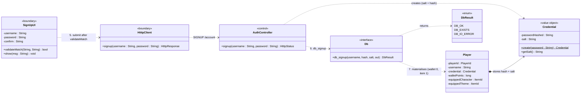

### CD UC-02 — Log In

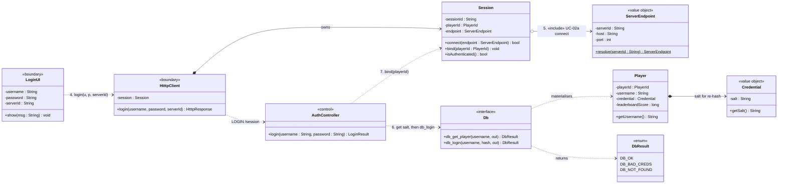

### CD UC-03 — Browse Open Rooms

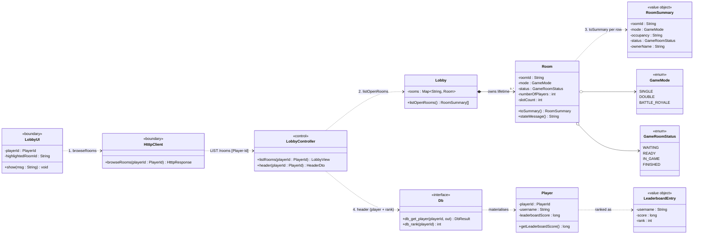

### CD UC-04 — Create Room

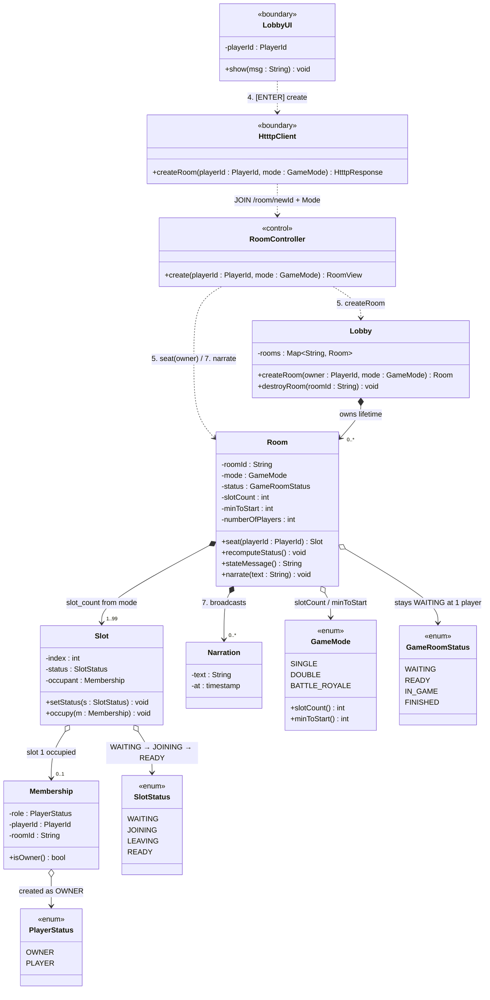

### CD UC-05 — Join Room from List

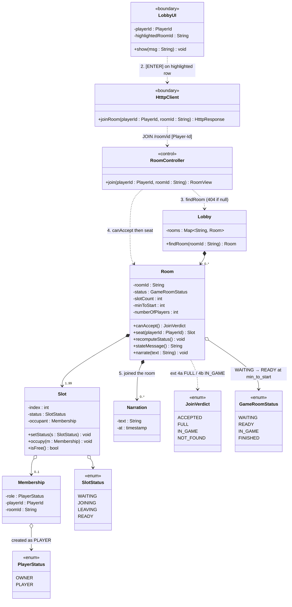

### CD UC-06 — Join Room by Room ID

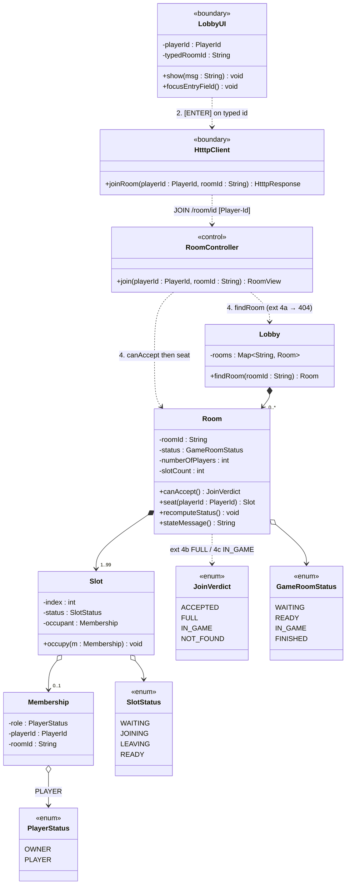

### CD UC-07 — Leave Room (with UC-07a)

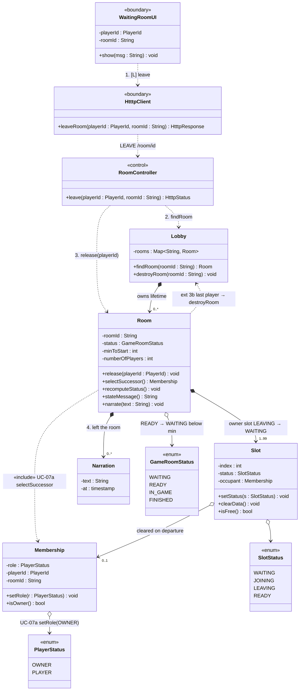

---

## Combined Domain Class Diagram

### Concept extraction

| Source (UC + step) | Concept surfaced | Class |
|---|---|---|
| UC-01.1–4 "username / password" | credentials, the account being created | `Account` |
| UC-01.5 "hashes with a per-user salt" | the hash + salt pair, a value object | `Credential` |
| UC-01.7 "wallet = 0, starter character/theme" | the durable player document | `Player` |
| UC-02.3 "enters the Server ID" | the server the client dials | `ServerEndpoint` |
| UC-02.5 "authenticated handshake" | the secure session, UC-02a | `Session` |
| UC-02.7 "opens a session" | authenticated identity for later requests | `Session` (holds `Player-Id`) |
| UC-03.2 "current room directory" | the collection of live rooms | `Lobby` |
| UC-03.3 "ID, Mode, Players, State, Owner" | one row of the directory | `RoomSummary` |
| UC-03.4 "username, score, ranking" | header data | `Player`, `LeaderboardEntry` |
| UC-04.2 "`[1] Double` / `[2] Battle Royale`" | mode with slot_count / min_to_start | `GameMode` `«enum»` |
| UC-04.5 "initialises the room with `slot_count` slots" | the room aggregate | `Room` |
| UC-04.5 "seats the Owner in slot 1" | a seat that can be empty or occupied | `Slot` |
| UC-04.5 "marks the Player as `OWNER`" | role *within a room*, not a global type | `Membership` + `PlayerStatus` `«enum»` |
| UC-04.5 "room status `WAITING`" | room lifecycle | `GameRoomStatus` `«enum»` |
| UC-04.5 slot `WAITING → JOINING → READY` | slot lifecycle | `SlotStatus` `«enum»` |
| UC-04.6 "STATE message `WAITING FOR OPPONENT`" | derived text keyed by room status | `Room.stateMessage()` (derived, not stored) |
| UC-04.7 "Server narrates to the room" | system-authored room message | `Narration` |
| UC-07.3 "`number_of_players -= 1`" | occupancy counter | `Room.numberOfPlayers` |
| UC-07a.1 "next player in slot order" | successor selection | `Room.selectSuccessor()` |
| UC-07 alt 3b "room is destroyed" | room lifetime is owned by the lobby | `Lobby *--> Room` |

### Domain diagram

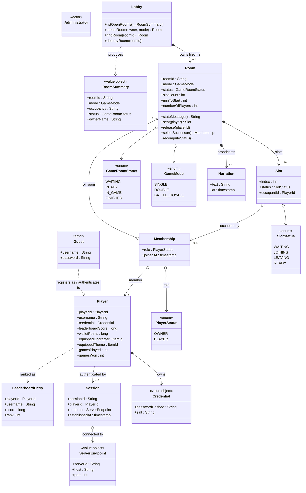

---

## Sequence Diagrams

### Layering conventions

| Participant | Layer | Process |
|---|---|---|
| `:LoginUI`, `:SignUpUI`, `:LobbyUI`, `:WaitingRoomUI` | UI | tetrisu |
| `:AuthController`, `:LobbyController`, `:RoomController` | Controller | tetrisd |
| `:HtttpClient` | Boundary | tetrisu |
| `:Lobby`, `:Room`, `:Slot`, `:Membership`, `:Player` | Domain | tetrisd |
| `:Db` | Persistence | `libmacminidb` |

### SD UC-01 — Register Account

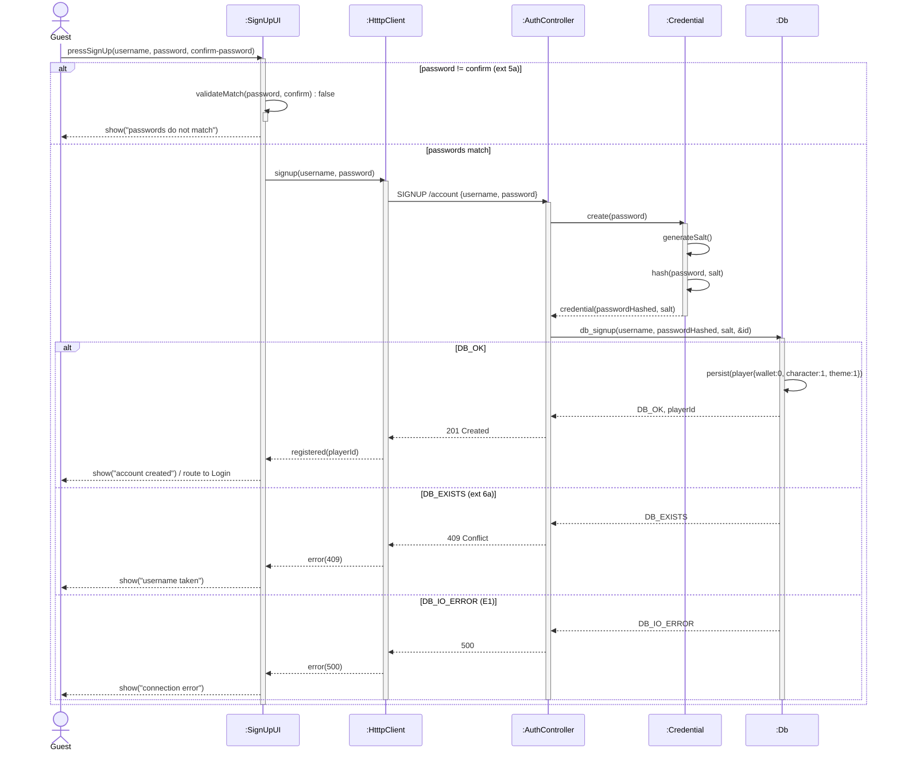

### SD UC-02 — Log In

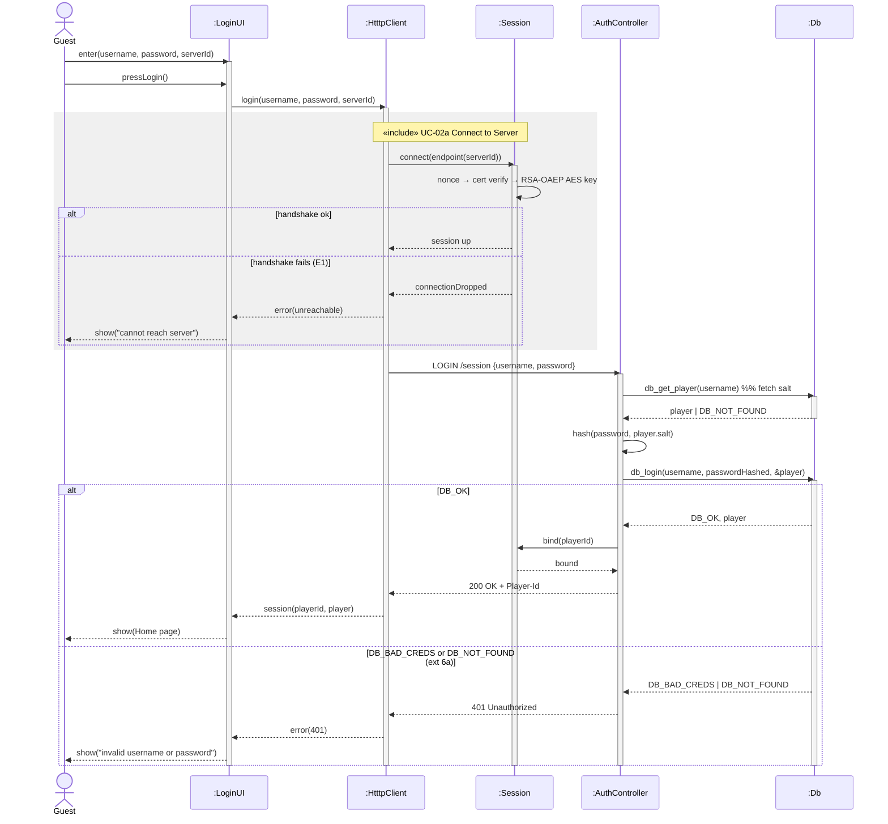

### SD UC-03 — Browse Open Rooms

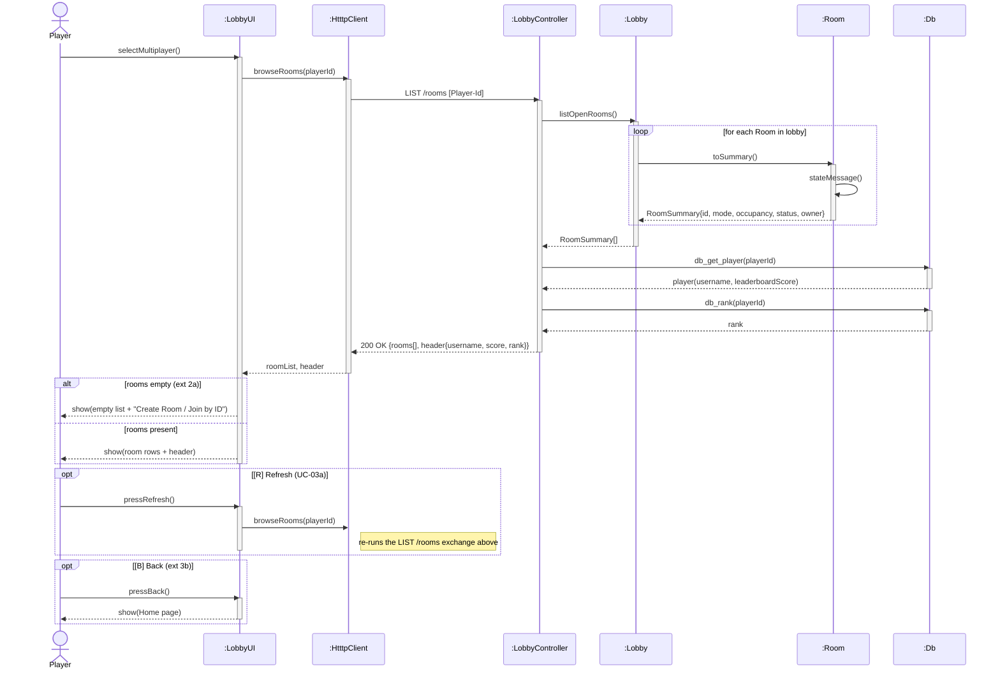

### SD UC-04 — Create Room

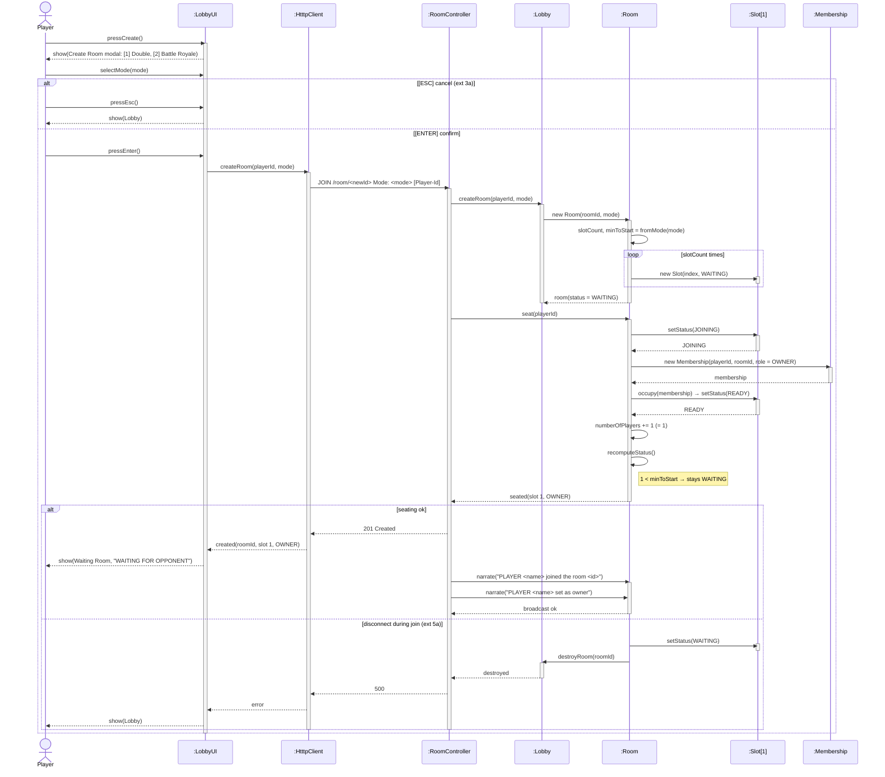

### SD UC-05 — Join Room from List

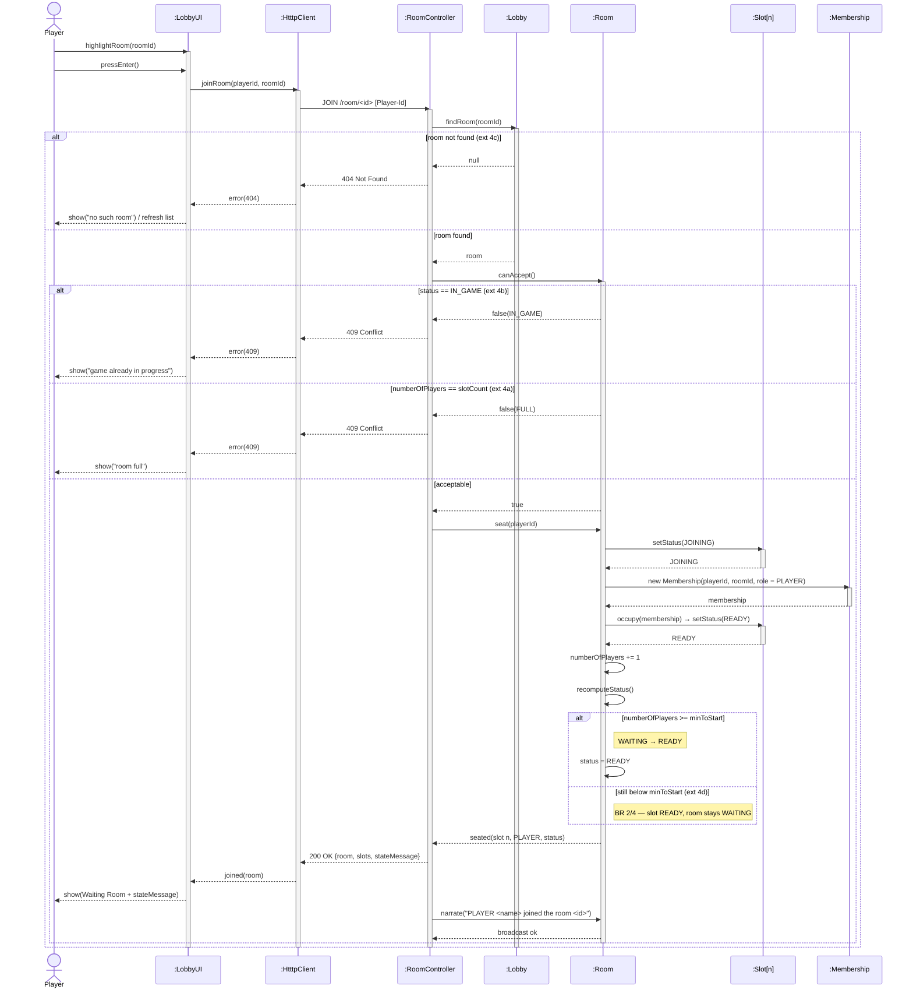

### SD UC-06 — Join Room by Room ID

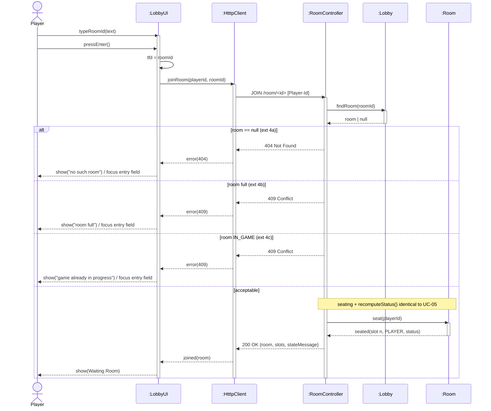

### SD UC-07 — Leave Room (includes UC-07a)

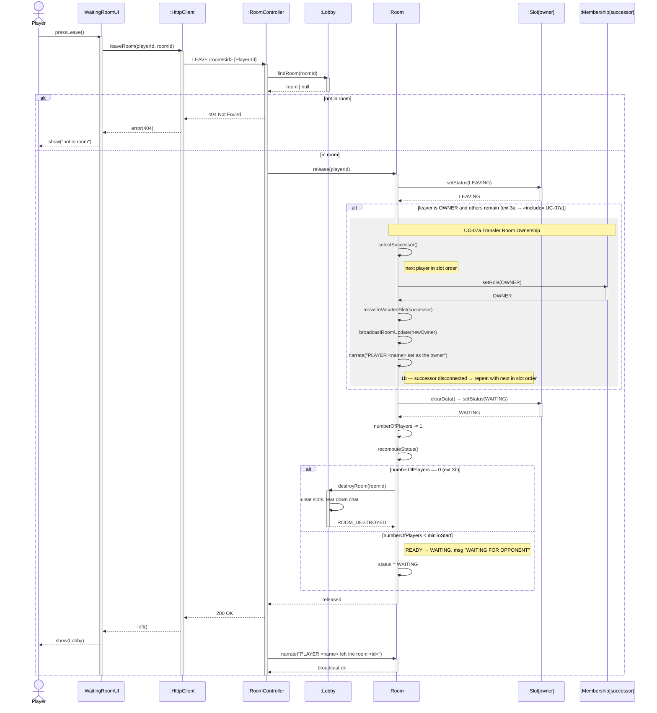

---

## Solution Class Diagram

### Method inventory by use case

| Behaviour | Owner | Signature | From |
|---|---|---|---|
| validate password match | `SignUpUI` | `validateMatch(String, String) : bool` | UC-01.5 |
| hash with fresh salt | `Credential` | `create(String) : Credential` | UC-01.5 |
| create the account | `AuthController` | `signup(String, String) : HtttpStatus` | UC-01.6 |
| authenticate | `AuthController` | `login(String, String) : LoginResult` | UC-02.6 |
| establish secure channel | `Session` | `connect(ServerEndpoint) : bool` | UC-02a |
| bind identity to session | `Session` | `bind(PlayerId)` | UC-02.7 |
| list rooms | `Lobby` | `listOpenRooms() : RoomSummary[]` | UC-03.2 |
| project a room to a row | `Room` | `toSummary() : RoomSummary` | UC-03.3 |
| derive STATE text | `Room` | `stateMessage() : String` | UC-04.6 |
| header data | `LobbyController` | `header(PlayerId) : HeaderDto` | UC-03.4 |
| create + register a room | `Lobby` | `createRoom(PlayerId, GameMode) : Room` | UC-04.5 |
| resolve mode parameters | `GameMode` | `slotCount() : int`, `minToStart() : int` | UC-04.5 |
| seat a player | `Room` | `seat(PlayerId) : Slot` | UC-04.5 / UC-05.4 |
| slot lifecycle | `Slot` | `setStatus(SlotStatus)`, `occupy(Membership)`, `clearData()` | UC-04.5 |
| admissibility check | `Room` | `canAccept() : JoinVerdict` | UC-05 ext 4a/4b |
| recompute room status | `Room` | `recomputeStatus()` | UC-05.4 |
| free a slot | `Room` | `release(PlayerId)` | UC-07.3 |
| pick the successor | `Room` | `selectSuccessor() : Membership` | UC-07a.1 |
| change role | `Membership` | `setRole(PlayerStatus)` | UC-07a.1 |
| system message | `Room` | `narrate(String)` | UC-04.7 / UC-07.4 |
| destroy the room | `Lobby` | `destroyRoom(String)` | UC-07 ext 3b |

### Solution diagram

```mermaid
j
```

---

## Traceability Matrix

| UC | Sequence diagram | Domain classes exercised | New solution methods |
|---|---|---|---|
| UC-01 | [SD UC-01](#sd-uc-01--register-account) | `Credential`, `Player` | `SignUpUI.validateMatch`, `Credential.create`, `AuthController.signup` |
| UC-02 | [SD UC-02](#sd-uc-02--log-in) | `Session`, `ServerEndpoint`, `Credential`, `Player` | `Session.connect`, `Session.bind`, `AuthController.login` |
| UC-03 | [SD UC-03](#sd-uc-03--browse-open-rooms) | `Lobby`, `Room`, `RoomSummary`, `Player` | `Lobby.listOpenRooms`, `Room.toSummary`, `LobbyController.header` |
| UC-04 | [SD UC-04](#sd-uc-04--create-room) | `Lobby`, `Room`, `Slot`, `Membership`, `GameMode` | `Lobby.createRoom`, `Room.seat`, `GameMode.slotCount/minToStart` |
| UC-05 | [SD UC-05](#sd-uc-05--join-room-from-list) | `Lobby`, `Room`, `Slot`, `Membership` | `Room.canAccept`, `Room.recomputeStatus`, `RoomController.join` |
| UC-06 | [SD UC-06](#sd-uc-06--join-room-by-room-id) | same as UC-05 | *(none — reuses `RoomController.join`)* |
| UC-07 | [SD UC-07](#sd-uc-07--leave-room-includes-uc-07a) | `Room`, `Slot`, `Membership`, `Lobby` | `Room.release`, `Room.selectSuccessor`, `Membership.setRole`, `Lobby.destroyRoom` |
| UC-07a | folded into SD UC-07 | `Room`, `Membership` | `Room.selectSuccessor`, `Membership.setRole` |