# tetriSH

## Table of Contents

- [Per-Use-Case Class Diagrams](#per-use-case-class-diagrams)
  - [CD UC-01 — Register Account](#cd-uc-01--register-account)
  - [CD UC-02 — Log In](#cd-uc-02--log-in)
  - [CD UC-03 — Browse Open Rooms](#cd-uc-03--browse-open-rooms)
  - [CD UC-04 — Create Room](#cd-uc-04--create-room)
  - [CD UC-05 — Join Room from List](#cd-uc-05--join-room-from-list)
  - [CD UC-06 — Join Room by Room ID](#cd-uc-06--join-room-by-room-id)
  - [CD UC-07 — Leave Room (with UC-07a)](#cd-uc-07--leave-room-with-uc-07a)
  - [CD UC-08 — Start Game](#cd-uc-08--start-game)
  - [CD UC-08a — Attempt to Start Game as Non-Owner (Denied)](#cd-uc-08a--attempt-to-start-game-as-non-owner-denied)
  - [CD UC-09 — Chat in Room](#cd-uc-09--chat-in-room)
- [Combined Domain Class Diagram](#combined-domain-class-diagram)
  - [Concept extraction](#concept-extraction)
  - [Domain diagram](#domain-diagram)
- [Sequence Diagrams](#sequence-diagrams)
  - [Layering conventions](#layering-conventions)
  - [SD UC-01 — Register Account](#sd-uc-01--register-account)
  - [SD UC-02 — Log In](#sd-uc-02--log-in)
  - [SD UC-03 — Browse Open Rooms](#sd-uc-03--browse-open-rooms)
  - [SD UC-04 — Create Room](#sd-uc-04--create-room)
  - [SD UC-05 — Join Room from List](#sd-uc-05--join-room-from-list)
  - [SD UC-06 — Join Room by Room ID](#sd-uc-06--join-room-by-room-id)
  - [SD UC-07 — Leave Room (includes UC-07a)](#sd-uc-07--leave-room-includes-uc-07a)
  - [SD UC-08 — Start Game (with UC-08a)](#sd-uc-08--start-game-with-uc-08a)
  - [SD UC-09 — Chat in Room](#sd-uc-09--chat-in-room)
- [Solution Class Diagram](#solution-class-diagram)
  - [Method inventory by use case](#method-inventory-by-use-case)
  - [Solution diagram](#solution-diagram)

---

## Per-Use-Case Class Diagrams

### CD UC-01 — Register Account

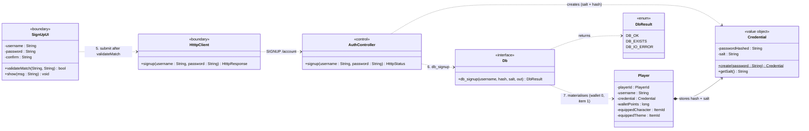
```mermaid
classDiagram
    direction LR

    class SignUpUI {
        <<boundary>>
        -username : String
        -password : String
        -confirm : String
        +validateMatch(String, String) bool
        +show(msg : String) void
    }
    class HtttpClient {
        <<boundary>>
        +signup(username : String, password : String) HtttpResponse
    }
    class AuthController {
        <<control>>
        +signup(username : String, password : String) HtttpStatus
    }
    class Credential {
        <<value object>>
        -passwordHashed : String
        -salt : String
        +create(password : String)$ Credential
        +getSalt() String
    }
    class Player {
        -playerId : PlayerId
        -username : String
        -credential : Credential
        -walletPoints : long
        -equippedCharacter : ItemId
        -equippedTheme : ItemId
    }
    class Db {
        <<interface>>
        +db_signup(username, hash, salt, out) DbResult
    }
    class DbResult {
        <<enum>>
        DB_OK
        DB_EXISTS
        DB_IO_ERROR
    }

    SignUpUI ..> HtttpClient : 5. submit after validateMatch
    HtttpClient ..> AuthController : SIGNUP /account
    AuthController ..> Credential : creates (salt + hash)
    AuthController ..> Db : 6. db_signup
    Db ..> DbResult : returns
    Db ..> Player : 7. materialises (wallet 0, item 1)
    Player *--> Credential : stores hash + salt
```

### CD UC-02 — Log In

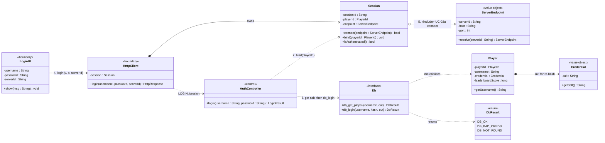
```mermaid
classDiagram
    direction LR

    class LoginUI {
        <<boundary>>
        -username : String
        -password : String
        -serverId : String
        +show(msg : String) void
    }
    class HtttpClient {
        <<boundary>>
        -session : Session
        +login(username, password, serverId) HtttpResponse
    }
    class Session {
        -sessionId : String
        -playerId : PlayerId
        -endpoint : ServerEndpoint
        +connect(endpoint : ServerEndpoint) bool
        +bind(playerId : PlayerId) void
        +isAuthenticated() bool
    }
    class ServerEndpoint {
        <<value object>>
        -serverId : String
        -host : String
        -port : int
        +resolve(serverId : String)$ ServerEndpoint
    }
    class AuthController {
        <<control>>
        +login(username : String, password : String) LoginResult
    }
    class Credential {
        <<value object>>
        -salt : String
        +getSalt() String
    }
    class Player {
        -playerId : PlayerId
        -username : String
        -credential : Credential
        -leaderboardScore : long
        +getUsername() String
    }
    class Db {
        <<interface>>
        +db_get_player(username, out) DbResult
        +db_login(username, hash, out) DbResult
    }
    class DbResult {
        <<enum>>
        DB_OK
        DB_BAD_CREDS
        DB_NOT_FOUND
    }

    LoginUI ..> HtttpClient : 4. login(u, p, serverId)
    HtttpClient *--> Session : owns
    Session o--> ServerEndpoint : 5. «include» UC-02a connect
    HtttpClient ..> AuthController : LOGIN /session
    AuthController ..> Db : 6. get salt, then db_login
    AuthController ..> Session : 7. bind(playerId)
    Db ..> DbResult : returns
    Db ..> Player : materialises
    Player *--> Credential : salt for re-hash
```

### CD UC-03 — Browse Open Rooms

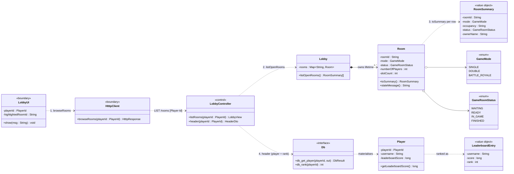
```mermaid
classDiagram
    direction LR

    class LobbyUI {
        <<boundary>>
        -playerId : PlayerId
        -highlightedRoomId : String
        +show(msg : String) void
    }
    class HtttpClient {
        <<boundary>>
        +browseRooms(playerId : PlayerId) HtttpResponse
    }
    class LobbyController {
        <<control>>
        +listRooms(playerId : PlayerId) LobbyView
        +header(playerId : PlayerId) HeaderDto
    }
    class Lobby {
        -rooms : Map~String, Room~
        +listOpenRooms() RoomSummary[]
    }
    class Room {
        -roomId : String
        -mode : GameMode
        -status : GameRoomStatus
        -numberOfPlayers : int
        -slotCount : int
        +toSummary() RoomSummary
        +stateMessage() String
    }
    class RoomSummary {
        <<value object>>
        -roomId : String
        -mode : GameMode
        -occupancy : String
        -status : GameRoomStatus
        -ownerName : String
    }
    class LeaderboardEntry {
        <<value object>>
        -username : String
        -score : long
        -rank : int
    }
    class Player {
        -playerId : PlayerId
        -username : String
        -leaderboardScore : long
        +getLeaderboardScore() long
    }
    class Db {
        <<interface>>
        +db_get_player(playerId, out) DbResult
        +db_rank(playerId) int
    }
    class GameMode {
        <<enum>>
        SINGLE
        DOUBLE
        BATTLE_ROYALE
    }
    class GameRoomStatus {
        <<enum>>
        WAITING
        READY
        IN_GAME
        FINISHED
    }

    LobbyUI ..> HtttpClient : 1. browseRooms
    HtttpClient ..> LobbyController : LIST /rooms [Player-Id]
    LobbyController ..> Lobby : 2. listOpenRooms
    LobbyController ..> Db : 4. header (player + rank)
    Lobby *--> "0..*" Room : owns lifetime
    Room ..> RoomSummary : 3. toSummary per row
    Room o--> GameMode
    Room o--> GameRoomStatus
    Db ..> Player : materialises
    Player ..> LeaderboardEntry : ranked as
```

### CD UC-04 — Create Room

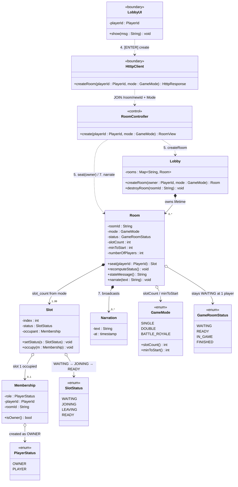
```mermaid
classDiagram
    direction TB

    class LobbyUI {
        <<boundary>>
        -playerId : PlayerId
        +show(msg : String) void
    }
    class HtttpClient {
        <<boundary>>
        +createRoom(playerId : PlayerId, mode : GameMode) HtttpResponse
    }
    class RoomController {
        <<control>>
        +create(playerId : PlayerId, mode : GameMode) RoomView
    }
    class Lobby {
        -rooms : Map~String, Room~
        +createRoom(owner : PlayerId, mode : GameMode) Room
        +destroyRoom(roomId : String) void
    }
    class Room {
        -roomId : String
        -mode : GameMode
        -status : GameRoomStatus
        -slotCount : int
        -minToStart : int
        -numberOfPlayers : int
        +seat(playerId : PlayerId) Slot
        +recomputeStatus() void
        +stateMessage() String
        +narrate(text : String) void
    }
    class Slot {
        -index : int
        -status : SlotStatus
        -occupant : Membership
        +setStatus(s : SlotStatus) void
        +occupy(m : Membership) void
    }
    class Membership {
        -role : PlayerStatus
        -playerId : PlayerId
        -roomId : String
        +isOwner() bool
    }
    class Narration {
        -text : String
        -at : timestamp
    }
    class GameMode {
        <<enum>>
        SINGLE
        DOUBLE
        BATTLE_ROYALE
        +slotCount() int
        +minToStart() int
    }
    class GameRoomStatus {
        <<enum>>
        WAITING
        READY
        IN_GAME
        FINISHED
    }
    class SlotStatus {
        <<enum>>
        WAITING
        JOINING
        LEAVING
        READY
    }
    class PlayerStatus {
        <<enum>>
        OWNER
        PLAYER
    }

    LobbyUI ..> HtttpClient : 4. [ENTER] create
    HtttpClient ..> RoomController : JOIN /room/newId + Mode
    RoomController ..> Lobby : 5. createRoom
    RoomController ..> Room : 5. seat(owner) / 7. narrate
    Lobby *--> "0..*" Room : owns lifetime
    Room *--> "1..99" Slot : slot_count from mode
    Room *--> "0..*" Narration : 7. broadcasts
    Room o--> GameMode : slotCount / minToStart
    Room o--> GameRoomStatus : stays WAITING at 1 player
    Slot o--> SlotStatus : WAITING → JOINING → READY
    Slot o--> "0..1" Membership : slot 1 occupied
    Membership o--> PlayerStatus : created as OWNER
```

### CD UC-05 — Join Room from List

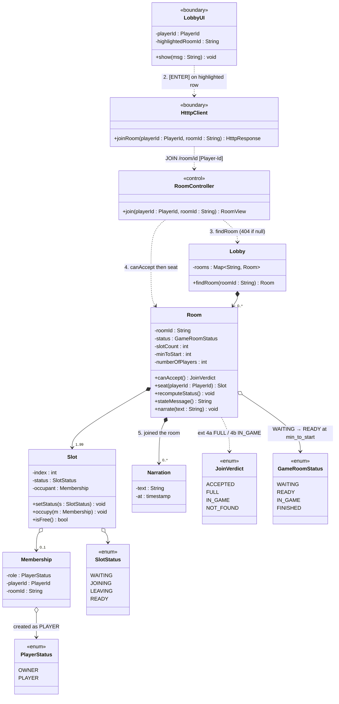
```mermaid
classDiagram
    direction TB

    class LobbyUI {
        <<boundary>>
        -playerId : PlayerId
        -highlightedRoomId : String
        +show(msg : String) void
    }
    class HtttpClient {
        <<boundary>>
        +joinRoom(playerId : PlayerId, roomId : String) HtttpResponse
    }
    class RoomController {
        <<control>>
        +join(playerId : PlayerId, roomId : String) RoomView
    }
    class Lobby {
        -rooms : Map~String, Room~
        +findRoom(roomId : String) Room
    }
    class Room {
        -roomId : String
        -status : GameRoomStatus
        -slotCount : int
        -minToStart : int
        -numberOfPlayers : int
        +canAccept() JoinVerdict
        +seat(playerId : PlayerId) Slot
        +recomputeStatus() void
        +stateMessage() String
        +narrate(text : String) void
    }
    class Slot {
        -index : int
        -status : SlotStatus
        -occupant : Membership
        +setStatus(s : SlotStatus) void
        +occupy(m : Membership) void
        +isFree() bool
    }
    class Membership {
        -role : PlayerStatus
        -playerId : PlayerId
        -roomId : String
    }
    class Narration {
        -text : String
        -at : timestamp
    }
    class JoinVerdict {
        <<enum>>
        ACCEPTED
        FULL
        IN_GAME
        NOT_FOUND
    }
    class GameRoomStatus {
        <<enum>>
        WAITING
        READY
        IN_GAME
        FINISHED
    }
    class SlotStatus {
        <<enum>>
        WAITING
        JOINING
        LEAVING
        READY
    }
    class PlayerStatus {
        <<enum>>
        OWNER
        PLAYER
    }

    LobbyUI ..> HtttpClient : 2. [ENTER] on highlighted row
    HtttpClient ..> RoomController : JOIN /room/id [Player-Id]
    RoomController ..> Lobby : 3. findRoom (404 if null)
    RoomController ..> Room : 4. canAccept then seat
    Lobby *--> "0..*" Room
    Room ..> JoinVerdict : ext 4a FULL / 4b IN_GAME
    Room *--> "1..99" Slot
    Room *--> "0..*" Narration : 5. joined the room
    Room o--> GameRoomStatus : WAITING → READY at min_to_start
    Slot o--> SlotStatus
    Slot o--> "0..1" Membership
    Membership o--> PlayerStatus : created as PLAYER
```

### CD UC-06 — Join Room by Room ID

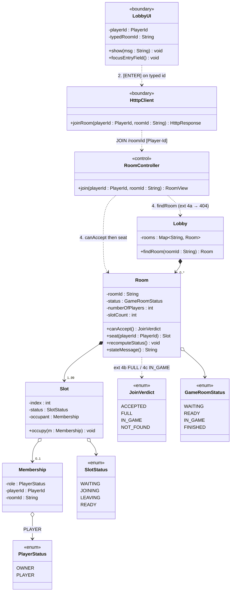
```mermaid
classDiagram
    direction TB

    class LobbyUI {
        <<boundary>>
        -playerId : PlayerId
        -typedRoomId : String
        +show(msg : String) void
        +focusEntryField() void
    }
    class HtttpClient {
        <<boundary>>
        +joinRoom(playerId : PlayerId, roomId : String) HtttpResponse
    }
    class RoomController {
        <<control>>
        +join(playerId : PlayerId, roomId : String) RoomView
    }
    class Lobby {
        -rooms : Map~String, Room~
        +findRoom(roomId : String) Room
    }
    class Room {
        -roomId : String
        -status : GameRoomStatus
        -numberOfPlayers : int
        -slotCount : int
        +canAccept() JoinVerdict
        +seat(playerId : PlayerId) Slot
        +recomputeStatus() void
        +stateMessage() String
    }
    class Slot {
        -index : int
        -status : SlotStatus
        -occupant : Membership
        +occupy(m : Membership) void
    }
    class Membership {
        -role : PlayerStatus
        -playerId : PlayerId
        -roomId : String
    }
    class JoinVerdict {
        <<enum>>
        ACCEPTED
        FULL
        IN_GAME
        NOT_FOUND
    }
    class GameRoomStatus {
        <<enum>>
        WAITING
        READY
        IN_GAME
        FINISHED
    }
    class SlotStatus {
        <<enum>>
        WAITING
        JOINING
        LEAVING
        READY
    }
    class PlayerStatus {
        <<enum>>
        OWNER
        PLAYER
    }

    LobbyUI ..> HtttpClient : 2. [ENTER] on typed id
    HtttpClient ..> RoomController : JOIN /room/id [Player-Id]
    RoomController ..> Lobby : 4. findRoom (ext 4a → 404)
    RoomController ..> Room : 4. canAccept then seat
    Lobby *--> "0..*" Room
    Room ..> JoinVerdict : ext 4b FULL / 4c IN_GAME
    Room *--> "1..99" Slot
    Room o--> GameRoomStatus
    Slot o--> SlotStatus
    Slot o--> "0..1" Membership
    Membership o--> PlayerStatus : PLAYER
```

### CD UC-07 — Leave Room (with UC-07a)

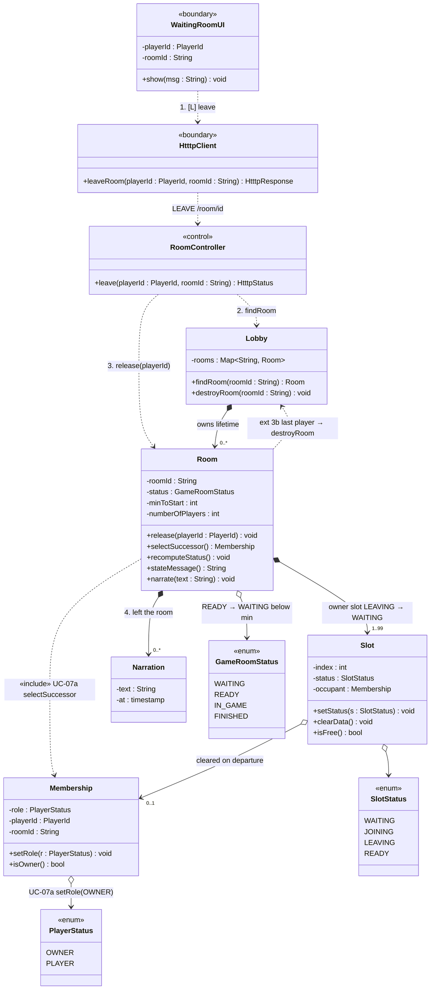
```mermaid
classDiagram
    direction TB

    class WaitingRoomUI {
        <<boundary>>
        -playerId : PlayerId
        -roomId : String
        +show(msg : String) void
    }
    class HtttpClient {
        <<boundary>>
        +leaveRoom(playerId : PlayerId, roomId : String) HtttpResponse
    }
    class RoomController {
        <<control>>
        +leave(playerId : PlayerId, roomId : String) HtttpStatus
    }
    class Lobby {
        -rooms : Map~String, Room~
        +findRoom(roomId : String) Room
        +destroyRoom(roomId : String) void
    }
    class Room {
        -roomId : String
        -status : GameRoomStatus
        -minToStart : int
        -numberOfPlayers : int
        +release(playerId : PlayerId) void
        +selectSuccessor() Membership
        +recomputeStatus() void
        +stateMessage() String
        +narrate(text : String) void
    }
    class Slot {
        -index : int
        -status : SlotStatus
        -occupant : Membership
        +setStatus(s : SlotStatus) void
        +clearData() void
        +isFree() bool
    }
    class Membership {
        -role : PlayerStatus
        -playerId : PlayerId
        -roomId : String
        +setRole(r : PlayerStatus) void
        +isOwner() bool
    }
    class Narration {
        -text : String
        -at : timestamp
    }
    class GameRoomStatus {
        <<enum>>
        WAITING
        READY
        IN_GAME
        FINISHED
    }
    class SlotStatus {
        <<enum>>
        WAITING
        JOINING
        LEAVING
        READY
    }
    class PlayerStatus {
        <<enum>>
        OWNER
        PLAYER
    }

    WaitingRoomUI ..> HtttpClient : 1. [L] leave
    HtttpClient ..> RoomController : LEAVE /room/id
    RoomController ..> Lobby : 2. findRoom
    RoomController ..> Room : 3. release(playerId)
    Room ..> Lobby : ext 3b last player → destroyRoom
    Room ..> Membership : «include» UC-07a selectSuccessor
    Lobby *--> "0..*" Room : owns lifetime
    Room *--> "1..99" Slot : owner slot LEAVING → WAITING
    Room *--> "0..*" Narration : 4. left the room
    Room o--> GameRoomStatus : READY → WAITING below min
    Slot o--> SlotStatus
    Slot o--> "0..1" Membership : cleared on departure
    Membership o--> PlayerStatus : UC-07a setRole(OWNER)
```

### CD UC-08 — Start Game

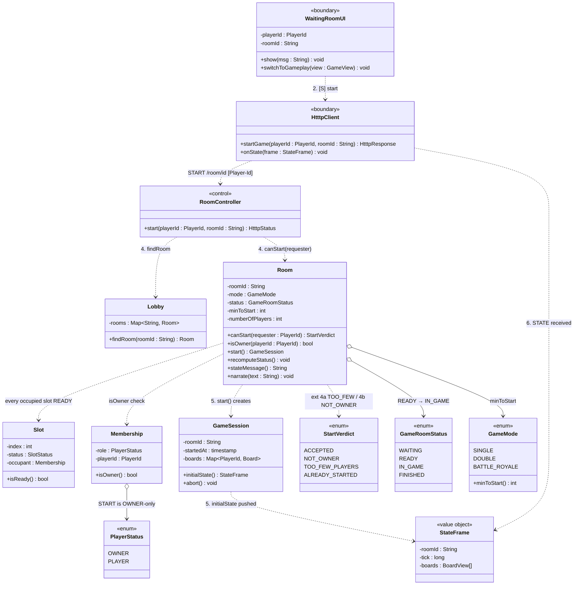
```mermaid
classDiagram
    direction TB

    class WaitingRoomUI {
        <<boundary>>
        -playerId : PlayerId
        -roomId : String
        +show(msg : String) void
        +switchToGameplay(view : GameView) void
    }
    class HtttpClient {
        <<boundary>>
        +startGame(playerId : PlayerId, roomId : String) HtttpResponse
        +onState(frame : StateFrame) void
    }
    class RoomController {
        <<control>>
        +start(playerId : PlayerId, roomId : String) HtttpStatus
    }
    class Lobby {
        -rooms : Map~String, Room~
        +findRoom(roomId : String) Room
    }
    class Room {
        -roomId : String
        -mode : GameMode
        -status : GameRoomStatus
        -minToStart : int
        -numberOfPlayers : int
        +canStart(requester : PlayerId) StartVerdict
        +isOwner(playerId : PlayerId) bool
        +start() GameSession
        +recomputeStatus() void
        +stateMessage() String
        +narrate(text : String) void
    }
    class Slot {
        -index : int
        -status : SlotStatus
        -occupant : Membership
        +isReady() bool
    }
    class Membership {
        -role : PlayerStatus
        -playerId : PlayerId
        +isOwner() bool
    }
    class GameSession {
        -roomId : String
        -startedAt : timestamp
        -boards : Map~PlayerId, Board~
        +initialState() StateFrame
        +abort() void
    }
    class StateFrame {
        <<value object>>
        -roomId : String
        -tick : long
        -boards : BoardView[]
    }
    class StartVerdict {
        <<enum>>
        ACCEPTED
        NOT_OWNER
        TOO_FEW_PLAYERS
        ALREADY_STARTED
    }
    class GameRoomStatus {
        <<enum>>
        WAITING
        READY
        IN_GAME
        FINISHED
    }
    class GameMode {
        <<enum>>
        SINGLE
        DOUBLE
        BATTLE_ROYALE
        +minToStart() int
    }
    class PlayerStatus {
        <<enum>>
        OWNER
        PLAYER
    }

    WaitingRoomUI ..> HtttpClient : 2. [S] start
    HtttpClient ..> RoomController : START /room/id [Player-Id]
    RoomController ..> Lobby : 4. findRoom
    RoomController ..> Room : 4. canStart(requester)
    Room ..> StartVerdict : ext 4a TOO_FEW / 4b NOT_OWNER
    Room ..> Membership : isOwner check
    Room ..> Slot : every occupied slot READY
    Room ..> GameSession : 5. start() creates
    GameSession ..> StateFrame : 5. initialState pushed
    HtttpClient ..> StateFrame : 6. STATE received
    Room o--> GameRoomStatus : READY → IN_GAME
    Room o--> GameMode : minToStart
    Membership o--> PlayerStatus : START is OWNER-only
```

### CD UC-08a — Attempt to Start Game as Non-Owner (Denied)

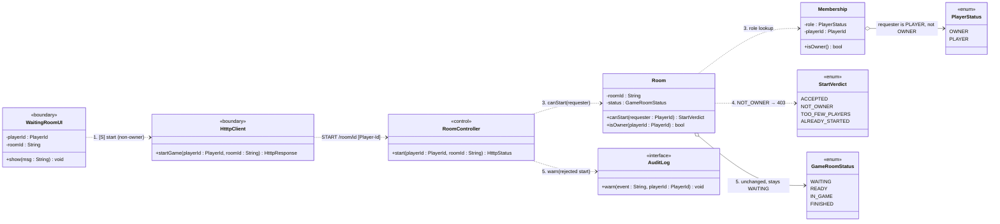
```mermaid
classDiagram
    direction LR

    class WaitingRoomUI {
        <<boundary>>
        -playerId : PlayerId
        -roomId : String
        +show(msg : String) void
    }
    class HtttpClient {
        <<boundary>>
        +startGame(playerId : PlayerId, roomId : String) HtttpResponse
    }
    class RoomController {
        <<control>>
        +start(playerId : PlayerId, roomId : String) HtttpStatus
    }
    class Room {
        -roomId : String
        -status : GameRoomStatus
        +canStart(requester : PlayerId) StartVerdict
        +isOwner(playerId : PlayerId) bool
    }
    class Membership {
        -role : PlayerStatus
        -playerId : PlayerId
        +isOwner() bool
    }
    class AuditLog {
        <<interface>>
        +warn(event : String, playerId : PlayerId) void
    }
    class StartVerdict {
        <<enum>>
        ACCEPTED
        NOT_OWNER
        TOO_FEW_PLAYERS
        ALREADY_STARTED
    }
    class GameRoomStatus {
        <<enum>>
        WAITING
        READY
        IN_GAME
        FINISHED
    }
    class PlayerStatus {
        <<enum>>
        OWNER
        PLAYER
    }

    WaitingRoomUI ..> HtttpClient : 1. [S] start (non-owner)
    HtttpClient ..> RoomController : START /room/id [Player-Id]
    RoomController ..> Room : 3. canStart(requester)
    Room ..> Membership : 3. role lookup
    Room ..> StartVerdict : 4. NOT_OWNER → 403
    RoomController ..> AuditLog : 5. warn(rejected start)
    Room o--> GameRoomStatus : 5. unchanged, stays WAITING
    Membership o--> PlayerStatus : requester is PLAYER, not OWNER
```

### CD UC-09 — Chat in Room

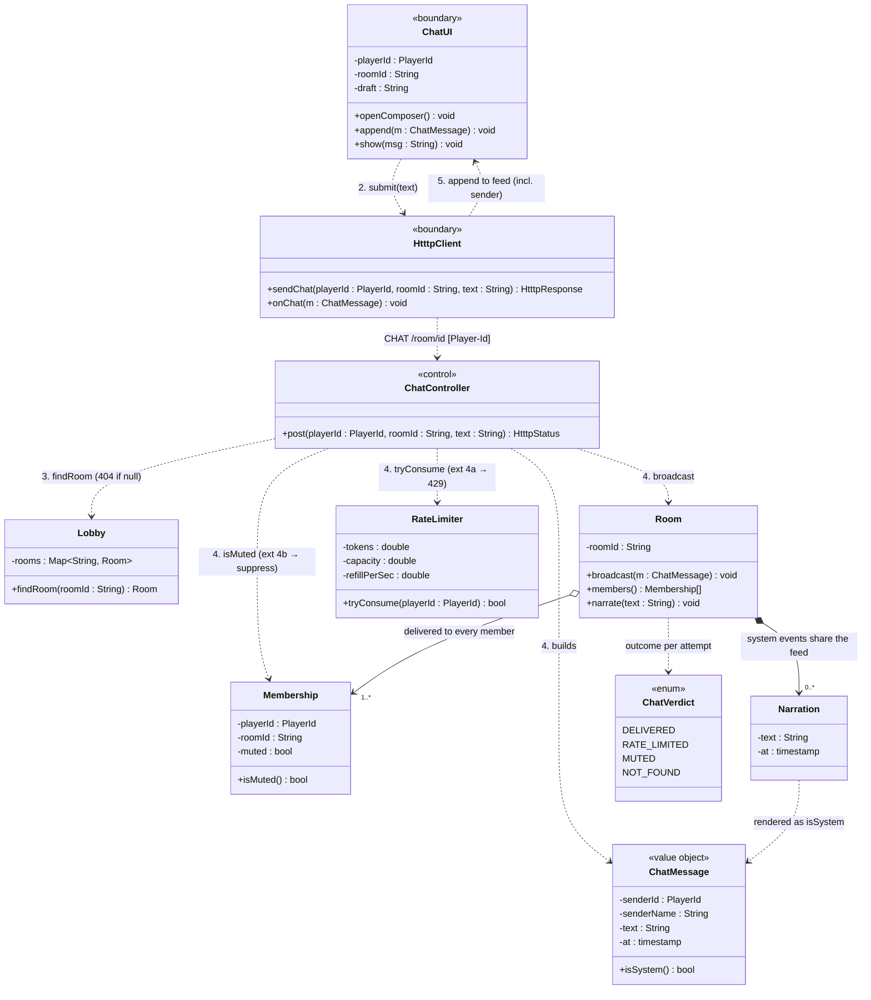
```mermaid
classDiagram
    direction TB

    class ChatUI {
        <<boundary>>
        -playerId : PlayerId
        -roomId : String
        -draft : String
        +openComposer() void
        +append(m : ChatMessage) void
        +show(msg : String) void
    }
    class HtttpClient {
        <<boundary>>
        +sendChat(playerId : PlayerId, roomId : String, text : String) HtttpResponse
        +onChat(m : ChatMessage) void
    }
    class ChatController {
        <<control>>
        +post(playerId : PlayerId, roomId : String, text : String) HtttpStatus
    }
    class Lobby {
        -rooms : Map~String, Room~
        +findRoom(roomId : String) Room
    }
    class Room {
        -roomId : String
        +broadcast(m : ChatMessage) void
        +members() Membership[]
        +narrate(text : String) void
    }
    class Membership {
        -playerId : PlayerId
        -roomId : String
        -muted : bool
        +isMuted() bool
    }
    class ChatMessage {
        <<value object>>
        -senderId : PlayerId
        -senderName : String
        -text : String
        -at : timestamp
        +isSystem() bool
    }
    class Narration {
        -text : String
        -at : timestamp
    }
    class RateLimiter {
        -tokens : double
        -capacity : double
        -refillPerSec : double
        +tryConsume(playerId : PlayerId) bool
    }
    class ChatVerdict {
        <<enum>>
        DELIVERED
        RATE_LIMITED
        MUTED
        NOT_FOUND
    }

    ChatUI ..> HtttpClient : 2. submit(text)
    HtttpClient ..> ChatController : CHAT /room/id [Player-Id]
    ChatController ..> Lobby : 3. findRoom (404 if null)
    ChatController ..> RateLimiter : 4. tryConsume (ext 4a → 429)
    ChatController ..> Membership : 4. isMuted (ext 4b → suppress)
    ChatController ..> ChatMessage : 4. builds
    ChatController ..> Room : 4. broadcast
    Room ..> ChatVerdict : outcome per attempt
    Room *--> "0..*" Narration : system events share the feed
    Room o--> "1..*" Membership : delivered to every member
    Narration ..> ChatMessage : rendered as isSystem
    HtttpClient ..> ChatUI : 5. append to feed (incl. sender)
```

---

## Combined Domain Class Diagram

### Concept extraction

| Source (UC + step) | Concept surfaced | Class |
|---|---|---|
| UC-01.1–4 "username / password" | credentials, the account being created | `Account` |
| UC-01.5 "hashes with a per-user salt" | the hash + salt pair, a value object | `Credential` |
| UC-01.7 "wallet = 0, starter character/theme" | the durable player document | `Player` |
| UC-02.3 "enters the Server ID" | the server the client dials | `ServerEndpoint` |
| UC-02.5 "authenticated handshake" | the secure session, UC-02a | `Session` |
| UC-02.7 "opens a session" | authenticated identity for later requests | `Session` (holds `Player-Id`) |
| UC-03.2 "current room directory" | the collection of live rooms | `Lobby` |
| UC-03.3 "ID, Mode, Players, State, Owner" | one row of the directory | `RoomSummary` |
| UC-03.4 "username, score, ranking" | header data | `Player`, `LeaderboardEntry` |
| UC-04.2 "`[1] Double` / `[2] Battle Royale`" | mode with slot_count / min_to_start | `GameMode` `«enum»` |
| UC-04.5 "initialises the room with `slot_count` slots" | the room aggregate | `Room` |
| UC-04.5 "seats the Owner in slot 1" | a seat that can be empty or occupied | `Slot` |
| UC-04.5 "marks the Player as `OWNER`" | role *within a room*, not a global type | `Membership` + `PlayerStatus` `«enum»` |
| UC-04.5 "room status `WAITING`" | room lifecycle | `GameRoomStatus` `«enum»` |
| UC-04.5 slot `WAITING → JOINING → READY` | slot lifecycle | `SlotStatus` `«enum»` |
| UC-04.6 "STATE message `WAITING FOR OPPONENT`" | derived text keyed by room status | `Room.stateMessage()` (derived, not stored) |
| UC-04.7 "Server narrates to the room" | system-authored room message | `Narration` |
| UC-07.3 "`number_of_players -= 1`" | occupancy counter | `Room.numberOfPlayers` |
| UC-07a.1 "next player in slot order" | successor selection | `Room.selectSuccessor()` |
| UC-07 alt 3b "room is destroyed" | room lifetime is owned by the lobby | `Lobby *--> Room` |
| UC-08.4 "verifies the requester is the Owner" | owner-only admission for START | `Room.canStart()` + `StartVerdict` `«enum»` |
| UC-08.5 "transitions the room to IN-GAME" | the live match, distinct from the room | `GameSession` |
| UC-08.5 "pushes the initial `STATE`" | the pushed board snapshot | `StateFrame` |
| UC-08a.5 "logs the rejected attempt at warning level" | audit sink outside the domain | `AuditLog` `«interface»` |
| UC-09.2 "types a message and submits it" | one authored room message | `ChatMessage` |
| UC-09.4 "per-session rate limit (token bucket)" | throttle keyed by player | `RateLimiter` |
| UC-09 ext 4b "Player is muted (admin action)" | per-room moderation flag | `Membership.muted` |
| UC-09.5 "system events may also be narrated" | narration shares the chat feed | `Narration ..> ChatMessage` |

### Domain diagram

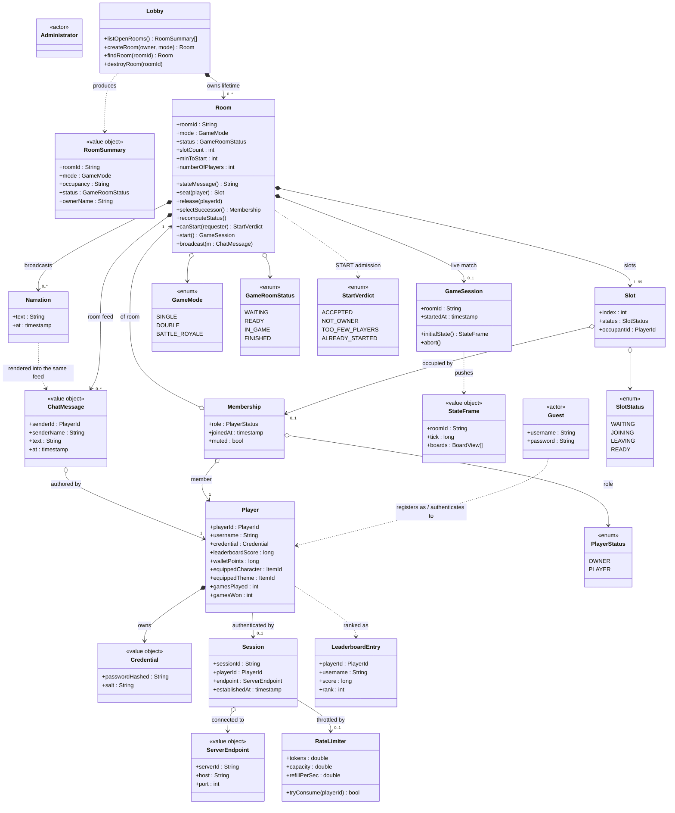
```mermaid
classDiagram
    direction TB

    class Guest {
        <<actor>>
        +username : String
        +password : String
    }
    class Administrator {
        <<actor>>
    }

    class Player {
        +playerId : PlayerId
        +username : String
        +credential : Credential
        +leaderboardScore : long
        +walletPoints : long
        +equippedCharacter : ItemId
        +equippedTheme : ItemId
        +gamesPlayed : int
        +gamesWon : int
    }
    class Credential {
        <<value object>>
        +passwordHashed : String
        +salt : String
    }
    class Session {
        +sessionId : String
        +playerId : PlayerId
        +endpoint : ServerEndpoint
        +establishedAt : timestamp
    }
    class ServerEndpoint {
        <<value object>>
        +serverId : String
        +host : String
        +port : int
    }

    class Lobby {
        +listOpenRooms() RoomSummary[]
        +createRoom(owner, mode) Room
        +findRoom(roomId) Room
        +destroyRoom(roomId)
    }
    class RoomSummary {
        <<value object>>
        +roomId : String
        +mode : GameMode
        +occupancy : String
        +status : GameRoomStatus
        +ownerName : String
    }
    class Room {
        +roomId : String
        +mode : GameMode
        +status : GameRoomStatus
        +slotCount : int
        +minToStart : int
        +numberOfPlayers : int
        +stateMessage() String
        +seat(player) Slot
        +release(playerId)
        +selectSuccessor() Membership
        +recomputeStatus()
        +canStart(requester) StartVerdict
        +start() GameSession
        +broadcast(m : ChatMessage)
    }
    class Slot {
        +index : int
        +status : SlotStatus
        +occupantId : PlayerId
    }
    class Membership {
        +role : PlayerStatus
        +joinedAt : timestamp
        +muted : bool
    }
    class Narration {
        +text : String
        +at : timestamp
    }
    class GameSession {
        +roomId : String
        +startedAt : timestamp
        +initialState() StateFrame
        +abort()
    }
    class StateFrame {
        <<value object>>
        +roomId : String
        +tick : long
        +boards : BoardView[]
    }
    class ChatMessage {
        <<value object>>
        +senderId : PlayerId
        +senderName : String
        +text : String
        +at : timestamp
    }
    class RateLimiter {
        +tokens : double
        +capacity : double
        +refillPerSec : double
        +tryConsume(playerId) bool
    }
    class LeaderboardEntry {
        +playerId : PlayerId
        +username : String
        +score : long
        +rank : int
    }

    class GameMode {
        <<enum>>
        SINGLE
        DOUBLE
        BATTLE_ROYALE
    }
    class GameRoomStatus {
        <<enum>>
        WAITING
        READY
        IN_GAME
        FINISHED
    }
    class SlotStatus {
        <<enum>>
        WAITING
        JOINING
        LEAVING
        READY
    }
    class PlayerStatus {
        <<enum>>
        OWNER
        PLAYER
    }
    class StartVerdict {
        <<enum>>
        ACCEPTED
        NOT_OWNER
        TOO_FEW_PLAYERS
        ALREADY_STARTED
    }

    Guest ..> Player : registers as / authenticates to
    Player *--> Credential : owns
    Player --> "0..1" Session : authenticated by
    Session o--> ServerEndpoint : connected to

    Lobby *--> "0..*" Room : owns lifetime
    Lobby ..> RoomSummary : produces
    Room *--> "1..99" Slot : slots
    Room *--> "0..*" Narration : broadcasts
    Room *--> "0..1" GameSession : live match
    Room *--> "0..*" ChatMessage : room feed
    Room ..> StartVerdict : START admission
    Room o--> GameMode
    Room o--> GameRoomStatus
    Slot o--> SlotStatus
    Slot o--> "0..1" Membership : occupied by

    GameSession ..> StateFrame : pushes
    Narration ..> ChatMessage : rendered into the same feed
    Session --> "0..1" RateLimiter : throttled by

    Membership o--> PlayerStatus : role
    Membership o--> "1" Player : member
    Membership o--> "1" Room : of room
    ChatMessage o--> "1" Player : authored by

    Player ..> LeaderboardEntry : ranked as
```

---

## Sequence Diagrams

### Layering conventions

| Participant | Layer | Process |
|---|---|---|
| `:LoginUI`, `:SignUpUI`, `:LobbyUI`, `:WaitingRoomUI`, `:ChatUI` | UI | tetrisu |
| `:AuthController`, `:LobbyController`, `:RoomController`, `:ChatController` | Controller | tetrisd |
| `:HtttpClient` | Boundary | tetrisu |
| `:Lobby`, `:Room`, `:Slot`, `:Membership`, `:Player`, `:GameSession`, `:RateLimiter` | Domain | tetrisd |
| `:Db` | Persistence | `libmacminidb` |
| `:AuditLog` | Logging | `tetrislogd` via `libcoreipc` |

### SD UC-01 — Register Account

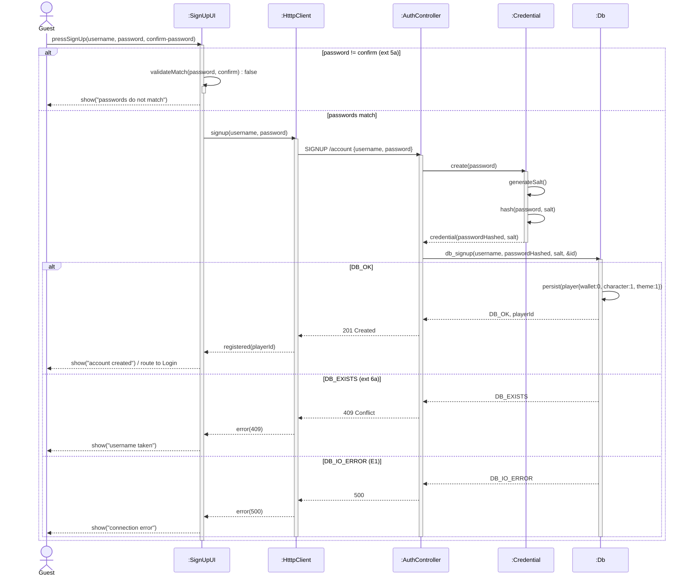
```mermaid
sequenceDiagram
    actor Guest
    participant UI as :SignUpUI
    participant C as :HtttpClient
    participant AC as :AuthController
    participant Cr as :Credential
    participant DB as :Db

    Guest->>UI: pressSignUp(username, password, confirm-password)
    activate UI

    alt password != confirm  (ext 5a)
        UI->>UI: validateMatch(password, confirm) : false
        activate UI
        deactivate UI
        UI-->>Guest: show("passwords do not match")
    else passwords match
        UI->>C: signup(username, password)
        activate C
        C->>AC: SIGNUP /account {username, password}
        activate AC

        AC->>Cr: create(password)
        activate Cr
        Cr->>Cr: generateSalt()
        Cr->>Cr: hash(password, salt)
        Cr-->>AC: credential(passwordHashed, salt)
        deactivate Cr

        AC->>DB: db_signup(username, passwordHashed, salt, &id)
        activate DB

        alt DB_OK
            DB->>DB: persist(player{wallet:0, character:1, theme:1})
            DB-->>AC: DB_OK, playerId
            AC-->>C: 201 Created
            C-->>UI: registered(playerId)
            UI-->>Guest: show("account created") / route to Login
        else DB_EXISTS  (ext 6a)
            DB-->>AC: DB_EXISTS
            AC-->>C: 409 Conflict
            C-->>UI: error(409)
            UI-->>Guest: show("username taken")
        else DB_IO_ERROR  (E1)
            DB-->>AC: DB_IO_ERROR
            AC-->>C: 500
            C-->>UI: error(500)
            UI-->>Guest: show("connection error")
        end

        deactivate DB
        deactivate AC
        deactivate C
    end
    deactivate UI
```

### SD UC-02 — Log In

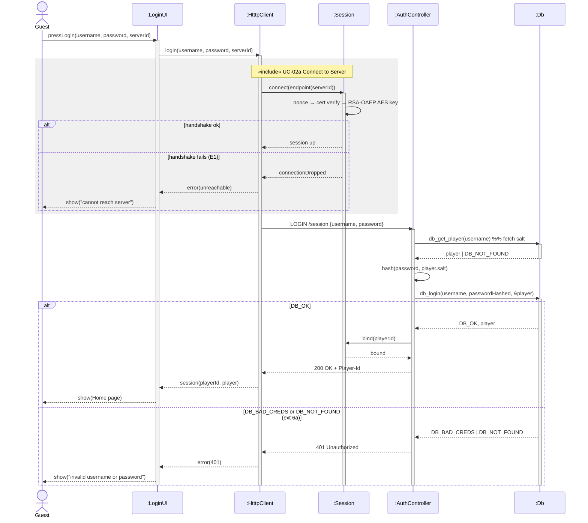
```mermaid
sequenceDiagram
    actor Guest
    participant UI as :LoginUI
    participant C as :HtttpClient
    participant S as :Session
    participant AC as :AuthController
    participant DB as :Db

    Guest->>UI: pressLogin(username, password, serverId)
    activate UI
    UI->>C: login(username, password, serverId)
    activate C

    rect rgb(240, 240, 240)
        note over C,S: «include» UC-02a Connect to Server
        C->>S: connect(endpoint(serverId))
        activate S
        S->>S: nonce → cert verify → RSA-OAEP AES key
        alt handshake ok
            S-->>C: session up
        else handshake fails  (E1)
            S-->>C: connectionDropped
            C-->>UI: error(unreachable)
            UI-->>Guest: show("cannot reach server")
        end
    end

    C->>AC: LOGIN /session {username, password}
    activate AC

    AC->>DB: db_get_player(username)  %% fetch salt
    activate DB
    DB-->>AC: player | DB_NOT_FOUND
    deactivate DB

    AC->>AC: hash(password, player.salt)

    AC->>DB: db_login(username, passwordHashed, &player)
    activate DB

    alt DB_OK
        DB-->>AC: DB_OK, player
        AC->>S: bind(playerId)
        S-->>AC: bound
        AC-->>C: 200 OK + Player-Id
        C-->>UI: session(playerId, player)
        UI-->>Guest: show(Home page)
    else DB_BAD_CREDS or DB_NOT_FOUND  (ext 6a)
        DB-->>AC: DB_BAD_CREDS | DB_NOT_FOUND
        AC-->>C: 401 Unauthorized
        C-->>UI: error(401)
        UI-->>Guest: show("invalid username or password")
    end

    deactivate DB
    deactivate AC
    deactivate S
    deactivate C
    deactivate UI
```

### SD UC-03 — Browse Open Rooms

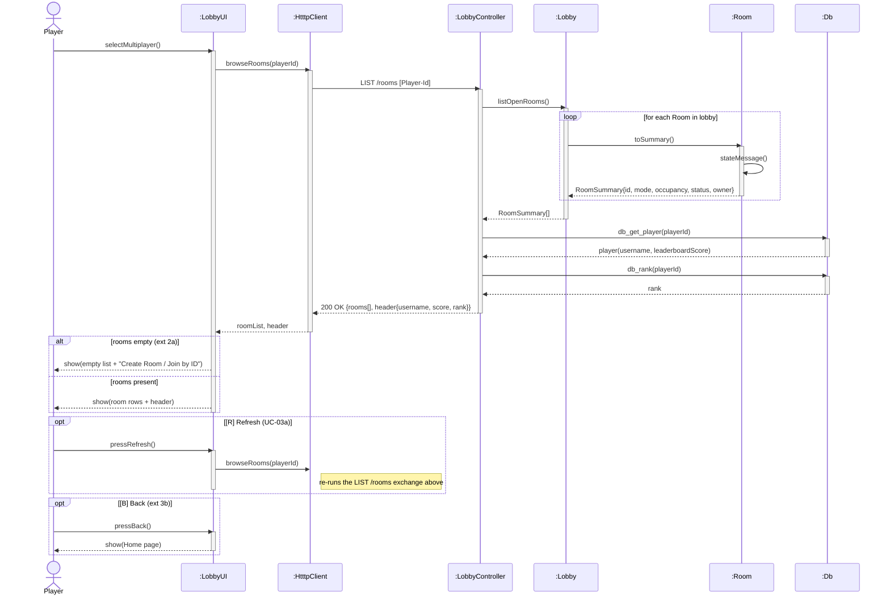
```mermaid
sequenceDiagram
    actor P as Player
    participant UI as :LobbyUI
    participant C as :HtttpClient
    participant LC as :LobbyController
    participant L as :Lobby
    participant R as :Room
    participant DB as :Db

    P->>UI: selectMultiplayer()
    activate UI
    UI->>C: browseRooms(playerId)
    activate C
    C->>LC: LIST /rooms  [Player-Id]
    activate LC

    LC->>L: listOpenRooms()
    activate L
    loop for each Room in lobby
        L->>R: toSummary()
        activate R
        R->>R: stateMessage()
        R-->>L: RoomSummary{id, mode, occupancy, status, owner}
        deactivate R
    end
    L-->>LC: RoomSummary[]
    deactivate L

    LC->>DB: db_get_player(playerId)
    activate DB
    DB-->>LC: player(username, leaderboardScore)
    deactivate DB

    LC->>DB: db_rank(playerId)
    activate DB
    DB-->>LC: rank
    deactivate DB

    LC-->>C: 200 OK {rooms[], header{username, score, rank}}
    deactivate LC
    C-->>UI: roomList, header
    deactivate C

    alt rooms empty  (ext 2a)
        UI-->>P: show(empty list + "Create Room / Join by ID")
    else rooms present
        UI-->>P: show(room rows + header)
    end
    deactivate UI

    opt [R] Refresh  (UC-03a)
        P->>UI: pressRefresh()
        activate UI
        UI->>C: browseRooms(playerId)
        note right of C: re-runs the LIST /rooms exchange above
        deactivate UI
    end

    opt [B] Back  (ext 3b)
        P->>UI: pressBack()
        activate UI
        UI-->>P: show(Home page)
        deactivate UI
    end
```

### SD UC-04 — Create Room

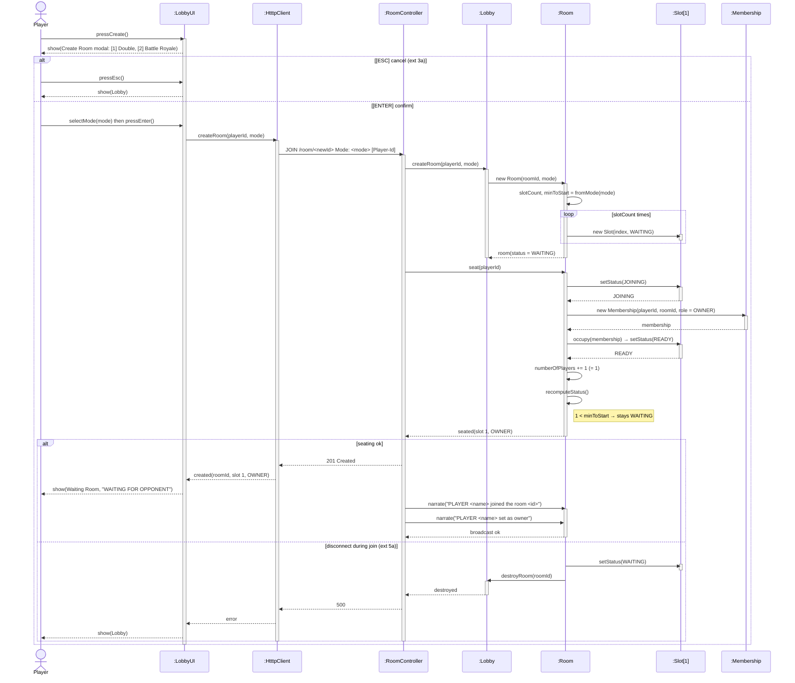
```mermaid
sequenceDiagram
    actor P as Player
    participant UI as :LobbyUI
    participant C as :HtttpClient
    participant RC as :RoomController
    participant L as :Lobby
    participant R as :Room
    participant S1 as :Slot[1]
    participant M as :Membership

    P->>UI: pressCreate()
    activate UI
    UI-->>P: show(Create Room modal: [1] Double, [2] Battle Royale)

    alt [ESC] cancel  (ext 3a)
        P->>UI: pressEsc()
        UI-->>P: show(Lobby)
    else [ENTER] confirm
        P->>UI: selectMode(mode) then pressEnter()
        UI->>C: createRoom(playerId, mode)
        activate C
        C->>RC: JOIN /room/<newId>  Mode: <mode>  [Player-Id]
        activate RC

        RC->>L: createRoom(playerId, mode)
        activate L
        L->>R: new Room(roomId, mode)
        activate R
        R->>R: slotCount, minToStart = fromMode(mode)
        loop slotCount times
            R->>S1: new Slot(index, WAITING)
            activate S1
            deactivate S1
        end
        R-->>L: room(status = WAITING)
        deactivate R
        deactivate L

        RC->>R: seat(playerId)
        activate R
        R->>S1: setStatus(JOINING)
        activate S1
        S1-->>R: JOINING
        deactivate S1
        R->>M: new Membership(playerId, roomId, role = OWNER)
        activate M
        M-->>R: membership
        deactivate M
        R->>S1: occupy(membership) → setStatus(READY)
        activate S1
        S1-->>R: READY
        deactivate S1
        R->>R: numberOfPlayers += 1  (= 1)
        R->>R: recomputeStatus()
        note right of R: 1 < minToStart → stays WAITING
        R-->>RC: seated(slot 1, OWNER)
        deactivate R

        alt seating ok
            RC-->>C: 201 Created
            C-->>UI: created(roomId, slot 1, OWNER)
            UI-->>P: show(Waiting Room, "WAITING FOR OPPONENT")
            RC->>R: narrate("PLAYER <name> joined the room <id>")
            activate R
            RC->>R: narrate("PLAYER <name> set as owner")
            R-->>RC: broadcast ok
            deactivate R
        else disconnect during join  (ext 5a)
            R->>S1: setStatus(WAITING)
            activate S1
            deactivate S1
            R->>L: destroyRoom(roomId)
            activate L
            L-->>RC: destroyed
            deactivate L
            RC-->>C: 500
            C-->>UI: error
            UI-->>P: show(Lobby)
        end

        deactivate RC
        deactivate C
    end
    deactivate UI
```

### SD UC-05 — Join Room from List

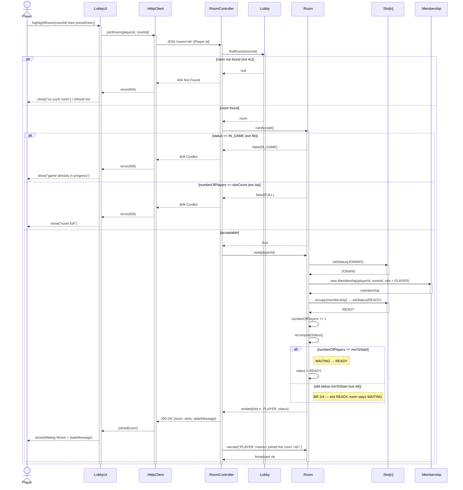
```mermaid
sequenceDiagram
    actor P as Player
    participant UI as :LobbyUI
    participant C as :HtttpClient
    participant RC as :RoomController
    participant L as :Lobby
    participant R as :Room
    participant Sn as :Slot[n]
    participant M as :Membership

    P->>UI: highlightRoom(roomId) then pressEnter()
    activate UI
    UI->>C: joinRoom(playerId, roomId)
    activate C
    C->>RC: JOIN /room/<id>  [Player-Id]
    activate RC

    RC->>L: findRoom(roomId)
    activate L

    alt room not found  (ext 4c)
        L-->>RC: null
        RC-->>C: 404 Not Found
        C-->>UI: error(404)
        UI-->>P: show("no such room") / refresh list
    else room found
        L-->>RC: room
        RC->>R: canAccept()
        activate R

        alt status == IN_GAME  (ext 4b)
            R-->>RC: false(IN_GAME)
            RC-->>C: 409 Conflict
            C-->>UI: error(409)
            UI-->>P: show("game already in progress")
        else numberOfPlayers == slotCount  (ext 4a)
            R-->>RC: false(FULL)
            RC-->>C: 409 Conflict
            C-->>UI: error(409)
            UI-->>P: show("room full")
        else acceptable
            R-->>RC: true
            RC->>R: seat(playerId)
            R->>Sn: setStatus(JOINING)
            activate Sn
            Sn-->>R: JOINING
            deactivate Sn
            R->>M: new Membership(playerId, roomId, role = PLAYER)
            activate M
            M-->>R: membership
            deactivate M
            R->>Sn: occupy(membership) → setStatus(READY)
            activate Sn
            Sn-->>R: READY
            deactivate Sn
            R->>R: numberOfPlayers += 1
            R->>R: recomputeStatus()

            alt numberOfPlayers >= minToStart
                note right of R: WAITING → READY
                R->>R: status = READY
            else still below minToStart  (ext 4d)
                note right of R: BR 2/4 — slot READY, room stays WAITING
            end

            R-->>RC: seated(slot n, PLAYER, status)
            RC-->>C: 200 OK {room, slots, stateMessage}
            C-->>UI: joined(room)
            UI-->>P: show(Waiting Room + stateMessage)
            RC->>R: narrate("PLAYER <name> joined the room <id>")
            R-->>RC: broadcast ok
        end

        deactivate R
    end

    deactivate L
    deactivate RC
    deactivate C
    deactivate UI
```

### SD UC-06 — Join Room by Room ID

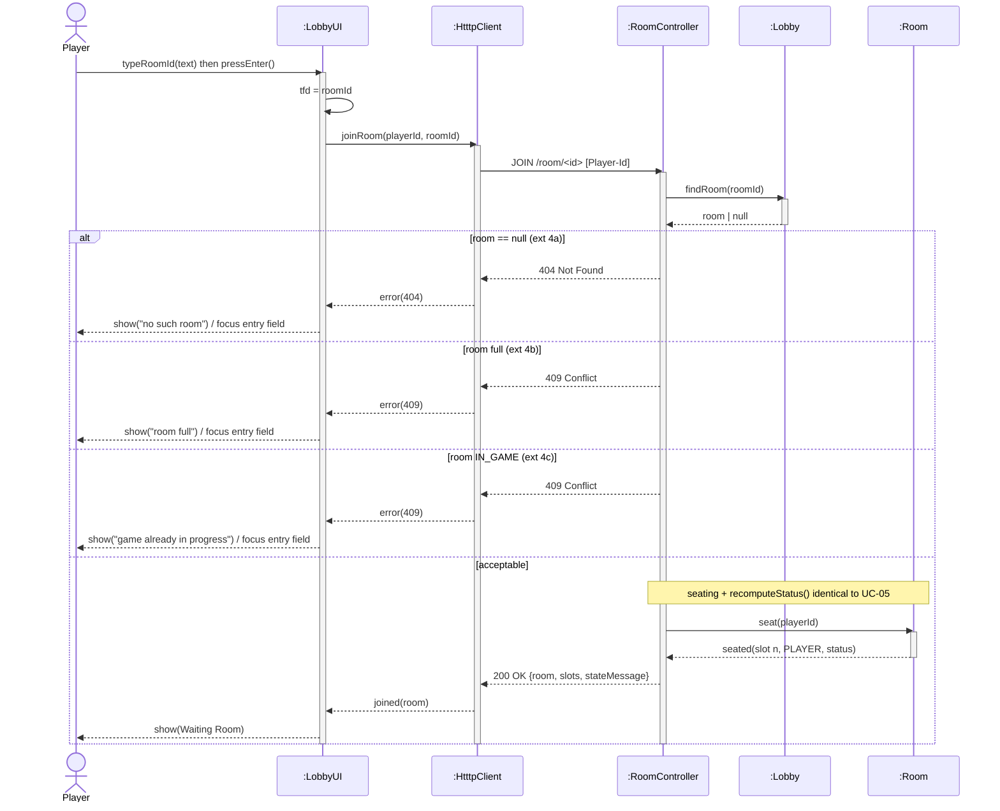
```mermaid
sequenceDiagram
    actor P as Player
    participant UI as :LobbyUI
    participant C as :HtttpClient
    participant RC as :RoomController
    participant L as :Lobby
    participant R as :Room

    P->>UI: typeRoomId(text) then pressEnter()
    activate UI
    UI->>UI: tfd = roomId
    UI->>C: joinRoom(playerId, roomId)
    activate C
    C->>RC: JOIN /room/<id>  [Player-Id]
    activate RC

    RC->>L: findRoom(roomId)
    activate L
    L-->>RC: room | null
    deactivate L

    alt room == null  (ext 4a)
        RC-->>C: 404 Not Found
        C-->>UI: error(404)
        UI-->>P: show("no such room") / focus entry field
    else room full  (ext 4b)
        RC-->>C: 409 Conflict
        C-->>UI: error(409)
        UI-->>P: show("room full") / focus entry field
    else room IN_GAME  (ext 4c)
        RC-->>C: 409 Conflict
        C-->>UI: error(409)
        UI-->>P: show("game already in progress") / focus entry field
    else acceptable
        note over RC,R: seating + recomputeStatus() identical to UC-05
        RC->>R: seat(playerId)
        activate R
        R-->>RC: seated(slot n, PLAYER, status)
        deactivate R
        RC-->>C: 200 OK {room, slots, stateMessage}
        C-->>UI: joined(room)
        UI-->>P: show(Waiting Room)
    end

    deactivate RC
    deactivate C
    deactivate UI
```

### SD UC-07 — Leave Room (includes UC-07a)

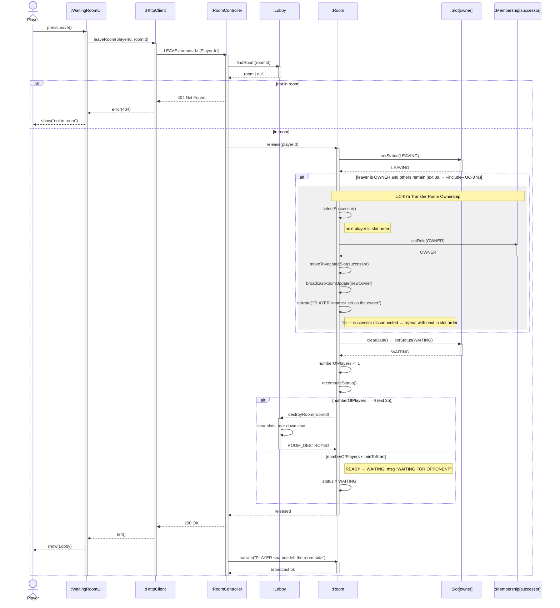
```mermaid
sequenceDiagram
    actor P as Player
    participant UI as :WaitingRoomUI
    participant C as :HtttpClient
    participant RC as :RoomController
    participant L as :Lobby
    participant R as :Room
    participant So as :Slot[owner]
    participant Ms as :Membership[successor]

    P->>UI: pressLeave()
    activate UI
    UI->>C: leaveRoom(playerId, roomId)
    activate C
    C->>RC: LEAVE /room/<id>  [Player-Id]
    activate RC

    RC->>L: findRoom(roomId)
    activate L
    L-->>RC: room | null
    deactivate L

    alt not in room
        RC-->>C: 404 Not Found
        C-->>UI: error(404)
        UI-->>P: show("not in room")
    else in room
        RC->>R: release(playerId)
        activate R
        R->>So: setStatus(LEAVING)
        activate So
        So-->>R: LEAVING
        deactivate So

        alt leaver is OWNER and others remain  (ext 3a → «include» UC-07a)
            rect rgb(240, 240, 240)
                note over R,Ms: UC-07a Transfer Room Ownership
                R->>R: selectSuccessor()
                note right of R: next player in slot order
                R->>Ms: setRole(OWNER)
                activate Ms
                Ms-->>R: OWNER
                deactivate Ms
                R->>R: moveToVacatedSlot(successor)
                R->>R: broadcastRoomUpdate(newOwner)
                R->>R: narrate("PLAYER <name> set as the owner")
                note right of R: 1b — successor disconnected → repeat with next in slot order
            end
        end

        R->>So: clearData() → setStatus(WAITING)
        activate So
        So-->>R: WAITING
        deactivate So
        R->>R: numberOfPlayers -= 1
        R->>R: recomputeStatus()

        alt numberOfPlayers == 0  (ext 3b)
            R->>L: destroyRoom(roomId)
            activate L
            L->>L: clear slots, tear down chat
            L-->>R: ROOM_DESTROYED
            deactivate L
        else numberOfPlayers < minToStart
            note right of R: READY → WAITING, msg "WAITING FOR OPPONENT"
            R->>R: status = WAITING
        end

        R-->>RC: released
        deactivate R

        RC-->>C: 200 OK
        C-->>UI: left()
        UI-->>P: show(Lobby)
        RC->>R: narrate("PLAYER <name> left the room <id>")
        activate R
        R-->>RC: broadcast ok
        deactivate R
    end

    deactivate RC
    deactivate C
    deactivate UI
```

### SD UC-08 — Start Game (with UC-08a)

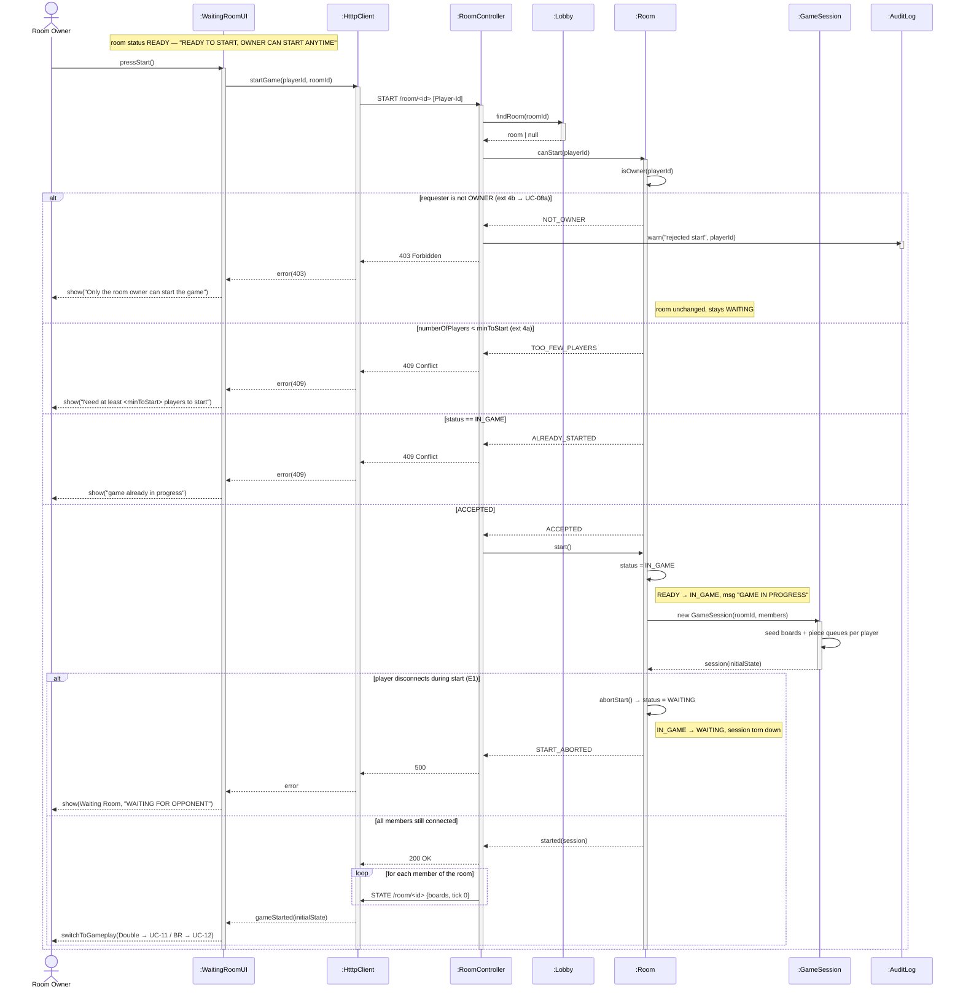
```mermaid
sequenceDiagram
    actor O as Room Owner
    participant UI as :WaitingRoomUI
    participant C as :HtttpClient
    participant RC as :RoomController
    participant L as :Lobby
    participant R as :Room
    participant GS as :GameSession
    participant LOG as :AuditLog

    note over UI: room status READY — "READY TO START, OWNER CAN START ANYTIME"

    O->>UI: pressStart()
    activate UI
    UI->>C: startGame(playerId, roomId)
    activate C
    C->>RC: START /room/<id>  [Player-Id]
    activate RC

    RC->>L: findRoom(roomId)
    activate L
    L-->>RC: room | null
    deactivate L

    RC->>R: canStart(playerId)
    activate R
    R->>R: isOwner(playerId)

    alt requester is not OWNER  (ext 4b → UC-08a)
        R-->>RC: NOT_OWNER
        RC->>LOG: warn("rejected start", playerId)
        activate LOG
        deactivate LOG
        RC-->>C: 403 Forbidden
        C-->>UI: error(403)
        UI-->>O: show("Only the room owner can start the game")
        note right of R: room unchanged, stays WAITING
    else numberOfPlayers < minToStart  (ext 4a)
        R-->>RC: TOO_FEW_PLAYERS
        RC-->>C: 409 Conflict
        C-->>UI: error(409)
        UI-->>O: show("Need at least <minToStart> players to start")
    else status == IN_GAME
        R-->>RC: ALREADY_STARTED
        RC-->>C: 409 Conflict
        C-->>UI: error(409)
        UI-->>O: show("game already in progress")
    else ACCEPTED
        R-->>RC: ACCEPTED
        RC->>R: start()
        R->>R: status = IN_GAME
        note right of R: READY → IN_GAME, msg "GAME IN PROGRESS"
        R->>GS: new GameSession(roomId, members)
        activate GS
        GS->>GS: seed boards + piece queues per player
        GS-->>R: session(initialState)
        deactivate GS

        alt player disconnects during start  (E1)
            R->>R: abortStart() → status = WAITING
            note right of R: IN_GAME → WAITING, session torn down
            R-->>RC: START_ABORTED
            RC-->>C: 500
            C-->>UI: error
            UI-->>O: show(Waiting Room, "WAITING FOR OPPONENT")
        else all members still connected
            R-->>RC: started(session)
            RC-->>C: 200 OK
            loop for each member of the room
                RC->>C: STATE /room/<id>  {boards, tick 0}
            end
            C-->>UI: gameStarted(initialState)
            UI-->>O: switchToGameplay(Double → UC-11 / BR → UC-12)
        end
    end

    deactivate R
    deactivate RC
    deactivate C
    deactivate UI
```

### SD UC-09 — Chat in Room

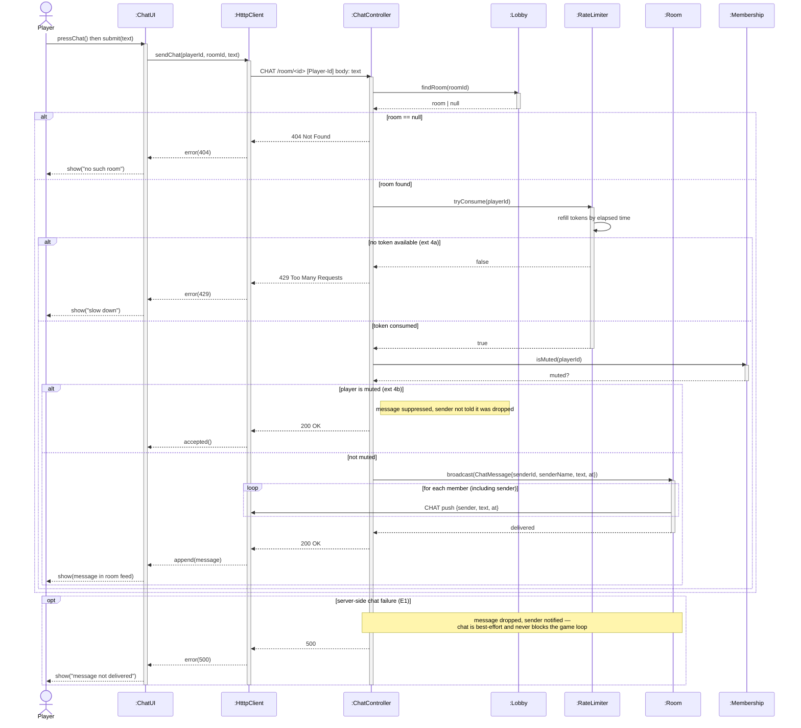
```mermaid
sequenceDiagram
    actor P as Player
    participant UI as :ChatUI
    participant C as :HtttpClient
    participant CC as :ChatController
    participant L as :Lobby
    participant RL as :RateLimiter
    participant R as :Room
    participant M as :Membership

    P->>UI: pressChat() then submit(text)
    activate UI
    UI->>C: sendChat(playerId, roomId, text)
    activate C
    C->>CC: CHAT /room/<id>  [Player-Id]  body: text
    activate CC

    CC->>L: findRoom(roomId)
    activate L
    L-->>CC: room | null
    deactivate L

    alt room == null
        CC-->>C: 404 Not Found
        C-->>UI: error(404)
        UI-->>P: show("no such room")
    else room found
        CC->>RL: tryConsume(playerId)
        activate RL
        RL->>RL: refill tokens by elapsed time

        alt no token available  (ext 4a)
            RL-->>CC: false
            CC-->>C: 429 Too Many Requests
            C-->>UI: error(429)
            UI-->>P: show("slow down")
        else token consumed
            RL-->>CC: true
            deactivate RL

            CC->>M: isMuted(playerId)
            activate M
            M-->>CC: muted?
            deactivate M

            alt player is muted  (ext 4b)
                note right of CC: message suppressed, sender not told it was dropped
                CC-->>C: 200 OK
                C-->>UI: accepted()
            else not muted
                CC->>R: broadcast(ChatMessage{senderId, senderName, text, at})
                activate R
                loop for each member (including sender)
                    R->>C: CHAT push {sender, text, at}
                end
                R-->>CC: delivered
                deactivate R
                CC-->>C: 200 OK
                C-->>UI: append(message)
                UI-->>P: show(message in room feed)
            end
        end
    end

    opt server-side chat failure  (E1)
        note over CC,R: message dropped, sender notified —<br/>chat is best-effort and never blocks the game loop
        CC-->>C: 500
        C-->>UI: error(500)
        UI-->>P: show("message not delivered")
    end

    deactivate CC
    deactivate C
    deactivate UI
```

---

## Solution Class Diagram

### Method inventory by use case

| Behaviour | Owner | Signature | From |
|---|---|---|---|
| validate password match | `SignUpUI` | `validateMatch(String, String) : bool` | UC-01.5 |
| hash with fresh salt | `Credential` | `create(String) : Credential` | UC-01.5 |
| create the account | `AuthController` | `signup(String, String) : HtttpStatus` | UC-01.6 |
| authenticate | `AuthController` | `login(String, String) : LoginResult` | UC-02.6 |
| establish secure channel | `Session` | `connect(ServerEndpoint) : bool` | UC-02a |
| bind identity to session | `Session` | `bind(PlayerId)` | UC-02.7 |
| list rooms | `Lobby` | `listOpenRooms() : RoomSummary[]` | UC-03.2 |
| project a room to a row | `Room` | `toSummary() : RoomSummary` | UC-03.3 |
| derive STATE text | `Room` | `stateMessage() : String` | UC-04.6 |
| header data | `LobbyController` | `header(PlayerId) : HeaderDto` | UC-03.4 |
| create + register a room | `Lobby` | `createRoom(PlayerId, GameMode) : Room` | UC-04.5 |
| resolve mode parameters | `GameMode` | `slotCount() : int`, `minToStart() : int` | UC-04.5 |
| seat a player | `Room` | `seat(PlayerId) : Slot` | UC-04.5 / UC-05.4 |
| slot lifecycle | `Slot` | `setStatus(SlotStatus)`, `occupy(Membership)`, `clearData()` | UC-04.5 |
| admissibility check | `Room` | `canAccept() : JoinVerdict` | UC-05 ext 4a/4b |
| recompute room status | `Room` | `recomputeStatus()` | UC-05.4 |
| free a slot | `Room` | `release(PlayerId)` | UC-07.3 |
| pick the successor | `Room` | `selectSuccessor() : Membership` | UC-07a.1 |
| change role | `Membership` | `setRole(PlayerStatus)` | UC-07a.1 |
| system message | `Room` | `narrate(String)` | UC-04.7 / UC-07.4 |
| destroy the room | `Lobby` | `destroyRoom(String)` | UC-07 ext 3b |
| owner-only start check | `Room` | `canStart(PlayerId) : StartVerdict` | UC-08.4 / UC-08a.3 |
| begin the match | `Room` | `start() : GameSession` | UC-08.5 |
| initial board snapshot | `GameSession` | `initialState() : StateFrame` | UC-08.5 |
| abort a failed start | `GameSession` | `abort()` | UC-08 E1 |
| start a room | `RoomController` | `start(PlayerId, String) : HtttpStatus` | UC-08.3 |
| log a rejected start | `AuditLog` | `warn(String, PlayerId)` | UC-08a.5 |
| throttle a sender | `RateLimiter` | `tryConsume(PlayerId) : bool` | UC-09.4 |
| moderation check | `Membership` | `isMuted() : bool` | UC-09 ext 4b |
| fan out a message | `Room` | `broadcast(ChatMessage)` | UC-09.4 |
| post a chat message | `ChatController` | `post(PlayerId, String, String) : HtttpStatus` | UC-09.3 |

### Solution diagram

```mermaid
classDiagram
    direction TB

    %% ---------------- UI layer (tetrisu) ----------------
    class SignUpUI {
        <<boundary>>
        -username : String
        -password : String
        -confirm : String
        +validateMatch(String, String) bool
        +show(msg : String) void
    }
    class LoginUI {
        <<boundary>>
        -username : String
        -password : String
        -serverId : String
        +show(msg : String) void
    }
    class LobbyUI {
        <<boundary>>
        -playerId : PlayerId
        -highlightedRoomId : String
        -typedRoomId : String
        +show(msg : String) void
    }
    class WaitingRoomUI {
        <<boundary>>
        -playerId : PlayerId
        -roomId : String
        +show(msg : String) void
        +switchToGameplay(view : GameView) void
    }
    class ChatUI {
        <<boundary>>
        -roomId : String
        -draft : String
        +openComposer() void
        +append(m : ChatMessage) void
        +show(msg : String) void
    }

    %% ---------------- Boundary ----------------
    class HtttpClient {
        <<boundary>>
        -session : Session
        +signup(String, String) HtttpResponse
        +login(String, String, String) HtttpResponse
        +browseRooms(PlayerId) HtttpResponse
        +createRoom(PlayerId, GameMode) HtttpResponse
        +joinRoom(PlayerId, String) HtttpResponse
        +leaveRoom(PlayerId, String) HtttpResponse
        +startGame(PlayerId, String) HtttpResponse
        +sendChat(PlayerId, String, String) HtttpResponse
        +onState(frame : StateFrame) void
        +onChat(m : ChatMessage) void
    }

    %% ---------------- Controllers (tetrisd, stateless) ----------------
    class AuthController {
        <<control>>
        +signup(username : String, password : String) HtttpStatus
        +login(username : String, password : String) LoginResult
    }
    class LobbyController {
        <<control>>
        +listRooms(playerId : PlayerId) LobbyView
        +header(playerId : PlayerId) HeaderDto
    }
    class RoomController {
        <<control>>
        +create(playerId : PlayerId, mode : GameMode) RoomView
        +join(playerId : PlayerId, roomId : String) RoomView
        +leave(playerId : PlayerId, roomId : String) HtttpStatus
        +start(playerId : PlayerId, roomId : String) HtttpStatus
    }
    class ChatController {
        <<control>>
        +post(playerId : PlayerId, roomId : String, text : String) HtttpStatus
    }

    %% ---------------- Domain ----------------
    class Player {
        -playerId : PlayerId
        -username : String
        -credential : Credential
        -leaderboardScore : long
        -walletPoints : long
        -gamesPlayed : int
        -gamesWon : int
        +getUsername() String
        +getLeaderboardScore() long
    }
    class Credential {
        -passwordHashed : String
        -salt : String
        +create(password : String)$ Credential
        +verify(password : String) bool
        +getSalt() String
    }
    class Session {
        -sessionId : String
        -playerId : PlayerId
        -endpoint : ServerEndpoint
        +connect(endpoint : ServerEndpoint) bool
        +bind(playerId : PlayerId) void
        +isAuthenticated() bool
        +close() void
    }
    class ServerEndpoint {
        -serverId : String
        -host : String
        -port : int
        +resolve(serverId : String)$ ServerEndpoint
    }
    class Lobby {
        -rooms : Map~String, Room~
        +listOpenRooms() RoomSummary[]
        +createRoom(owner : PlayerId, mode : GameMode) Room
        +findRoom(roomId : String) Room
        +destroyRoom(roomId : String) void
    }
    class Room {
        -roomId : String
        -mode : GameMode
        -status : GameRoomStatus
        -slotCount : int
        -minToStart : int
        -numberOfPlayers : int
        +stateMessage() String
        +canAccept() JoinVerdict
        +seat(playerId : PlayerId) Slot
        +release(playerId : PlayerId) void
        +selectSuccessor() Membership
        +recomputeStatus() void
        +narrate(text : String) void
        +toSummary() RoomSummary
        +isOwner(playerId : PlayerId) bool
        +canStart(requester : PlayerId) StartVerdict
        +start() GameSession
        +broadcast(m : ChatMessage) void
        +members() Membership[]
    }
    class Slot {
        -index : int
        -status : SlotStatus
        -occupant : Membership
        +setStatus(s : SlotStatus) void
        +occupy(m : Membership) void
        +clearData() void
        +isFree() bool
        +isReady() bool
    }
    class Membership {
        -role : PlayerStatus
        -playerId : PlayerId
        -roomId : String
        -muted : bool
        +setRole(r : PlayerStatus) void
        +isOwner() bool
        +isMuted() bool
    }
    class RoomSummary {
        <<value object>>
        -roomId : String
        -mode : GameMode
        -occupancy : String
        -status : GameRoomStatus
        -ownerName : String
    }
    class GameSession {
        -roomId : String
        -startedAt : timestamp
        -boards : Map~PlayerId, Board~
        +initialState() StateFrame
        +abort() void
    }
    class StateFrame {
        <<value object>>
        -roomId : String
        -tick : long
        -boards : BoardView[]
    }
    class ChatMessage {
        <<value object>>
        -senderId : PlayerId
        -senderName : String
        -text : String
        -at : timestamp
        +isSystem() bool
    }
    class RateLimiter {
        -tokens : double
        -capacity : double
        -refillPerSec : double
        +tryConsume(playerId : PlayerId) bool
    }

    %% ---------------- Persistence & logging ----------------
    class Db {
        <<interface>>
        libmacminidb
        +db_signup(username, hash, salt, out) DbResult
        +db_login(username, hash, out) DbResult
        +db_get_player(playerId, out) DbResult
        +db_rank(playerId) int
    }
    class AuditLog {
        <<interface>>
        tetrislogd via libcoreipc
        +warn(event : String, playerId : PlayerId) void
    }

    %% ---------------- Enums ----------------
    class GameMode {
        <<enum>>
        SINGLE
        DOUBLE
        BATTLE_ROYALE
        +slotCount() int
        +minToStart() int
    }
    class GameRoomStatus {
        <<enum>>
        WAITING
        READY
        IN_GAME
        FINISHED
    }
    class SlotStatus {
        <<enum>>
        WAITING
        JOINING
        LEAVING
        READY
    }
    class PlayerStatus {
        <<enum>>
        OWNER
        PLAYER
    }
    class StartVerdict {
        <<enum>>
        ACCEPTED
        NOT_OWNER
        TOO_FEW_PLAYERS
        ALREADY_STARTED
    }
    class ChatVerdict {
        <<enum>>
        DELIVERED
        RATE_LIMITED
        MUTED
        NOT_FOUND
    }
    class DbResult {
        <<enum>>
        DB_OK
        DB_EXISTS
        DB_BAD_CREDS
        DB_NOT_FOUND
        DB_IO_ERROR
    }

    %% ---------------- Relationships ----------------
    SignUpUI ..> HtttpClient : uses
    LoginUI ..> HtttpClient : uses
    LobbyUI ..> HtttpClient : uses
    WaitingRoomUI ..> HtttpClient : uses
    ChatUI ..> HtttpClient : uses

    HtttpClient *--> Session : owns
    Session o--> ServerEndpoint

    HtttpClient ..> AuthController : HTTTP SIGNUP / LOGIN
    HtttpClient ..> LobbyController : HTTTP LIST
    HtttpClient ..> RoomController : HTTTP JOIN / LEAVE / START
    HtttpClient ..> ChatController : HTTTP CHAT

    AuthController ..> Credential : creates
    AuthController ..> Db : signup / login
    AuthController ..> Session : bind

    LobbyController ..> Lobby : listOpenRooms
    LobbyController ..> Db : player + rank
    LobbyController ..> RoomSummary : returns

    RoomController ..> Lobby : create / find / destroy
    RoomController ..> Room : seat / release / narrate / start
    RoomController ..> AuditLog : warn on rejected start

    ChatController ..> Lobby : findRoom
    ChatController ..> RateLimiter : tryConsume
    ChatController ..> Room : broadcast
    ChatController ..> ChatVerdict : outcome

    Lobby *--> "0..*" Room : owns
    Room *--> "1..99" Slot
    Room *--> "0..1" GameSession : live match
    Room *--> "0..*" ChatMessage : room feed
    Room o--> GameMode
    Room o--> GameRoomStatus
    Room ..> RoomSummary : produces
    Room ..> StartVerdict : canStart
    GameSession ..> StateFrame : pushes
    HtttpClient ..> StateFrame : receives push
    Slot o--> SlotStatus
    Slot o--> "0..1" Membership
    Membership o--> PlayerStatus
    Membership ..> Player : refers to
    ChatMessage o--> "1" Player : authored by
    Session --> "0..1" RateLimiter : throttled by

    Player *--> Credential
    Db ..> Player : materialises
    Db ..> DbResult
```
