# tetriSH — Gameplay (UC-10 – UC-14)

## Table of Contents

- [Per-Use-Case Class Diagrams](#per-use-case-class-diagrams)
  - [CD UC-10 — Play Single-Player Game](#cd-uc-10--play-single-player-game)
  - [CD UC-11 — Play Double (2-Player) Game](#cd-uc-11--play-double-2-player-game)
  - [CD UC-12 — Play Battle Royale Game](#cd-uc-12--play-battle-royale-game)
  - [CD UC-13 — Control Falling Piece](#cd-uc-13--control-falling-piece)
  - [CD UC-14 — Activate Gaiden Ability](#cd-uc-14--activate-gaiden-ability)
- [Combined Domain Class Diagram](#combined-domain-class-diagram)
  - [Concept extraction](#concept-extraction)
  - [Domain diagram](#domain-diagram)
- [Sequence Diagrams](#sequence-diagrams)
  - [Layering conventions](#layering-conventions)
  - [SD UC-10 — Play Single-Player Game](#sd-uc-10--play-single-player-game)
  - [SD UC-11 — Play Double (2-Player) Game](#sd-uc-11--play-double-2-player-game)
  - [SD UC-12 — Play Battle Royale Game](#sd-uc-12--play-battle-royale-game)
  - [SD UC-13 — Control Falling Piece](#sd-uc-13--control-falling-piece)
  - [SD UC-14 — Activate Gaiden Ability](#sd-uc-14--activate-gaiden-ability)
- [Solution Class Diagram](#solution-class-diagram)
  - [Method inventory by use case](#method-inventory-by-use-case)
  - [Solution diagram](#solution-diagram)
- [Traceability Matrix](#traceability-matrix)

---

## Per-Use-Case Class Diagrams

### CD UC-10 — Play Single-Player Game

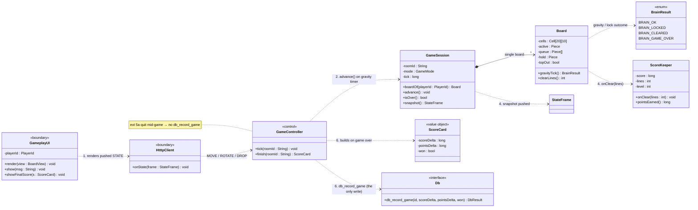

### CD UC-11 — Play Double (2-Player) Game

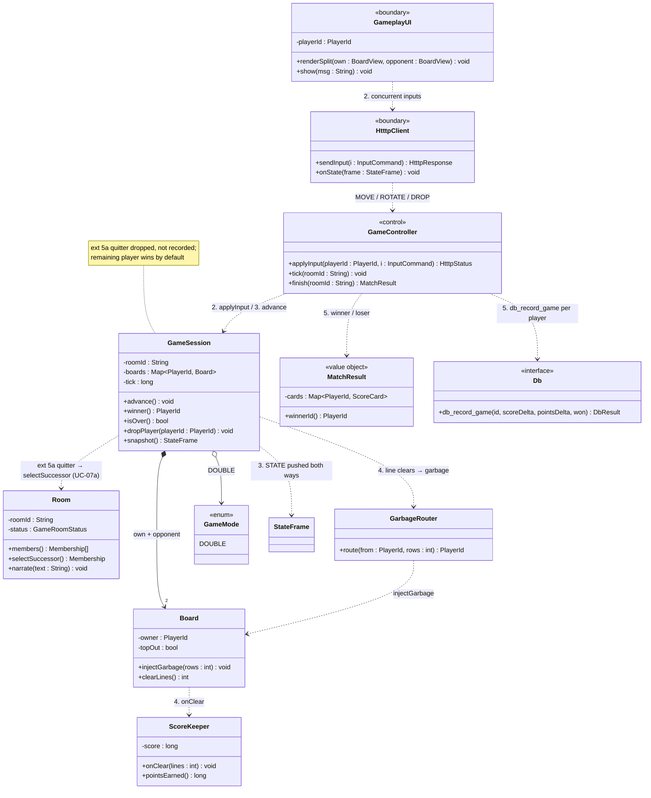

### CD UC-12 — Play Battle Royale Game

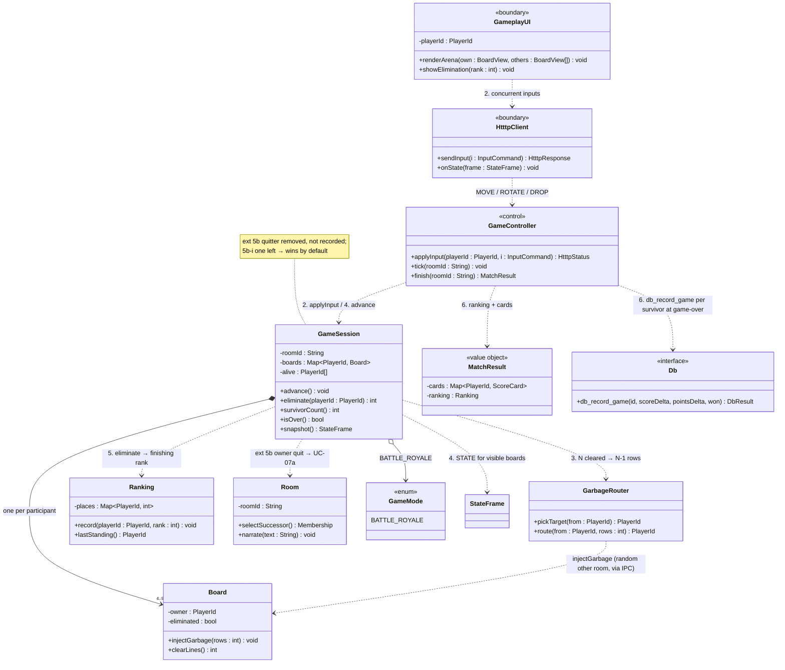

### CD UC-13 — Control Falling Piece

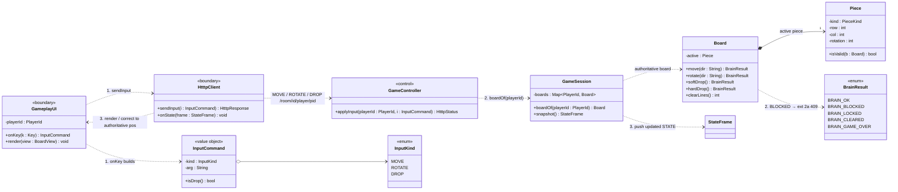

### CD UC-14 — Activate Gaiden Ability

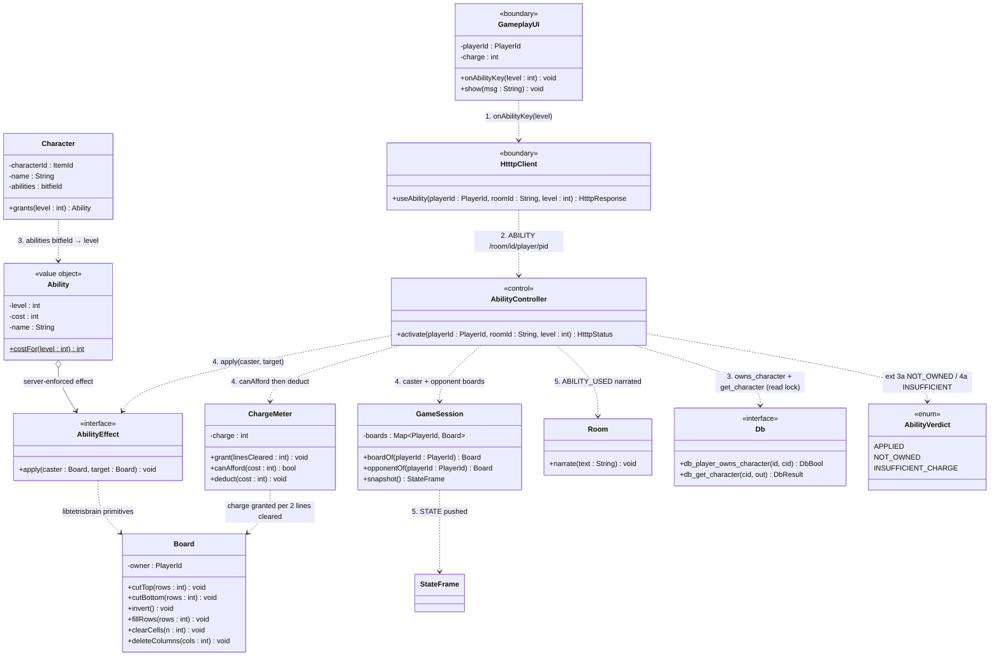

---

## Combined Domain Class Diagram

### Concept extraction

| Source (UC + step) | Concept surfaced | Class |
|---|---|---|
| UC-10.1 "renders the board" | the authoritative 20×10 playfield | `Board` |
| UC-10.1 "piece queue (next pieces), the hold column" | the falling tetromino | `Piece` + `PieceKind` `«enum»` |
| UC-10.2 "spawns falling pieces on a gravity timer" | the live match clock | `GameSession.tick` |
| UC-10.4 "clears completed lines and updates the score" | score / lines / level accumulator | `ScoreKeeper` |
| UC-10.5 "until the board tops out" | terminal board flag | `Board.topOut` |
| UC-10.6 `db_record_game(score_delta, points_delta, won)` | one player's post-game deltas | `ScoreCard` `«value object»` |
| UC-11.1 "split screen: own board / opponent board" | boards keyed by player | `GameSession.boards` |
| UC-11.3 "Server pushes each Player's `STATE`" | the pushed board snapshot | `StateFrame` `«value object»` |
| UC-11.4 "garbage may be applied per rules" | who receives cleared-line garbage | `GarbageRouter` |
| UC-11.5 "winner/loser determined" | per-match outcome for every player | `MatchResult` |
| UC-11 ext 5a "ownership is transferred" | reuses UC-07a | `Room.selectSuccessor()` |
| UC-12.3 "inserted at the bottom of a random other player's board" | target selection across rooms | `GarbageRouter.pickTarget()` |
| UC-12.5 "eliminated as they top out" | who is still playing | `GameSession.alive` |
| UC-12.6 "records the final ranking" | finishing place per participant | `Ranking` |
| UC-13.1 "`MOVE`/`ROTATE`/`DROP`" | one validated player action | `InputCommand` + `InputKind` `«enum»` |
| UC-13.2 "validates against the authoritative board" | brain return code | `BrainResult` `«enum»` |
| UC-14.1 "triggers the equipped ability" | one of four levels a character grants | `Ability` `«value object»` |
| UC-14.3 "reads the `abilities` bitfield" | the catalogue item that grants abilities | `Character` |
| UC-14.4 "enough line-clear charge, deducts the cost" | the charge meter (2 lines = 1 charge) | `ChargeMeter` |
| UC-14.4 "enforces the corresponding effect" | pluggable effect over board primitives | `AbilityEffect` `«interface»` |
| UC-14.5 "Server narrates it to the room" | reuses UC-04/UC-09 narration | `Room.narrate()` |

### Domain diagram

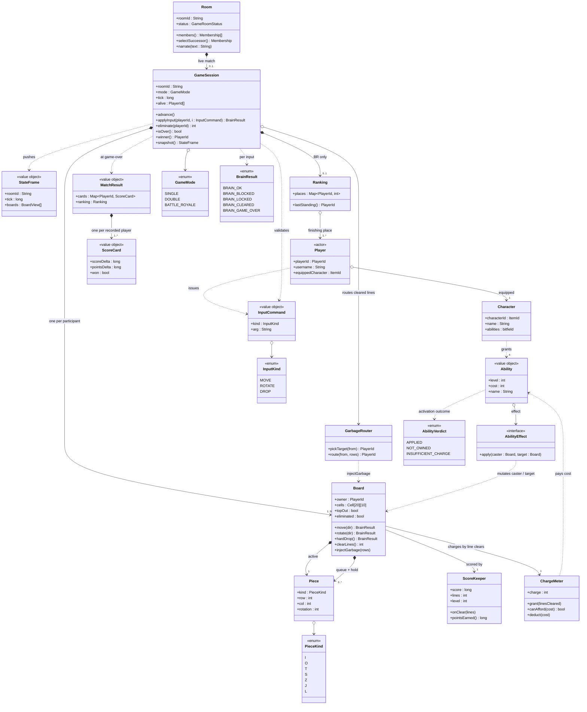

---

## Sequence Diagrams

### Layering conventions

| Participant | Layer | Process |
|---|---|---|
| `:GameplayUI` | UI | tetrisu |
| `:HtttpClient` | Boundary | tetrisu |
| `:GameController`, `:AbilityController` | Controller | tetrisd |
| `:GameSession`, `:Board`, `:ScoreKeeper`, `:ChargeMeter`, `:GarbageRouter`, `:Room` | Domain | tetrisd (logic via `libtetrisbrain`) |
| `:Db` | Persistence | `libmacminidb` |

### SD UC-10 — Play Single-Player Game

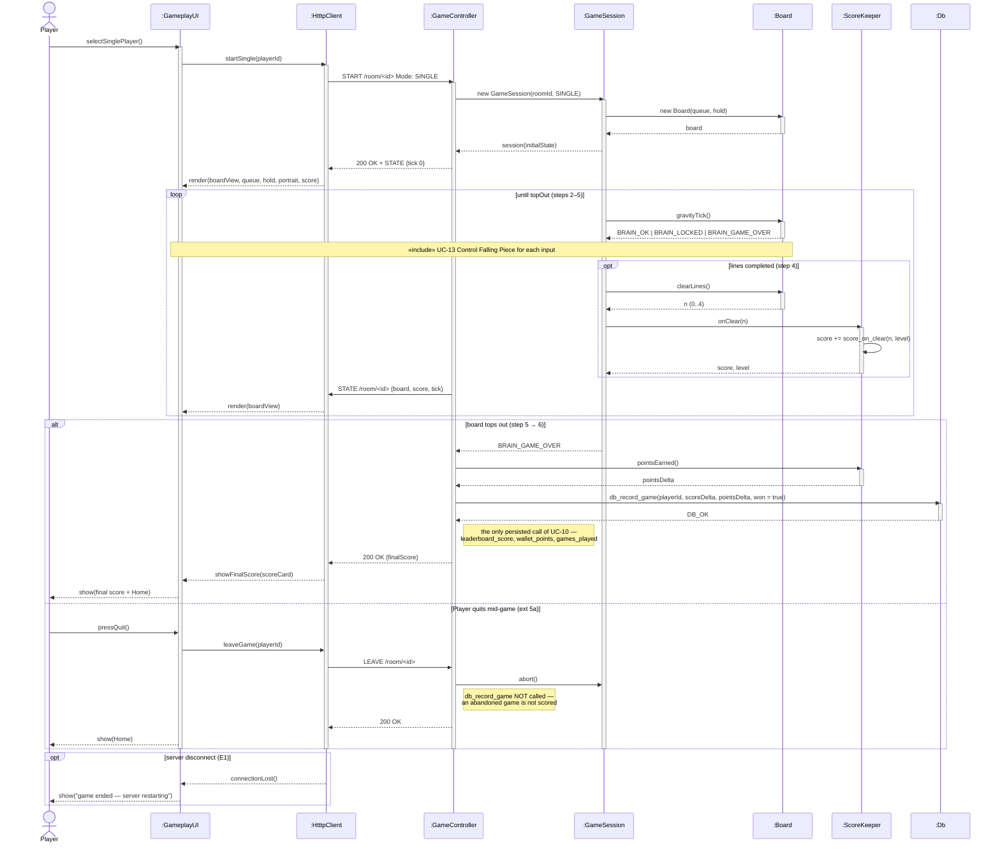

### SD UC-11 — Play Double (2-Player) Game

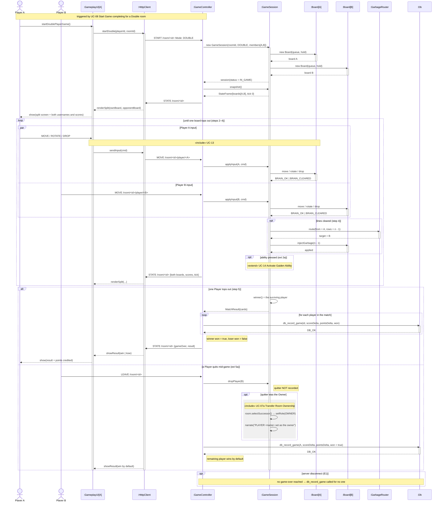

### SD UC-12 — Play Battle Royale Game

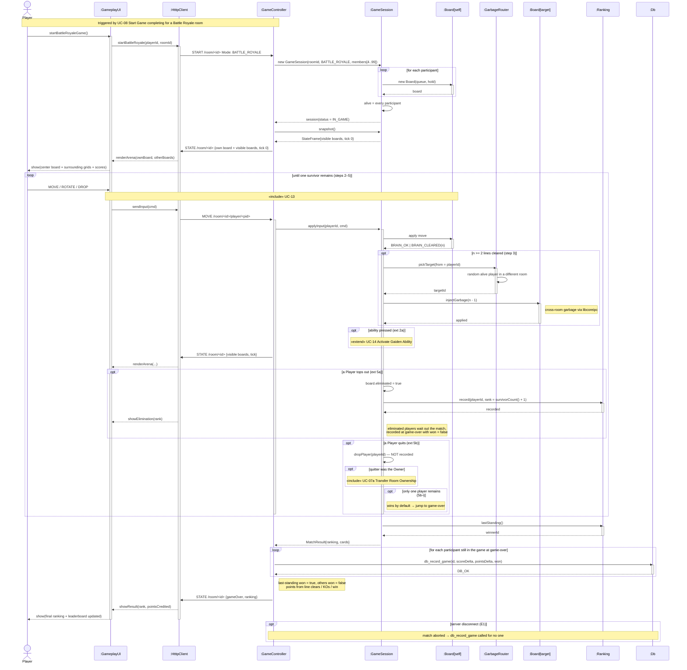

### SD UC-13 — Control Falling Piece

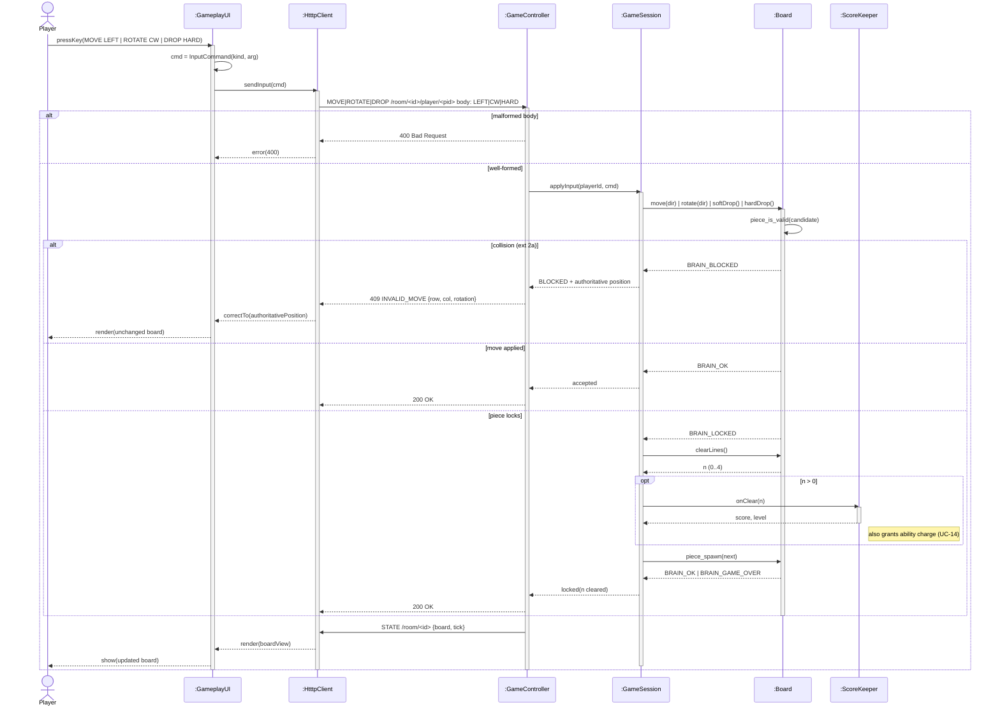

### SD UC-14 — Activate Gaiden Ability

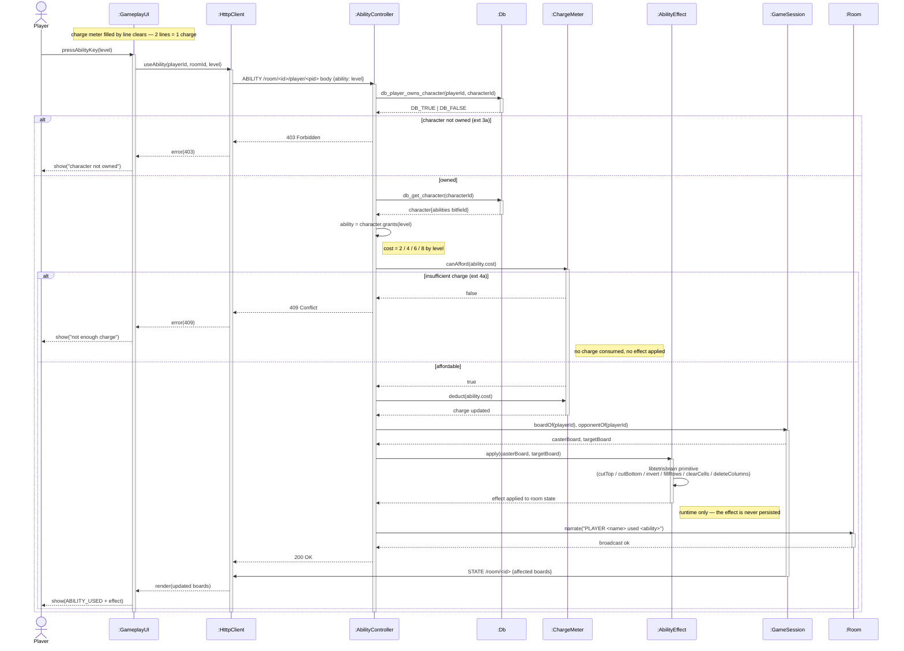

---

## Solution Class Diagram

### Method inventory by use case

| Behaviour | Owner | Signature | From |
|---|---|---|---|
| advance the gravity timer | `GameSession` | `advance()` | UC-10.2 |
| one gravity step | `Board` | `gravityTick() : BrainResult` | UC-10.2 |
| clear completed lines | `Board` | `clearLines() : int` | UC-10.4 |
| accumulate score | `ScoreKeeper` | `onClear(int)`, `pointsEarned() : long` | UC-10.4 |
| detect game over | `GameSession` | `isOver() : bool` | UC-10.5 |
| persist the result | `Db` | `db_record_game(id, scoreDelta, pointsDelta, won)` | UC-10.6 |
| build post-game deltas | `GameController` | `finish(String) : MatchResult` | UC-10.6 / UC-11.5 |
| push a board snapshot | `GameSession` | `snapshot() : StateFrame` | UC-11.3 |
| decide the garbage target | `GarbageRouter` | `pickTarget(PlayerId) : PlayerId` | UC-12.3 |
| deliver garbage | `Board` | `injectGarbage(int)` | UC-11.4 / UC-12.3 |
| name the winner | `GameSession` | `winner() : PlayerId` | UC-11.5 |
| remove a quitter | `GameSession` | `dropPlayer(PlayerId)` | UC-11 ext 5a / UC-12 ext 5b |
| eliminate a topped-out board | `GameSession` | `eliminate(PlayerId) : int` | UC-12 ext 5a |
| record finishing places | `Ranking` | `record(PlayerId, int)`, `lastStanding() : PlayerId` | UC-12.6 |
| translate a keypress | `GameplayUI` | `onKey(Key) : InputCommand` | UC-13.1 |
| validate + apply an input | `GameController` | `applyInput(PlayerId, InputCommand) : HtttpStatus` | UC-13.2 |
| move / rotate / drop | `Board` | `move(String)`, `rotate(String)`, `softDrop()`, `hardDrop()` | UC-13.1–3 |
| collision check | `Piece` | `isValid(Board) : bool` | UC-13.2 |
| activate an ability | `AbilityController` | `activate(PlayerId, String, int) : HtttpStatus` | UC-14.2 |
| ownership + catalogue read | `Db` | `db_player_owns_character(id, cid)`, `db_get_character(cid, out)` | UC-14.3 |
| resolve level → ability | `Character` | `grants(int) : Ability` | UC-14.3 |
| charge accounting | `ChargeMeter` | `grant(int)`, `canAfford(int) : bool`, `deduct(int)` | UC-14.4 |
| enforce the effect | `AbilityEffect` | `apply(Board, Board)` | UC-14.4 |
| board primitives for effects | `Board` | `cutTop`, `cutBottom`, `invert`, `fillRows`, `clearCells`, `deleteColumns` | UC-14.4 |
| narrate the event | `Room` | `narrate(String)` | UC-14.5 |

### Solution diagram

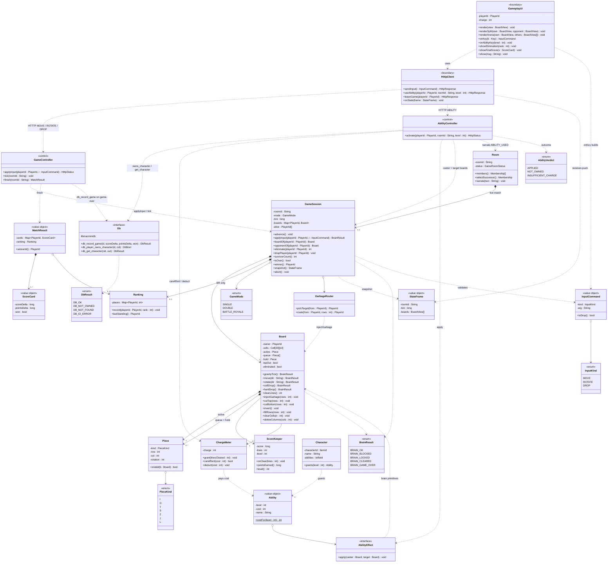

---

## Traceability Matrix

| UC | Sequence diagram | Domain classes exercised | New solution methods |
|---|---|---|---|
| UC-10 | [SD UC-10](#sd-uc-10--play-single-player-game) | `GameSession`, `Board`, `Piece`, `ScoreKeeper`, `ScoreCard` | `GameSession.advance/isOver`, `Board.gravityTick/clearLines`, `ScoreKeeper.onClear/pointsEarned`, `GameController.finish` |
| UC-11 | [SD UC-11](#sd-uc-11--play-double-2-player-game) | `GameSession`, `Board`, `GarbageRouter`, `MatchResult`, `Room` | `GameSession.winner/dropPlayer/snapshot`, `GarbageRouter.route`, `Board.injectGarbage` |
| UC-12 | [SD UC-12](#sd-uc-12--play-battle-royale-game) | `GameSession`, `Board`, `GarbageRouter`, `Ranking`, `MatchResult` | `GameSession.eliminate/survivorCount`, `GarbageRouter.pickTarget`, `Ranking.record/lastStanding` |
| UC-13 | [SD UC-13](#sd-uc-13--control-falling-piece) | `Board`, `Piece`, `InputCommand`, `ScoreKeeper` | `GameplayUI.onKey`, `GameController.applyInput`, `Board.move/rotate/softDrop/hardDrop`, `Piece.isValid` |
| UC-14 | [SD UC-14](#sd-uc-14--activate-gaiden-ability) | `Character`, `Ability`, `AbilityEffect`, `ChargeMeter`, `Board`, `Room` | `AbilityController.activate`, `Character.grants`, `ChargeMeter.grant/canAfford/deduct`, `AbilityEffect.apply`, `Board.cutTop/invert/fillRows/…` |
| UC-07a | folded into SD UC-11 / SD UC-12 | `Room`, `Membership` | *(none — reuses `Room.selectSuccessor`)* |
