# tetriSH — Marketplace (UC-15 – UC-19)

## Table of Contents

- [Per-Use-Case Class Diagrams](#per-use-case-class-diagrams)
  - [CD UC-15 — Buy Character](#cd-uc-15--buy-character)
  - [CD UC-15a — Determine Character Button State](#cd-uc-15a--determine-character-button-state)
  - [CD UC-16 — Buy Theme](#cd-uc-16--buy-theme)
  - [CD UC-16a — Determine Theme Button State](#cd-uc-16a--determine-theme-button-state)
  - [CD UC-17 — Deduct Wallet Points](#cd-uc-17--deduct-wallet-points)
  - [CD UC-18 — Set Default Character](#cd-uc-18--set-default-character)
  - [CD UC-19 — Set Default Theme](#cd-uc-19--set-default-theme)
- [Combined Domain Class Diagram](#combined-domain-class-diagram)
  - [Concept extraction](#concept-extraction)
  - [Domain diagram](#domain-diagram)
- [Sequence Diagrams](#sequence-diagrams)
  - [Layering conventions](#layering-conventions)
  - [SD UC-15 — Buy Character (includes UC-15a, UC-17)](#sd-uc-15--buy-character-includes-uc-15a-uc-17)
  - [SD UC-15a — Determine Character Button State](#sd-uc-15a--determine-character-button-state)
  - [SD UC-16 — Buy Theme (includes UC-16a, UC-17)](#sd-uc-16--buy-theme-includes-uc-16a-uc-17)
  - [SD UC-16a — Determine Theme Button State](#sd-uc-16a--determine-theme-button-state)
  - [SD UC-17 — Deduct Wallet Points](#sd-uc-17--deduct-wallet-points)
  - [SD UC-18 — Set Default Character](#sd-uc-18--set-default-character)
  - [SD UC-19 — Set Default Theme](#sd-uc-19--set-default-theme)
- [Solution Class Diagram](#solution-class-diagram)
  - [Method inventory by use case](#method-inventory-by-use-case)
  - [Solution diagram](#solution-diagram)

---

## Per-Use-Case Class Diagrams

### CD UC-15 — Buy Character

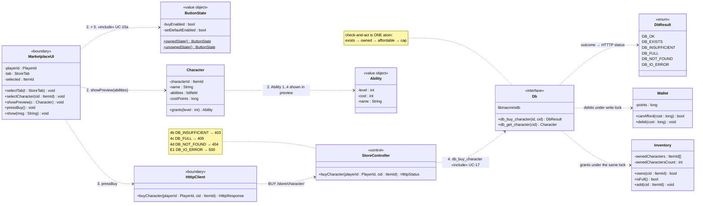

### CD UC-15a — Determine Character Button State

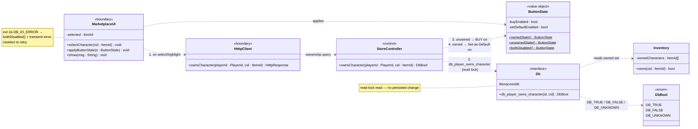

### CD UC-16 — Buy Theme

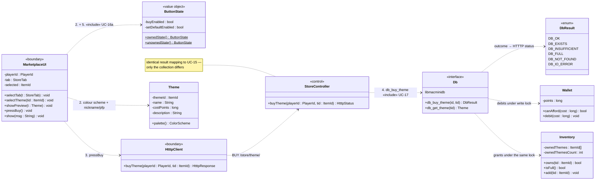

### CD UC-16a — Determine Theme Button State

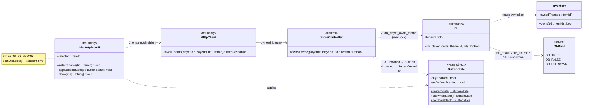

### CD UC-17 — Deduct Wallet Points

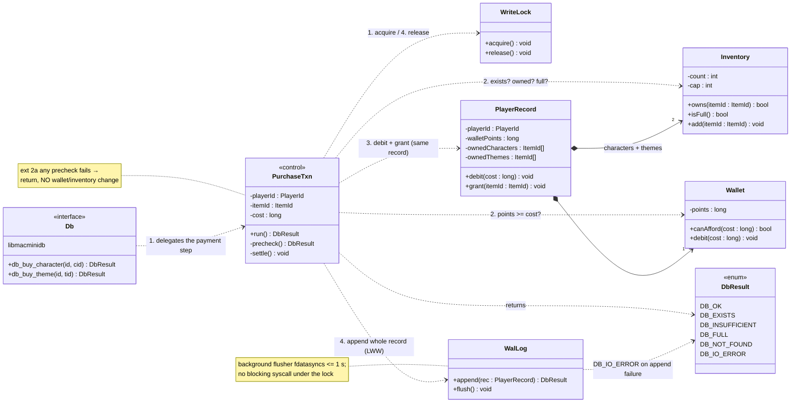

### CD UC-18 — Set Default Character

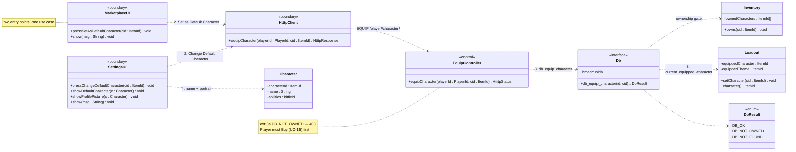

### CD UC-19 — Set Default Theme

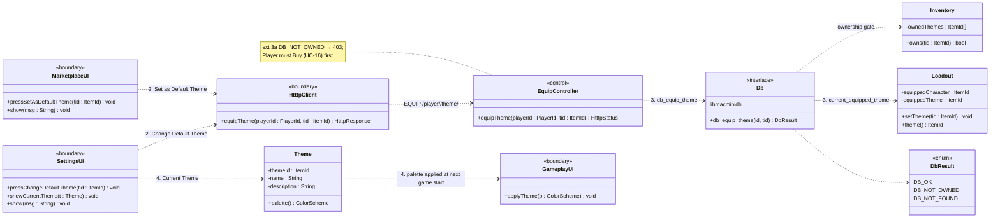

---

## Combined Domain Class Diagram

### Concept extraction

| Source (UC + step) | Concept surfaced | Class |
|---|---|---|
| UC-15.1 "Characters tab / Themes tab" | which half of the store is showing | `StoreTab` `«enum»` |
| UC-15.1 "a specific character (Princess, Halloween, …)" | the priced catalogue item granting abilities | `Character` |
| UC-15.2 "shows the preview and abilities (Ability 1, Ability 2, …)" | one of four levels a character grants | `Ability` `«value object»` |
| UC-15.2 "determines BUY / Set as Default button state" | the two-button enable/disable pair | `ButtonState` `«value object»` |
| UC-15 DB mapping "`cost_points`" | the item's price | `Character.costPoints` / `Theme.costPoints` |
| UC-15 post "wallet debited by `cost_points`" | the Player's spendable balance | `Wallet` |
| UC-15 post "character added to `owned_characters`" | the owned sets, one per item kind | `Inventory` |
| UC-15 ext 4c "`owned_characters_count` is at `DB_MAX_OWNED`" | the ownership cap | `Inventory.cap` |
| UC-15a.2 "`db_player_owns_character(id, cid)`" | ownership test, read-lock only | `Inventory.owns()` |
| UC-16.1 "a specific theme (Default, Haaland, John Cena, …)" | the priced cosmetic item | `Theme` |
| UC-16.2 "the theme's colour scheme" | the palette a theme carries | `ColorScheme` `«value object»` |
| UC-16.2 "character nickname/profile-picture details" | theme copy shown in the preview | `Theme.description` |
| UC-17.1 "takes the DB write lock" | the single-writer critical section | `WriteLock` |
| UC-17.2 "checks, in order" | the ordered precheck-then-settle purchase | `PurchaseTxn` |
| UC-17.3 "debits **and** adds … on the same player record" | the whole-record unit of write | `PlayerRecord` |
| UC-17.4 "appends the whole updated record to the log" | append-only LWW log + 1 s flusher | `WalLog` |
| UC-18 post "`current_equipped_character` is updated" | what the Player currently has equipped | `Loadout` |
| UC-18.4 "reflects the change in Settings … and in-game" | the settings/profile screen | `SettingsUI` |
| UC-19.4 "loads it on the next game start" | the render surface that adopts the palette | `GameplayUI` |
| UC-15/16 DB mapping "`DB_OK` / `DB_EXISTS` / …" | the store outcome vocabulary | `DbResult` `«enum»` |

### Domain diagram

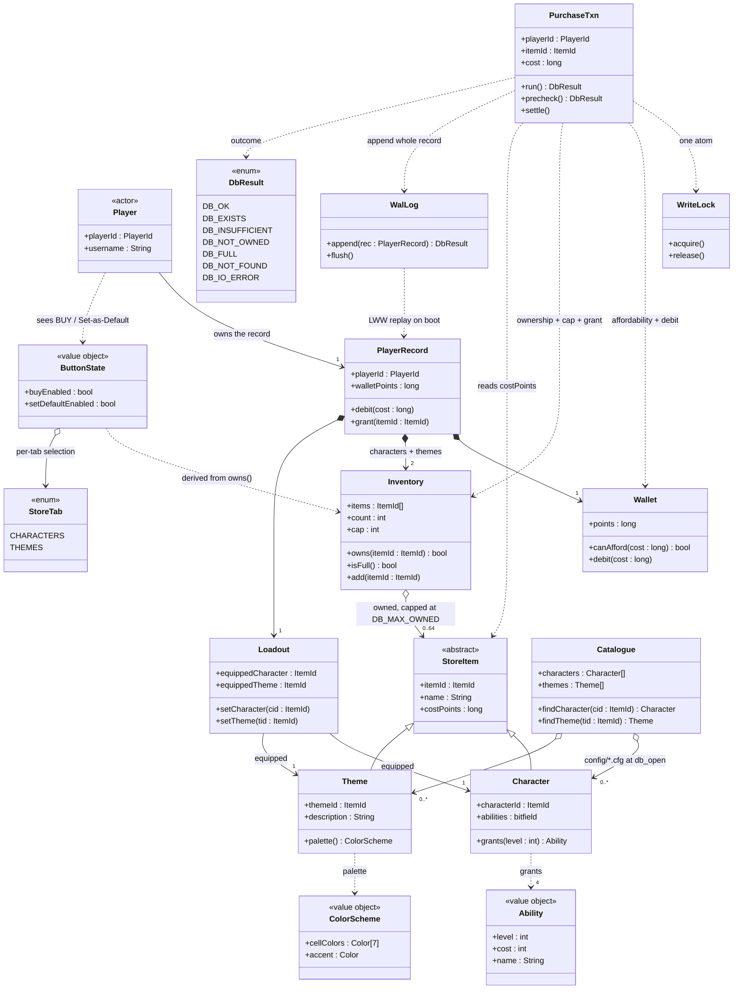

---

## Sequence Diagrams

### Layering conventions

| Participant | Layer | Process |
|---|---|---|
| `:MarketplaceUI`, `:SettingsUI`, `:GameplayUI` | UI | tetrisu |
| `:HtttpClient` | Boundary | tetrisu |
| `:StoreController`, `:EquipController` | Controller | tetrisd |
| `:PurchaseTxn`, `:WriteLock`, `:WalLog` | Domain (internal to the store) | `libmacminidb` |
| `:Db` | Persistence façade | `libmacminidb` |

All five use cases are **persisted** — UC-15/16/17 take the DB write lock, UC-15a/16a
take the read lock, UC-18/19 take the write lock for a single field.

### SD UC-15 — Buy Character (includes UC-15a, UC-17)

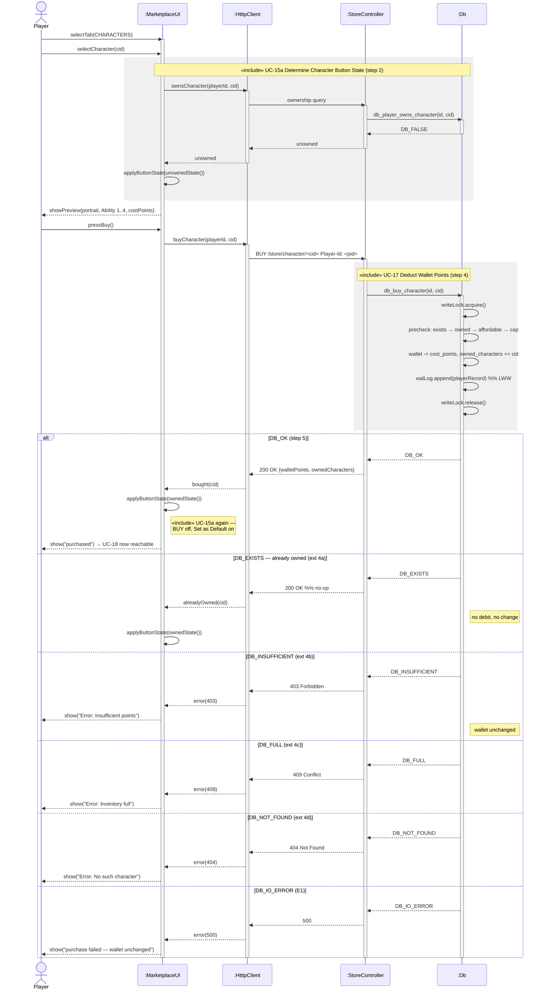

### SD UC-15a — Determine Character Button State

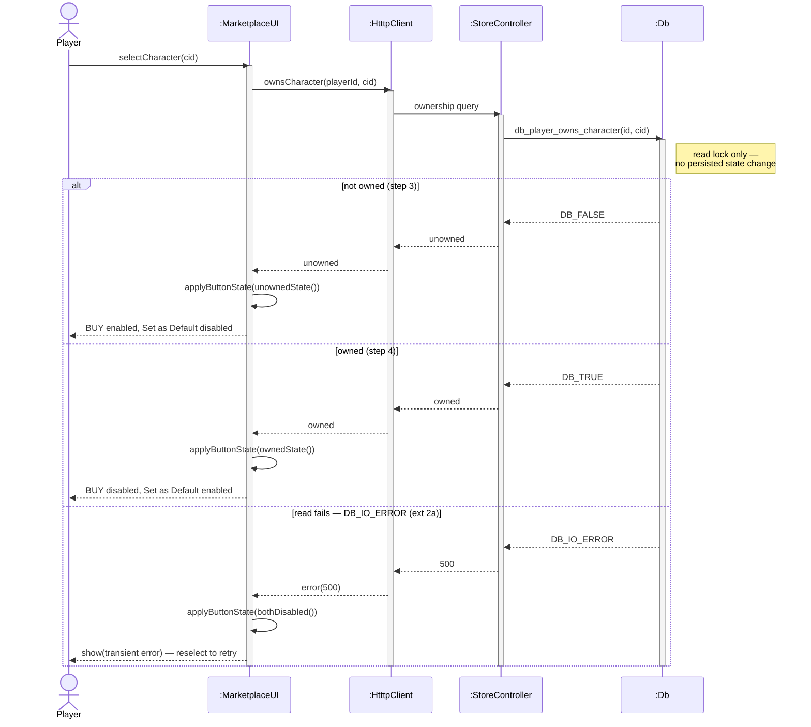

### SD UC-16 — Buy Theme (includes UC-16a, UC-17)

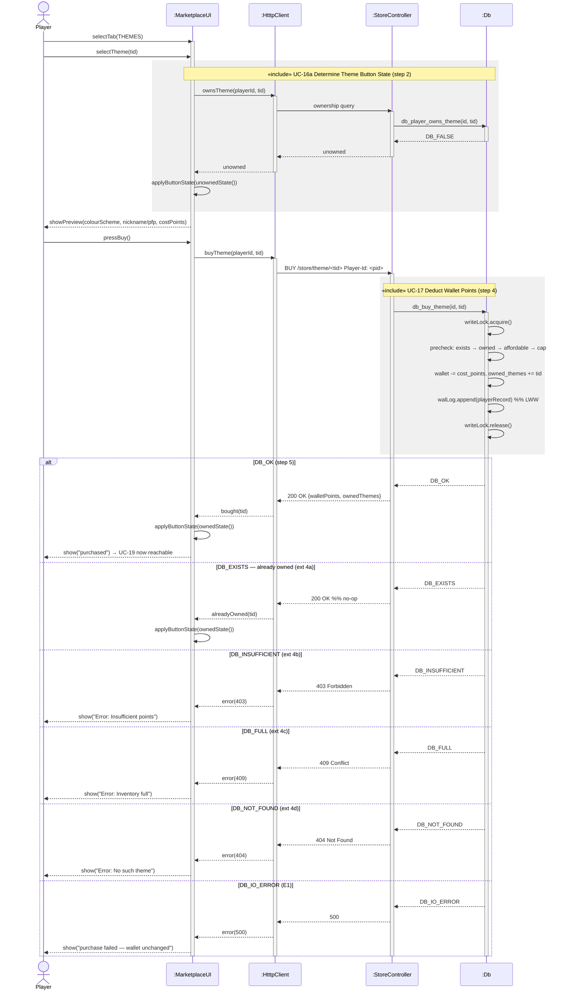

### SD UC-16a — Determine Theme Button State

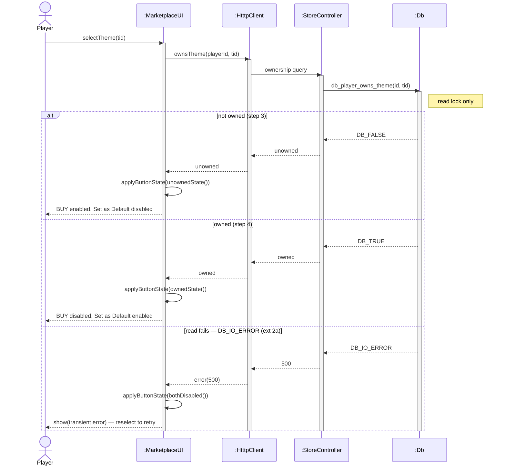

### SD UC-17 — Deduct Wallet Points

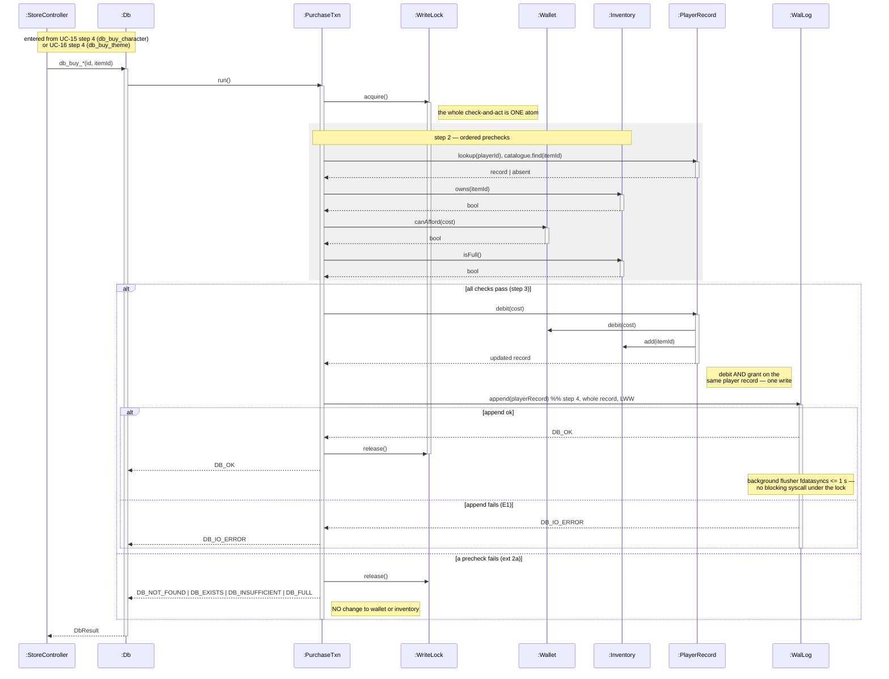

### SD UC-18 — Set Default Character

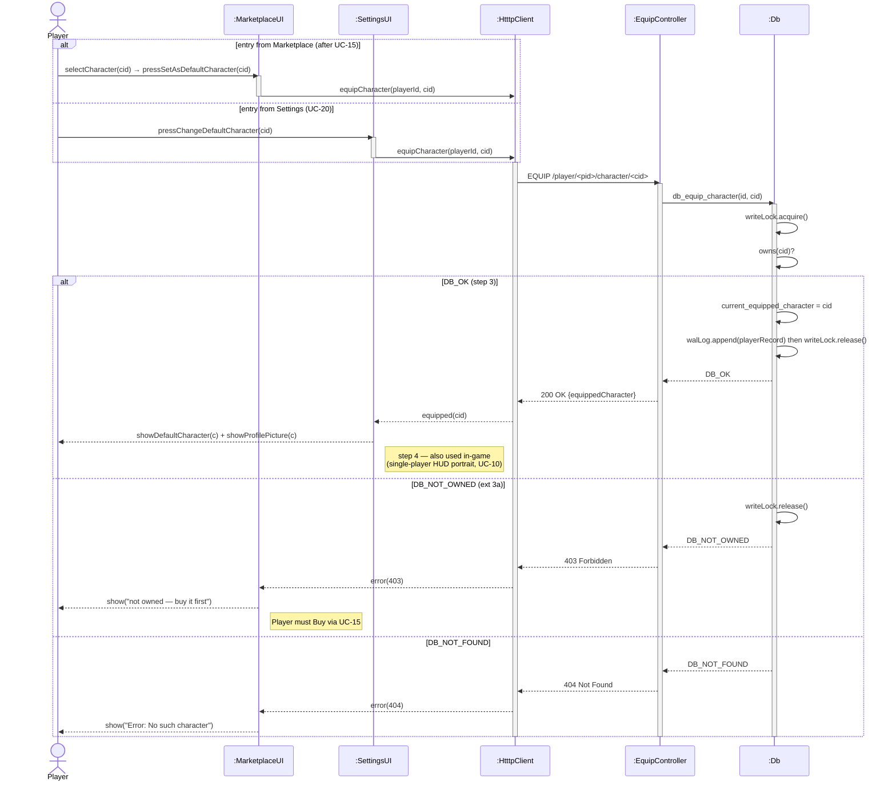

### SD UC-19 — Set Default Theme

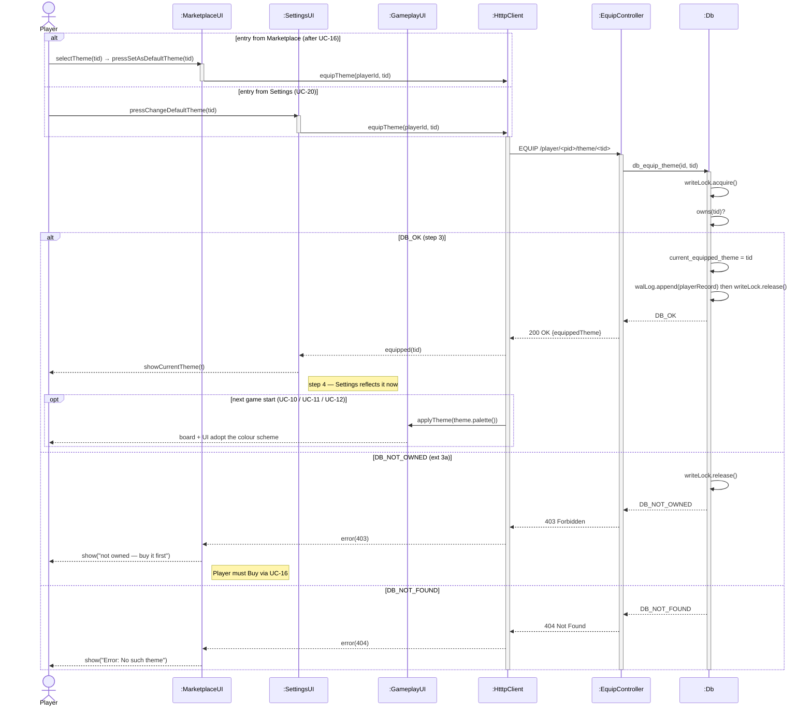

---

## Solution Class Diagram

### Method inventory by use case

| Behaviour | Owner | Signature | From |
|---|---|---|---|
| switch store tab | `MarketplaceUI` | `selectTab(StoreTab)` | UC-15.1 / UC-16.1 |
| select an item | `MarketplaceUI` | `selectCharacter(ItemId)`, `selectTheme(ItemId)` | UC-15.1 / UC-16.1 |
| show preview + abilities | `MarketplaceUI` | `showPreview(Character)`, `showPreview(Theme)` | UC-15.2 / UC-16.2 |
| resolve level → ability | `Character` | `grants(int) : Ability` | UC-15.2 |
| expose a theme's palette | `Theme` | `palette() : ColorScheme` | UC-16.2 |
| derive the button pair | `ButtonState` | `ownedState()`, `unownedState()`, `bothDisabled()` | UC-15a.3–4 / UC-16a.3–4 |
| apply the button pair | `MarketplaceUI` | `applyButtonState(ButtonState)` | UC-15a.3 / UC-16a.3 |
| ownership test | `Db` | `db_player_owns_character(id, cid)`, `db_player_owns_theme(id, tid)` | UC-15a.2 / UC-16a.2 |
| buy a character | `StoreController` | `buyCharacter(PlayerId, ItemId) : HtttpStatus` | UC-15.3–4 |
| buy a theme | `StoreController` | `buyTheme(PlayerId, ItemId) : HtttpStatus` | UC-16.3–4 |
| persist a purchase | `Db` | `db_buy_character(id, cid)`, `db_buy_theme(id, tid)` | UC-15.4 / UC-16.4 |
| read the catalogue | `Catalogue` | `findCharacter(ItemId)`, `findTheme(ItemId)` | UC-15.2 / UC-16.2 |
| run the atomic purchase | `PurchaseTxn` | `run() : DbResult`, `precheck() : DbResult`, `settle()` | UC-17.1–4 |
| hold the critical section | `WriteLock` | `acquire()`, `release()` | UC-17.1 / UC-17.4 |
| affordability + debit | `Wallet` | `canAfford(long) : bool`, `debit(long)` | UC-17.2–3 |
| ownership + cap + grant | `Inventory` | `owns(ItemId) : bool`, `isFull() : bool`, `add(ItemId)` | UC-17.2–3 |
| one whole-record write | `PlayerRecord` | `debit(long)`, `grant(ItemId)` | UC-17.3 |
| durable append (LWW) | `WalLog` | `append(PlayerRecord) : DbResult`, `flush()` | UC-17.4 |
| equip a character | `EquipController` | `equipCharacter(PlayerId, ItemId) : HtttpStatus` | UC-18.2–3 |
| equip a theme | `EquipController` | `equipTheme(PlayerId, ItemId) : HtttpStatus` | UC-19.2–3 |
| persist the equip | `Db` | `db_equip_character(id, cid)`, `db_equip_theme(id, tid)` | UC-18.3 / UC-19.3 |
| hold what is equipped | `Loadout` | `setCharacter(ItemId)`, `setTheme(ItemId)`, `character()`, `theme()` | UC-18.3 / UC-19.3 |
| reflect in Settings | `SettingsUI` | `showDefaultCharacter(Character)`, `showProfilePicture(Character)`, `showCurrentTheme(Theme)` | UC-18.4 / UC-19.4 |
| adopt the palette in-game | `GameplayUI` | `applyTheme(ColorScheme)` | UC-19.4 |

### Solution diagram

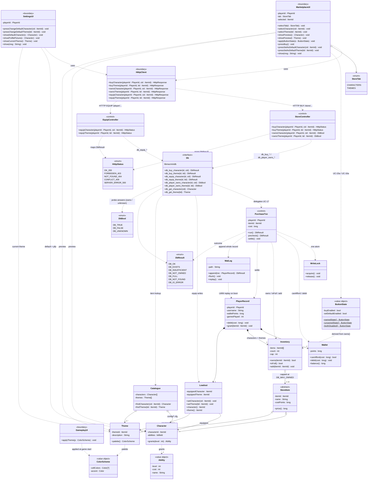
