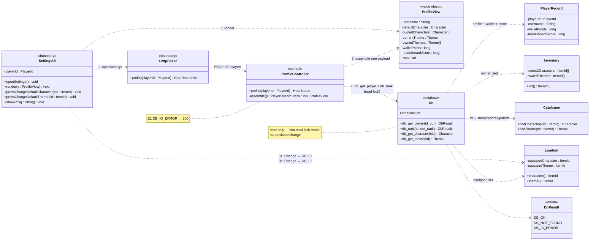
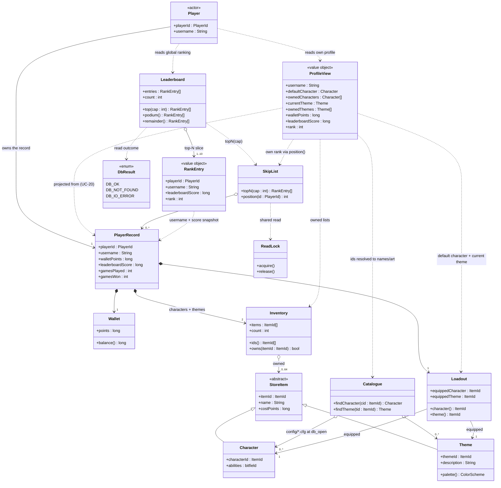
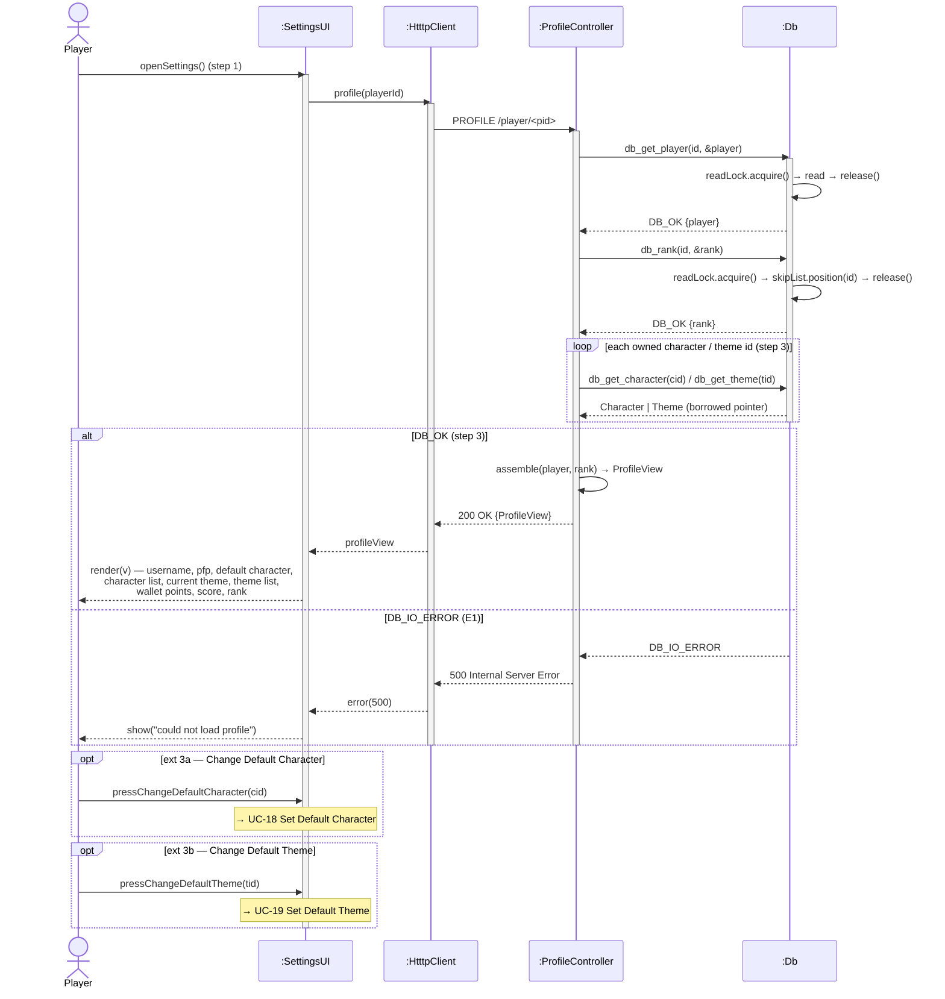
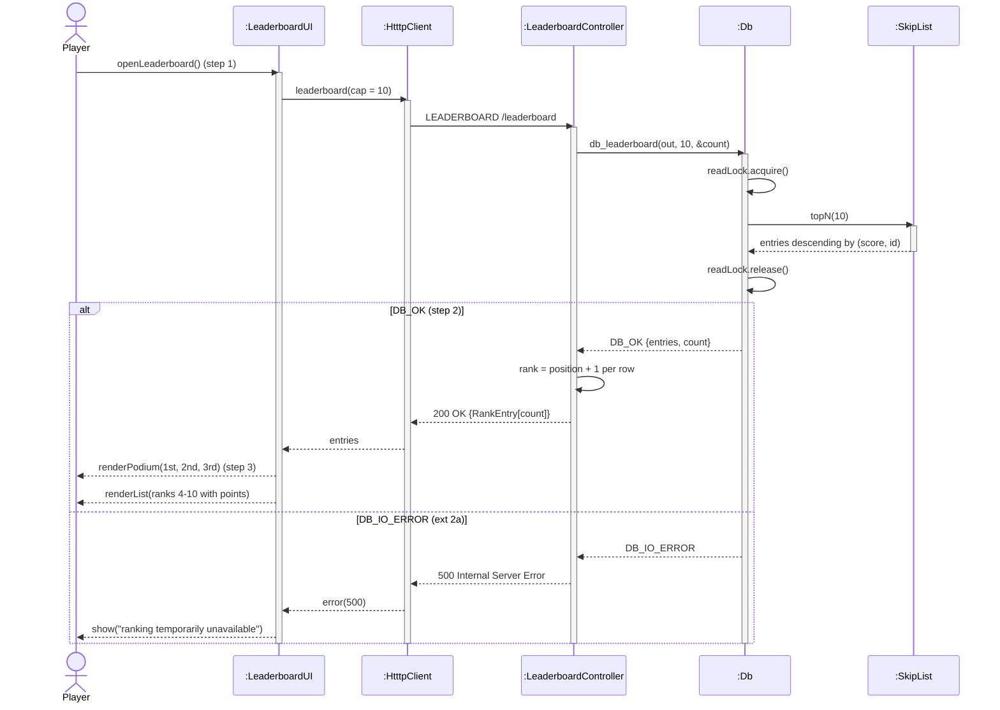
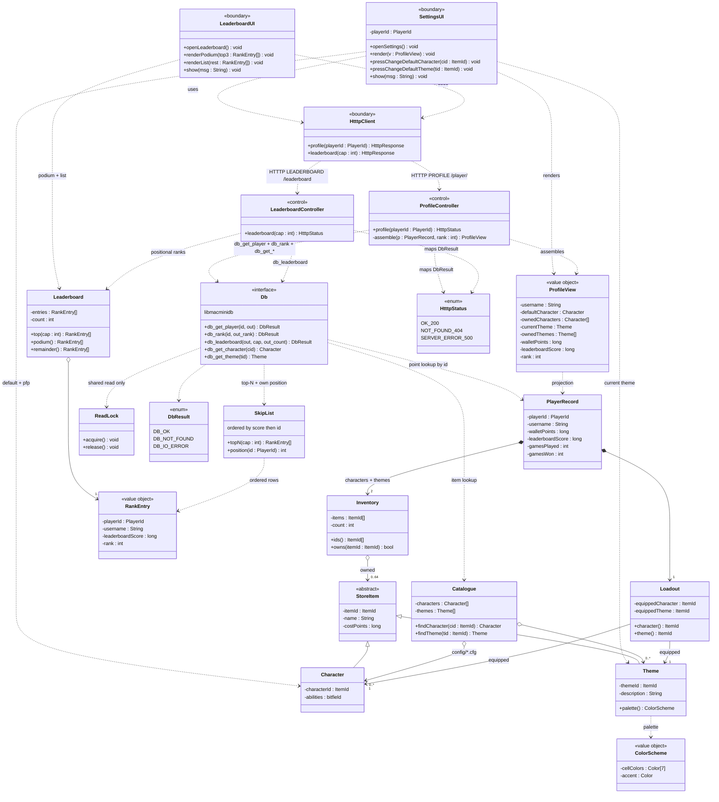

# tetriSH — Profile, Settings & Leaderboard (UC-20 – UC-21)

## Table of Contents

- [Per-Use-Case Class Diagrams](#per-use-case-class-diagrams)
  - [CD UC-20 — View Settings / Profile](#cd-uc-20--view-settings--profile)
  - [CD UC-21 — View Leaderboard](#cd-uc-21--view-leaderboard)
- [Combined Domain Class Diagram](#combined-domain-class-diagram)
  - [Concept extraction](#concept-extraction)
  - [Domain diagram](#domain-diagram)
- [Sequence Diagrams](#sequence-diagrams)
  - [Layering conventions](#layering-conventions)
  - [SD UC-20 — View Settings / Profile](#sd-uc-20--view-settings--profile)
  - [SD UC-21 — View Leaderboard](#sd-uc-21--view-leaderboard)
- [Solution Class Diagram](#solution-class-diagram)
  - [Method inventory by use case](#method-inventory-by-use-case)
  - [Solution diagram](#solution-diagram)

---

## Per-Use-Case Class Diagrams

### CD UC-20 — View Settings / Profile

### CD UC-21 — View Leaderboard

```mermaid
classDiagram
    direction LR

    class LeaderboardUI {
        <<boundary>>
        +openLeaderboard() void
        +renderPodium(top3 : RankEntry[]) void
        +renderList(rest : RankEntry[]) void
        +show(msg : String) void
    }
    class HtttpClient {
        <<boundary>>
        +leaderboard(cap : int) HtttpResponse
    }
    class LeaderboardController {
        <<control>>
        +leaderboard(cap : int) HtttpStatus
    }
    class Leaderboard {
        -entries : RankEntry[]
        -count : int
        +top(cap : int) RankEntry[]
        +podium() RankEntry[]
        +remainder() RankEntry[]
    }
    class RankEntry {
        <<value object>>
        -playerId : PlayerId
        -username : String
        -leaderboardScore : long
        -rank : int
    }
    class SkipList {
        ordered by score then id
        +topN(cap : int) RankEntry[]
    }
    class Db {
        <<interface>>
        libmacminidb
        +db_leaderboard(out, cap, out_count) DbResult
    }
    class DbResult {
        <<enum>>
        DB_OK
        DB_IO_ERROR
    }

    LeaderboardUI ..> HtttpClient : 1. openLeaderboard
    HtttpClient ..> LeaderboardController : LEADERBOARD /leaderboard
    LeaderboardController ..> Db : 2. db_leaderboard(out, 10, &count)
    Db ..> SkipList : 2. topN under read lock
    SkipList ..> RankEntry : descending by (score, id)
    LeaderboardController ..> Leaderboard : rank = position + 1
    Leaderboard ..> RankEntry : 1..10
    LeaderboardUI ..> Leaderboard : 3. podium(1-3) + list(4-10)
    note for Leaderboard "rank is positional —<br/>never stored on the record"
    note for LeaderboardUI "ext 2a → ranking temporarily unavailable"
```

---

## Combined Domain Class Diagram

### Concept extraction

| Source (UC + step) | Concept surfaced | Class |
|---|---|---|
| UC-20.1 "Player opens Settings" | the settings/profile screen | `SettingsUI` |
| UC-20.3 "Username … Wallet Points … Leaderboard Scores" | the one read-only payload the screen renders | `ProfileView` `«value object»` |
| UC-20.2 "`db_get_player(id, ...)`" | the durable player document | `PlayerRecord` |
| UC-20.3 "profile picture of current default character" | what the Player currently has equipped | `Loadout` |
| UC-20.3 "Character List / Theme List (current marked)" | the owned sets, one per item kind | `Inventory` |
| UC-20.3 "Default Character / Current Theme" names + art | id → catalogue item resolution | `Catalogue` |
| UC-20.2 "`db_rank(id, &rank)` (1-based rank)" | the Player's own position | `ProfileView.rank` |
| UC-20 ext 3a / 3b "Change Default …" | the two outbound links to UC-18 / UC-19 | `SettingsUI` presses |
| UC-21.1 "Player opens the Leaderboard" | the ranking screen | `LeaderboardUI` |
| UC-21.2 "top-N by `(score, id)` straight off the skip list" | the ordered leaderboard index | `SkipList` |
| UC-21.2 "`db_leaderboard(out, 10, &count)`" | the fetched top-N slice | `Leaderboard` |
| UC-21.2 "per-row rank is positional" | one ranked row | `RankEntry` `«value object»` |
| UC-21.3 "podium for top 3, list for 4–10" | the two render bands | `Leaderboard.podium()` / `.remainder()` |
| UC-20/21 DB mapping "read-lock read" | the shared-read critical section | `ReadLock` |
| UC-20/21 "`DB_OK` / `DB_IO_ERROR`" | the read outcome vocabulary | `DbResult` `«enum»` |

### Domain diagram

---

## Sequence Diagrams

### Layering conventions

| Participant | Layer | Process |
|---|---|---|
| `:SettingsUI`, `:LeaderboardUI` | UI | tetrisu |
| `:HtttpClient` | Boundary | tetrisu |
| `:ProfileController`, `:LeaderboardController` | Controller | tetrisd |
| `:Leaderboard`, `:SkipList`, `:ReadLock` | Domain (internal to the store) | `libmacminidb` |
| `:Db` | Persistence façade | `libmacminidb` |

Both use cases are **persisted reads** — they take the DB **read** lock only and
change nothing. Every write they lead to belongs to another use case (UC-18 / UC-19).

### SD UC-20 — View Settings / Profile

### SD UC-21 — View Leaderboard

---

## Solution Class Diagram

### Method inventory by use case

| Behaviour | Owner | Signature | From |
|---|---|---|---|
| open the settings screen | `SettingsUI` | `openSettings()` | UC-20.1 |
| render the whole profile | `SettingsUI` | `render(ProfileView)` | UC-20.3 |
| leave for an equip change | `SettingsUI` | `pressChangeDefaultCharacter(ItemId)`, `pressChangeDefaultTheme(ItemId)` | UC-20 ext 3a / 3b |
| serve the profile | `ProfileController` | `profile(PlayerId) : HtttpStatus` | UC-20.2–3 |
| build the read payload | `ProfileController` | `assemble(PlayerRecord, int) : ProfileView` | UC-20.3 |
| read the player document | `Db` | `db_get_player(id, out) : DbResult` | UC-20.2 |
| read the Player's own rank | `Db` | `db_rank(id, out_rank) : DbResult` | UC-20.2 |
| resolve owned ids to items | `Catalogue` | `findCharacter(ItemId)`, `findTheme(ItemId)` | UC-20.3 |
| expose the equipped ids | `Loadout` | `character() : ItemId`, `theme() : ItemId` | UC-20.3 |
| list an owned set | `Inventory` | `ids() : ItemId[]` | UC-20.3 |
| open the leaderboard screen | `LeaderboardUI` | `openLeaderboard()` | UC-21.1 |
| render the two bands | `LeaderboardUI` | `renderPodium(RankEntry[])`, `renderList(RankEntry[])` | UC-21.3 |
| serve the top-N | `LeaderboardController` | `leaderboard(int) : HtttpStatus` | UC-21.2 |
| read the top-N | `Db` | `db_leaderboard(out, cap, out_count) : DbResult` | UC-21.2 |
| walk the ordered index | `SkipList` | `topN(int) : RankEntry[]`, `position(PlayerId) : int` | UC-21.2 / UC-20.2 |
| split podium from list | `Leaderboard` | `top(int)`, `podium()`, `remainder()` | UC-21.3 |
| hold the shared read | `ReadLock` | `acquire()`, `release()` | UC-20.2 / UC-21.2 |

### Solution diagram

