# tetriSH — Administration / `tetrisctl` (UC-22 – UC-27)

## Table of Contents

- [Per-Use-Case Class Diagrams](#per-use-case-class-diagrams)
  - [CD UC-22 — Query Server Status](#cd-uc-22--query-server-status)
  - [CD UC-23 — Graceful Shutdown](#cd-uc-23--graceful-shutdown)
  - [CD UC-24 — Kick Player (with UC-07a)](#cd-uc-24--kick-player-with-uc-07a)
  - [CD UC-25 — List Rooms](#cd-uc-25--list-rooms)
  - [CD UC-26 — List Players](#cd-uc-26--list-players)
  - [CD UC-27 — Query Dropped Logs](#cd-uc-27--query-dropped-logs)
- [Combined Domain Class Diagram](#combined-domain-class-diagram)
  - [Concept extraction](#concept-extraction)
  - [Domain diagram](#domain-diagram)
- [Sequence Diagrams](#sequence-diagrams)
  - [Layering conventions](#layering-conventions)
  - [SD UC-22 — Query Server Status](#sd-uc-22--query-server-status)
  - [SD UC-23 — Graceful Shutdown](#sd-uc-23--graceful-shutdown)
  - [SD UC-24 — Kick Player (includes UC-07a)](#sd-uc-24--kick-player-includes-uc-07a)
  - [SD UC-25 — List Rooms](#sd-uc-25--list-rooms)
  - [SD UC-26 — List Players](#sd-uc-26--list-players)
  - [SD UC-27 — Query Dropped Logs](#sd-uc-27--query-dropped-logs)
- [Solution Class Diagram](#solution-class-diagram)
  - [Method inventory by use case](#method-inventory-by-use-case)
  - [Solution diagram](#solution-diagram)

---

## Per-Use-Case Class Diagrams

### CD UC-22 — Query Server Status

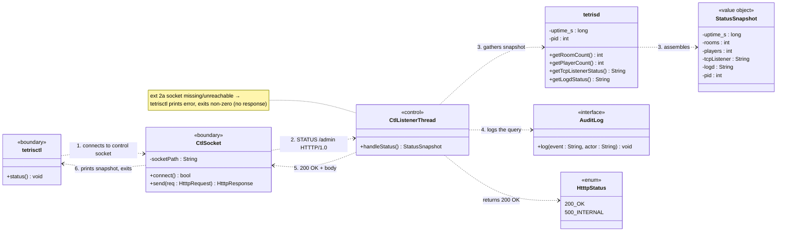

### CD UC-23 — Graceful Shutdown

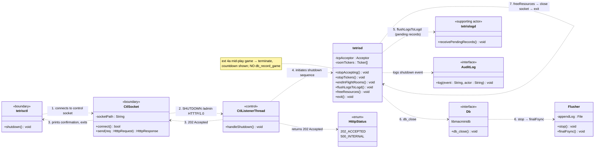

### CD UC-24 — Kick Player (with UC-07a)

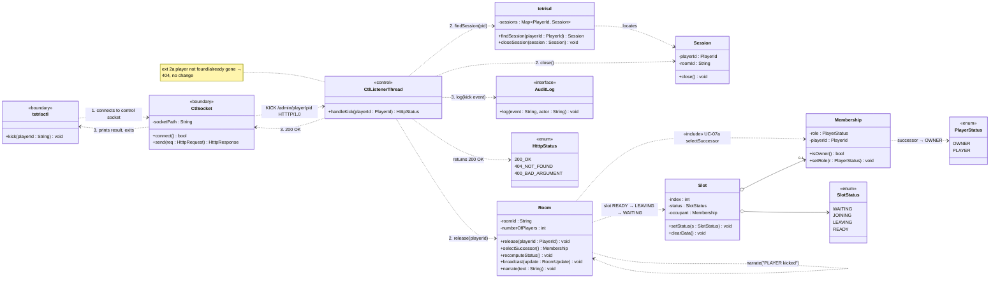

### CD UC-25 — List Rooms

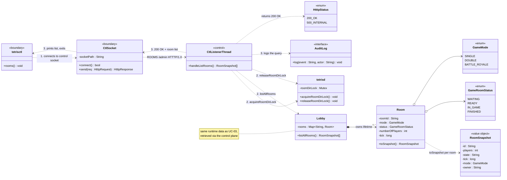

### CD UC-26 — List Players

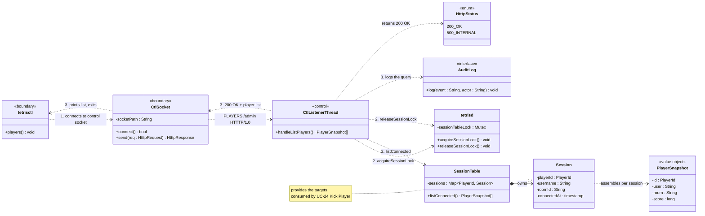

### CD UC-27 — Query Dropped Logs

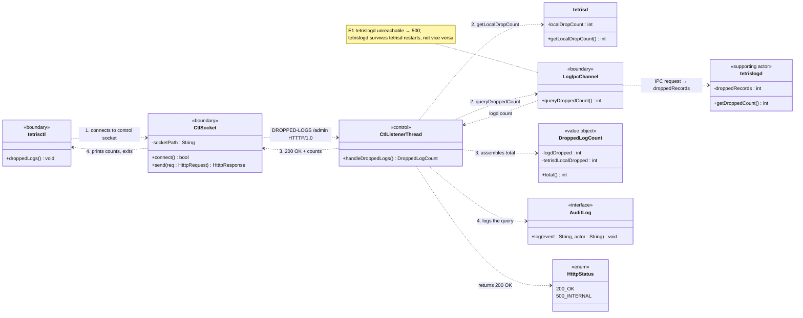

---

## Combined Domain Class Diagram

### Concept extraction

| Source (UC + step) | Concept surfaced | Class |
|---|---|---|
| UC-22.2 "connects to the control socket" | the local-only admin transport | `CtlSocket` |
| UC-22.3 "gathers a snapshot (uptime, rooms, players/connections, tick rate)" | the assembled health snapshot | `StatusSnapshot` `«value object»` |
| UC-22 ext 2a "control socket missing/unreachable" | client-side failure with no daemon response | `CtlSocket.connect()` |
| UC-23.3 "stops accepting new TCP connections and stops room tickers" | the ordered stop sequence | `tetrisd.stopAccepting/stopTickers` |
| UC-23.4 "in-flight rooms are ended… pending log records shipped to `tetrislogd`" | the drain step before persistence closes | `tetrisd.endInFlightRooms/flushLogsToLogd` |
| UC-23.5 "`db_close` stops the flusher and performs a final fsync" | the durable-shutdown guarantee | `Db.db_close()` / `Flusher.finalFsync()` |
| UC-23 ext 4a "no `db_record_game` for unfinished games" | the same abandon-game rule as UC-10/11/12 | `tetrisd.endInFlightRooms()` |
| UC-24.2 "locates the player's session, closes it, frees their room slot" | the forced-disconnect path | `tetrisd.findSession` / `Session.close()` |
| UC-24.2 "if they were Room Owner) transfers ownership" | reuse of the successor-selection rule | `Room.selectSuccessor()` «include» UC-07a |
| UC-25.2 "reads its in-memory room directory (under the room-directory lock)" | the same lobby data UC-03 shows, over the control plane | `Lobby.listAllRooms()` |
| UC-26.2 "reads its connection/session table… assembles the connected-player list" | the live session table as an admin view | `SessionTable.listConnected()` |
| UC-26 "provides the `<player>` targets for UC-24" | list output feeding another use case's input | `PlayerSnapshot.id` |
| UC-27.2 "queries `tetrislogd`… for its dropped-records counter" | the cross-daemon drop counter, summed | `DroppedLogCount` `«value object»` |
| UC-27 E1 "`tetrislogd` unreachable" | the one admin query that can fail on a peer daemon, not on `tetrisd` itself | `LogIpcChannel.queryDroppedCount()` |
| UC-22–UC-27 "the action is logged" | the audit trail every control-plane call writes to | `AuditLog` |

### Domain diagram

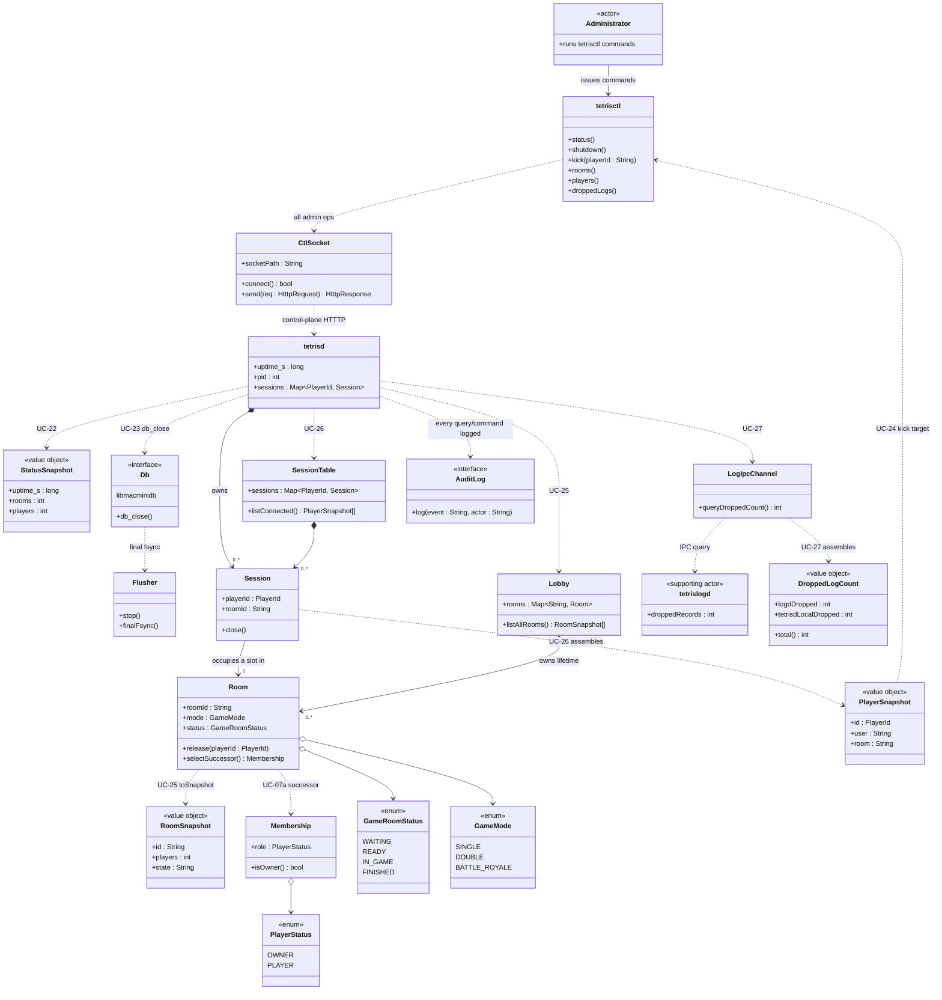

---

## Sequence Diagrams

### Layering conventions

| Participant | Layer | Process |
|---|---|---|
| `:tetrisctl` | UI / CLI | tetrisctl |
| `:CtlSocket` | Boundary | tetrisctl |
| `:CtlListenerThread` | Controller | tetrisd (control-plane thread) |
| `:tetrisd`, `:Lobby`, `:Room`, `:SessionTable`, `:Session` | Domain | tetrisd |
| `:Db`, `:Flusher` | Persistence façade | `libmacminidb` |
| `:LogIpcChannel`, `:tetrislogd` | IPC / peer daemon | `tetrislogd` |

All six use cases go over the **local-only control socket**, never the public TCP
port. UC-22/25/26/27 are read-only queries; UC-23 and UC-24 mutate runtime state.

### SD UC-22 — Query Server Status

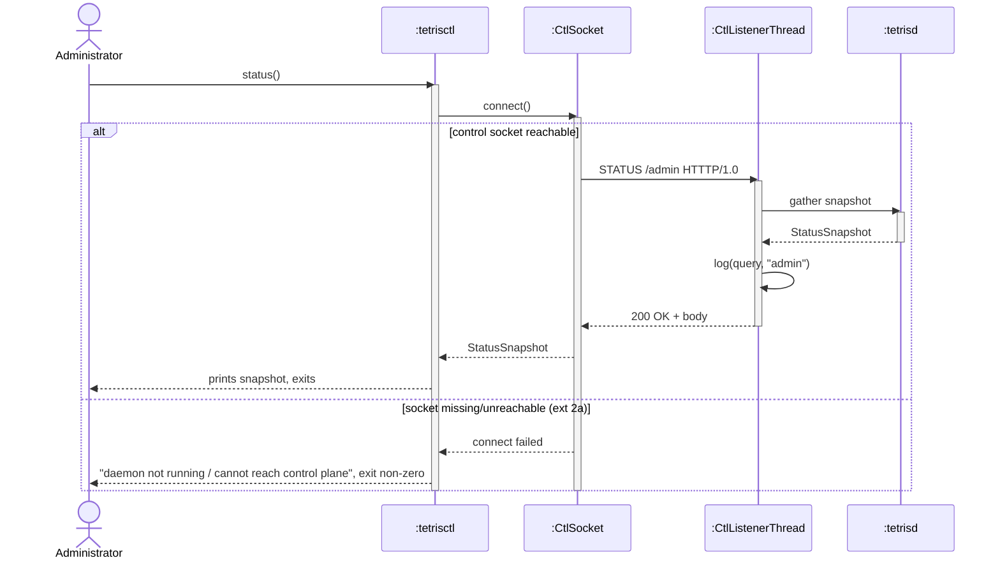

### SD UC-23 — Graceful Shutdown

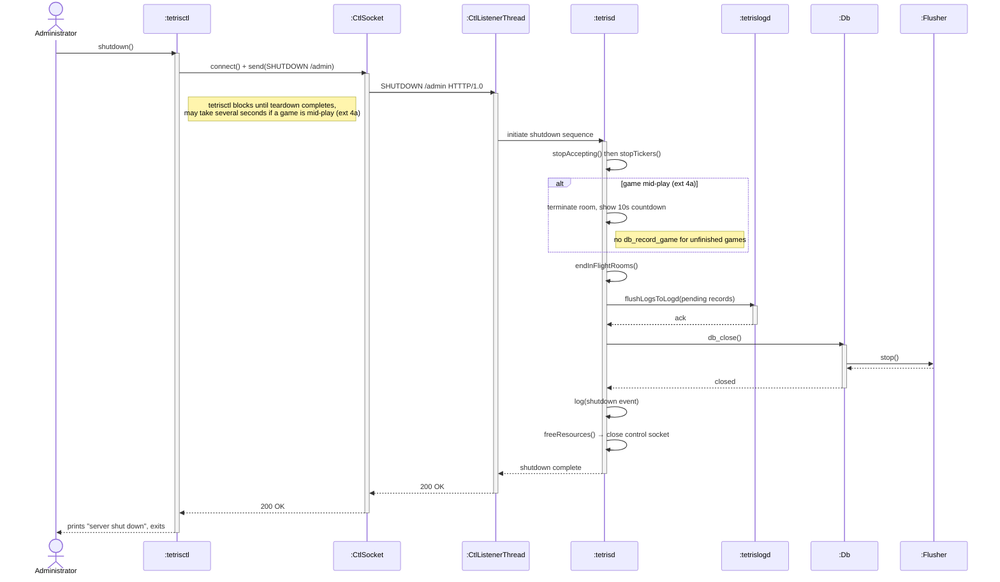

### SD UC-24 — Kick Player (includes UC-07a)

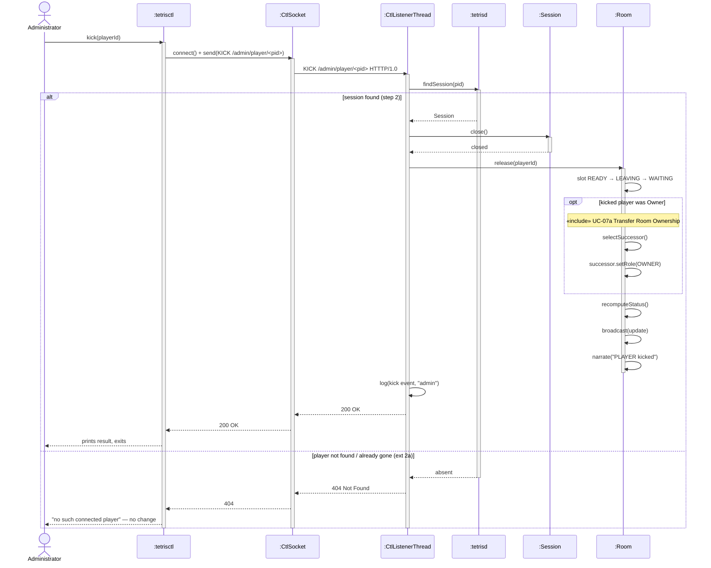

### SD UC-25 — List Rooms

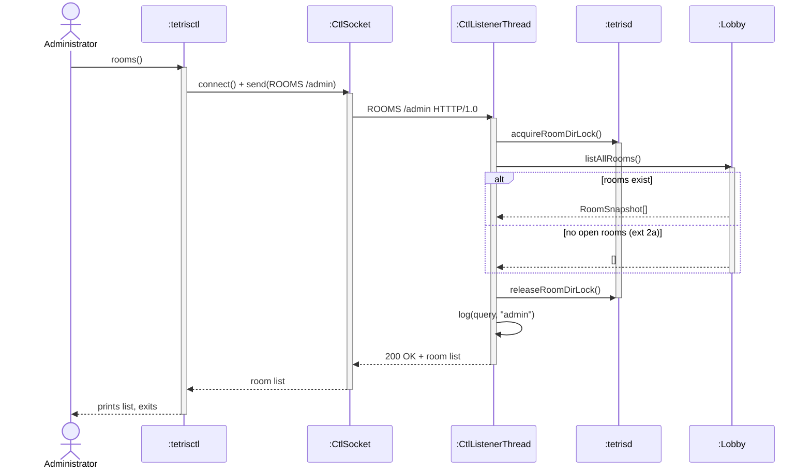

### SD UC-26 — List Players

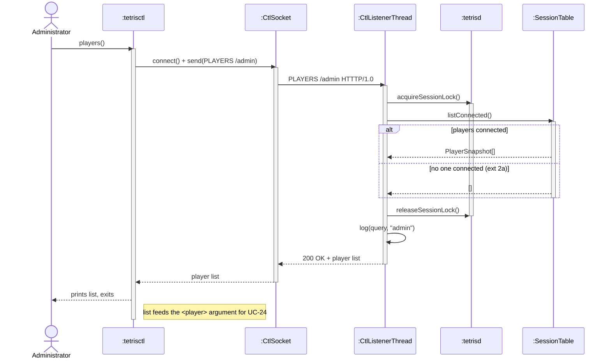

### SD UC-27 — Query Dropped Logs

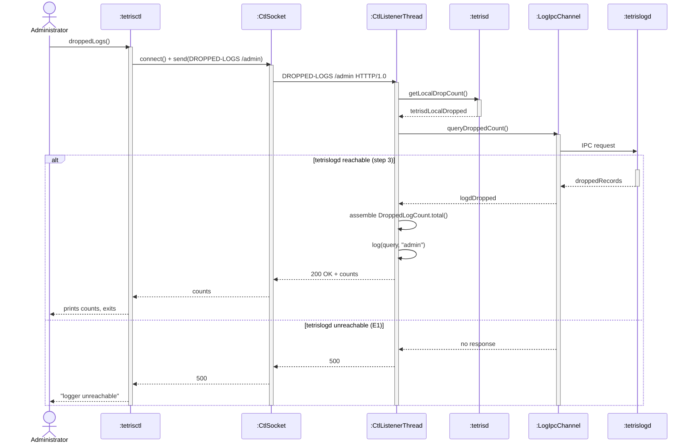

---

## Solution Class Diagram

### Method inventory by use case

| Behaviour | Owner | Signature | From |
|---|---|---|---|
| connect to control socket | `CtlSocket` | `connect() : bool`, `send(HtttpRequest) : HtttpResponse` | UC-22–UC-27 (all) |
| request a status snapshot | `tetrisctl` | `status()` | UC-22.1 |
| gather the snapshot | `CtlListenerThread` / `tetrisd` | `handleStatus() : StatusSnapshot`, `getRoomCount/getPlayerCount/getTcpListenerStatus/getLogdStatus()` | UC-22.3 |
| request a shutdown | `tetrisctl` | `shutdown()` | UC-23.1 |
| run the shutdown sequence | `tetrisd` | `stopAccepting()`, `stopTickers()`, `endInFlightRooms()`, `flushLogsToLogd()`, `freeResources()`, `exit()` | UC-23.3–7 |
| close persistence durably | `Db` / `Flusher` | `db_close()`, `stop()`, `finalFsync()` | UC-23.5 |
| request a kick | `tetrisctl` | `kick(String)` | UC-24.1 |
| locate + close a session | `tetrisd` / `Session` | `findSession(PlayerId) : Session`, `close()` | UC-24.2 |
| free the room slot | `Room` | `release(PlayerId)`, `recomputeStatus()`, `broadcast(RoomUpdate)`, `narrate(String)` | UC-24.2 |
| transfer ownership on kick | `Room` / `Membership` | `selectSuccessor() : Membership`, `setRole(PlayerStatus)` | UC-24.2 «include» UC-07a |
| request the room list | `tetrisctl` | `rooms()` | UC-25.1 |
| list all rooms | `Lobby` / `Room` | `listAllRooms() : RoomSnapshot[]`, `toSnapshot() : RoomSnapshot` | UC-25.2 |
| request the player list | `tetrisctl` | `players()` | UC-26.1 |
| list connected sessions | `SessionTable` | `listConnected() : PlayerSnapshot[]` | UC-26.2 |
| request dropped-log counts | `tetrisctl` | `droppedLogs()` | UC-27.1 |
| read the local drop count | `tetrisd` | `getLocalDropCount() : int` | UC-27.2 |
| query the logger's drop count | `LogIpcChannel` / `tetrislogd` | `queryDroppedCount() : int`, `getDroppedCount() : int` | UC-27.2–3 |
| sum the total dropped count | `DroppedLogCount` | `total() : int` | UC-27.3 |
| record the audit trail | `AuditLog` | `log(event : String, actor : String)` | UC-22–UC-27 (all) |

### Solution diagram

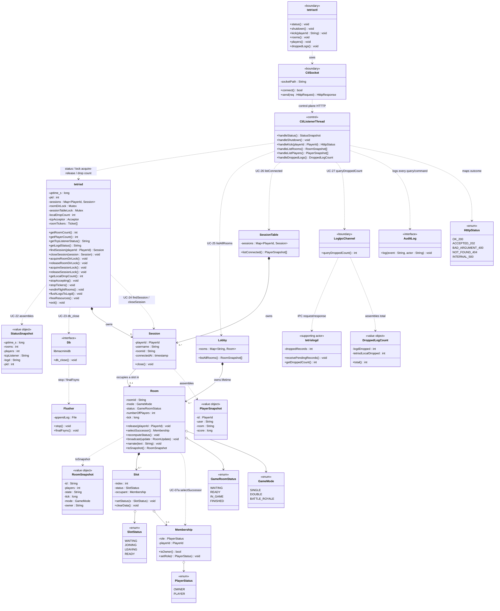
