# tetriSH — Complete Solution Sequence Diagrams (UC-01 – UC-27)

## Table of Contents

- [SD UC-01 — Register Account](#sd-uc-01--register-account)
- [SD UC-02 — Log In](#sd-uc-02--log-in)
- [SD UC-03 — Browse Open Rooms](#sd-uc-03--browse-open-rooms)
- [SD UC-04 — Create Room](#sd-uc-04--create-room)
- [SD UC-05 — Join Room from List](#sd-uc-05--join-room-from-list)
- [SD UC-06 — Join Room by Room ID](#sd-uc-06--join-room-by-room-id)
- [SD UC-07 — Leave Room (includes UC-07a)](#sd-uc-07--leave-room-includes-uc-07a)
- [SD UC-08 — Start Game (with UC-08a)](#sd-uc-08--start-game-with-uc-08a)
- [SD UC-09 — Chat in Room](#sd-uc-09--chat-in-room)
- [SD UC-10 — Play Single-Player Game](#sd-uc-10--play-single-player-game)
- [SD UC-11 — Play Double (2-Player) Game](#sd-uc-11--play-double-2-player-game)
- [SD UC-12 — Play Battle Royale Game](#sd-uc-12--play-battle-royale-game)
- [SD UC-13 — Control Falling Piece](#sd-uc-13--control-falling-piece)
- [SD UC-14 — Activate Gaiden Ability](#sd-uc-14--activate-gaiden-ability)
- [SD UC-15 — Buy Character (includes UC-15a, UC-17)](#sd-uc-15--buy-character-includes-uc-15a-uc-17)
- [SD UC-15a — Determine Character Button State](#sd-uc-15a--determine-character-button-state)
- [SD UC-16 — Buy Theme (includes UC-16a, UC-17)](#sd-uc-16--buy-theme-includes-uc-16a-uc-17)
- [SD UC-16a — Determine Theme Button State](#sd-uc-16a--determine-theme-button-state)
- [SD UC-17 — Deduct Wallet Points](#sd-uc-17--deduct-wallet-points)
- [SD UC-18 — Set Default Character](#sd-uc-18--set-default-character)
- [SD UC-19 — Set Default Theme](#sd-uc-19--set-default-theme)
- [SD UC-20 — View Settings / Profile](#sd-uc-20--view-settings--profile)
- [SD UC-21 — View Leaderboard](#sd-uc-21--view-leaderboard)
- [SD UC-22 — Query Server Status](#sd-uc-22--query-server-status)
- [SD UC-23 — Graceful Shutdown](#sd-uc-23--graceful-shutdown)
- [SD UC-24 — Kick Player (includes UC-07a)](#sd-uc-24--kick-player-includes-uc-07a)
- [SD UC-25 — List Rooms](#sd-uc-25--list-rooms)
- [SD UC-26 — List Players](#sd-uc-26--list-players)
- [SD UC-27 — Query Dropped Logs](#sd-uc-27--query-dropped-logs)

---

## SD UC-01 — Register Account

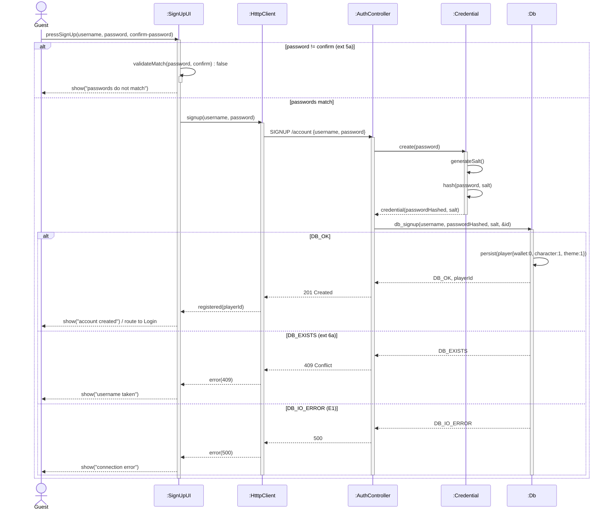
```mermaid
sequenceDiagram
    actor Guest
    participant UI as :SignUpUI
    participant C as :HtttpClient
    participant AC as :AuthController
    participant Cr as :Credential
    participant DB as :Db

    Guest->>UI: pressSignUp(username, password, confirm-password)
    activate UI

    alt password != confirm  (ext 5a)
        UI->>UI: validateMatch(password, confirm) : false
        activate UI
        deactivate UI
        UI-->>Guest: show("passwords do not match")
    else passwords match
        UI->>C: signup(username, password)
        activate C
        C->>AC: SIGNUP /account {username, password}
        activate AC

        AC->>Cr: create(password)
        activate Cr
        Cr->>Cr: generateSalt()
        Cr->>Cr: hash(password, salt)
        Cr-->>AC: credential(passwordHashed, salt)
        deactivate Cr

        AC->>DB: db_signup(username, passwordHashed, salt, &id)
        activate DB

        alt DB_OK
            DB->>DB: persist(player{wallet:0, character:1, theme:1})
            DB-->>AC: DB_OK, playerId
            AC-->>C: 201 Created
            C-->>UI: registered(playerId)
            UI-->>Guest: show("account created") / route to Login
        else DB_EXISTS  (ext 6a)
            DB-->>AC: DB_EXISTS
            AC-->>C: 409 Conflict
            C-->>UI: error(409)
            UI-->>Guest: show("username taken")
        else DB_IO_ERROR  (E1)
            DB-->>AC: DB_IO_ERROR
            AC-->>C: 500
            C-->>UI: error(500)
            UI-->>Guest: show("connection error")
        end

        deactivate DB
        deactivate AC
        deactivate C
    end
    deactivate UI
```

---

## SD UC-02 — Log In

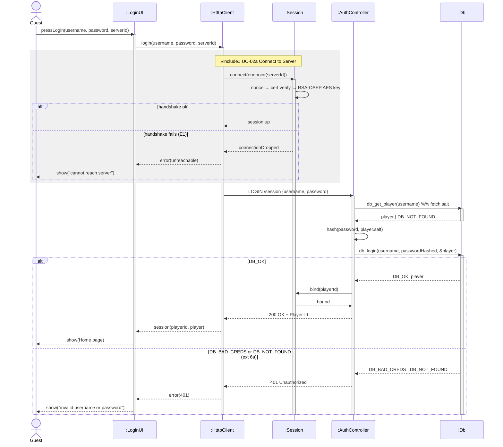
```mermaid
sequenceDiagram
    actor Guest
    participant UI as :LoginUI
    participant C as :HtttpClient
    participant S as :Session
    participant AC as :AuthController
    participant DB as :Db

    Guest->>UI: pressLogin(username, password, serverId)
    activate UI
    UI->>C: login(username, password, serverId)
    activate C

    rect rgb(240, 240, 240)
        note over C,S: «include» UC-02a Connect to Server
        C->>S: connect(endpoint(serverId))
        activate S
        S->>S: nonce → cert verify → RSA-OAEP AES key
        alt handshake ok
            S-->>C: session up
        else handshake fails  (E1)
            S-->>C: connectionDropped
            C-->>UI: error(unreachable)
            UI-->>Guest: show("cannot reach server")
        end
    end

    C->>AC: LOGIN /session {username, password}
    activate AC

    AC->>DB: db_get_player(username)  %% fetch salt
    activate DB
    DB-->>AC: player | DB_NOT_FOUND
    deactivate DB

    AC->>AC: hash(password, player.salt)

    AC->>DB: db_login(username, passwordHashed, &player)
    activate DB

    alt DB_OK
        DB-->>AC: DB_OK, player
        AC->>S: bind(playerId)
        S-->>AC: bound
        AC-->>C: 200 OK + Player-Id
        C-->>UI: session(playerId, player)
        UI-->>Guest: show(Home page)
    else DB_BAD_CREDS or DB_NOT_FOUND  (ext 6a)
        DB-->>AC: DB_BAD_CREDS | DB_NOT_FOUND
        AC-->>C: 401 Unauthorized
        C-->>UI: error(401)
        UI-->>Guest: show("invalid username or password")
    end

    deactivate DB
    deactivate AC
    deactivate S
    deactivate C
    deactivate UI
```

---

## SD UC-03 — Browse Open Rooms

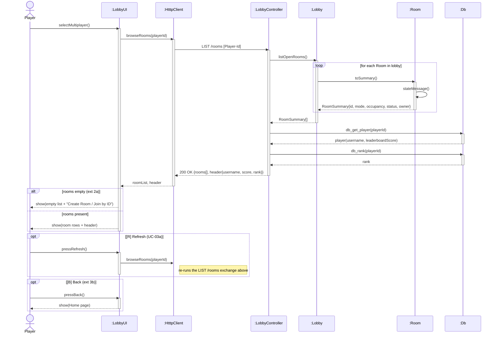
```mermaid
sequenceDiagram
    actor P as Player
    participant UI as :LobbyUI
    participant C as :HtttpClient
    participant LC as :LobbyController
    participant L as :Lobby
    participant R as :Room
    participant DB as :Db

    P->>UI: selectMultiplayer()
    activate UI
    UI->>C: browseRooms(playerId)
    activate C
    C->>LC: LIST /rooms  [Player-Id]
    activate LC

    LC->>L: listOpenRooms()
    activate L
    loop for each Room in lobby
        L->>R: toSummary()
        activate R
        R->>R: stateMessage()
        R-->>L: RoomSummary{id, mode, occupancy, status, owner}
        deactivate R
    end
    L-->>LC: RoomSummary[]
    deactivate L

    LC->>DB: db_get_player(playerId)
    activate DB
    DB-->>LC: player(username, leaderboardScore)
    deactivate DB

    LC->>DB: db_rank(playerId)
    activate DB
    DB-->>LC: rank
    deactivate DB

    LC-->>C: 200 OK {rooms[], header{username, score, rank}}
    deactivate LC
    C-->>UI: roomList, header
    deactivate C

    alt rooms empty  (ext 2a)
        UI-->>P: show(empty list + "Create Room / Join by ID")
    else rooms present
        UI-->>P: show(room rows + header)
    end
    deactivate UI

    opt [R] Refresh  (UC-03a)
        P->>UI: pressRefresh()
        activate UI
        UI->>C: browseRooms(playerId)
        note right of C: re-runs the LIST /rooms exchange above
        deactivate UI
    end

    opt [B] Back  (ext 3b)
        P->>UI: pressBack()
        activate UI
        UI-->>P: show(Home page)
        deactivate UI
    end
```

---

## SD UC-04 — Create Room

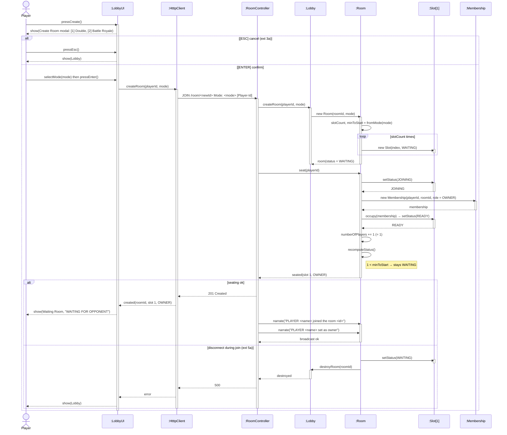
```mermaid
sequenceDiagram
    actor P as Player
    participant UI as :LobbyUI
    participant C as :HtttpClient
    participant RC as :RoomController
    participant L as :Lobby
    participant R as :Room
    participant S1 as :Slot[1]
    participant M as :Membership

    P->>UI: pressCreate()
    activate UI
    UI-->>P: show(Create Room modal: [1] Double, [2] Battle Royale)

    alt [ESC] cancel  (ext 3a)
        P->>UI: pressEsc()
        UI-->>P: show(Lobby)
    else [ENTER] confirm
        P->>UI: selectMode(mode) then pressEnter()
        UI->>C: createRoom(playerId, mode)
        activate C
        C->>RC: JOIN /room/<newId>  Mode: <mode>  [Player-Id]
        activate RC

        RC->>L: createRoom(playerId, mode)
        activate L
        L->>R: new Room(roomId, mode)
        activate R
        R->>R: slotCount, minToStart = fromMode(mode)
        loop slotCount times
            R->>S1: new Slot(index, WAITING)
            activate S1
            deactivate S1
        end
        R-->>L: room(status = WAITING)
        deactivate R
        deactivate L

        RC->>R: seat(playerId)
        activate R
        R->>S1: setStatus(JOINING)
        activate S1
        S1-->>R: JOINING
        deactivate S1
        R->>M: new Membership(playerId, roomId, role = OWNER)
        activate M
        M-->>R: membership
        deactivate M
        R->>S1: occupy(membership) → setStatus(READY)
        activate S1
        S1-->>R: READY
        deactivate S1
        R->>R: numberOfPlayers += 1  (= 1)
        R->>R: recomputeStatus()
        note right of R: 1 < minToStart → stays WAITING
        R-->>RC: seated(slot 1, OWNER)
        deactivate R

        alt seating ok
            RC-->>C: 201 Created
            C-->>UI: created(roomId, slot 1, OWNER)
            UI-->>P: show(Waiting Room, "WAITING FOR OPPONENT")
            RC->>R: narrate("PLAYER <name> joined the room <id>")
            activate R
            RC->>R: narrate("PLAYER <name> set as owner")
            R-->>RC: broadcast ok
            deactivate R
        else disconnect during join  (ext 5a)
            R->>S1: setStatus(WAITING)
            activate S1
            deactivate S1
            R->>L: destroyRoom(roomId)
            activate L
            L-->>RC: destroyed
            deactivate L
            RC-->>C: 500
            C-->>UI: error
            UI-->>P: show(Lobby)
        end

        deactivate RC
        deactivate C
    end
    deactivate UI
```

---

## SD UC-05 — Join Room from List

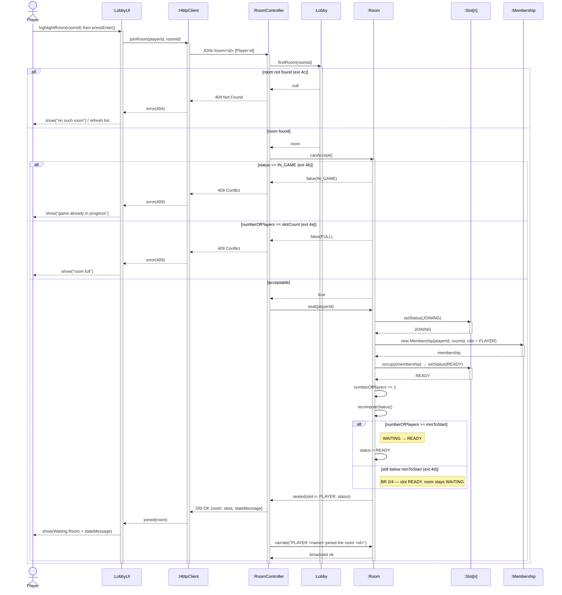
```mermaid
sequenceDiagram
    actor P as Player
    participant UI as :LobbyUI
    participant C as :HtttpClient
    participant RC as :RoomController
    participant L as :Lobby
    participant R as :Room
    participant Sn as :Slot[n]
    participant M as :Membership

    P->>UI: highlightRoom(roomId) then pressEnter()
    activate UI
    UI->>C: joinRoom(playerId, roomId)
    activate C
    C->>RC: JOIN /room/<id>  [Player-Id]
    activate RC

    RC->>L: findRoom(roomId)
    activate L

    alt room not found  (ext 4c)
        L-->>RC: null
        RC-->>C: 404 Not Found
        C-->>UI: error(404)
        UI-->>P: show("no such room") / refresh list
    else room found
        L-->>RC: room
        RC->>R: canAccept()
        activate R

        alt status == IN_GAME  (ext 4b)
            R-->>RC: false(IN_GAME)
            RC-->>C: 409 Conflict
            C-->>UI: error(409)
            UI-->>P: show("game already in progress")
        else numberOfPlayers == slotCount  (ext 4a)
            R-->>RC: false(FULL)
            RC-->>C: 409 Conflict
            C-->>UI: error(409)
            UI-->>P: show("room full")
        else acceptable
            R-->>RC: true
            RC->>R: seat(playerId)
            R->>Sn: setStatus(JOINING)
            activate Sn
            Sn-->>R: JOINING
            deactivate Sn
            R->>M: new Membership(playerId, roomId, role = PLAYER)
            activate M
            M-->>R: membership
            deactivate M
            R->>Sn: occupy(membership) → setStatus(READY)
            activate Sn
            Sn-->>R: READY
            deactivate Sn
            R->>R: numberOfPlayers += 1
            R->>R: recomputeStatus()

            alt numberOfPlayers >= minToStart
                note right of R: WAITING → READY
                R->>R: status = READY
            else still below minToStart  (ext 4d)
                note right of R: BR 2/4 — slot READY, room stays WAITING
            end

            R-->>RC: seated(slot n, PLAYER, status)
            RC-->>C: 200 OK {room, slots, stateMessage}
            C-->>UI: joined(room)
            UI-->>P: show(Waiting Room + stateMessage)
            RC->>R: narrate("PLAYER <name> joined the room <id>")
            R-->>RC: broadcast ok
        end

        deactivate R
    end

    deactivate L
    deactivate RC
    deactivate C
    deactivate UI
```

---

## SD UC-06 — Join Room by Room ID

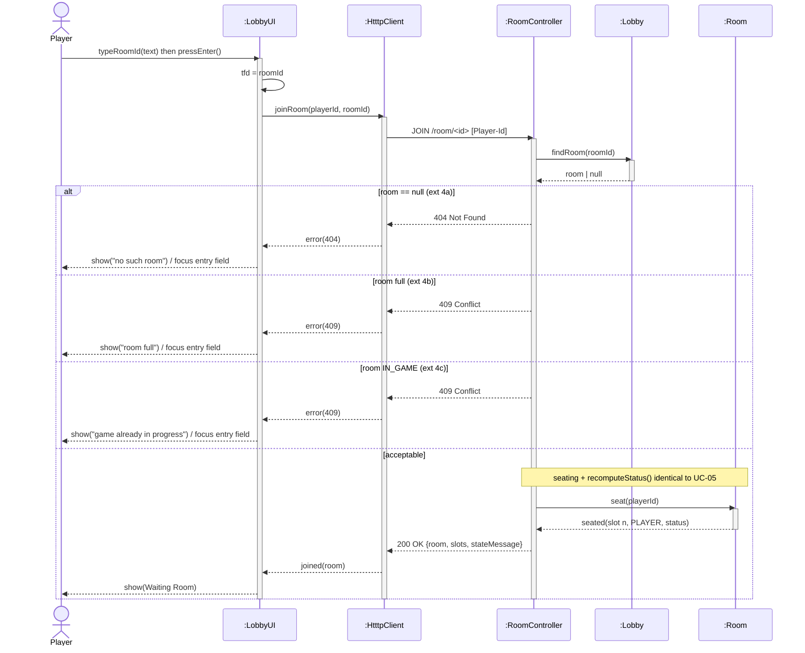
```mermaid
sequenceDiagram
    actor P as Player
    participant UI as :LobbyUI
    participant C as :HtttpClient
    participant RC as :RoomController
    participant L as :Lobby
    participant R as :Room

    P->>UI: typeRoomId(text) then pressEnter()
    activate UI
    UI->>UI: tfd = roomId
    UI->>C: joinRoom(playerId, roomId)
    activate C
    C->>RC: JOIN /room/<id>  [Player-Id]
    activate RC

    RC->>L: findRoom(roomId)
    activate L
    L-->>RC: room | null
    deactivate L

    alt room == null  (ext 4a)
        RC-->>C: 404 Not Found
        C-->>UI: error(404)
        UI-->>P: show("no such room") / focus entry field
    else room full  (ext 4b)
        RC-->>C: 409 Conflict
        C-->>UI: error(409)
        UI-->>P: show("room full") / focus entry field
    else room IN_GAME  (ext 4c)
        RC-->>C: 409 Conflict
        C-->>UI: error(409)
        UI-->>P: show("game already in progress") / focus entry field
    else acceptable
        note over RC,R: seating + recomputeStatus() identical to UC-05
        RC->>R: seat(playerId)
        activate R
        R-->>RC: seated(slot n, PLAYER, status)
        deactivate R
        RC-->>C: 200 OK {room, slots, stateMessage}
        C-->>UI: joined(room)
        UI-->>P: show(Waiting Room)
    end

    deactivate RC
    deactivate C
    deactivate UI
```

---

## SD UC-07 — Leave Room (includes UC-07a)

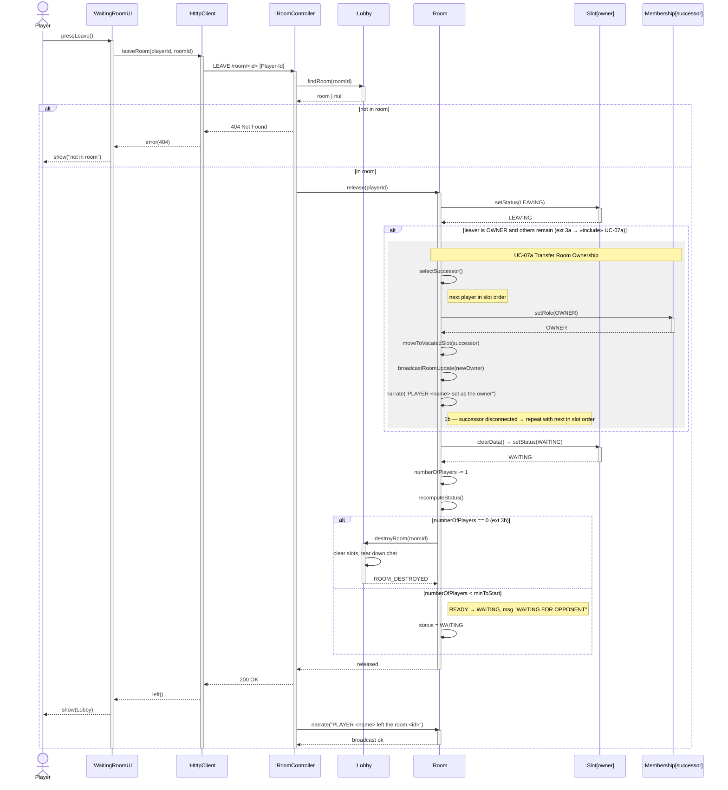
```mermaid
sequenceDiagram
    actor P as Player
    participant UI as :WaitingRoomUI
    participant C as :HtttpClient
    participant RC as :RoomController
    participant L as :Lobby
    participant R as :Room
    participant So as :Slot[owner]
    participant Ms as :Membership[successor]

    P->>UI: pressLeave()
    activate UI
    UI->>C: leaveRoom(playerId, roomId)
    activate C
    C->>RC: LEAVE /room/<id>  [Player-Id]
    activate RC

    RC->>L: findRoom(roomId)
    activate L
    L-->>RC: room | null
    deactivate L

    alt not in room
        RC-->>C: 404 Not Found
        C-->>UI: error(404)
        UI-->>P: show("not in room")
    else in room
        RC->>R: release(playerId)
        activate R
        R->>So: setStatus(LEAVING)
        activate So
        So-->>R: LEAVING
        deactivate So

        alt leaver is OWNER and others remain  (ext 3a → «include» UC-07a)
            rect rgb(240, 240, 240)
                note over R,Ms: UC-07a Transfer Room Ownership
                R->>R: selectSuccessor()
                note right of R: next player in slot order
                R->>Ms: setRole(OWNER)
                activate Ms
                Ms-->>R: OWNER
                deactivate Ms
                R->>R: moveToVacatedSlot(successor)
                R->>R: broadcastRoomUpdate(newOwner)
                R->>R: narrate("PLAYER <name> set as the owner")
                note right of R: 1b — successor disconnected → repeat with next in slot order
            end
        end

        R->>So: clearData() → setStatus(WAITING)
        activate So
        So-->>R: WAITING
        deactivate So
        R->>R: numberOfPlayers -= 1
        R->>R: recomputeStatus()

        alt numberOfPlayers == 0  (ext 3b)
            R->>L: destroyRoom(roomId)
            activate L
            L->>L: clear slots, tear down chat
            L-->>R: ROOM_DESTROYED
            deactivate L
        else numberOfPlayers < minToStart
            note right of R: READY → WAITING, msg "WAITING FOR OPPONENT"
            R->>R: status = WAITING
        end

        R-->>RC: released
        deactivate R

        RC-->>C: 200 OK
        C-->>UI: left()
        UI-->>P: show(Lobby)
        RC->>R: narrate("PLAYER <name> left the room <id>")
        activate R
        R-->>RC: broadcast ok
        deactivate R
    end

    deactivate RC
    deactivate C
    deactivate UI
```

---

## SD UC-08 — Start Game (with UC-08a)

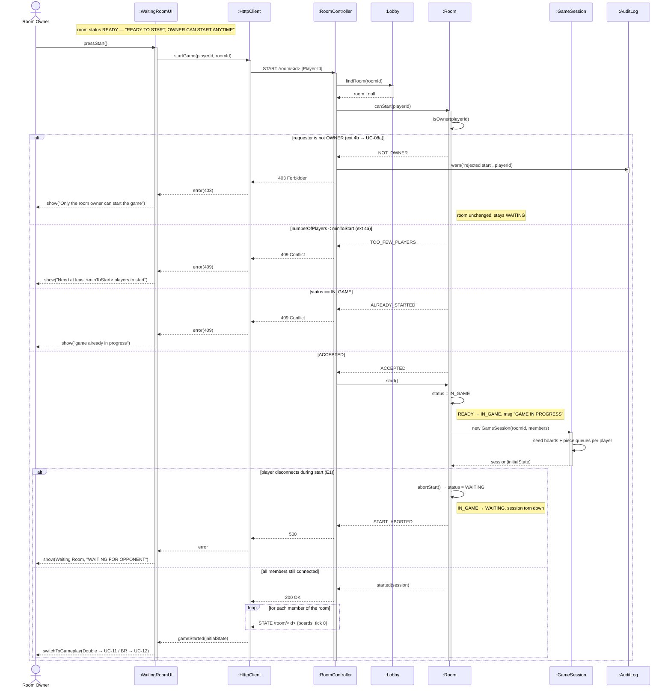
```mermaid
sequenceDiagram
    actor O as Room Owner
    participant UI as :WaitingRoomUI
    participant C as :HtttpClient
    participant RC as :RoomController
    participant L as :Lobby
    participant R as :Room
    participant GS as :GameSession
    participant LOG as :AuditLog

    note over UI: room status READY — "READY TO START, OWNER CAN START ANYTIME"

    O->>UI: pressStart()
    activate UI
    UI->>C: startGame(playerId, roomId)
    activate C
    C->>RC: START /room/<id>  [Player-Id]
    activate RC

    RC->>L: findRoom(roomId)
    activate L
    L-->>RC: room | null
    deactivate L

    RC->>R: canStart(playerId)
    activate R
    R->>R: isOwner(playerId)

    alt requester is not OWNER  (ext 4b → UC-08a)
        R-->>RC: NOT_OWNER
        RC->>LOG: warn("rejected start", playerId)
        activate LOG
        deactivate LOG
        RC-->>C: 403 Forbidden
        C-->>UI: error(403)
        UI-->>O: show("Only the room owner can start the game")
        note right of R: room unchanged, stays WAITING
    else numberOfPlayers < minToStart  (ext 4a)
        R-->>RC: TOO_FEW_PLAYERS
        RC-->>C: 409 Conflict
        C-->>UI: error(409)
        UI-->>O: show("Need at least <minToStart> players to start")
    else status == IN_GAME
        R-->>RC: ALREADY_STARTED
        RC-->>C: 409 Conflict
        C-->>UI: error(409)
        UI-->>O: show("game already in progress")
    else ACCEPTED
        R-->>RC: ACCEPTED
        RC->>R: start()
        R->>R: status = IN_GAME
        note right of R: READY → IN_GAME, msg "GAME IN PROGRESS"
        R->>GS: new GameSession(roomId, members)
        activate GS
        GS->>GS: seed boards + piece queues per player
        GS-->>R: session(initialState)
        deactivate GS

        alt player disconnects during start  (E1)
            R->>R: abortStart() → status = WAITING
            note right of R: IN_GAME → WAITING, session torn down
            R-->>RC: START_ABORTED
            RC-->>C: 500
            C-->>UI: error
            UI-->>O: show(Waiting Room, "WAITING FOR OPPONENT")
        else all members still connected
            R-->>RC: started(session)
            RC-->>C: 200 OK
            loop for each member of the room
                RC->>C: STATE /room/<id>  {boards, tick 0}
            end
            C-->>UI: gameStarted(initialState)
            UI-->>O: switchToGameplay(Double → UC-11 / BR → UC-12)
        end
    end

    deactivate R
    deactivate RC
    deactivate C
    deactivate UI
```

---

## SD UC-09 — Chat in Room

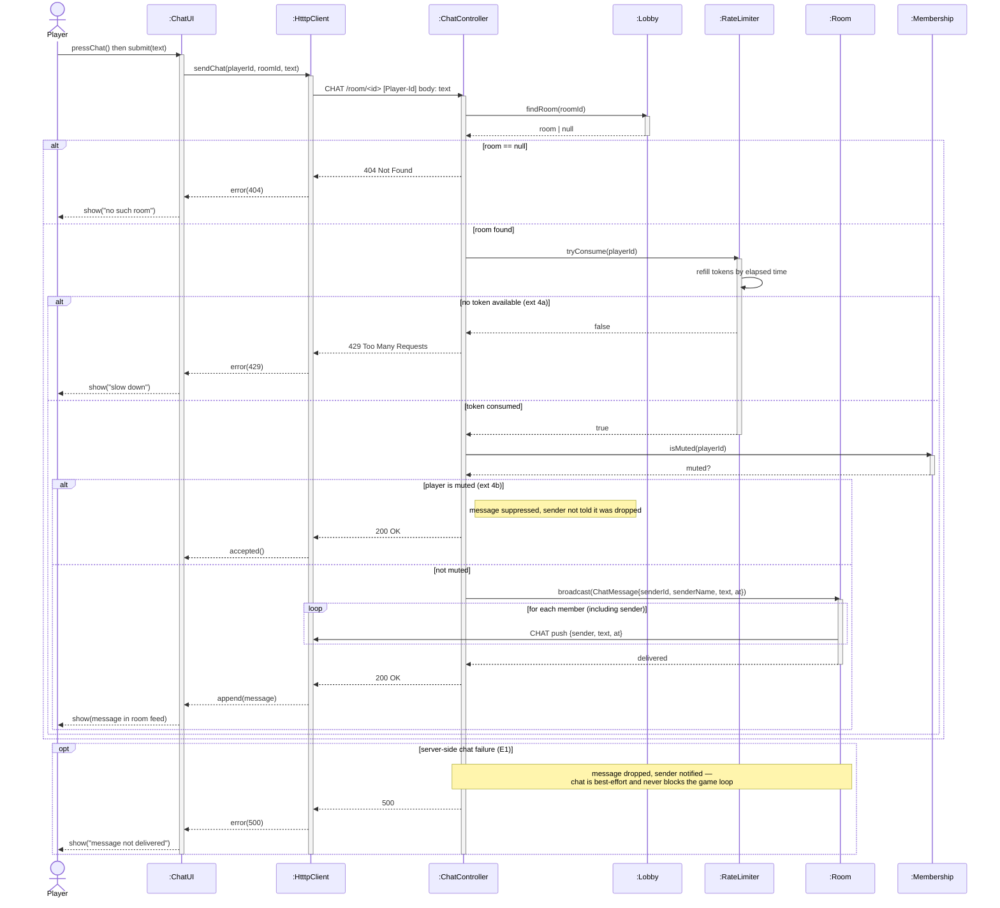
```mermaid
sequenceDiagram
    actor P as Player
    participant UI as :ChatUI
    participant C as :HtttpClient
    participant CC as :ChatController
    participant L as :Lobby
    participant RL as :RateLimiter
    participant R as :Room
    participant M as :Membership

    P->>UI: pressChat() then submit(text)
    activate UI
    UI->>C: sendChat(playerId, roomId, text)
    activate C
    C->>CC: CHAT /room/<id>  [Player-Id]  body: text
    activate CC

    CC->>L: findRoom(roomId)
    activate L
    L-->>CC: room | null
    deactivate L

    alt room == null
        CC-->>C: 404 Not Found
        C-->>UI: error(404)
        UI-->>P: show("no such room")
    else room found
        CC->>RL: tryConsume(playerId)
        activate RL
        RL->>RL: refill tokens by elapsed time

        alt no token available  (ext 4a)
            RL-->>CC: false
            CC-->>C: 429 Too Many Requests
            C-->>UI: error(429)
            UI-->>P: show("slow down")
        else token consumed
            RL-->>CC: true
            deactivate RL

            CC->>M: isMuted(playerId)
            activate M
            M-->>CC: muted?
            deactivate M

            alt player is muted  (ext 4b)
                note right of CC: message suppressed, sender not told it was dropped
                CC-->>C: 200 OK
                C-->>UI: accepted()
            else not muted
                CC->>R: broadcast(ChatMessage{senderId, senderName, text, at})
                activate R
                loop for each member (including sender)
                    R->>C: CHAT push {sender, text, at}
                end
                R-->>CC: delivered
                deactivate R
                CC-->>C: 200 OK
                C-->>UI: append(message)
                UI-->>P: show(message in room feed)
            end
        end
    end

    opt server-side chat failure  (E1)
        note over CC,R: message dropped, sender notified —<br/>chat is best-effort and never blocks the game loop
        CC-->>C: 500
        C-->>UI: error(500)
        UI-->>P: show("message not delivered")
    end

    deactivate CC
    deactivate C
    deactivate UI
```

---

---

## SD UC-10 — Play Single-Player Game

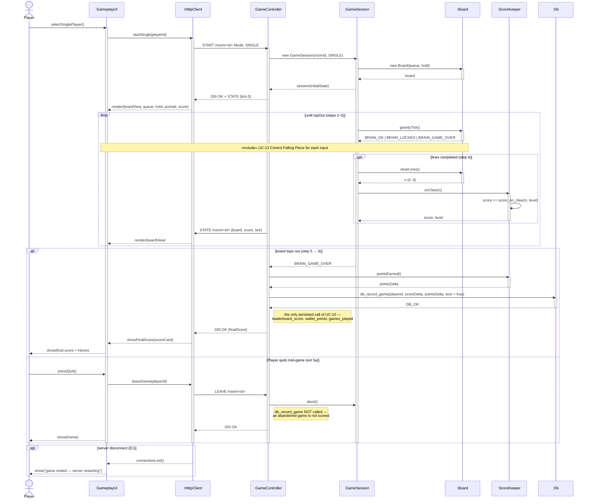
```mermaid
sequenceDiagram
    actor P as Player
    participant UI as :GameplayUI
    participant C as :HtttpClient
    participant GC as :GameController
    participant GS as :GameSession
    participant B as :Board
    participant SK as :ScoreKeeper
    participant DB as :Db

    P->>UI: selectSinglePlayer()
    activate UI
    UI->>C: startSingle(playerId)
    activate C
    C->>GC: START /room/<id>  Mode: SINGLE
    activate GC
    GC->>GS: new GameSession(roomId, SINGLE)
    activate GS
    GS->>B: new Board(queue, hold)
    activate B
    B-->>GS: board
    deactivate B
    GS-->>GC: session(initialState)
    GC-->>C: 200 OK + STATE {tick 0}
    C-->>UI: render(boardView, queue, hold, portrait, score)

    loop until topOut  (steps 2–5)
        GS->>B: gravityTick()
        activate B
        B-->>GS: BRAIN_OK | BRAIN_LOCKED | BRAIN_GAME_OVER
        deactivate B

        note over UI,B: «include» UC-13 Control Falling Piece for each input

        opt lines completed  (step 4)
            GS->>B: clearLines()
            activate B
            B-->>GS: n (0..4)
            deactivate B
            GS->>SK: onClear(n)
            activate SK
            SK->>SK: score += score_on_clear(n, level)
            SK-->>GS: score, level
            deactivate SK
        end

        GC->>C: STATE /room/<id>  {board, score, tick}
        C-->>UI: render(boardView)
    end

    alt board tops out  (step 5 → 6)
        GS-->>GC: BRAIN_GAME_OVER
        GC->>SK: pointsEarned()
        activate SK
        SK-->>GC: pointsDelta
        deactivate SK
        GC->>DB: db_record_game(playerId, scoreDelta, pointsDelta, won = true)
        activate DB
        DB-->>GC: DB_OK
        deactivate DB
        note right of GC: the only persisted call of UC-10 —<br/>leaderboard_score, wallet_points, games_played
        GC-->>C: 200 OK {finalScore}
        C-->>UI: showFinalScore(scoreCard)
        UI-->>P: show(final score + Home)
    else Player quits mid-game  (ext 5a)
        P->>UI: pressQuit()
        UI->>C: leaveGame(playerId)
        C->>GC: LEAVE /room/<id>
        GC->>GS: abort()
        note right of GC: db_record_game NOT called —<br/>an abandoned game is not scored
        GC-->>C: 200 OK
        UI-->>P: show(Home)
    end

    deactivate GS
    deactivate GC
    deactivate C
    deactivate UI

    opt server disconnect  (E1)
        C-->>UI: connectionLost()
        UI-->>P: show("game ended — server restarting")
    end
```

---

## SD UC-11 — Play Double (2-Player) Game

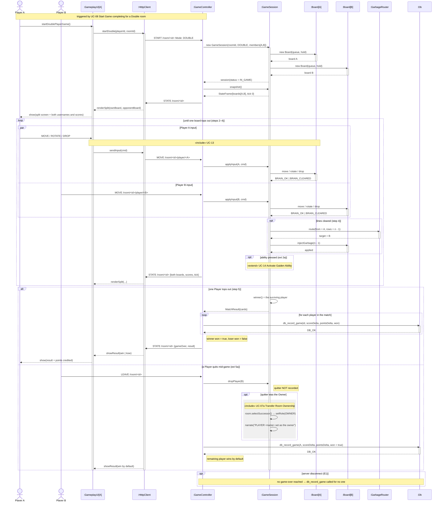
```mermaid
sequenceDiagram
    actor P1 as Player A
    actor P2 as Player B
    participant UI as :GameplayUI[A]
    participant C as :HtttpClient
    participant GC as :GameController
    participant GS as :GameSession
    participant BA as :Board[A]
    participant BB as :Board[B]
    participant GR as :GarbageRouter
    participant DB as :Db

    note over P1,GC: triggered by UC-08 Start Game completing for a Double room

    P1->>UI: startDoublePlayerGame()
    activate UI
    UI->>C: startDouble(playerId, roomId)
    activate C
    C->>GC: START /room/<id>  Mode: DOUBLE
    activate GC
    GC->>GS: new GameSession(roomId, DOUBLE, members[A,B])
    activate GS
    GS->>BA: new Board(queue, hold)
    activate BA
    BA-->>GS: board A
    deactivate BA
    GS->>BB: new Board(queue, hold)
    activate BB
    BB-->>GS: board B
    deactivate BB
    GS-->>GC: session(status = IN_GAME)

    GC->>GS: snapshot()
    GS-->>GC: StateFrame{boards[A,B], tick 0}
    GC->>C: STATE /room/<id>
    C-->>UI: renderSplit(ownBoard, opponentBoard)
    UI-->>P1: show(split screen + both usernames and scores)

    loop until one board tops out  (steps 2–4)
        par Player A input
            P1->>UI: MOVE / ROTATE / DROP
            note over UI,BA: «include» UC-13
            UI->>C: sendInput(cmd)
            C->>GC: MOVE /room/<id>/player/<A>
            GC->>GS: applyInput(A, cmd)
            GS->>BA: move / rotate / drop
            activate BA
            BA-->>GS: BRAIN_OK | BRAIN_CLEARED
            deactivate BA
        and Player B input
            P2->>GC: MOVE /room/<id>/player/<B>
            GC->>GS: applyInput(B, cmd)
            GS->>BB: move / rotate / drop
            activate BB
            BB-->>GS: BRAIN_OK | BRAIN_CLEARED
            deactivate BB
        end

        opt lines cleared  (step 4)
            GS->>GR: route(from = A, rows = n - 1)
            activate GR
            GR-->>GS: target = B
            deactivate GR
            GS->>BB: injectGarbage(n - 1)
            activate BB
            BB-->>GS: applied
            deactivate BB
        end

        opt ability pressed  (ext 2a)
            note over GS: «extend» UC-14 Activate Gaiden Ability
        end

        GC->>C: STATE /room/<id>  {both boards, scores, tick}
        C-->>UI: renderSplit(...)
    end

    alt one Player tops out  (step 5)
        GS->>GS: winner() = the surviving player
        GS-->>GC: MatchResult{cards}
        loop for each player in the match
            GC->>DB: db_record_game(id, scoreDelta, pointsDelta, won)
            activate DB
            DB-->>GC: DB_OK
            deactivate DB
        end
        note right of GC: winner won = true, loser won = false
        GC->>C: STATE /room/<id>  {gameOver, result}
        C-->>UI: showResult(win | lose)
        UI-->>P1: show(result + points credited)
    else a Player quits mid-game  (ext 5a)
        P2->>GC: LEAVE /room/<id>
        GC->>GS: dropPlayer(B)
        note right of GS: quitter NOT recorded

        opt quitter was the Owner
            rect rgb(240, 240, 240)
                note over GS: «include» UC-07a Transfer Room Ownership
                GS->>GS: room.selectSuccessor() → setRole(OWNER)
                GS->>GS: narrate("PLAYER <name> set as the owner")
            end
        end

        GC->>DB: db_record_game(A, scoreDelta, pointsDelta, won = true)
        activate DB
        DB-->>GC: DB_OK
        deactivate DB
        note right of GC: remaining player wins by default
        C-->>UI: showResult(win by default)
    end

    deactivate UI
    deactivate C
    deactivate GS

    opt server disconnect  (E1)
        note over GC,DB: no game-over reached → db_record_game called for no one
    end
```

---

## SD UC-12 — Play Battle Royale Game

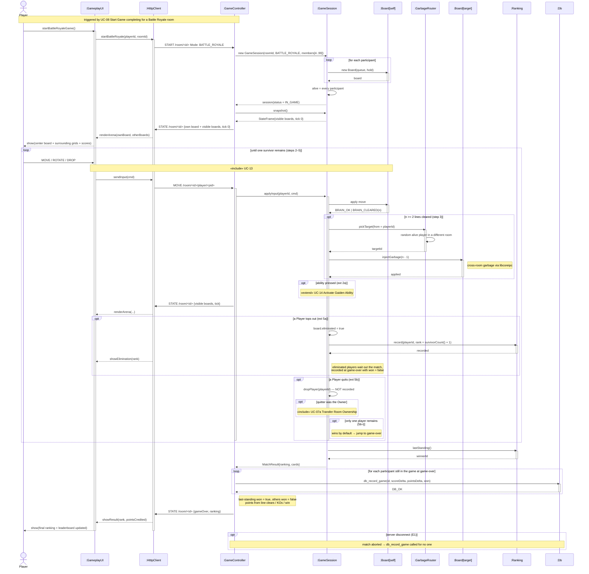
```mermaid
sequenceDiagram
    actor P as Player
    participant UI as :GameplayUI
    participant C as :HtttpClient
    participant GC as :GameController
    participant GS as :GameSession
    participant B as :Board[self]
    participant GR as :GarbageRouter
    participant BT as :Board[target]
    participant RK as :Ranking
    participant DB as :Db

    note over P,GC: triggered by UC-08 Start Game completing for a Battle Royale room

    P->>UI: startBattleRoyaleGame()
    activate UI
    UI->>C: startBattleRoyale(playerId, roomId)
    activate C
    C->>GC: START /room/<id>  Mode: BATTLE_ROYALE
    activate GC
    GC->>GS: new GameSession(roomId, BATTLE_ROYALE, members[4..99])
    activate GS
    loop for each participant
        GS->>B: new Board(queue, hold)
        activate B
        B-->>GS: board
        deactivate B
    end
    GS->>GS: alive = every participant
    GS-->>GC: session(status = IN_GAME)

    GC->>GS: snapshot()
    GS-->>GC: StateFrame{visible boards, tick 0}
    GC->>C: STATE /room/<id>  {own board + visible boards, tick 0}
    C-->>UI: renderArena(ownBoard, otherBoards)
    UI-->>P: show(center board + surrounding grids + scores)

    loop until one survivor remains  (steps 2–5)
        P->>UI: MOVE / ROTATE / DROP
        note over UI,B: «include» UC-13
        UI->>C: sendInput(cmd)
        C->>GC: MOVE /room/<id>/player/<pid>
        activate GC
        GC->>GS: applyInput(playerId, cmd)
        activate GS
        GS->>B: apply move
        activate B
        B-->>GS: BRAIN_OK | BRAIN_CLEARED(n)
        deactivate B

        opt n >= 2 lines cleared  (step 3)
            GS->>GR: pickTarget(from = playerId)
            activate GR
            GR->>GR: random alive player in a different room
            GR-->>GS: targetId
            deactivate GR
            GS->>BT: injectGarbage(n - 1)
            activate BT
            note right of BT: cross-room garbage via libcoreipc
            BT-->>GS: applied
            deactivate BT
        end

        opt ability pressed  (ext 2a)
            note over GS: «extend» UC-14 Activate Gaiden Ability
        end

        GC->>C: STATE /room/<id>  {visible boards, tick}
        C-->>UI: renderArena(...)

        opt a Player tops out  (ext 5a)
            GS->>GS: board.eliminated = true
            GS->>RK: record(playerId, rank = survivorCount() + 1)
            activate RK
            RK-->>GS: recorded
            deactivate RK
            C-->>UI: showElimination(rank)
            note right of GS: eliminated players wait out the match,<br/>recorded at game-over with won = false
        end

        opt a Player quits  (ext 5b)
            GS->>GS: dropPlayer(playerId) — NOT recorded
            opt quitter was the Owner
                note over GS: «include» UC-07a Transfer Room Ownership
            end
            opt only one player remains  (5b-i)
                note right of GS: wins by default → jump to game-over
            end
        end

        deactivate GS
        deactivate GC
    end

    GS->>RK: lastStanding()
    activate RK
    RK-->>GS: winnerId
    deactivate RK
    GS-->>GC: MatchResult{ranking, cards}

    loop for each participant still in the game at game-over
        GC->>DB: db_record_game(id, scoreDelta, pointsDelta, won)
        activate DB
        DB-->>GC: DB_OK
        deactivate DB
    end
    note right of GC: last-standing won = true, others won = false<br/>points from line clears / KOs / win

    GC->>C: STATE /room/<id>  {gameOver, ranking}
    C-->>UI: showResult(rank, pointsCredited)
    UI-->>P: show(final ranking + leaderboard updated)

    deactivate UI
    deactivate C

    opt server disconnect  (E1)
        note over GC,DB: match aborted → db_record_game called for no one
    end
```

---

## SD UC-13 — Control Falling Piece

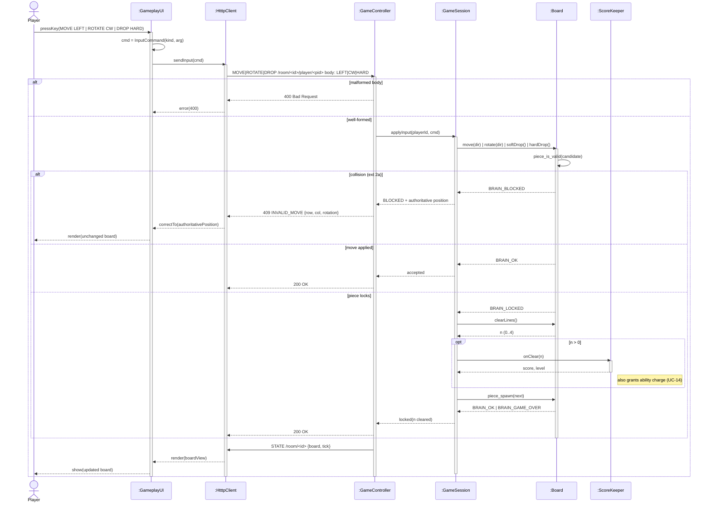
```mermaid
sequenceDiagram
    actor P as Player
    participant UI as :GameplayUI
    participant C as :HtttpClient
    participant GC as :GameController
    participant GS as :GameSession
    participant B as :Board
    participant SK as :ScoreKeeper

    P->>UI: pressKey(MOVE LEFT | ROTATE CW | DROP HARD)
    activate UI
    UI->>UI: cmd = InputCommand(kind, arg)
    UI->>C: sendInput(cmd)
    activate C
    C->>GC: MOVE|ROTATE|DROP /room/<id>/player/<pid>  body: LEFT|CW|HARD
    activate GC

    alt malformed body
        GC-->>C: 400 Bad Request
        C-->>UI: error(400)
    else well-formed
        GC->>GS: applyInput(playerId, cmd)
        activate GS
        GS->>B: move(dir) | rotate(dir) | softDrop() | hardDrop()
        activate B
        B->>B: piece_is_valid(candidate)

        alt collision  (ext 2a)
            B-->>GS: BRAIN_BLOCKED
            GS-->>GC: BLOCKED + authoritative position
            GC-->>C: 409 INVALID_MOVE {row, col, rotation}
            C-->>UI: correctTo(authoritativePosition)
            UI-->>P: render(unchanged board)
        else move applied
            B-->>GS: BRAIN_OK
            GS-->>GC: accepted
            GC-->>C: 200 OK
        else piece locks
            B-->>GS: BRAIN_LOCKED
            GS->>B: clearLines()
            B-->>GS: n (0..4)
            opt n > 0
                GS->>SK: onClear(n)
                activate SK
                SK-->>GS: score, level
                deactivate SK
                note right of SK: also grants ability charge (UC-14)
            end
            GS->>B: piece_spawn(next)
            B-->>GS: BRAIN_OK | BRAIN_GAME_OVER
            GS-->>GC: locked(n cleared)
            GC-->>C: 200 OK
        end
        deactivate B

        GC->>C: STATE /room/<id>  {board, tick}
        C-->>UI: render(boardView)
        UI-->>P: show(updated board)
        deactivate GS
    end

    deactivate GC
    deactivate C
    deactivate UI
```

---

## SD UC-14 — Activate Gaiden Ability

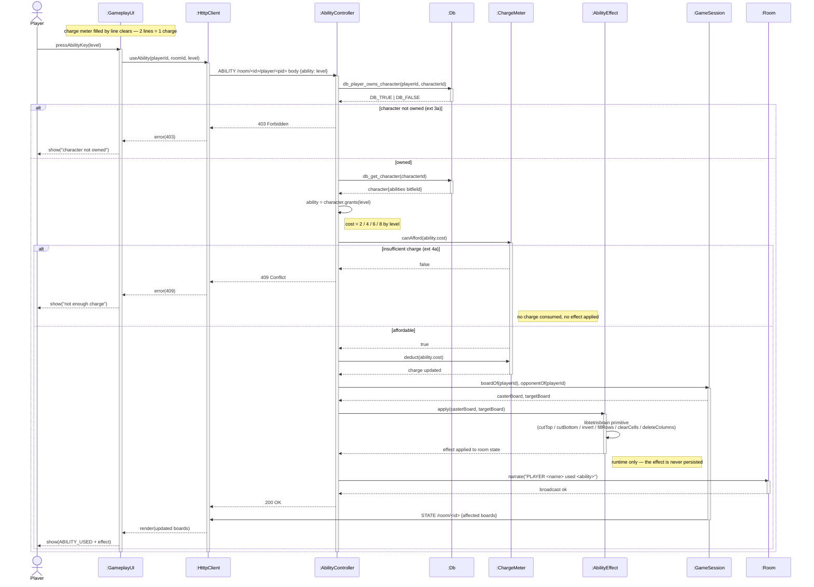
```mermaid
sequenceDiagram
    actor P as Player
    participant UI as :GameplayUI
    participant C as :HtttpClient
    participant AC as :AbilityController
    participant DB as :Db
    participant CM as :ChargeMeter
    participant EF as :AbilityEffect
    participant GS as :GameSession
    participant R as :Room

    note over UI: charge meter filled by line clears — 2 lines = 1 charge

    P->>UI: pressAbilityKey(level)
    activate UI
    UI->>C: useAbility(playerId, roomId, level)
    activate C
    C->>AC: ABILITY /room/<id>/player/<pid>  body {ability: level}
    activate AC

    AC->>DB: db_player_owns_character(playerId, characterId)
    activate DB
    DB-->>AC: DB_TRUE | DB_FALSE
    deactivate DB

    alt character not owned  (ext 3a)
        AC-->>C: 403 Forbidden
        C-->>UI: error(403)
        UI-->>P: show("character not owned")
    else owned
        AC->>DB: db_get_character(characterId)
        activate DB
        DB-->>AC: character{abilities bitfield}
        deactivate DB
        AC->>AC: ability = character.grants(level)
        note right of AC: cost = 2 / 4 / 6 / 8 by level

        AC->>CM: canAfford(ability.cost)
        activate CM

        alt insufficient charge  (ext 4a)
            CM-->>AC: false
            AC-->>C: 409 Conflict
            C-->>UI: error(409)
            UI-->>P: show("not enough charge")
            note right of CM: no charge consumed, no effect applied
        else affordable
            CM-->>AC: true
            AC->>CM: deduct(ability.cost)
            CM-->>AC: charge updated
            deactivate CM

            AC->>GS: boardOf(playerId), opponentOf(playerId)
            activate GS
            GS-->>AC: casterBoard, targetBoard

            AC->>EF: apply(casterBoard, targetBoard)
            activate EF
            EF->>EF: libtetrisbrain primitive<br/>(cutTop / cutBottom / invert / fillRows / clearCells / deleteColumns)
            EF-->>AC: effect applied to room state
            deactivate EF
            note right of EF: runtime only — the effect is never persisted

            AC->>R: narrate("PLAYER <name> used <ability>")
            activate R
            R-->>AC: broadcast ok
            deactivate R

            AC-->>C: 200 OK
            GS->>C: STATE /room/<id>  {affected boards}
            deactivate GS
            C-->>UI: render(updated boards)
            UI-->>P: show(ABILITY_USED + effect)
        end
    end

    deactivate AC
    deactivate C
    deactivate UI
```

---

---

## SD UC-15 — Buy Character (includes UC-15a, UC-17)

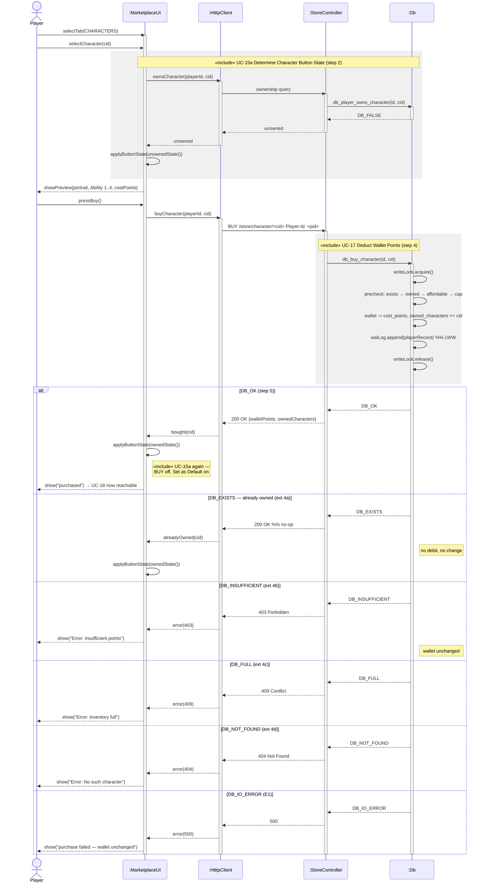
```mermaid
sequenceDiagram
    actor P as Player
    participant UI as :MarketplaceUI
    participant C as :HtttpClient
    participant SC as :StoreController
    participant DB as :Db

    P->>UI: selectTab(CHARACTERS)
    activate UI
    P->>UI: selectCharacter(cid)

    rect rgb(240, 240, 240)
        note over UI,DB: «include» UC-15a Determine Character Button State  (step 2)
        UI->>C: ownsCharacter(playerId, cid)
        activate C
        C->>SC: ownership query
        activate SC
        SC->>DB: db_player_owns_character(id, cid)
        activate DB
        DB-->>SC: DB_FALSE
        deactivate DB
        SC-->>C: unowned
        deactivate SC
        C-->>UI: unowned
        deactivate C
        UI->>UI: applyButtonState(unownedState())
    end

    UI-->>P: showPreview(portrait, Ability 1..4, costPoints)

    P->>UI: pressBuy()
    UI->>C: buyCharacter(playerId, cid)
    activate C
    C->>SC: BUY /store/character/<cid>  Player-Id: <pid>
    activate SC

    rect rgb(240, 240, 240)
        note over SC,DB: «include» UC-17 Deduct Wallet Points  (step 4)
        SC->>DB: db_buy_character(id, cid)
        activate DB
        DB->>DB: writeLock.acquire()
        DB->>DB: precheck: exists → owned → affordable → cap
        DB->>DB: wallet -= cost_points, owned_characters += cid
        DB->>DB: walLog.append(playerRecord)  %% LWW
        DB->>DB: writeLock.release()
    end

    alt DB_OK  (step 5)
        DB-->>SC: DB_OK
        SC-->>C: 200 OK {walletPoints, ownedCharacters}
        C-->>UI: bought(cid)
        UI->>UI: applyButtonState(ownedState())
        note right of UI: «include» UC-15a again —<br/>BUY off, Set as Default on
        UI-->>P: show("purchased") → UC-18 now reachable
    else DB_EXISTS — already owned  (ext 4a)
        DB-->>SC: DB_EXISTS
        SC-->>C: 200 OK  %% no-op
        C-->>UI: alreadyOwned(cid)
        note right of DB: no debit, no change
        UI->>UI: applyButtonState(ownedState())
    else DB_INSUFFICIENT  (ext 4b)
        DB-->>SC: DB_INSUFFICIENT
        SC-->>C: 403 Forbidden
        C-->>UI: error(403)
        UI-->>P: show("Error: Insufficient points")
        note right of DB: wallet unchanged
    else DB_FULL  (ext 4c)
        DB-->>SC: DB_FULL
        SC-->>C: 409 Conflict
        C-->>UI: error(409)
        UI-->>P: show("Error: Inventory full")
    else DB_NOT_FOUND  (ext 4d)
        DB-->>SC: DB_NOT_FOUND
        SC-->>C: 404 Not Found
        C-->>UI: error(404)
        UI-->>P: show("Error: No such character")
    else DB_IO_ERROR  (E1)
        DB-->>SC: DB_IO_ERROR
        SC-->>C: 500
        C-->>UI: error(500)
        UI-->>P: show("purchase failed — wallet unchanged")
    end

    deactivate DB
    deactivate SC
    deactivate C
    deactivate UI
```

---

## SD UC-15a — Determine Character Button State

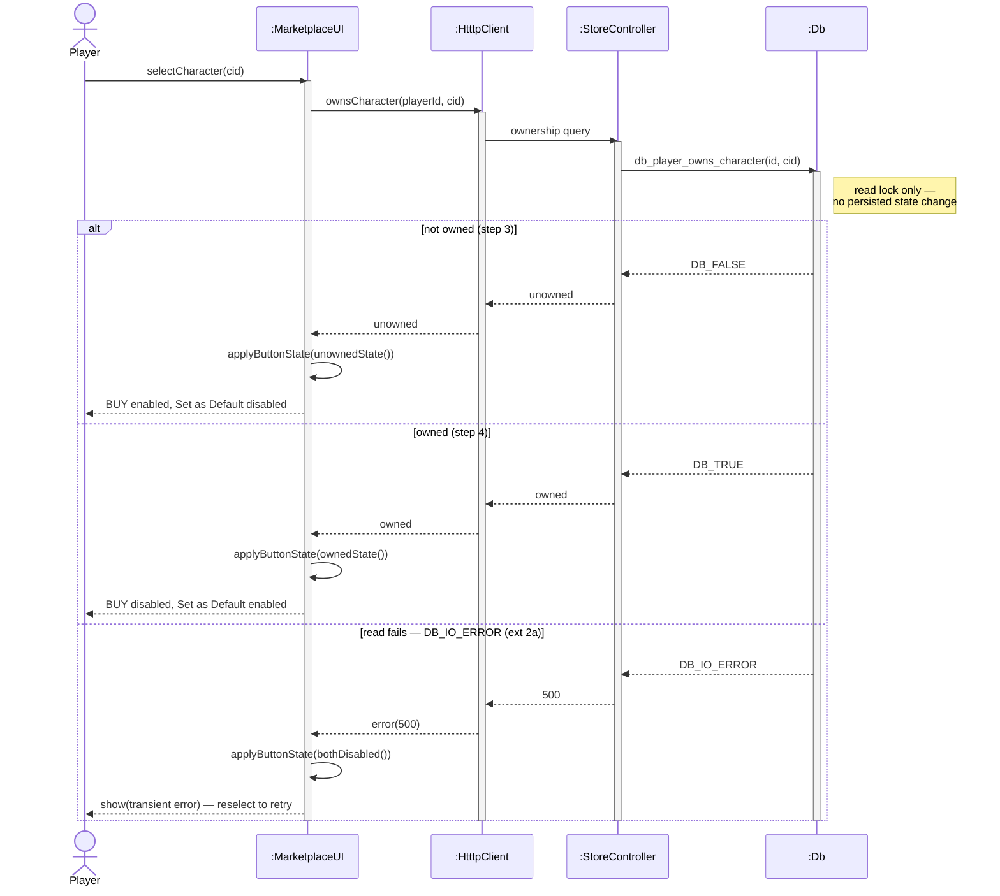
```mermaid
sequenceDiagram
    actor P as Player
    participant UI as :MarketplaceUI
    participant C as :HtttpClient
    participant SC as :StoreController
    participant DB as :Db

    P->>UI: selectCharacter(cid)
    activate UI
    UI->>C: ownsCharacter(playerId, cid)
    activate C
    C->>SC: ownership query
    activate SC
    SC->>DB: db_player_owns_character(id, cid)
    activate DB
    note right of DB: read lock only —<br/>no persisted state change

    alt not owned  (step 3)
        DB-->>SC: DB_FALSE
        SC-->>C: unowned
        C-->>UI: unowned
        UI->>UI: applyButtonState(unownedState())
        UI-->>P: BUY enabled, Set as Default disabled
    else owned  (step 4)
        DB-->>SC: DB_TRUE
        SC-->>C: owned
        C-->>UI: owned
        UI->>UI: applyButtonState(ownedState())
        UI-->>P: BUY disabled, Set as Default enabled
    else read fails — DB_IO_ERROR  (ext 2a)
        DB-->>SC: DB_IO_ERROR
        SC-->>C: 500
        C-->>UI: error(500)
        UI->>UI: applyButtonState(bothDisabled())
        UI-->>P: show(transient error) — reselect to retry
    end

    deactivate DB
    deactivate SC
    deactivate C
    deactivate UI
```

---

## SD UC-16 — Buy Theme (includes UC-16a, UC-17)

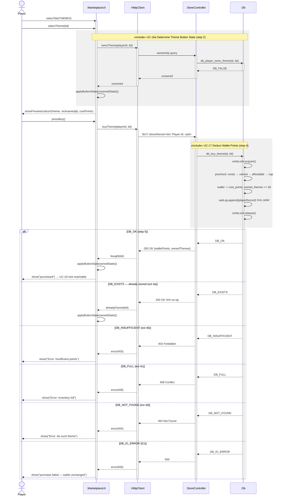
```mermaid
sequenceDiagram
    actor P as Player
    participant UI as :MarketplaceUI
    participant C as :HtttpClient
    participant SC as :StoreController
    participant DB as :Db

    P->>UI: selectTab(THEMES)
    activate UI
    P->>UI: selectTheme(tid)

    rect rgb(240, 240, 240)
        note over UI,DB: «include» UC-16a Determine Theme Button State  (step 2)
        UI->>C: ownsTheme(playerId, tid)
        activate C
        C->>SC: ownership query
        activate SC
        SC->>DB: db_player_owns_theme(id, tid)
        activate DB
        DB-->>SC: DB_FALSE
        deactivate DB
        SC-->>C: unowned
        deactivate SC
        C-->>UI: unowned
        deactivate C
        UI->>UI: applyButtonState(unownedState())
    end

    UI-->>P: showPreview(colourScheme, nickname/pfp, costPoints)

    P->>UI: pressBuy()
    UI->>C: buyTheme(playerId, tid)
    activate C
    C->>SC: BUY /store/theme/<tid>  Player-Id: <pid>
    activate SC

    rect rgb(240, 240, 240)
        note over SC,DB: «include» UC-17 Deduct Wallet Points  (step 4)
        SC->>DB: db_buy_theme(id, tid)
        activate DB
        DB->>DB: writeLock.acquire()
        DB->>DB: precheck: exists → owned → affordable → cap
        DB->>DB: wallet -= cost_points, owned_themes += tid
        DB->>DB: walLog.append(playerRecord)  %% LWW
        DB->>DB: writeLock.release()
    end

    alt DB_OK  (step 5)
        DB-->>SC: DB_OK
        SC-->>C: 200 OK {walletPoints, ownedThemes}
        C-->>UI: bought(tid)
        UI->>UI: applyButtonState(ownedState())
        UI-->>P: show("purchased") → UC-19 now reachable
    else DB_EXISTS — already owned  (ext 4a)
        DB-->>SC: DB_EXISTS
        SC-->>C: 200 OK  %% no-op
        C-->>UI: alreadyOwned(tid)
        UI->>UI: applyButtonState(ownedState())
    else DB_INSUFFICIENT  (ext 4b)
        DB-->>SC: DB_INSUFFICIENT
        SC-->>C: 403 Forbidden
        C-->>UI: error(403)
        UI-->>P: show("Error: Insufficient points")
    else DB_FULL  (ext 4c)
        DB-->>SC: DB_FULL
        SC-->>C: 409 Conflict
        C-->>UI: error(409)
        UI-->>P: show("Error: Inventory full")
    else DB_NOT_FOUND  (ext 4d)
        DB-->>SC: DB_NOT_FOUND
        SC-->>C: 404 Not Found
        C-->>UI: error(404)
        UI-->>P: show("Error: No such theme")
    else DB_IO_ERROR  (E1)
        DB-->>SC: DB_IO_ERROR
        SC-->>C: 500
        C-->>UI: error(500)
        UI-->>P: show("purchase failed — wallet unchanged")
    end

    deactivate DB
    deactivate SC
    deactivate C
    deactivate UI
```

---

## SD UC-16a — Determine Theme Button State

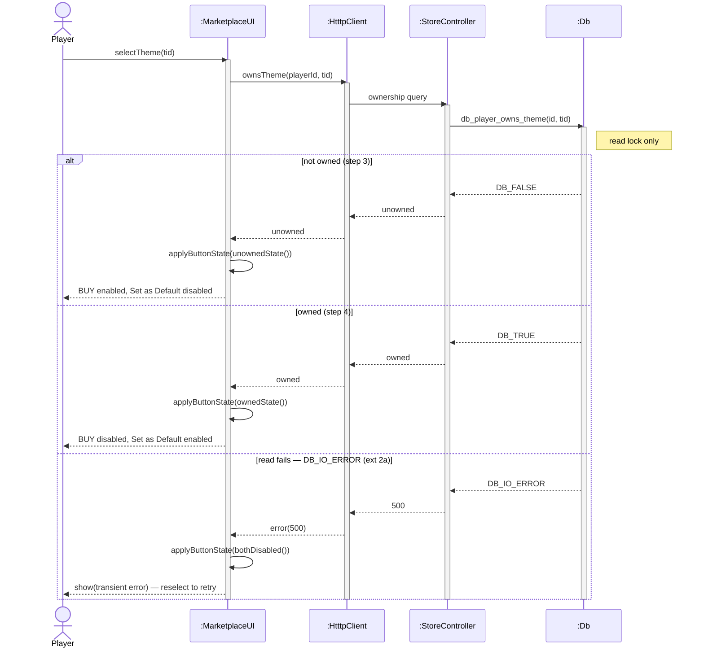
```mermaid
sequenceDiagram
    actor P as Player
    participant UI as :MarketplaceUI
    participant C as :HtttpClient
    participant SC as :StoreController
    participant DB as :Db

    P->>UI: selectTheme(tid)
    activate UI
    UI->>C: ownsTheme(playerId, tid)
    activate C
    C->>SC: ownership query
    activate SC
    SC->>DB: db_player_owns_theme(id, tid)
    activate DB
    note right of DB: read lock only

    alt not owned  (step 3)
        DB-->>SC: DB_FALSE
        SC-->>C: unowned
        C-->>UI: unowned
        UI->>UI: applyButtonState(unownedState())
        UI-->>P: BUY enabled, Set as Default disabled
    else owned  (step 4)
        DB-->>SC: DB_TRUE
        SC-->>C: owned
        C-->>UI: owned
        UI->>UI: applyButtonState(ownedState())
        UI-->>P: BUY disabled, Set as Default enabled
    else read fails — DB_IO_ERROR  (ext 2a)
        DB-->>SC: DB_IO_ERROR
        SC-->>C: 500
        C-->>UI: error(500)
        UI->>UI: applyButtonState(bothDisabled())
        UI-->>P: show(transient error) — reselect to retry
    end

    deactivate DB
    deactivate SC
    deactivate C
    deactivate UI
```

---

## SD UC-17 — Deduct Wallet Points

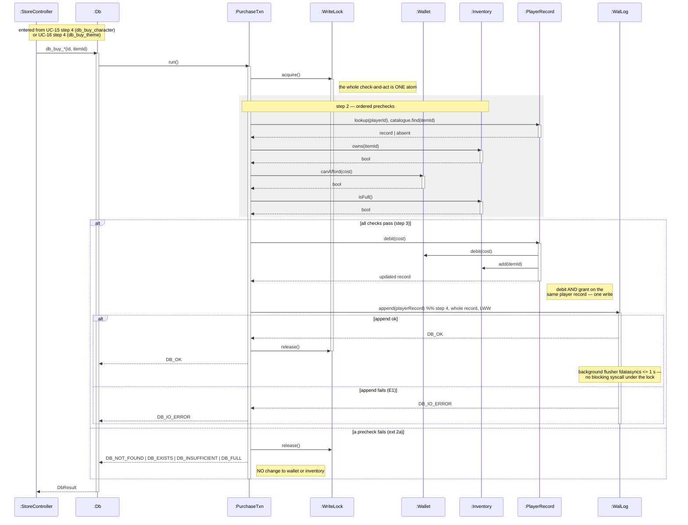
```mermaid
sequenceDiagram
    participant SC as :StoreController
    participant DB as :Db
    participant TX as :PurchaseTxn
    participant L as :WriteLock
    participant W as :Wallet
    participant I as :Inventory
    participant R as :PlayerRecord
    participant LOG as :WalLog

    note over SC,DB: entered from UC-15 step 4 (db_buy_character)<br/>or UC-16 step 4 (db_buy_theme)

    SC->>DB: db_buy_*(id, itemId)
    activate DB
    DB->>TX: run()
    activate TX

    TX->>L: acquire()
    activate L
    note right of L: the whole check-and-act is ONE atom

    rect rgb(240, 240, 240)
        note over TX,I: step 2 — ordered prechecks
        TX->>R: lookup(playerId), catalogue.find(itemId)
        activate R
        R-->>TX: record | absent
        deactivate R
        TX->>I: owns(itemId)
        activate I
        I-->>TX: bool
        deactivate I
        TX->>W: canAfford(cost)
        activate W
        W-->>TX: bool
        deactivate W
        TX->>I: isFull()
        activate I
        I-->>TX: bool
        deactivate I
    end

    alt all checks pass  (step 3)
        TX->>R: debit(cost)
        activate R
        R->>W: debit(cost)
        R->>I: add(itemId)
        R-->>TX: updated record
        deactivate R
        note right of R: debit AND grant on the<br/>same player record — one write

        TX->>LOG: append(playerRecord)  %% step 4, whole record, LWW
        activate LOG
        alt append ok
            LOG-->>TX: DB_OK
            TX->>L: release()
            deactivate L
            TX-->>DB: DB_OK
            note over LOG: background flusher fdatasyncs <= 1 s —<br/>no blocking syscall under the lock
        else append fails  (E1)
            LOG-->>TX: DB_IO_ERROR
            TX-->>DB: DB_IO_ERROR
        end
        deactivate LOG
    else a precheck fails  (ext 2a)
        TX->>L: release()
        TX-->>DB: DB_NOT_FOUND | DB_EXISTS | DB_INSUFFICIENT | DB_FULL
        note right of TX: NO change to wallet or inventory
    end

    deactivate TX
    DB-->>SC: DbResult
    deactivate DB
```

---

## SD UC-18 — Set Default Character

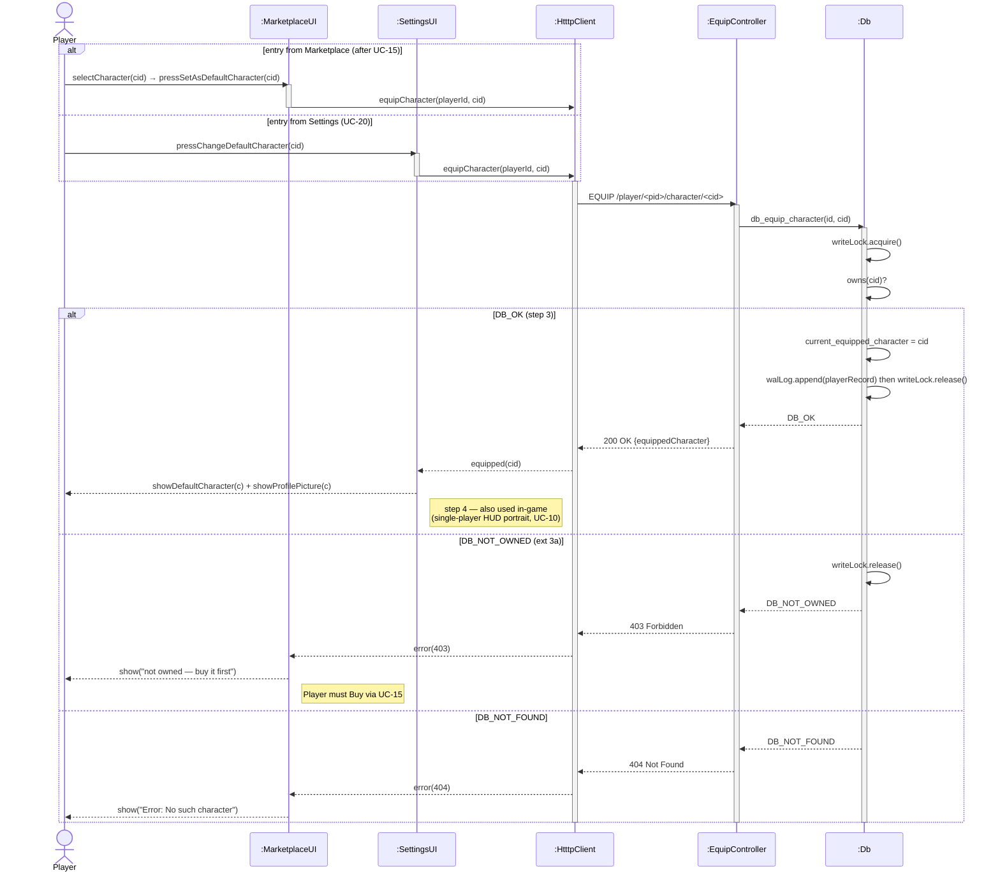
```mermaid
sequenceDiagram
    actor P as Player
    participant MU as :MarketplaceUI
    participant SU as :SettingsUI
    participant C as :HtttpClient
    participant EC as :EquipController
    participant DB as :Db

    alt entry from Marketplace  (after UC-15)
        P->>MU: selectCharacter(cid) → pressSetAsDefaultCharacter(cid)
        activate MU
        MU->>C: equipCharacter(playerId, cid)
        deactivate MU
    else entry from Settings  (UC-20)
        P->>SU: pressChangeDefaultCharacter(cid)
        activate SU
        SU->>C: equipCharacter(playerId, cid)
        deactivate SU
    end

    activate C
    C->>EC: EQUIP /player/<pid>/character/<cid>
    activate EC
    EC->>DB: db_equip_character(id, cid)
    activate DB
    DB->>DB: writeLock.acquire()
    DB->>DB: owns(cid)?

    alt DB_OK  (step 3)
        DB->>DB: current_equipped_character = cid
        DB->>DB: walLog.append(playerRecord) then writeLock.release()
        DB-->>EC: DB_OK
        EC-->>C: 200 OK {equippedCharacter}
        C-->>SU: equipped(cid)
        SU-->>P: showDefaultCharacter(c) + showProfilePicture(c)
        note right of SU: step 4 — also used in-game<br/>(single-player HUD portrait, UC-10)
    else DB_NOT_OWNED  (ext 3a)
        DB->>DB: writeLock.release()
        DB-->>EC: DB_NOT_OWNED
        EC-->>C: 403 Forbidden
        C-->>MU: error(403)
        MU-->>P: show("not owned — buy it first")
        note right of MU: Player must Buy via UC-15
    else DB_NOT_FOUND
        DB-->>EC: DB_NOT_FOUND
        EC-->>C: 404 Not Found
        C-->>MU: error(404)
        MU-->>P: show("Error: No such character")
    end

    deactivate DB
    deactivate EC
    deactivate C
```

---

## SD UC-19 — Set Default Theme

```mermaid
sequenceDiagram
    actor P as Player
    participant MU as :MarketplaceUI
    participant SU as :SettingsUI
    participant GU as :GameplayUI
    participant C as :HtttpClient
    participant EC as :EquipController
    participant DB as :Db

    alt entry from Marketplace  (after UC-16)
        P->>MU: selectTheme(tid) → pressSetAsDefaultTheme(tid)
        activate MU
        MU->>C: equipTheme(playerId, tid)
        deactivate MU
    else entry from Settings  (UC-20)
        P->>SU: pressChangeDefaultTheme(tid)
        activate SU
        SU->>C: equipTheme(playerId, tid)
        deactivate SU
    end

    activate C
    C->>EC: EQUIP /player/<pid>/theme/<tid>
    activate EC
    EC->>DB: db_equip_theme(id, tid)
    activate DB
    DB->>DB: writeLock.acquire()
    DB->>DB: owns(tid)?

    alt DB_OK  (step 3)
        DB->>DB: current_equipped_theme = tid
        DB->>DB: walLog.append(playerRecord) then writeLock.release()
        DB-->>EC: DB_OK
        EC-->>C: 200 OK {equippedTheme}
        C-->>SU: equipped(tid)
        SU-->>P: showCurrentTheme(t)
        note right of SU: step 4 — Settings reflects it now
        opt next game start  (UC-10 / UC-11 / UC-12)
            C->>GU: applyTheme(theme.palette())
            GU-->>P: board + UI adopt the colour scheme
        end
    else DB_NOT_OWNED  (ext 3a)
        DB->>DB: writeLock.release()
        DB-->>EC: DB_NOT_OWNED
        EC-->>C: 403 Forbidden
        C-->>MU: error(403)
        MU-->>P: show("not owned — buy it first")
        note right of MU: Player must Buy via UC-16
    else DB_NOT_FOUND
        DB-->>EC: DB_NOT_FOUND
        EC-->>C: 404 Not Found
        C-->>MU: error(404)
        MU-->>P: show("Error: No such theme")
    end

    deactivate DB
    deactivate EC
    deactivate C
```

---

---

## SD UC-20 — View Settings / Profile

```mermaid
sequenceDiagram
    actor P as Player
    participant UI as :SettingsUI
    participant C as :HtttpClient
    participant PC as :ProfileController
    participant DB as :Db

    P->>UI: openSettings()  (step 1)
    activate UI
    UI->>C: profile(playerId)
    activate C
    C->>PC: PROFILE /player/<pid>
    activate PC

    PC->>DB: db_get_player(id, &player)
    activate DB
    DB->>DB: readLock.acquire() → read → release()
    DB-->>PC: DB_OK {player}
    PC->>DB: db_rank(id, &rank)
    DB->>DB: readLock.acquire() → skipList.position(id) → release()
    DB-->>PC: DB_OK {rank}

    loop each owned character / theme id  (step 3)
        PC->>DB: db_get_character(cid) / db_get_theme(tid)
        DB-->>PC: Character | Theme  (borrowed pointer)
    end
    deactivate DB

    alt DB_OK  (step 3)
        PC->>PC: assemble(player, rank) → ProfileView
        PC-->>C: 200 OK {ProfileView}
        C-->>UI: profileView
        UI-->>P: render(v) — username, pfp, default character,<br/>character list, current theme, theme list,<br/>wallet points, score, rank
    else DB_IO_ERROR  (E1)
        DB-->>PC: DB_IO_ERROR
        PC-->>C: 500 Internal Server Error
        C-->>UI: error(500)
        UI-->>P: show("could not load profile")
    end

    deactivate PC
    deactivate C

    opt ext 3a — Change Default Character
        P->>UI: pressChangeDefaultCharacter(cid)
        note over UI: → UC-18 Set Default Character
    end
    opt ext 3b — Change Default Theme
        P->>UI: pressChangeDefaultTheme(tid)
        note over UI: → UC-19 Set Default Theme
    end
    deactivate UI
```

---

## SD UC-21 — View Leaderboard

```mermaid
sequenceDiagram
    actor P as Player
    participant UI as :LeaderboardUI
    participant C as :HtttpClient
    participant LC as :LeaderboardController
    participant DB as :Db
    participant SL as :SkipList

    P->>UI: openLeaderboard()  (step 1)
    activate UI
    UI->>C: leaderboard(cap = 10)
    activate C
    C->>LC: LEADERBOARD /leaderboard
    activate LC

    LC->>DB: db_leaderboard(out, 10, &count)
    activate DB
    DB->>DB: readLock.acquire()
    DB->>SL: topN(10)
    activate SL
    SL-->>DB: entries descending by (score, id)
    deactivate SL
    DB->>DB: readLock.release()

    alt DB_OK  (step 2)
        DB-->>LC: DB_OK {entries, count}
        LC->>LC: rank = position + 1 per row
        LC-->>C: 200 OK {RankEntry[count]}
        C-->>UI: entries
        UI-->>P: renderPodium(1st, 2nd, 3rd)  (step 3)
        UI-->>P: renderList(ranks 4-10 with points)
    else DB_IO_ERROR  (ext 2a)
        DB-->>LC: DB_IO_ERROR
        LC-->>C: 500 Internal Server Error
        C-->>UI: error(500)
        UI-->>P: show("ranking temporarily unavailable")
    end

    deactivate DB
    deactivate LC
    deactivate C
    deactivate UI
```

---

---

## SD UC-22 — Query Server Status

```mermaid
sequenceDiagram
    actor A as Administrator
    participant CLI as :tetrisctl
    participant CS as :CtlSocket
    participant LT as :CtlListenerThread
    participant D as :tetrisd

    A->>CLI: status()
    activate CLI
    CLI->>CS: connect()
    activate CS

    alt control socket reachable
        CS->>LT: STATUS /admin HTTTP/1.0
        activate LT
        LT->>D: gather snapshot
        activate D
        D-->>LT: StatusSnapshot
        deactivate D
        LT->>LT: log(query, "admin")
        LT-->>CS: 200 OK + body
        deactivate LT
        CS-->>CLI: StatusSnapshot
        CLI-->>A: prints snapshot, exits
    else socket missing/unreachable  (ext 2a)
        CS-->>CLI: connect failed
        CLI-->>A: "daemon not running / cannot reach control plane", exit non-zero
    end

    deactivate CS
    deactivate CLI
```

---

## SD UC-23 — Graceful Shutdown

```mermaid
sequenceDiagram
    actor A as Administrator
    participant CLI as :tetrisctl
    participant CS as :CtlSocket
    participant LT as :CtlListenerThread
    participant D as :tetrisd
    participant LOGD as :tetrislogd
    participant DB as :Db
    participant F as :Flusher

    A->>CLI: shutdown()
    activate CLI
    CLI->>CS: connect() + send(SHUTDOWN /admin)
    activate CS
    CS->>LT: SHUTDOWN /admin HTTTP/1.0
    activate LT
    note right of CLI: tetrisctl blocks until teardown completes,<br/>may take several seconds if a game is mid-play (ext 4a)

    LT->>D: initiate shutdown sequence
    activate D
    D->>D: stopAccepting() then stopTickers()

    alt game mid-play  (ext 4a)
        D->>D: terminate room, show 10s countdown
        note right of D: no db_record_game for unfinished games
    end

    D->>D: endInFlightRooms()
    D->>LOGD: flushLogsToLogd(pending records)
    activate LOGD
    LOGD-->>D: ack
    deactivate LOGD

    D->>DB: db_close()
    activate DB
    DB->>F: stop()
    F-->>DB:
    DB-->>D: closed
    deactivate DB

    D->>D: log(shutdown event)
    D->>D: freeResources() → close control socket
    D-->>LT: shutdown complete
    deactivate D
    LT-->>CS: 200 OK
    deactivate LT
    CS-->>CLI: 200 OK
    deactivate CS
    CLI-->>A: prints "server shut down", exits
    deactivate CLI
```

---

## SD UC-24 — Kick Player (includes UC-07a)

```mermaid
sequenceDiagram
    actor A as Administrator
    participant CLI as :tetrisctl
    participant CS as :CtlSocket
    participant LT as :CtlListenerThread
    participant D as :tetrisd
    participant S as :Session
    participant R as :Room

    A->>CLI: kick(playerId)
    activate CLI
    CLI->>CS: connect() + send(KICK /admin/player/<pid>)
    activate CS
    CS->>LT: KICK /admin/player/<pid> HTTTP/1.0
    activate LT
    LT->>D: findSession(pid)
    activate D

    alt session found  (step 2)
        D-->>LT: Session
        LT->>S: close()
        activate S
        S-->>LT: closed
        deactivate S
        LT->>R: release(playerId)
        activate R
        R->>R: slot READY → LEAVING → WAITING

        opt kicked player was Owner
            note over R: «include» UC-07a Transfer Room Ownership
            R->>R: selectSuccessor()
            R->>R: successor.setRole(OWNER)
        end

        R->>R: recomputeStatus()
        R->>R: broadcast(update)
        R->>R: narrate("PLAYER kicked")
        deactivate R
        LT->>LT: log(kick event, "admin")
        LT-->>CS: 200 OK
        CS-->>CLI: 200 OK
        CLI-->>A: prints result, exits
    else player not found / already gone  (ext 2a)
        D-->>LT: absent
        deactivate D
        LT-->>CS: 404 Not Found
        CS-->>CLI: 404
        CLI-->>A: "no such connected player" — no change
    end

    deactivate LT
    deactivate CS
    deactivate CLI
```

---

## SD UC-25 — List Rooms

```mermaid
sequenceDiagram
    actor A as Administrator
    participant CLI as :tetrisctl
    participant CS as :CtlSocket
    participant LT as :CtlListenerThread
    participant D as :tetrisd
    participant L as :Lobby

    A->>CLI: rooms()
    activate CLI
    CLI->>CS: connect() + send(ROOMS /admin)
    activate CS
    CS->>LT: ROOMS /admin HTTTP/1.0
    activate LT
    LT->>D: acquireRoomDirLock()
    activate D
    LT->>L: listAllRooms()
    activate L

    alt rooms exist
        L-->>LT: RoomSnapshot[]
    else no open rooms  (ext 2a)
        L-->>LT: []
    end

    deactivate L
    LT->>D: releaseRoomDirLock()
    deactivate D
    LT->>LT: log(query, "admin")
    LT-->>CS: 200 OK + room list
    deactivate LT
    CS-->>CLI: room list
    deactivate CS
    CLI-->>A: prints list, exits
    deactivate CLI
```

---

## SD UC-26 — List Players

```mermaid
sequenceDiagram
    actor A as Administrator
    participant CLI as :tetrisctl
    participant CS as :CtlSocket
    participant LT as :CtlListenerThread
    participant D as :tetrisd
    participant ST as :SessionTable

    A->>CLI: players()
    activate CLI
    CLI->>CS: connect() + send(PLAYERS /admin)
    activate CS
    CS->>LT: PLAYERS /admin HTTTP/1.0
    activate LT
    LT->>D: acquireSessionLock()
    activate D
    LT->>ST: listConnected()
    activate ST

    alt players connected
        ST-->>LT: PlayerSnapshot[]
    else no one connected  (ext 2a)
        ST-->>LT: []
    end

    deactivate ST
    LT->>D: releaseSessionLock()
    deactivate D
    LT->>LT: log(query, "admin")
    LT-->>CS: 200 OK + player list
    deactivate LT
    CS-->>CLI: player list
    deactivate CS
    CLI-->>A: prints list, exits
    note right of CLI: list feeds the <player> argument for UC-24
    deactivate CLI
```

---

## SD UC-27 — Query Dropped Logs

```mermaid
sequenceDiagram
    actor A as Administrator
    participant CLI as :tetrisctl
    participant CS as :CtlSocket
    participant LT as :CtlListenerThread
    participant D as :tetrisd
    participant IPC as :LogIpcChannel
    participant LOGD as :tetrislogd

    A->>CLI: droppedLogs()
    activate CLI
    CLI->>CS: connect() + send(DROPPED-LOGS /admin)
    activate CS
    CS->>LT: DROPPED-LOGS /admin HTTTP/1.0
    activate LT
    LT->>D: getLocalDropCount()
    activate D
    D-->>LT: tetrisdLocalDropped
    deactivate D
    LT->>IPC: queryDroppedCount()
    activate IPC
    IPC->>LOGD: IPC request

    alt tetrislogd reachable  (step 3)
        activate LOGD
        LOGD-->>IPC: droppedRecords
        deactivate LOGD
        IPC-->>LT: logdDropped
        LT->>LT: assemble DroppedLogCount.total()
        LT->>LT: log(query, "admin")
        LT-->>CS: 200 OK + counts
        CS-->>CLI: counts
        CLI-->>A: prints counts, exits
    else tetrislogd unreachable  (E1)
        IPC-->>LT: no response
        LT-->>CS: 500
        CS-->>CLI: 500
        CLI-->>A: "logger unreachable"
    end

    deactivate IPC
    deactivate LT
    deactivate CS
    deactivate CLI
```
