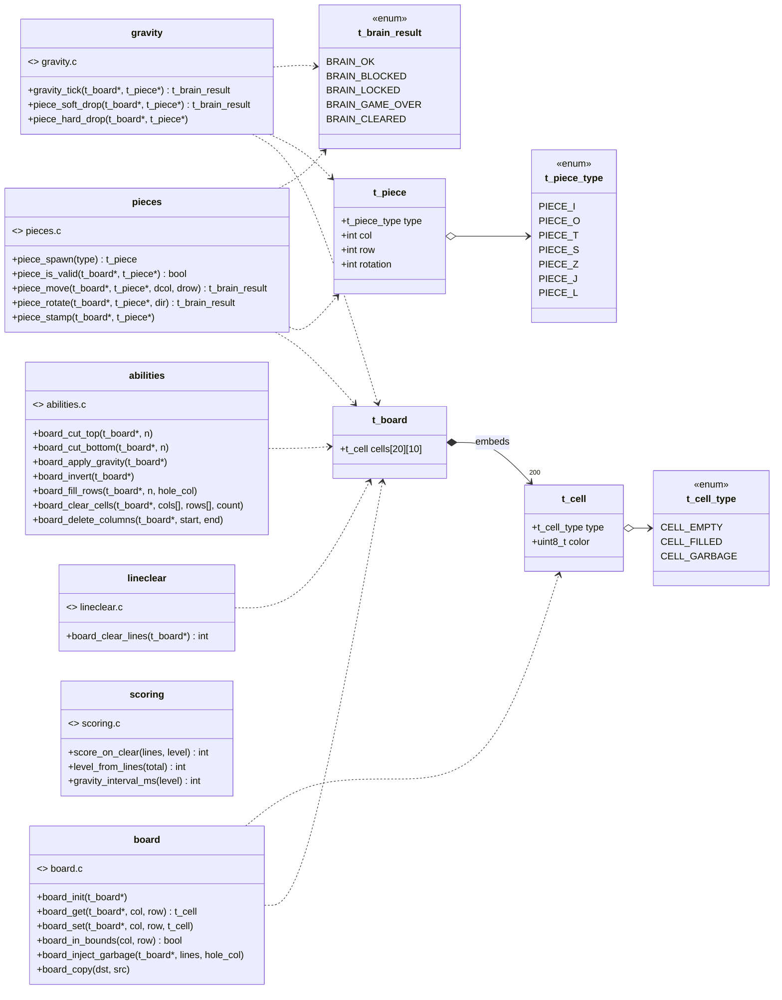
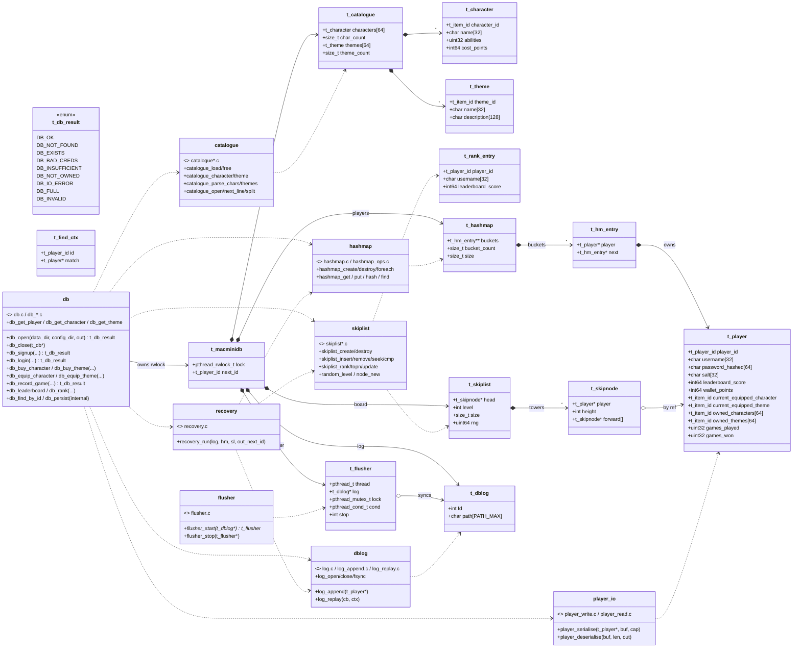
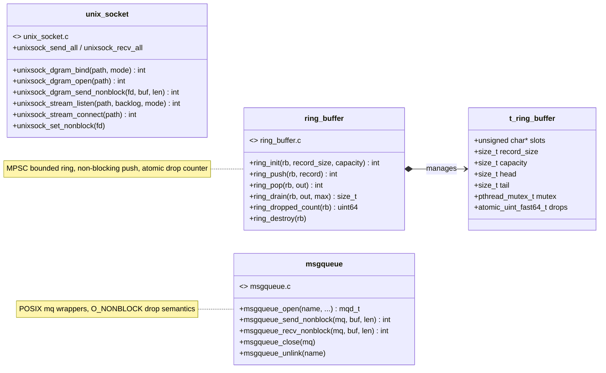
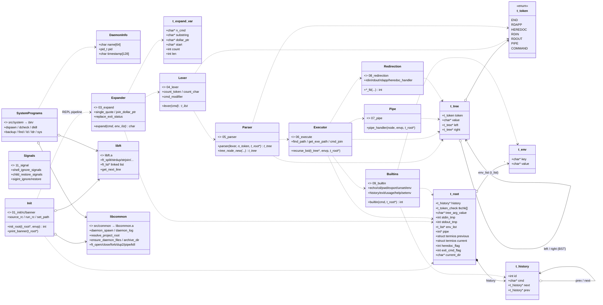
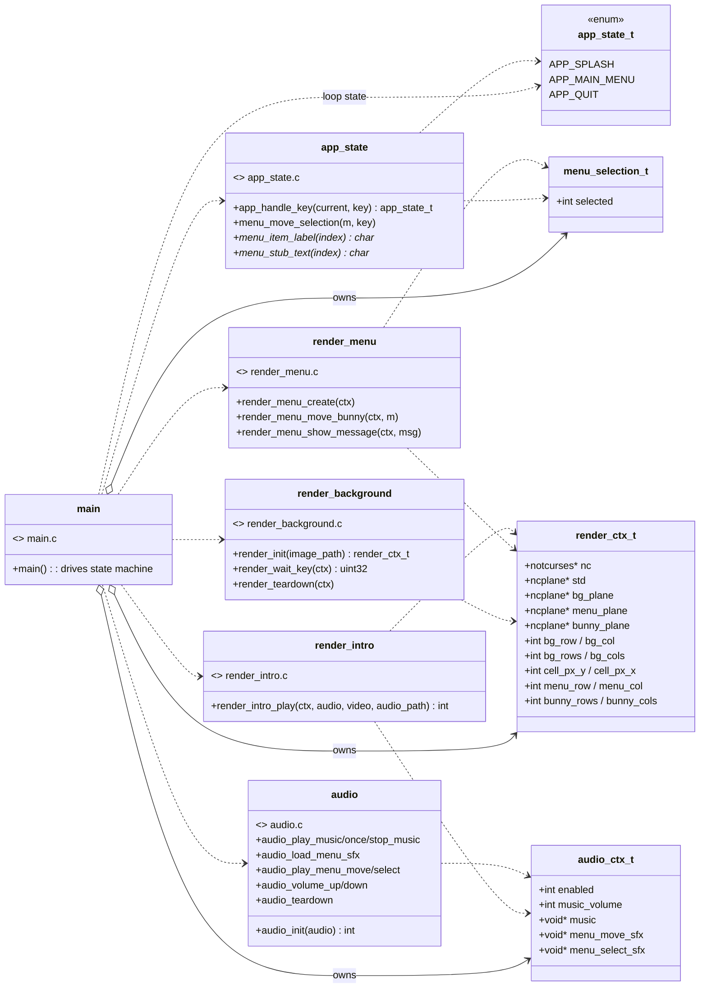
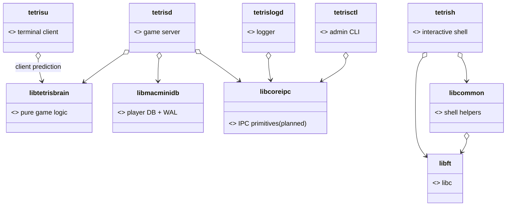

# tetriSH — Class Diagrams

C has no classes, so each diagram models the code as UML classes using a consistent convention:

- **structs** → classes with their fields as attributes.
- **`.c` modules** with no owning struct → classes stereotyped `«module»` whose "methods" are their public functions (grouped by the source file that implements them).
- **enums** → classes stereotyped `«enum»`.
- Relationships: 
    - `*-->` composition (owns/embeds)
    - `o-->` aggregation (references, does not own)
    - `..>` dependency (uses/produces)
    - `--|>` realization (module implements header API).

Diagrams cover every library (`lib/*`) and every source tree (`src/*`).

Rendered PNGs live alongside this file in [`docs/img/`](img/).

---

## 1. `libtetrisbrain` — pure game logic

---

## 2. `libmacminidb` — in-memory player DB (WAL + hashmap + skiplist)

---

## 3. `libcoreipc` — IPC primitives *(planned — no code yet)*

---

## 4. `src/tetrish` — secure interactive shell (REPL pipeline)

---

## 5. `src/tetrisu` — terminal client (notcurses UI)

---

## 6. System-level composition (who links what)

