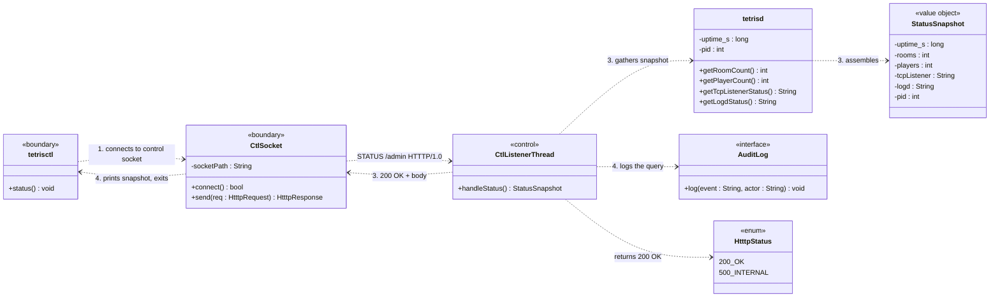
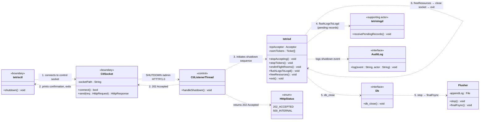
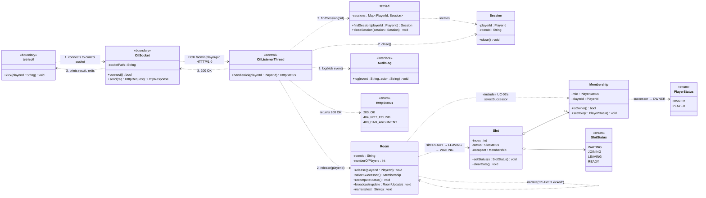
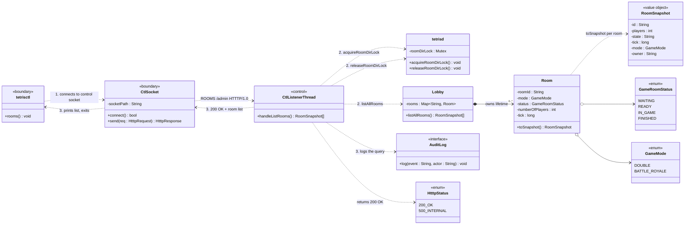
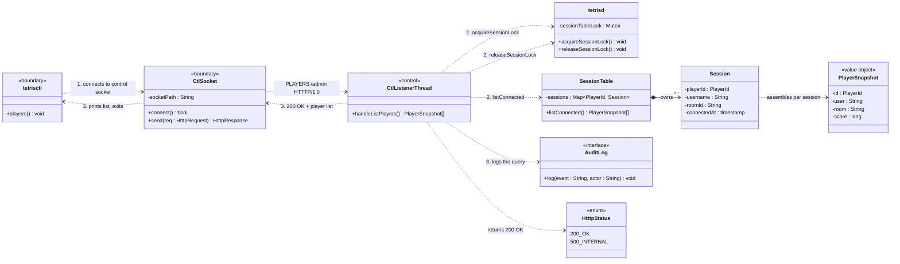
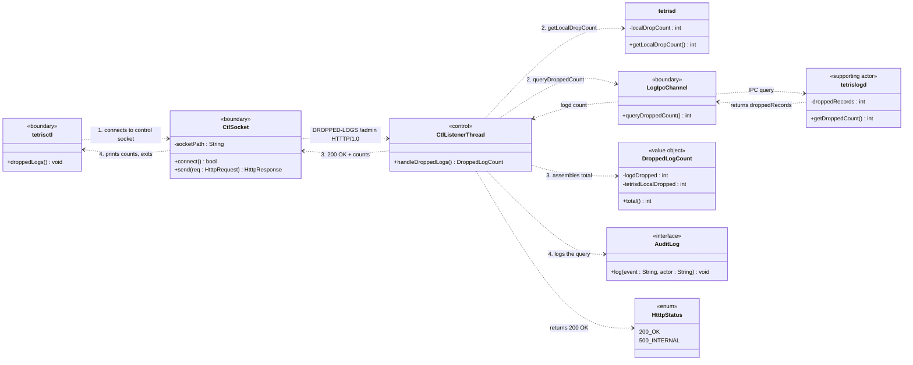

# tetriSH — Use Case Diagrams: Administration (`tetrisctl`)

Individual use case diagrams for each `tetrisctl` control-plane operation. Each diagram shows the actors, system boundary, and the specific use case with its relationships.

---

## Table of Contents

- [UC-22 — Query Server Status](#uc-22--query-server-status)
- [UC-23 — Graceful Shutdown](#uc-23--graceful-shutdown)
- [UC-24 — Kick Player](#uc-24--kick-player)
- [UC-25 — List Rooms](#uc-25--list-rooms)
- [UC-26 — List Players](#uc-26--list-players)
- [UC-27 — Query Dropped Logs](#uc-27--query-dropped-logs)

---

## UC-22 — Query Server Status



**Actors & roles**

| Actor | Role |
|---|---|
| Administrator | Primary — runs `tetrisctl status` |
| tetrisd | Supporting — provides runtime snapshot |

**Wire exchange**

```
STATUS /admin HTTTP/1.0        →  control socket
HTTTP/1.0 200 OK               ←  {"uptime_s":…,"rooms":…,"players":…,"tcp_listener":"up","logd":"connected","pid":…}
```

---

## UC-23 — Graceful Shutdown



**Actors & roles**

| Actor | Role |
|---|---|
| Administrator | Primary — runs `tetrisctl shutdown` |
| tetrisd | Supporting — executes the graceful shutdown sequence |
| tetrislogd | Supporting — receives flushed log records before exit |
| DB (libmacminidb) | Supporting — performs final fsync via `db_close` |

**Wire exchange**

```
SHUTDOWN /admin HTTTP/1.0      →  control socket
HTTTP/1.0 202 Accepted         ←  {"shutting_down":true}
                                   (daemon then exits)
```

---

## UC-24 — Kick Player



**Actors & roles**

| Actor | Role |
|---|---|
| Administrator | Primary — runs `tetrisctl kick <player>` |
| tetrisd | Supporting — closes session, updates room |

**Relationships**

| Relationship | Target |
|---|---|
| `«include»` | UC-07a Transfer Room Ownership (if kicked player is Owner) |

**Wire exchange**

```
KICK /admin/player/p17 HTTTP/1.0  →  control socket
{"reason":"admin"}
HTTTP/1.0 200 OK                   ←  (empty body)
```

---

## UC-25 — List Rooms



**Actors & roles**

| Actor | Role |
|---|---|
| Administrator | Primary — runs `tetrisctl rooms` |
| tetrisd | Supporting — provides the in-memory room directory (same data as UC-03 but via control plane) |

**Wire exchange**

```
GET /admin/rooms HTTTP/1.0     →  control socket
HTTTP/1.0 200 OK               ←  {"rooms":[{"id":"main","players":4,"state":"RUNNING","tick":48124},…]}
```

---

## UC-26 — List Players



**Actors & roles**

| Actor | Role |
|---|---|
| Administrator | Primary — runs `tetrisctl players` |
| tetrisd | Supporting — provides the connection/session table |

**Relationships**

| Relationship | Target |
|---|---|
| provides targets for | UC-24 Kick Player (the `<player>` argument) |

**Wire exchange**

```
GET /admin/players HTTTP/1.0   →  control socket
HTTTP/1.0 200 OK               ←  {"players":[{"id":"p17","user":"alice","room":"main","score":9100},…]}
```

---

## UC-27 — Query Dropped Logs



**Actors & roles**

| Actor | Role |
|---|---|
| Administrator | Primary — runs `tetrisctl dropped-logs` |
| tetrisd | Supporting — provides its own local drop count |
| tetrislogd | Secondary — provides the logger-side dropped-records counter over IPC |

**Wire exchange**

```
GET /admin/logs/dropped HTTTP/1.0  →  control socket
HTTTP/1.0 200 OK                    ←  {"logd_dropped":152,"tetrisd_local_dropped":8}
```

**Exceptions**

| Condition | Response |
|---|---|
| `tetrislogd` unreachable | `500 Internal` — operator is told the logger is down |
