# tetriSH — Use Case Descriptions

---

## Table of Contents

- [Actors](#actors)
- [Persistence vs Runtime](#persistence-vs-runtime)
- [Request & Return Status (per use case)](#request--return-status-per-use-case)
- [Authentication](#authentication)
  - [UC-01 — Register Account](#uc-01--register-account)
  - [UC-02 — Log In](#uc-02--log-in)
- [Multiplayer Lobby & Rooms](#multiplayer-lobby--rooms)
  - [UC-03 — Browse Open Rooms](#uc-03--browse-open-rooms)
  - [UC-04 — Create Room](#uc-04--create-room)
  - [UC-05 — Join Room from List](#uc-05--join-room-from-list)
  - [UC-06 — Join Room by Room ID](#uc-06--join-room-by-room-id)
  - [UC-07 — Leave Room](#uc-07--leave-room)
  - [UC-07a — Transfer Room Ownership](#uc-07a--transfer-room-ownership-included-by-uc-07--uc-11--uc-12--uc-24)
  - [UC-08 — Start Game](#uc-08--start-game)
  - [UC-08a — Attempt to Start Game as Non-Owner (Denied)](#uc-08a--attempt-to-start-game-as-non-owner-denied)
  - [UC-09 — Chat in Room](#uc-09--chat-in-room)
- [Gameplay](#gameplay)
  - [UC-10 — Play Single-Player Game](#uc-10--play-single-player-game)
  - [UC-11 — Play Double (2-Player) Game](#uc-11--play-double-2-player-game)
  - [UC-12 — Play Battle Royale Game](#uc-12--play-battle-royale-game)
  - [UC-13 — Control Falling Piece](#uc-13--control-falling-piece-included-by-uc-101112)
  - [UC-14 — Activate Gaiden Ability](#uc-14--activate-gaiden-ability-extends-uc-11uc-12)
- [Marketplace](#marketplace)
  - [UC-15 — Buy Character](#uc-15--buy-character)
  - [UC-15a — Determine Character Button State](#uc-15a--determine-character-button-state-included-by-uc-15)
  - [UC-16 — Buy Theme](#uc-16--buy-theme)
  - [UC-16a — Determine Theme Button State](#uc-16a--determine-theme-button-state-included-by-uc-16)
  - [UC-17 — Deduct Wallet Points](#uc-17--deduct-wallet-points-included-by-uc-15uc-16)
  - [UC-18 — Set Default Character](#uc-18--set-default-character)
  - [UC-19 — Set Default Theme](#uc-19--set-default-theme)
- [Profile, Settings & Leaderboard](#profile-settings--leaderboard)
  - [UC-20 — View Settings / Profile](#uc-20--view-settings--profile)
  - [UC-21 — View Leaderboard](#uc-21--view-leaderboard)
- [Administration — `tetrisctl` Control Plane](#administration--tetrisctl-control-plane)
  - [UC-22 — Query Server Status](#uc-22--query-server-status)
  - [UC-23 — Graceful Shutdown](#uc-23--graceful-shutdown)
  - [UC-24 — Kick Player](#uc-24--kick-player)
  - [UC-25 — List Rooms](#uc-25--list-rooms)
  - [UC-26 — List Players](#uc-26--list-players)
  - [UC-27 — Query Dropped Logs](#uc-27--query-dropped-logs)
- [Summary of Relationships](#summary-of-relationships)
- [DB Mapping Summary (`libmacminidb`)](#db-mapping-summary-libmacminidb)

---

## Actors

| Actor | Description |
|---|---|
| **Guest** | An unauthenticated user. Can only register or log in. |
| **Player** | An authenticated user. Primary actor for all gameplay, marketplace, settings, and lobby use cases. |
| **Room Owner** | A specialization of Player who created a room; gains room-control use cases (Start Game). |
| **Administrator** | An operator with filesystem access to `tetrisd`'s control socket. Primary actor for all `tetrisctl` control-plane use cases (server status, shutdown, kick, list rooms/players, dropped-log queries). |
| **Game Server (tetrisd)** | Supporting actor. Server-authoritative game loop; validates moves, pushes board STATE. Holds all room/lobby/live-game state in memory. Also mediates purchases and equips (calling the persistence layer for wallet/inventory changes) and owns room chat and system narration. |
| **Logger Daemon (tetrislogd)** | Supporting actor. Separate logger process; receives log records over IPC and survives `tetrisd` restarts; tracks dropped-record counts under IPC pressure. |
| **DB** | Custom DB |


## Persistence vs Runtime

Two distinct state systems back these use cases, and their status/result codes must not be conflated:

- **Persisted state — `libmacminidb`.** Only **player, character, and theme** documents are durable.
  - *Covers:*
    - signup
    - login
    - buy
    - equip
    - post-game record
    - profile
    - leaderboard.
  - These use cases call the DB, which returns a `t_db_result`
    - `DB_OK`
    - `DB_EXISTS`
    - `DB_BAD_CREDS`
    - `DB_INSUFFICIENT`
    - `DB_NOT_OWNED`
    - `DB_NOT_FOUND`
  - The server translates that result into an HTTTP status.
- **Runtime state — tetrisd (in memory).** Rooms, the lobby directory, slot occupancy, ready/started status, live boards, and chat are **never persisted**.

| Group | Use cases | Backing store |
|---|---|---|
| **Persisted (DB)** | • UC-01 <br>• UC-02<br>• UC-15 <br>• UC-16 <br>• UC-17<br>• UC-18 <br>• UC-19<br>• UC-20 <br>• UC-21<br>• the `record_game` step of UC-10/11/12<br>• UC-14 reads catalogue/ownership | `libmacminidb` |
| **Runtime only** | • UC-03 <br>• UC-04 <br>• UC-05 <br>• UC-06<br>• UC-07 <br>• UC-08 <br>• UC-08a<br>• UC-09 <br>• UC-13<br>• the live-play loop of UC-10/11/12<br>• UC-22–UC-26<br>• UC-27 (the Dropped counter lives in `tetrisd`'s ring) | tetrisd memory |

---

## Request & Return Status (per use case)

Every use case's wire request and the status codes it can return. Two transports are in play; the **Transport** column says which:

- **HTTTP → tetrisd**
    - the fixed game protocol (`METHOD PATH HTTTP/1.0`) over the authenticated TCP session. `tetrisd` serves every client-facing method — gameplay, chat, abilities, and the marketplace/profile/leaderboard calls — over this one session.
- **tetrisctl → HTTTP → tetrisd (control socket)**
    - `tetrisctl`'s admin channel: same wire format, over a local-only Unix control socket instead of the public TCP port.

| UC | Request (wire) | Transport | Success | Error statuses |
|---|---|---|---|---|
| UC-01 Register | `SIGNUP /account` body `{username,password}` | HTTTP → tetrisd | `201` | • `409` taken<br>• `400` malformed<br>• `500` |
| UC-02 Log In | `LOGIN /session` body `{username,password}` | HTTTP → tetrisd | `200` (+`Player-Id`) | • `401` bad creds/unknown<br>• `400`<br>• `500` |
| UC-02a Connect | crypto handshake (nonce → cert → RSA-OAEP AES key) | `libtetrissh` session | session up | handshake fail → connection dropped |
| UC-03 Browse Rooms | `LIST /rooms` | HTTTP → tetrisd | `200` (room list) | `500` |
| UC-03a Refresh | `LIST /rooms` | HTTTP → tetrisd | `200` | `500` |
| UC-04 Create Room | `JOIN /room/<id>` body `Mode:` (new id) | HTTTP → tetrisd | `201` (owner) | • `400` bad mode<br>• `409` id exists<br>• `500` |
| UC-05 Join from List | `JOIN /room/<id>` | HTTTP → tetrisd | `200` | • `404` no room<br>• `409` full<br>• `409` in-game |
| UC-06 Join by ID | `JOIN /room/<id>` | HTTTP → tetrisd | `200` | • `404` no room<br>• `409` full*<br>• `409` in-game* |
| UC-07 Leave Room | `LEAVE /room/<id>` | HTTTP → tetrisd | `200` | `404` not in room |
| UC-08 Start Game | `START /room/<id>` (owner) | HTTTP → tetrisd | `200` | • `403` not owner<br>• `409` too few/started |
| UC-08a Non-owner Start | `START /room/<id>` (non-owner) | HTTTP → tetrisd | — | `403` not owner |
| UC-09 Chat | `CHAT /room/<id>` body text | HTTTP → tetrisd | `200` | • `429` rate-limited<br>• `403` muted<br>• `404` |
| UC-10 Single Player | play via UC-13; server `db_record_game` on game-over | HTTTP → tetrisd | `200` per input | `409` invalid move |
| UC-11 Double | UC-13 inputs + UC-14 ability; `STATE` pushed; server `db_record_game` **per player** on game-over | HTTTP → tetrisd | `200` per input | `409` invalid move |
| UC-12 Battle Royale | UC-13 inputs + UC-14 ability; `STATE` pushed; server `db_record_game` **per participant** on game-over | HTTTP → tetrisd | `200` per input | `409` invalid move |
| UC-13 Control Piece | `MOVE`/`ROTATE`/`DROP /room/<id>/player/<pid>` body `LEFT\|RIGHT` / `CW\|CCW` / `SOFT\|HARD` | HTTTP → tetrisd | `200` accepted | • `409` INVALID_MOVE (+authoritative pos)<br>• `400` bad body |
| — `STATE /room/<id>/player/<pid>` | server-originated push, one subject per snapshot (no client status) | HTTTP ← tetrisd | pushed | — |
| UC-15 Buy Character | `BUY /store/character/<cid>` | HTTTP → tetrisd | `200` (bought / owned no-op) | `403` insufficient • `409` inventory full • `404` no item |
| UC-16 Buy Theme | `BUY /store/theme/<tid>` | HTTTP → tetrisd | `200` (bought / owned no-op) | `403` insufficient • `409` inventory full • `404` no item |
| UC-17 Deduct Points | — internal to `db_buy_*` | — | — | — |
| UC-18 Set Default Character | `EQUIP /player/<pid>/character/<cid>` | HTTTP → tetrisd | `200` | `403` not owned • `404` |
| UC-19 Set Default Theme | `EQUIP /player/<pid>/theme/<tid>` | HTTTP → tetrisd | `200` | `403` not owned • `404` |
| UC-20 View Settings | `PROFILE /player/<pid>` (+ rank) | HTTTP → tetrisd | `200` (player doc + rank) | `500` |
| UC-14 Activate Ability | `ABILITY /room/<id>/player/<pid>` body `{ability}` | HTTTP → tetrisd | `200` applied | `403` not owned • `409` insufficient charge or otherwise ineligible |
| UC-21 View Leaderboard | `LEADERBOARD /leaderboard` (top-N) | HTTTP → tetrisd | `200` (top entries) | `500` |
| UC-22 Query Server Status | `STATUS /admin` | HTTTP → tetrisd (control) | `200` (status snapshot) | `500` |
| UC-23 Graceful Shutdown | `SHUTDOWN /admin` | HTTTP → tetrisd (control) | `200` (shutdown complete) | `500` |
| UC-24 Kick Player | `KICK /admin/player/<pid>` | HTTTP → tetrisd (control) | `200` (kicked) | • `404` no such player<br>• `400` bad argument |
| UC-25 List Rooms | `ROOMS /admin` | HTTTP → tetrisd (control) | `200` (room list) | `500` |
| UC-26 List Players | `PLAYERS /admin` | HTTTP → tetrisd (control) | `200` (player list) | `500` |
| UC-27 Query Dropped Logs | `DROPPED-LOGS /admin` | HTTTP → tetrisd (control) | `200` (dropped count) | — |

---

## Authentication

### UC-01 — Register Account

| Field | Content |
|---|---|
| **ID** | UC-01 |
| **Primary Actor** | Guest |
| **Goal** | Create a new player account so the Guest can log in and play. |
| **Preconditions** | The Sign Up page is displayed. The Guest is not authenticated. |
| **Postconditions (success)** | A new account exists with the chosen username; the Guest is routed back to the Login page. |
| **Trigger** | Guest presses **SIGN UP** on the Login page (or is on the Sign Up page). |
| **DB Mapping** | `db_signup(username, password_hashed, salt, &id)` →<br>• `DB_OK`=`201 Created`<br>• `DB_EXISTS`=`409 Conflict` (username taken)<br>Server hashes the password with a per-user salt **before** the call; the DB stores only the hash + salt. |

**Main Success Scenario**
1. Guest enters a username.
2. Guest enters a password.
3. Guest re-enters the password.
4. Guest presses **SIGN UP**.
5. System validates that both passwords match (client/server) and hashes the password with a freshly generated per-user salt.
6. System calls `db_signup(username, password_hashed, salt, &id)`.
7. On `DB_OK`, the record is created (wallet = 0 pts, starter character/theme = item `1`, no other owned items) and the Guest is routed back to the Login page.

**Extensions / Alternate Flows**
- **5a. Passwords do not match:** System shows an error; return to step 3.
- **5b. Empty required field:** System highlights the field; Guest completes it.
- **6a. Username already taken (`DB_EXISTS` → 409):** System shows "username taken"; return to step 1.

**Exceptions**
- **E1. Server unreachable:** System shows a connection error; account is not created.

**Related Use Cases**
- None.

---

### UC-02 — Log In

| Field | Content |
|---|---|
| **ID** | UC-02 |
| **Primary Actor** | Guest |
| **Goal** | Authenticate against a server and open a session as a Player. |
| **Preconditions** | The Login page is displayed. A valid account exists. |
| **Postconditions (success)** | An authenticated session is established; the Home page is displayed as a Player. |
| **Trigger** | Guest presses **LOGIN**. |
| **DB Mapping** | `db_login(username, password_hashed, &player)` →<br>• `DB_OK`=`200 OK`<br>• `DB_BAD_CREDS`=`401 Unauthorized`<br>• `DB_NOT_FOUND`=`401` (do not reveal whether the username exists)<br>Server fetches the account's stored salt with `db_get_salt(username, &salt, cap)`, hashes the entered password with it **before** the call; the DB compares hashes only.<br>`db_get_salt` returns `DB_NOT_FOUND` for an unknown username — the server must still hash against a dummy salt and return the same `401` on the same path, so neither message nor timing reveals whether the account exists. |

**Main Success Scenario**
1. Guest enters username.
2. Guest enters password.
3. Guest enters the **Server ID** of the server to connect to.
4. Guest presses **LOGIN**.
5. System connects to the specified server (`«include»` **UC-02a Connect to Server**) and performs the authenticated handshake.
6. System hashes the entered password with the account salt and calls `db_login(...)` to verify credentials.
7. On `DB_OK`, System opens a session and displays the Home page (Single Player / Multiplayer / Marketplace / Leaderboard / Setting).

**Extensions / Alternate Flows**
- **3a. No account yet:** Guest presses **SIGN UP** → UC-01 Register Account.
- **6a. Invalid credentials (`DB_BAD_CREDS` / `DB_NOT_FOUND` → 401):** System shows "invalid username or password" (identical message either way); return to step 1.

**Exceptions**
- **E1. Server ID unreachable / wrong (404 / timeout):** System shows a connection error; no session is opened.

**Related Use Cases**
- `«include»` UC-02a Connect to Server.

---

## Multiplayer Lobby & Rooms

### Runtime Status Model *(shared by UC-04 – UC-08)*

Rooms, slots, and player roles are **runtime-only** state held in `tetrisd` memory. The lobby use cases below (Create, Join, Leave, Start) each drive a set of status transitions across three enums.

**Status enums**

```
PLAYER_STATUS
{
  OWNER,
  PLAYER
} // role within a room

GAME_ROOM_STATUS
{
  WAITING,
  READY,
  IN_GAME,
  FINISHED
}

SLOT_STATUS
{
  WAITING,
  JOINING,
  LEAVING,
  READY
} // one per slot
```

**Room STATE message**
  - shown at the bottom-left of the room UI, keyed by `GAME_ROOM_STATUS`:

| Room status | STATE message |
|---|---|
| `WAITING` | `WAITING FOR OPPONENT` |
| `READY` | `READY TO START, OWNER CAN START ANYTIME` |
| `IN_GAME` | `GAME IN PROGRESS` |
| `FINISHED` | `GAME OVER, RECORDING THE RESULTS` |

**Mode generalization.** Single, Double, and Battle Royale share the *same* state machine; only the slot count and the start threshold differ:

| Mode | `slot_count` | `min_to_start` |
|---|---|---|
| Single | 1 | 1 |
| Double | 2 | 2 |
| Battle Royale | 4–99 | 4 |

- Room flips `WAITING → READY` when `number_of_players >= min_to_start` (and every occupied slot is `READY`).
- Room falls back `READY → WAITING` if `number_of_players` drops below `min_to_start`.
- In Battle Royale, a `READY` room keeps accepting joiners up to `slot_count`.
- Only *crossing* `min_to_start` changes room status. E.g.
  - BR at 5/8 dropping to 3 → `WAITING`
  - back to 4 → `READY`.

**Combined state machine**

```mermaid
stateDiagram-v2
    direction TB

    %% ================= ROOM =================
    state "ROOM" as ROOM {
        [*] --> R_WAITING
        state "WAITING<br/>(msg: WAITING FOR OPPONENT)" as R_WAITING
        state "READY<br/>(msg: READY TO START, OWNER CAN START ANYTIME)" as R_READY
        state "IN_GAME<br/>(msg: GAME IN PROGRESS)" as R_IN_GAME
        state "FINISHED<br/>(msg: GAME OVER, RECORDING THE RESULTS)" as R_FINISHED

        R_WAITING --> R_READY : players >= min
        R_READY --> R_WAITING : players below min
        R_READY --> R_IN_GAME : OWNER START
        R_IN_GAME --> R_FINISHED : game ends
        R_FINISHED --> [*] : records written
    }
    note right of ROOM
        Cross-machine coupling:
        • last slot READY & num_players >= min → ROOM.READY
        • num_players drop below min → ROOM.WAITING
          (BR: 5/8 → 3 falls back; back to 4 re-readies)
        • START is OWNER-only (PLAYER.OWNER)
        • ROOM.FINISHED clears all slots → SLOT.WAITING
    end note

    %% ================= SLOT =================
    state "SLOT (per slot)" as SLOT {
        [*] --> S_WAITING
        state "WAITING (empty)" as S_WAITING
        state "JOINING" as S_JOINING
        state "READY (occupied)" as S_READY
        state "LEAVING" as S_LEAVING

        S_WAITING --> S_JOINING : slot begins occupying
        S_JOINING --> S_READY : join complete / num_players += 1
        S_READY --> S_LEAVING : occupant leaves
        S_LEAVING --> S_WAITING : slot cleared / num_players -= 1
        S_READY --> [*] : room FINISHED / all slots cleared
    }

    %% ================= PLAYER =================
    state "PLAYER (role)" as PLAYER {
        state "OWNER (can START)" as P_OWNER
        state "PLAYER" as P_PLAYER

        [*] --> P_OWNER : created room (first occupant)
        [*] --> P_PLAYER : joined existing room

        P_PLAYER --> P_OWNER : previous owner left and promoted (player in slot 2)

        P_OWNER --> [*] : leaves room
        P_PLAYER --> [*] : leaves room
    }
```



---

### UC-03 — Browse Open Rooms

| Field | Content |
|---|---|
| **ID** | UC-03 |
| **Primary Actor** | Player |
| **Goal** | See the list of open rooms in order to choose one to join. |
| **Preconditions** | Player is authenticated and has entered the Multiplayer Lobby. |
| **Postconditions (success)** | The current list of open rooms (ID, Mode, Players, State, Owner) is displayed; Player's own username, leaderboard score, and ranking are shown in the header. |
| **Trigger** | Player selects **Multiplayer** on the Home page. |

**Main Success Scenario**
1. Player enters the Lobby.
2. System requests the current room directory from the Game Server.
3. System renders each room row:
    - ID
    - Mode (D / BR)
    - Players (e.g. 1/2, 8/8)
    - State (WAITING / IN-GAME)
    - Owner
4. System renders the header with the Player's username, leaderboard score, and ranking.

**Extensions / Alternate Flows**
- **2a. No open rooms:** System shows an empty list; Player may Create Room (UC-04) or Join by Room ID (UC-06).
- **3a. Player presses `[R]` Refresh:** → UC-03a Refresh Room List (re-runs steps 2–4).
- **3b. Player presses `[B]` Back:** System returns to the Home page.

**Exceptions**
- **E1. Server unreachable:** System shows a stale-list warning or connection error.

**Related Use Cases**
- `«include»` UC-03a Refresh Room List.
- Leads to UC-04, UC-05, UC-06.

---

### UC-04 — Create Room

| Field | Content |
|---|---|
| **ID** | UC-04 |
| **Primary Actor** | Player (becomes Room Owner) |
| **Goal** | Create a new game room in a chosen mode and become its owner. |
| **Preconditions** | Player is in the Lobby. |
| **Postconditions (success)** | •  A new room exists (server assigns a Room ID <br>• Player is the Room Owner and is placed in the room's Waiting Room.  <br>•  Room status `WAITING`, slot 1 `READY` (Owner seated), `number_of_players = 1`, STATE message `WAITING FOR OPPONENT`. |
| **Trigger** | Player presses `[C]` Create Room. |
| **Status Model** | See [Runtime Status Model](#runtime-status-model-shared-by-uc-04--uc-08). |

**Main Success Scenario**
1. System opens the **Create Room** modal.
2. System presents the mode options: `[1] Double` (2 players, default) and `[2] Battle Royale` (4–99 players).
3. Player selects a mode with `[↑/↓]`.
4. Player presses `[ENTER]` to create (`«include»` **UC-04a Select Game Mode**).
5. System sends the create/JOIN request; the Game Server:
   - marks the creating Player as `OWNER` (PLAYER_STATUS);
   - initialises the room with `slot_count` slots, each `WAITING`, and room status `WAITING`;
   - seats the Owner in slot 1: slot 1 `WAITING → JOINING → READY`, `number_of_players += 1` (→ 1);
   - since `number_of_players (1) < min_to_start`, the room stays `WAITING`;
   - returns `201 Created`.
6. System closes the modal and shows the Waiting Room with the Player in slot 1 (Owner); STATE message `WAITING FOR OPPONENT`.
7. Server narrates to the room: `PLAYER <name> joined the room <id>` / `PLAYER <name> set as owner`.

**Extensions / Alternate Flows**
- **2a. No mode selected:** Default (Double) is used.
- **3a. Player presses `[ESC]` Cancel:** Modal closes; return to Lobby, no room created.
- **5a. Owner seating fails (disconnect during join):** slot 1 → `WAITING`; with no members remaining the room is destroyed; Player returns to Lobby.

**Exceptions**
- **E1. Server rejects creation (500 / capacity):** System shows an error; return to Lobby.

**Related Use Cases**
- `«include»` UC-04a Select Game Mode.
- Leads to UC-08 Start Game, UC-07 Leave Room.

---

### UC-05 — Join Room from List

| Field | Content |
|---|---|
| **ID** | UC-05 |
| **Primary Actor** | Player |
| **Goal** | Join an existing open room selected from the lobby list. |
| **Preconditions** | • Player is in the Lobby.  <br>•  at least one room is in state WAITING with a free slot. |
| **Postconditions (success)** | •  Player occupies a `READY` slot in the room (role `PLAYER`) and is placed in its Waiting Room.  <br>• If `number_of_players` reaches `min_to_start`, the room becomes `READY` and its STATE message updates. |
| **Trigger** | Player selects a room and presses `[ENTER]` Join. |
| **Status Model** | See [Runtime Status Model](#runtime-status-model-shared-by-uc-04--uc-08). |

**Main Success Scenario**
1. Player highlights a room row using `[↑/↓]`.
2. Player presses `[ENTER]` to join.
3. System sends `JOIN /room/<id>` to the Game Server.
4. Server assigns the Player an open slot and returns `200 OK` (joining an existing room, no resource created):
   - joiner's role → `PLAYER` (PLAYER_STATUS);
   - target slot `WAITING → JOINING → READY`.
   - `number_of_players += 1`;
   - if `number_of_players >= min_to_start` (all occupied slots `READY`)
      - room `WAITING → READY`
      - STATE message → `READY TO START, OWNER CAN START ANYTIME`.
5. System displays the Waiting Room; Player's name appears in the next free slot with status "ready". Server narrates to the room: `PLAYER <name> joined the room <id>`.

**Extensions / Alternate Flows**
- **4a. Room is full (409):** System shows "room full"; return to Lobby (UC-03). (No slot enters `JOINING`.)
- **4b. Room already IN-GAME (409):** Join is refused; System suggests other open rooms; return to Lobby.
- **4c. Room no longer exists (404):** System refreshes the list; return to Lobby.
- **4d. Still below `min_to_start` (Battle Royale, e.g. 2/4):** Slot becomes `READY` but the room stays `WAITING`; STATE message stays `WAITING FOR OPPONENT`.
- **4e. Seating aborts (disconnect during join):** slot → `WAITING`; `number_of_players` unchanged; room status unchanged.

**Exceptions**
- **E1. Server unreachable:** System shows a connection error; Player stays in Lobby.

**Related Use Cases**
- Analogous to UC-06 Join Room by Room ID.

---

### UC-06 — Join Room by Room ID

| Field | Content |
|---|---|
| **ID** | UC-06 |
| **Primary Actor** | Player |
| **Goal** | Join a specific room directly by typing its Room ID (e.g. shared by a friend). |
| **Preconditions** | Player is in the Lobby and knows a valid Room ID. |
| **Postconditions (success)** | • Player occupies a `READY` slot in the target room (role `PLAYER`) and is placed in its Waiting Room.  <br>•  Status transitions are identical to UC-05 step 4. |
| **Trigger** | Player types a Room ID in the **Join By Room ID** panel and presses `[ENTER]`. |
| **Status Model** | Same as UC-05 — see [Runtime Status Model](#runtime-status-model-shared-by-uc-04--uc-08). |

**Main Success Scenario**
1. Player types a Room ID (e.g. `duel-42`) into the entry field.
2. Player presses `[ENTER]` Join.
3. System sends `JOIN /room/<id>` to the Game Server.
4. Server validates the ID and assigns an open slot, returning `200 OK` (joining an existing room, no resource created).
5. System displays the Waiting Room with the Player in a slot.

**Extensions / Alternate Flows**
- **4a. Unknown Room ID (404):** System shows "no such room"; return to step 1.
- **4b. Room full (409):** System shows "room full"; return to step 1.
- **4c. Room IN-GAME (409):** Join refused; System shows a "game already in progress" message; return to step 1.

**Exceptions**
- **E1. Server unreachable:** Connection error; Player stays in Lobby.

**Related Use Cases**
- Analogous to UC-05.

---

### UC-07 — Leave Room

| Field | Content |
|---|---|
| **ID** | UC-07 |
| **Primary Actor** | Player |
| **Goal** | Leave a waiting room and return to the Lobby. |
| **Preconditions** | Player is in a Waiting Room. |
| **Postconditions (success)** | •  Leaver's slot is `WAITING` again and their data cleared (`number_of_players -= 1`) <br>• Player is back in the Lobby.  <br>• If the Owner leaves and others remain, ownership passes to the next player in slot order before the Owner's slot is freed .<br>• if no one remains, the room is destroyed.  <br>• If `number_of_players` drops below `min_to_start`, the room falls back to `WAITING`. |
| **Trigger** | Player presses `[L]` Leave. |
| **Status Model** | See [Runtime Status Model](#runtime-status-model-shared-by-uc-04--uc-08). |

**Main Success Scenario**
1. Player presses `[L]` Leave.
2. System sends `LEAVE /room/<id>`.
3. Server frees the Player's slot and updates the room for remaining players:
   - leaver's slot → `LEAVING`, then (after data is cleared) → `WAITING`
   - `number_of_players -= 1`
   - if `number_of_players < min_to_start`
      - room → `WAITING`
      - STATE message → `WAITING FOR OPPONENT`.
4. System returns the Player to the Lobby. Server narrates to the room: `PLAYER <name> left the room <id>`.

**Extensions / Alternate Flows**
- **3a. Leaving Player is the Owner and others remain:**
    - Ownership is transferred **before** the old Owner's slot is freed → see [UC-07a](#uc-07a--transfer-room-ownership-included-by-uc-07--uc-11--uc-12--uc-24).
- **3b. Last player leaves:** Server destroys the room (ROOM_DESTROYED); all slots and player data are cleared; chat room is torn down.

**Exceptions**
- **E1. Server unreachable:** System still returns Player to Lobby locally; session reconciles on reconnect.

**Related Use Cases**
- `«include»` UC-07a Transfer Room Ownership (when the leaver is the Owner and others remain).

---

### UC-07a — Transfer Room Ownership *(included by UC-07 / UC-11 / UC-12 / UC-24)*

| Field | Content |
|---|---|
| **ID** | UC-07a |
| **Level** | Subfunction (server-internal; no direct user interaction) |
| **Primary Actor** | Server (`tetrisd`) |
| **Goal** | Hand the `OWNER` role to a remaining member when the current Owner's slot is about to be freed, so the room is never ownerless. |
| **Preconditions** | • The departing player's role is `OWNER` <br>• at least one other slot in the room is occupied <br>• the departing player's slot is `LEAVING` but not yet cleared. |
| **Postconditions (success)** | • Exactly one member holds role `OWNER` <br>• the new Owner occupies the vacated lower slot <br>• every remaining member has received the room update <br>• the old Owner's slot is `WAITING`. |
| **Trigger** | •  The Owner's slot is about to be freed — voluntary leave (UC-07) <br>• mid-game quit/disconnect (UC-11 / UC-12) <br>•  Admin kick (UC-24). |
| **Status Model** | See [Runtime Status Model](#runtime-status-model-shared-by-uc-04--uc-08). |

**Main Success Scenario**
1. Server selects the **next player in slot order** as the successor:
    - that player's role → `OWNER`
    - the successor is moved into the vacated lower slot.
2. Server broadcasts the room update (new owner) to all remaining members.
3. Server narrates to the room: `PLAYER <name> set as the owner`.
4. Server frees the old Owner's slot:
    - slot `LEAVING → WAITING`, data cleared
    - `number_of_players -= 1`.

**Extensions / Alternate Flows**
- **1a. No other occupied slots:** No transfer occurs; the room is destroyed instead → see UC-07 alt-flow 3b.
- **1b. Successor disconnects mid-transfer:** Server skips them and repeats step 1 with the next player in slot order; if none remain, fall through to 1a.
- **2a. Trigger was an admin kick:** Identical flow; narration reflects the kick rather than a voluntary leave → see UC-24.

**Exceptions**
- **E1. Broadcast fails to a member:** Transfer still commits server-side; the affected client reconciles ownership on its next `STATE` push or reconnect.

**Related Use Cases**
- Included by UC-07 Leave Room, UC-11 / UC-12 (mid-game quit), and UC-24 Kick Player.

---

### UC-08 — Start Game

| Field | Content |
|---|---|
| **ID** | UC-08 |
| **Primary Actor** | Room Owner |
| **Goal** | Begin the match for everyone in the room. |
| **Preconditions** | Actor is the Room Owner; room has enough ready players (Double: 2/2; Battle Royale: ≥ 4). |
| **Postconditions (success)** | The room transitions to IN-GAME; all members enter the corresponding gameplay screen. |
| **Trigger** | Owner presses `[S]` Start. |

**Main Success Scenario**
1. Room reaches the required player count; status shows "Ready to start".
2. Owner presses `[S]` Start.
3. System sends `START /room/<id>`.
4. Server verifies the requester is the Owner and the room meets minimum players.
5. Server transitions the room to IN-GAME and pushes the initial `STATE`.
6. All members' clients switch to the gameplay screen (Double → UC-11, Battle Royale → UC-12).

**Extensions / Alternate Flows**
- **4a. Not enough players (Battle Royale < 4):** Server refuses; status stays "Waiting for opponents — Need at least 4 players to start".
- **4b. Requester is not the Owner (403):** Start is refused → see UC-08a.

**Exceptions**
- **E1. A player disconnects during start:** Server aborts start; room returns to WAITING.

**Related Use Cases**
- Precedes UC-11 / UC-12.
- Alternate actor path UC-08a.

---

### UC-08a — Attempt to Start Game as Non-Owner (Denied)

| Field | Content |
|---|---|
| **ID** | UC-08a |
| **Primary Actor** | Player (non-owner member of the room) |
| **Goal** | A non-owner attempts to start the match; the server must reject the attempt because starting is an owner-only privilege. |
| **Preconditions** | Player is a member of a Waiting Room but is **not** the Room Owner. |
| **Postconditions (success)** | No state change: the room stays in WAITING; the requesting Player is informed that only the Owner can start; the rejection is logged. |
| **Trigger** | A non-owner Player presses `[S]` Start. |

**Main Success Scenario** *(success here = the attempt is correctly denied)*
1. Non-owner Player presses `[S]` Start.
2. Client sends `START /room/<id>`.
3. Server checks the requester's identity against the room's Owner.
4. Server determines the requester is not the Owner and returns `403 Forbidden`.
5. Server leaves the room unchanged (still WAITING) and logs the rejected attempt at warning level.
6. Client shows a "Only the room owner can start the game" message; the Player remains in the Waiting Room.

**Extensions / Alternate Flows**
- **3a. Requester is actually the Owner:** This is not this use case → proceed as UC-08.

**Exceptions**
- **E1. Server unreachable:** Client shows a connection error; no start occurs.

**Related Use Cases**
- Alternate actor path of UC-08 Start Game (same trigger, non-owner actor).

---

### UC-09 — Chat in Room

| Field | Content |
|---|---|
| **ID** | UC-09 |
| **Primary Actor** | Player |
| **Goal** | Exchange text messages with others in the same room. |
| **Preconditions** | Player is in a Waiting Room (or in-game room with chat enabled). |
| **Postconditions (success)** | The message is broadcast to all room members; it appears in the room chat. |
| **Trigger** | Player presses `[C]` Chat and submits a message. |

**Main Success Scenario**
1. Player presses `[C]` Chat.
2. Player types a message and submits it.
3. Client sends a `CHAT` message to the Game Server (tetrisd) over the authenticated session.
4. Server applies the per-session rate limit (token bucket) and broadcasts the message to the room.
5. All members (including sender) see the message; system events may also be narrated (e.g. joins, KOs).

**Extensions / Alternate Flows**
- **4a. Rate limit exceeded (429):** Message is dropped; sender sees a "slow down" notice.
- **4b. Player is muted (admin action):** Message is suppressed.

**Exceptions**
- **E1. Chat handling fails server-side:** The message is dropped and the sender is notified; gameplay is unaffected (chat delivery is best-effort and never blocks the game loop).

**Related Use Cases**
- None.

---

## Gameplay

### UC-10 — Play Single-Player Game

| Field | Content |
|---|---|
| **ID** | UC-10 |
| **Primary Actor** | Player |
| **Goal** | Play a solo Tetris game to earn points and score. |
| **Preconditions** | Player is authenticated; a default character and theme are set. |
| **Postconditions (success)** | • Final score is recorded. <br>• points earned are credited to the wallet. <br>•  leaderboard is updated if a personal best is beaten. |
| **Trigger** | Player selects **Single Player** on the Home page. |
| **DB Mapping** | Only the post-game step persists: `db_record_game(id, score_delta, points_delta, won)`. |

**Main Success Scenario**
1. System starts a single-player session and renders the board, the piece queue (next pieces), the hold column, the Player's default character portrait, and the live score.
2. System spawns falling pieces on a gravity timer.
3. Player controls pieces (`MOVE` left/right, `ROTATE` cw/ccw, `DROP` soft/hard) — `«include»` **UC-13 Control Falling Piece**.
4. System clears completed lines and updates the score.
5. Loop steps 2–4 until the board tops out (game over).
6. System shows the final score, then makes the **one** persisted call of this use case (this specific user):
    - `db_record_game(id, score_delta, points_delta, won=true)`, which updates
      - `leaderboard_score`
      - credits `wallet_points`
      - increments `games_played`
    - Leaderboard reflects the new score immediately.

**Extensions / Alternate Flows**
- **3a. Invalid move (collision, `409` runtime):** Server rejects; board keeps the authoritative position.
- **5a. Player quits mid-game:** Session ends **without** calling `db_record_game` — an abandoned game is not scored, so no points, score, or games_played change. (Only a game that reaches game-over is recorded.)

**Exceptions**
- **E1. Server disconnect:** Game ends; Server restart and game restart.

**Related Use Cases**
- `«include»` UC-13 Control Falling Piece.

---

### UC-11 — Play Double (2-Player) Game

| Field | Content |
|---|---|
| **ID** | UC-11 |
| **Primary Actor** | Player (×2) |
| **Goal** | Compete head-to-head against one opponent. |
| **Preconditions** | A Double room with 2 players has been started (UC-08). |
| **Postconditions (success)** | • Winner/loser determined.  <br>• points credited. <br>• leaderboard updated. |
| **Trigger** | The room's Start Game (UC-08) completes for a Double room. |
| **DB Mapping** | Post-game, **each** player is persisted with `db_record_game(id, score_delta, points_delta, won)` — `won=true` for the winner, `false` for the loser. |

**Main Success Scenario**
1. System renders the split screen:
    - own **Board** with piece queue and hold column on the left
    - **Opponent Board** on the right
    - both usernames with live point totals below.
2. Both Players control their pieces concurrently (`MOVE`/`ROTATE`/`DROP`).
3. Server pushes each Player's `STATE` and the opponent's board updates in real time.
4. Line clears update each Player's score; garbage/abilities may be applied per rules.
5. Game ends when one Player tops out or a win condition is met; the match **reaches game-over**, so System calls `db_record_game(...)` once per player (winner `won=true`, loser `won=false`), crediting points and updating the leaderboard.

**Extensions / Alternate Flows**
- **2a. A Player activates an equipped ability:** → UC-14 Activate Gaiden Ability (`«extend»`).
- **5a. A Player quits/disconnects mid-game:**
    - Only one Player remains, so the match ends immediately.
    - If the departing Player owns the room, ownership is transferred to the remaining Player → see [UC-07a](#uc-07a--transfer-room-ownership-included-by-uc-07--uc-11--uc-12--uc-24).
    - The **quitter is not recorded** (`db_record_game` is not called for them — an abandoned game is not scored). The remaining Player wins by default and **is** recorded (`won=true`).

**Exceptions**
- **E1. Server disconnect (whole match aborted):** No game-over is reached, so `db_record_game` is called for **no one**; handled per reconnection policy. Server restart and game restart.

**Related Use Cases**
- `«include»` UC-13.
- `«extend»` UC-14.
- `«include»` UC-07a Transfer Room Ownership (on mid-game quit by the Owner).

---

### UC-12 — Play Battle Royale Game

| Field | Content |
|---|---|
| **ID** | UC-12 |
| **Primary Actor** | Player (4–99) |
| **Goal** | Compete against many players; survive as garbage is traded across boards. |
| **Preconditions** | A Battle Royale room with ≥ 4 players has been started (UC-08). |
| **Postconditions (success)** | • Ranking/last-standing determined <br>• points credited  <br>• leaderboard updated. |
| **Trigger** | The room's Start Game (UC-08) completes for a Battle Royale room. |
| **DB Mapping** | Live play (boards, garbage routed between slots within the room) is runtime only. Post-game, **each** participant is persisted with `db_record_game(id, score_delta, points_delta, won)` — `won=true` only for the last-standing player, `won=false` for the remaining players. |

**Main Success Scenario**
1. System renders own **Board** (center) with piece queue, hold column, and live **Scores**, surrounded by grids showing other players' boards.
2. Players control pieces concurrently.
3. When a Player clears N lines (N ≥ 2) in one move, N−1 rows become garbage queued against a Target — a random other player still in the game, in the same room — and inserted at the bottom of that player's board at their next piece lock (server-routed; see [ADR-0009](adr/0009-cross-player-effects-resolve-at-piece-lock.md)).
4. Server pushes `STATE` updates for all visible boards.
5. Players are eliminated as they top out; play continues until a winner/last-standing remains.
6. At game-over, System records the final ranking and calls `db_record_game(...)` once per **participant who was still in the game at game-over** (last-standing `won=true`, others `won=false`), crediting points (line clears / KOs / win) and updating the leaderboard.

**Extensions / Alternate Flows**
- **2a. Player activates an equipped ability:**
    - UC-14 Activate Gaiden Ability (`«extend»`).
- **5a. Player is KO'd:**
    - Their board is marked eliminated; they wait out the remainder until a winner is decided, and are recorded at game-over with their finishing rank (`won=false`).
- **5b. Player quits/disconnects mid-game:**
    - Server removes them from the match; remaining players play on.
    - If the departing Player owns the room, ownership is transferred and the remaining players are notified → see [UC-07a](#uc-07a--transfer-room-ownership-included-by-uc-07--uc-11--uc-12--uc-24).
    - The quitter is **not recorded** (`db_record_game` is not called for them). Each remaining player is recorded normally at game-over.
    - **5b-i. Only one player remains:** They win by default; the match ends and they are recorded (`won=true`).

**Exceptions**
- **E1. Server disconnect (whole match aborted):** No game-over reached → `db_record_game` called for no one. Server restart and game restart.

**Related Use Cases**
- `«include»` UC-13.
- `«extend»` UC-14.
- `«include»` UC-07a Transfer Room Ownership (on mid-game quit by the Owner).

---

### UC-13 — Control Falling Piece *(included by UC-10/11/12)*

| Field | Content |
|---|---|
| **ID** | UC-13 |
| **Primary Actor** | Player |
| **Goal** | Move, rotate, and drop the active piece; the server validates each action. |
| **Preconditions** | A game is IN-GAME with an active falling piece. |
| **Postconditions (success)** | The piece is placed at a server-validated position; lines may clear. |
| **Trigger** | Player issues a movement input. |

**Main Success Scenario**
1. Player issues `MOVE LEFT/RIGHT`, `ROTATE CW/CCW`, or `DROP SOFT/HARD`.
2. Server validates the move against the authoritative board.
3. Server applies the move and pushes updated `STATE`.

**Extensions / Alternate Flows**
- **2a. Illegal move (collision):**
  - Server responds `409 INVALID_MOVE` with the authoritative position
  - client corrects to it.

**Related Use Cases**
- Included by UC-10, UC-11, UC-12.

---

### UC-14 — Activate Gaiden Ability *(extends UC-11/UC-12)*

| Field | Content |
|---|---|
| **ID** | UC-14 |
| **Primary Actor** | Player |
| **Goal** | Trigger one of the four Gaiden ability levels granted by the Player's equipped character during a multiplayer match. |
| **Preconditions** | • Player owns and has equipped the character before the game started. <br>• Player has enough ability charge from cleared lines to activate the requested ability level. |
| **Postconditions (success)** | The ability's server-enforced effect is applied; the Server narrates the event to the room. |
| **Trigger** | Player presses the ability's key during an eligible match. |
| **DB Mapping** | Read-only checks: <br><br>• `db_player_owns_character(id, cid)` (does the player own the character granting this ability) <br>• `db_get_character(cid)` to read the `abilities` bitfield. <br><br> The **effect itself is runtime** (room state), not persisted. |

**Main Success Scenario**
1. Player triggers the equipped ability.
2. Client sends the ability request (HTTTP `ABILITY`) to the Game Server (tetrisd).
3. Server validates ownership via `db_player_owns_character` and checks the `abilities` bitfield from `db_get_character` (read lock).
4. Server verifies the Player has enough line-clear charge, deducts the requested ability's cost, then enforces the corresponding effect from the ability catalogue below in room state.
5. Server emits an `ABILITY_USED` event; the Server narrates it to the room.

**Supported Character Abilities**

The four selected characters retain their complete, four-level ability sets from [Tetris Battle Gaiden](https://tetris.wiki/Tetris_Battle_Gaiden), adapted to tetriSH's line-clear meter. Every two cleared lines grant one charge. Ability levels cost 2, 4, 6, and 8 charge respectively.

| Ability level | Charge cost | Total lines cleared to earn that charge |
|---:|---:|---:|
| 1 | 2 | 4 |
| 2 | 4 | 8 |
| 3 | 6 | 12 |
| 4 | 8 | 16 |

A **Target** is the player an offensive ability lands on ([CONTEXT.md](CONTEXT.md)): Single mode has no Target and offensive abilities are unavailable there, Double implies the one other player, and Battle Royale draws one per resolution from the room's seeded random source among players still in the game. Every cross-player effect is queued against its Target and applied at that player's next piece lock ([ADR-0009](adr/0009-cross-player-effects-resolve-at-piece-lock.md)). Ability text is kept in step with [`themes.md`](themes.md), which is its source of truth.

| Character | Level | Ability | Server-enforced effect |
|---|---:|---|---|
| Halloween | 1 | Fry | Fill the bottom three rows with blocks. When the next piece locks, those rows clear and are sent to the Target. |
| Halloween | 2 | Dark | Black out the Target's field except for a small visible area below the active piece. |
| Halloween | 3 | Vampire | Transfer the Target's stored ability charge to the Player. |
| Halloween | 4 | Bomb | Destroy randomly selected blocks on the Target's field. |
| Mirurun | 1 | Mirurun | Remove the bottom four rows from the Player's field without sending them to a Target. |
| Mirurun | 2 | Inversion | Reverse the Target's controls for their next three pieces. |
| Mirurun | 3 | Pentaris | Send five garbage lines to the Target. |
| Mirurun | 4 | Sirtet | Invert every occupied row on the Target's field: empty cells become blocks and filled cells become empty cells. |
| Princess | 1 | Sol | Clear three adjacent columns from the Player's field with a steerable beam that fires automatically after three seconds. |
| Princess | 2 | Mirror | Steal the next ability activated against the Player. |
| Princess | 3 | Paralysis | Prevent the Target from rotating their next three pieces. |
| Princess | 4 | Copy | Replace the Player's field with a copy of a Target's field. |
| Wolf-man | 1 | Cut | Clear the top four rows from the Player's field. |
| Wolf-man | 2 | Nue | Prevent the Target from fast-dropping their next four pieces. |
| Wolf-man | 3 | Pals | For a limited time, incoming ordinary garbage lowers the Player's stack instead of raising it; garbage created by abilities is excluded. |
| Wolf-man | 4 | Thwack | For the Player's next four pieces, blocks above a cleared line fall, allowing incomplete lower lines to clear in the same sequence. |

**Extensions / Alternate Flows**
- **3a. Character/ability not owned (`db_player_owns_character` returns `DB_FALSE` → 403):** Request rejected; no effect.
- **4a. Insufficient line-clear charge (`409`):** Request rejected; no charge is consumed and no effect is applied.

**Related Use Cases**
- `«extend»` UC-11, UC-12.

---

## Marketplace

### UC-15 — Buy Character

| Field | Content |
|---|---|
| **ID** | UC-15 |
| **Primary Actor** | Player |
| **Goal** | Purchase a character (and its abilities) using wallet points. |
| **Preconditions** | Player is in the Marketplace (Characters tab). (Affordability and ownership are **not** preconditions — `db_buy_character` enforces them atomically and reports the outcome.) |
| **Postconditions (success)** | • On `DB_OK`: character added to `owned_characters`, wallet debited by `cost_points`, change persisted (LWW log append). <br>• On `DB_EXISTS`: no change (already owned). |
| **Trigger** | Player presses **BUY** on a selected character. |
| **DB Mapping** | `db_buy_character(id, cid)` →<br>• `DB_OK`=`200 OK` (bought)<br>• `DB_EXISTS`=`200 OK` (already owned, no-op)<br>• `DB_INSUFFICIENT`=`403 Forbidden`<br>• `DB_NOT_FOUND`=`404`<br>• `DB_FULL`=`409 Conflict` (inventory at `DB_MAX_OWNED`)<br>All checks + debit + grant run **inside the DB write lock** — check-and-act is one atom. |

**Main Success Scenario**
1. Player selects **Characters tab** and a specific character (e.g. Princess, Halloween, Wolf-man, or Mirurun).
2. System shows the preview and abilities (Ability 1, Ability 2, etc), and determines **BUY** / **Set as Default** button state (`«include»` **UC-15a Determine Character Button State**).
3. Player presses **BUY**.
4. Server calls `db_buy_character(id, cid)` (`«include»` **UC-17 Deduct Wallet Points**).
5. On `DB_OK`, System confirms the purchase, flips the **BUY** / **Set as Default** button state (`«include»` **UC-15a Determine Character Button State**).

**Extensions / Alternate Flows**
- **4a. Already owned (`DB_EXISTS` → 200, no-op):**
  - No debit, no change.
- **4b. Insufficient points (`DB_INSUFFICIENT` → 403):**
  - Refused, wallet unchanged.
  - Display error message at tetrisu: `Error: Insufficient points`.
- **4c. Inventory full (`DB_FULL` → 409)** (It won't really trigger this) **:**
  - `owned_characters_count` is at `DB_MAX_OWNED`; purchase refused, wallet unchanged.
  - Display error message at tetrisu: `Error: Inventory full`.
- **4d. Unknown character (`DB_NOT_FOUND` → 404)** (It won't really trigger this) **:**
  - Refused.
  - Display error message at tetrisu: `Error: No such character`.

**Exceptions**
- **E1. DB I/O error (`DB_IO_ERROR` → 500):**
  - Purchase fails; wallet unchanged.

**Related Use Cases**
- `«include»` UC-15a Determine Character Button State.
- `«include»` UC-17 Deduct Wallet Points.
- Enables UC-18 Set Default Character.

---

### UC-15a — Determine Character Button State *(included by UC-15)*

| Field | Content |
|---|---|
| **ID** | UC-15a |
| **Primary Actor** | Player |
| **Goal** | Reflect the Player's current ownership of the selected character in the **BUY** / **Set as Default** button state. |
| **Preconditions** | Player has selected a character in the Marketplace (Characters tab). |
| **Postconditions (success)** | **BUY** is enabled and **Set as Default** disabled if not owned, or the reverse if owned; no persisted state changes. |
| **Trigger** | Player selects/highlights a character. |
| **DB Mapping** | `db_player_owns_character(id, cid)` — read-lock read, returns `t_db_bool` (`DB_TRUE` / `DB_FALSE`).|

**Main Success Scenario**
1. Player selects/highlights a character.
2. System calls `db_player_owns_character(id, cid)`.
3. If not owned: System enables **BUY**, disables **Set as Default**.
4. If owned: System disables **BUY**, enables **Set as Default**.

**Extensions / Alternate Flows**
- **2a. Read fails (`DB_IO_ERROR`):** System defaults both buttons to disabled and shows a transient error; Player may reselect to retry.

**Related Use Cases**
- Included by UC-15 Buy Character (step 2).
- Same pattern as UC-16a for themes.

---

### UC-16 — Buy Theme

| Field | Content |
|---|---|
| **ID** | UC-16 |
| **Primary Actor** | Player |
| **Goal** | Purchase a theme (color scheme + character nickname/profile picture set) using wallet points. |
| **Preconditions** | Player is in the Marketplace (Themes tab). (Affordability and ownership are **not** preconditions — `db_buy_theme` enforces them atomically and reports the outcome.) |
| **Postconditions (success)** | On `DB_OK`: theme added to `owned_themes`, wallet debited by `cost_points`, change persisted (LWW log append). On `DB_EXISTS`: no change (already owned). |
| **Trigger** | Player presses **BUY** on a selected theme. |
| **DB Mapping** | `db_buy_theme(id, tid)` →<br>• `DB_OK`=`200 OK` (bought)<br>• `DB_EXISTS`=`200 OK` (already owned, no-op)<br>• `DB_INSUFFICIENT`=`403 Forbidden`<br>• `DB_NOT_FOUND`=`404`<br>• `DB_FULL`=`409 Conflict` (inventory at `DB_MAX_OWNED`) |

**Main Success Scenario**
1. Player selects **Themes tab** and a specific theme (e.g. Default, Design and AI, Do u wanna build a snowman, Haaland, John Cena, Claude-ing).
2. System shows the theme's color scheme and character nickname/profile-picture details, and determines **BUY** / **Set as Default** button state (`«include»` **UC-16a Determine Theme Button State**).
3. Player presses **BUY**.
4. Server calls `db_buy_theme(id, tid)` (`«include»` **UC-17 Deduct Wallet Points**).
5. On `DB_OK`, System confirms the purchase, flips the **BUY** / **Set as Default** button state (`«include»` **UC-16a Determine Theme Button State**).


**Extensions / Alternate Flows**
- **4a. Already owned (`DB_EXISTS` → 200, no-op):**
  - No debit, no change;
- **4b. Insufficient points (`DB_INSUFFICIENT` → 403):**
  - Refused, wallet unchanged.
  - Display error message at tetrisu: `Error: Insufficient points`.
- **4c. Inventory full (`DB_FULL` → 409)** (It won't really trigger this) **:**
  - `owned_themes_count` is at `DB_MAX_OWNED`
  - purchase refused, wallet unchanged.
  - Display error message at tetrisu: `Error: Inventory full`.
- **4d. Unknown theme (`DB_NOT_FOUND` → 404)** (It won't really trigger this) **:**
  - Refused.
  - Display error message at tetrisu: `Error: No such theme`.

**Exceptions**
- **E1. DB I/O error (`DB_IO_ERROR` → 500):**
  - Purchase fails; wallet unchanged.

**Related Use Cases**
- `«include»` UC-16a Determine Theme Button State.
- `«include»` UC-17.
- Enables UC-19 Set Default Theme.

---

### UC-16a — Determine Theme Button State *(included by UC-16)*

| Field | Content |
|---|---|
| **ID** | UC-16a |
| **Primary Actor** | Player |
| **Goal** | Reflect the Player's current ownership of the selected theme in the **BUY** / **Set as Default** button state. |
| **Preconditions** | Player has selected a theme in the Marketplace (Themes tab). |
| **Postconditions (success)** | **BUY** is enabled and **Set as Default** disabled if not owned, or the reverse if owned; no persisted state changes. |
| **Trigger** | Player selects/highlights a theme. |
| **DB Mapping** | `db_player_owns_theme(id, tid)` — read-lock read, returns `t_db_bool` (`DB_TRUE` / `DB_FALSE`). |

**Main Success Scenario**
1. Player selects/highlights a theme.
2. System calls `db_player_owns_theme(id, tid)`.
3. If not owned: System enables **BUY**, disables **Set as Default**.
4. If owned: System disables **BUY**, enables **Set as Default**.

**Extensions / Alternate Flows**
- **2a. Read fails (`DB_IO_ERROR`):** System defaults both buttons to disabled and shows a transient error; Player may reselect to retry.

**Related Use Cases**
- Included by UC-16 Buy Theme (step 2).
- Same pattern as UC-15a for characters.

---

### UC-17 — Deduct Wallet Points *(included by UC-15/UC-16)*

| Field | Content |
|---|---|
| **ID** | UC-17 |
| **Primary Actor** | Player (initiator); `libmacminidb` (executor) |
| **Goal** | Atomically debit the points for a purchase and add the item, in a single durable write. |
| **Preconditions** | A purchase is in progress; balance ≥ `cost_points`. |
| **Postconditions (success)** | Wallet is reduced by `cost_points` and the item added to the owned set, as one whole-record write, appended to the append-only log (LWW) and flushed within ≤ 1 s. |
| **Trigger** | `db_buy_character` / `db_buy_theme` reaches its payment step. |
| **DB Mapping** | it is the internal effect of `db_buy_*`. Executes under the DB **write lock**. |

**Main Success Scenario**
1. `db_buy_*` takes the DB write lock.
2. It checks, in order:
    - player & item exist (`DB_NOT_FOUND`)
    - not already owned (`DB_EXISTS`)
    - `wallet_points ≥ cost_points` (`DB_INSUFFICIENT`)
    - inventory below cap (`DB_FULL`).
3. All checks pass
    - it debits the wallet **and** adds the item to `owned_characters` / `owned_themes` on the same player record.
4. It appends the whole updated record to the log and releases the lock (`DB_OK`).

**Extensions / Alternate Flows**
- **2a. A precheck fails:** Returns the corresponding result (`DB_NOT_FOUND` / `DB_EXISTS` / `DB_INSUFFICIENT` / `DB_FULL`) with **no** change to wallet or inventory.

**Related Use Cases**
- Included by UC-15, UC-16.

---

### UC-18 — Set Default Character

| Field | Content |
|---|---|
| **ID** | UC-18 |
| **Primary Actor** | Player |
| **Goal** | Choose which owned character is used by default in games and as profile picture. |
| **Preconditions** | Player owns the character. |
| **Postconditions (success)** | `current_equipped_character` is updated and persisted; it appears in Settings and single-player HUD. |
| **Trigger** | Player presses **Set as Default Character** (Marketplace) or **Change Default Character** (Settings). |
| **DB Mapping** | `db_equip_character(id, cid)` →<br>• `DB_OK`=`200 OK`<br>• `DB_NOT_OWNED`=`403 Forbidden` |

**Main Success Scenario**
1. Player selects an owned character.
2. Player presses **Set as Default Character** / **Change Default Character**.
3. Server calls `db_equip_character(id, cid)`
    - on `DB_OK` the default is updated.
4. System reflects the change in Settings (Default Character, profile picture) and in-game.

**Extensions / Alternate Flows**
- **3a. Character not owned (`DB_NOT_OWNED` → 403):**
  - Rejected; Player must Buy (UC-15) first.

**Related Use Cases**
- Reachable from Marketplace and Settings (same use case, two entry points).

---

### UC-19 — Set Default Theme

| Field | Content |
|---|---|
| **ID** | UC-19 |
| **Primary Actor** | Player |
| **Goal** | Choose which owned theme is applied by default. |
| **Preconditions** | Player owns the theme. |
| **Postconditions (success)** | `current_equipped_theme` is updated and persisted; the board and UI adopt its color scheme at game start. |
| **Trigger** | Player presses **Set as Default Theme** (Marketplace) or **Change Default Theme** (Settings). |
| **DB Mapping** | `db_equip_theme(id, tid)` →<br>• `DB_OK`=`200 OK`<br>• `DB_NOT_OWNED`=`403 Forbidden` |

**Main Success Scenario**
1. Player selects an owned theme.
2. Player presses **Set as Default Theme** / **Change Default Theme**.
3. Server calls `db_equip_theme(id, tid)`
   - on `DB_OK` the current theme is updated.
4. System reflects the change in Settings (Current Theme) and loads it on the next game start.

**Extensions / Alternate Flows**
- **3a. Theme not owned (`DB_NOT_OWNED` → 403):**
  - Rejected; Player must Buy (UC-16) first.

**Related Use Cases**
- Reachable from Marketplace and Settings.

---

## Profile, Settings & Leaderboard

### UC-20 — View Settings / Profile

| Field | Content |
|---|---|
| **ID** | UC-20 |
| **Primary Actor** | Player |
| **Goal** | Review account and profile information in one place. |
| **Preconditions** | Player is authenticated. |
| **Postconditions (success)** | System displays username, profile picture, default character, owned character list, current theme, owned theme list, wallet points, leaderboard score, and leaderboard ranking. |
| **Trigger** | Player selects **Setting** on the Home page. |
| **DB Mapping** | `db_get_player(id, &player)` (profile, wallet, equipped, owned lists) + `db_rank(id, &rank)` (1-based rank). |

**Main Success Scenario**
1. Player opens Settings.
2. Server reads the profile with `db_get_player(id, ...)` and the rank with `db_rank(id, ...)`.
3. System displays:
    - Username
    - profile picture of current default character, - Default Character (+ Change btn)
    - Character List (with current default marked), - Current Theme (+ Change btn)
    - Theme List (with current marked)
    - Wallet Points
    - Leaderboard Scores
    - Leaderboard Ranking.

**Extensions / Alternate Flows**
- **3a. Player presses Change Default Character:** → UC-18.
- **3b. Player presses Change Default Theme:** → UC-19.

**Related Use Cases**
- Leads to UC-18, UC-19.

---

### UC-21 — View Leaderboard

| Field | Content |
|---|---|
| **ID** | UC-21 |
| **Primary Actor** | Player |
| **Goal** | See the global ranking of players by points. |
| **Preconditions** | Player is authenticated. |
| **Postconditions (success)** | The leaderboard is displayed (podium for top 3, list for ranks 4–10, each with points). |
| **Trigger** | Player selects **Leaderboard** on the Home page. |
| **DB Mapping** | `db_leaderboard(out, cap=10, &count)` — top-N by `(score, id)` straight off the skip list; per-row rank is positional. Read-lock read. |

**Main Success Scenario**
1. Player opens the Leaderboard.
2. Server calls `db_leaderboard(out, 10, &count)`, reading the top entries from the skip list under a read lock.
3. System renders the top-3 podium (1st, 2nd, 3rd with names and points) and the ranked list for positions 4–10 with points.

**Extensions / Alternate Flows**
- **2a. Ranking unavailable:** System shows a "temporarily unavailable" message.

**Related Use Cases**
- None.

---

## Administration — `tetrisctl` Control Plane

**Transport**

- Unix domain socket, path from `.tetrishrc` — local-only, not the public TCP game port.
- Served by `tetrisd`'s dedicated `ctl_listener_thread`, separate from the public TCP accept loop, so admin control stays responsive even if the game port is flooded (e.g. `tetrisctl shutdown` still works under load).
- Client is `tetrisctl`, a separate binary from the player-facing game client.
- AuthZ is by filesystem permissions on the socket, not `Player-Id`/session-based.
- Every admin action is timestamped and forwarded to `tetrislogd`.

**Wire format**

- Fixed to HTTTP — same protocol as the public game traffic, not a bespoke admin format.
- Same `libhtttp` parses/serializes both `tetrisctl` requests and `tetrisd` responses.
- Same HTTTP status code set, no separate admin-specific codes.

---

### UC-22 — Query Server Status

| Field | Content |
|---|---|
| **ID** | UC-22 |
| **Primary Actor** | Administrator |
| **Goal** | Retrieve a health/status snapshot of the running daemon. |
| **Preconditions** | `tetrisd` is running; the control socket exists and the operator can reach it. |
| **Postconditions (success)** | A status snapshot (uptime, room count, player/connection count, tick rate, health) is returned to the operator; the query is logged. No server state changes. |
| **Trigger** | Operator runs `tetrisctl status`. |
| **Request** | `STATUS /admin HTTTP/1.0` over the control socket (control IPC, local). |
| **Return** | • `200 OK` + status body<br>• `500` internal error |

**Main Success Scenario**
1. Operator runs `tetrisctl status`.
2. `tetrisctl` connects to the control socket and sends `STATUS /admin`.
3. `ctl_listener_thread` gathers a snapshot (uptime, rooms, players/connections, tick rate) and replies `200 OK` with the body.
4. `tetrisctl` prints the snapshot and exits; the action is logged.

**Extensions / Alternate Flows**
- **2a. Control socket missing/unreachable:** `tetrisctl` prints "daemon not running / cannot reach control plane" and exits non-zero (no `tetrisd` response).

**Related Use Cases**
- None.

**Example**

```
GET /admin/status HTTTP/1.0
Host: tetrish.local
Client: tetrisctl
```

```
HTTTP/1.0 200 OK
Date: Tue, 21 Jul 2026 09:14:02 GMT
Content-Type: application/json
Content-Length: 97

{"uptime_s":8412,"rooms":3,"players":7,"tcp_listener":"up","logd":"connected","pid":4123}
```

---

### UC-23 — Graceful Shutdown

| Field | Content |
|---|---|
| **ID** | UC-23 |
| **Primary Actor** | Administrator |
| **Goal** | Stop `tetrisd` cleanly without data loss, even under load. |
| **Preconditions** | `tetrisd` is running. |
| **Postconditions (success)** | Daemon stops accepting new connections, drains in-flight work, **flushes persistence (`db_close` → final fsync)** and log records, closes the control socket, and exits. |
| **Trigger** | Operator runs `tetrisctl shutdown`. |
| **Request** | `SHUTDOWN /admin HTTTP/1.0` over the control socket (equivalently triggers the same path as `SIGTERM`). `tetrisctl` blocks on the response — it does not return control until `tetrisd` has finished tearing down. |
| **Return** | • `200 OK` (shutdown complete, daemon has exited)<br>• `500` |

**Main Success Scenario**
1. Operator runs `tetrisctl shutdown` (works even while the public TCP port is flooded, because the control listener is a separate thread).
2. `tetrisctl` sends `SHUTDOWN /admin` and blocks, awaiting a response.
3. `tetrisd` stops accepting new TCP connections and stops room tickers.
4. In-flight rooms are ended/notified; pending log records are shipped to `tetrislogd`.
5. Persistence is closed cleanly: `db_close` stops the flusher and performs a **final fsync** of the append-only player log.
6. `tetrisd` frees resources; the control listener replies `200 OK`, then `tetrisd` closes the control socket and exits.
7. `tetrisctl` receives `200 OK`, prints confirmation that the server has shut down, and exits.

**Extensions / Alternate Flows**
- **4a. A game is mid-play:** terminate it, on tetrisu show countdown timer for `server shutting down in 10s`; **no `db_record_game` for unfinished games** (consistent with UC-10/11/12 quit rule).

**Related Use Cases**
- None.

**Example**

```
SHUTDOWN /admin HTTTP/1.0
Host: tetrish.local
Client: tetrisctl
```

```
HTTTP/1.0 200 OK
Date: Tue, 21 Jul 2026 09:15:44 GMT
Content-Type: application/json
Content-Length: 18

{"shutdown":true}
```

---

### UC-24 — Kick Player 

| Field | Content |
|---|---|
| **ID** | UC-24  |
| **Primary Actor** | Administrator |
| **Goal** | Forcibly disconnect a player and update their room. |
| **Preconditions** | `tetrisd` is running; target player is connected. |
| **Postconditions (success)** | The player's session is closed, their slot in any room is freed (ownership transfers per UC-07a if they owned the room), the room update is broadcast, and the action is logged. |
| **Trigger** | Operator runs `tetrisctl kick <player>`. |
| **Request** | `KICK /admin/player/<pid> HTTTP/1.0` over the control socket. |
| **Return** | • `200 OK` (kicked)<br>• `404` no such connected player<br>• `400` bad argument |

**Main Success Scenario**
1. Operator runs `tetrisctl kick <player>`.
2. `tetrisd` locates the player's session, closes it, frees their room slot, and (if they were Room Owner) transfers ownership and broadcasts the room update → see [UC-07a](#uc-07a--transfer-room-ownership-included-by-uc-07--uc-11--uc-12--uc-24).
3. `tetrisd` replies `200 OK`; the action is logged.

**Extensions / Alternate Flows**
- **2a. Player not found / already gone (`404`):** No change; operator informed.

**Related Use Cases**
- `«include»` UC-07a Transfer Room Ownership.

**Example**

```
KICK /admin/player/p17 HTTTP/1.0
Host: tetrish.local
Client: tetrisctl
Content-Type: application/tetris-command
Content-Length: 19

{"reason":"admin"}
```

```
HTTTP/1.0 200 OK
Date: Tue, 21 Jul 2026 09:17:02 GMT
Content-Length: 0
```

---

### UC-25 — List Rooms 

| Field | Content |
|---|---|
| **ID** | UC-25  |
| **Primary Actor** | Administrator |
| **Goal** | Get a live snapshot of all rooms on the running daemon. |
| **Preconditions** | `tetrisd` is running. |
| **Postconditions (success)** | The current room directory is returned (id, mode, players, state, owner); no state changes; the query is logged. |
| **Trigger** | Operator runs `tetrisctl rooms`. |
| **Request** | `ROOMS /admin HTTTP/1.0` over the control socket. |
| **Return** | • `200 OK` + room list<br>• `500` |

**Main Success Scenario**
1. Operator runs `tetrisctl rooms`.
2. `tetrisd` reads its in-memory room directory (under the room-directory lock) — the same runtime data the lobby shows (UC-03), but retrieved via the control plane.
3. `tetrisd` replies `200 OK` with the list; `tetrisctl` prints it; the query is logged.

**Extensions / Alternate Flows**
- **2a. No open rooms:** `200 OK` with an empty list.

**Related Use Cases**
- Same underlying data as UC-03 Browse Open Rooms (runtime, not DB).

**Example**

```
GET /admin/rooms HTTTP/1.0
Host: tetrish.local
Client: tetrisctl
```

```
HTTTP/1.0 200 OK
Date: Tue, 21 Jul 2026 09:16:10 GMT
Content-Type: application/json
Content-Length: 113

{"rooms":[{"id":"main","players":4,"state":"RUNNING","tick":48124},{"id":"lobby2","players":1,"state":"WAITING"}]}
```

---

### UC-26 — List Players 

| Field | Content |
|---|---|
| **ID** | UC-26  |
| **Primary Actor** | Administrator |
| **Goal** | List the currently connected players / sessions. |
| **Preconditions** | `tetrisd` is running. |
| **Postconditions (success)** | Connected players are returned (player id, username, current room, session/connection info); no state changes; the query is logged. |
| **Trigger** | Operator runs `tetrisctl players`. |
| **Request** | `PLAYERS /admin HTTTP/1.0` over the control socket. |
| **Return** | • `200 OK` + player list<br>• `500` |

**Main Success Scenario**
1. Operator runs `tetrisctl players`.
2. `tetrisd` reads its connection/session table (under the appropriate lock) and assembles the connected-player list.
3. `tetrisd` replies `200 OK` with the list; `tetrisctl` prints it; the query is logged.

**Extensions / Alternate Flows**
- **2a. No one connected:** `200 OK` with an empty list.

**Related Use Cases**
- Provides the `<player>` targets for UC-24 Kick Player.

**Example**

```
GET /admin/players HTTTP/1.0
Host: tetrish.local
Client: tetrisctl
```

```
HTTTP/1.0 200 OK
Date: Tue, 21 Jul 2026 09:16:31 GMT
Content-Type: application/json
Content-Length: 104

{"players":[{"id":"p17","user":"alice","room":"main","score":9100},{"id":"p18","user":"bob","room":"main"}]}
```

---

### UC-27 — Query Dropped Logs 

| Field | Content |
|---|---|
| **ID** | UC-27  |
| **Primary Actor** | Administrator |
| **Secondary Actor** | — (answered by `tetrisd` alone) |
| **Goal** | Read the Dropped counter — how many log records `tetrisd` never sent because its ring buffer was full. |
| **Preconditions** | `tetrisd` is running. |
| **Postconditions (success)** | The Dropped count is returned to the operator; no state changes; the query is logged. |
| **Trigger** | Operator runs `tetrisctl dropped-logs`. |
| **Request** | `DROPPED-LOGS /admin HTTTP/1.0` over the control socket. |
| **Return** | • `200 OK` + count |

**Main Success Scenario**
1. Operator runs `tetrisctl dropped-logs`.
2. `tetrisd` receives `DROPPED-LOGS /admin` and reads its own ring-buffer counter (`ring_dropped_count`).
3. `tetrisd` replies `200 OK` with the count, labelled as producer-side Dropped records.
4. `tetrisctl` prints the count; the query is logged.

**Notes**
- The log IPC channel is a one-way datagram socket, so `tetrisd` cannot query the logger over it. Dropped is a quantity only `tetrisd` can observe anyway: the record never left the ring.
- `tetrislogd` owns two *different* counters — Rejected (arrived malformed) and Degraded (valid, sink unavailable, written to stderr). They are not Dropped records and must not be added to this total. Until `tetrisctl` gains a control channel to the logger, they surface in the log file itself at boot, on rotation, on `SIGUSR1`, and at shutdown.
- The state of the logger does not affect this response: `tetrisd` falls back to stderr when the logger is absent, so there is no "logger unreachable" failure to report here.

**Related Use Cases**
- Targets `tetrisd`'s log path, not tetrisd game state or the DB.

**Example**

```
GET /admin/logs/dropped HTTTP/1.0
Host: tetrish.local
Client: tetrisctl
```

```
HTTTP/1.0 200 OK
Date: Tue, 21 Jul 2026 09:19:05 GMT
Content-Type: application/json
Content-Length: 44

{"logd_dropped":152,"tetrisd_local_dropped":8}
```

---

## Summary of Relationships

| Base Use Case | Relationship | Target |
|---|---|---|
| UC-02 Log In | `«include»` | UC-02a Connect to Server |
| UC-03 Browse Open Rooms | `«include»` | UC-03a Refresh Room List |
| UC-04 Create Room | `«include»` | UC-04a Select Game Mode |
| UC-07 Leave Room | `«include»` | UC-07a Transfer Room Ownership |
| UC-11 / UC-12 (Owner quits mid-game) | `«include»` | UC-07a Transfer Room Ownership |
| UC-08 Start Game | alternate actor path | UC-08a Attempt to Start as Non-Owner |
| UC-10/11/12 Play Game | `«include»` | UC-13 Control Falling Piece |
| UC-11/12 Play Multiplayer | `«extend»` | UC-14 Activate Gaiden Ability |
| UC-15 Buy Character | `«include»` | UC-15a Determine Character Button State |
| UC-15 Buy Character | `«include»` | UC-17 Deduct Wallet Points |
| UC-16 Buy Theme | `«include»` | UC-16a Determine Theme Button State |
| UC-16 Buy Theme | `«include»` | UC-17 Deduct Wallet Points |
| UC-20 View Settings | navigates to | UC-18 / UC-19 |
| UC-24 Kick Player | `«include»` | UC-07a Transfer Room Ownership |
| UC-25 List Rooms | same underlying data as | UC-03 Browse Open Rooms (runtime, not DB) |
| UC-26 List Players | provides targets for | UC-24 Kick Player |

## DB Mapping Summary (`libmacminidb`)

Every persisted use case, its `libmacminidb` call, and the `t_db_result → HTTTP` translation. Use cases not listed here are **runtime only** (tetrisd) and never touch the DB.

| Use case | DB call(s) | Result → HTTTP |
|---|---|---|
| UC-01 Register | `db_signup` | • `DB_OK`→201<br>• `DB_EXISTS`→409 |
| UC-02 Log In | `db_login` | • `DB_OK`→200<br>• `DB_BAD_CREDS`/`DB_NOT_FOUND`→401 |
| UC-15 Buy Character | `db_buy_character` (all checks in-lock) | • `DB_OK`→200<br>• `DB_EXISTS`→200 (no-op)<br>• `DB_INSUFFICIENT`→403<br>• `DB_FULL`→409<br>• `DB_NOT_FOUND`→404 |
| UC-15a Determine Character Button State | `db_player_owns_character` (read) | button state only, not an HTTTP endpoint |
| UC-16 Buy Theme | `db_buy_theme` (all checks in-lock) | • `DB_OK`→200<br>• `DB_EXISTS`→200 (no-op)<br>• `DB_INSUFFICIENT`→403<br>• `DB_FULL`→409<br>• `DB_NOT_FOUND`→404 |
| UC-16a Determine Theme Button State | `db_player_owns_theme` (read) | button state only, not an HTTTP endpoint |
| UC-17 Deduct Points | *internal to* `db_buy_*` (atomic, write lock) | — |
| UC-18 Set Default Character | `db_equip_character` | • `DB_OK`→200<br>• `DB_NOT_OWNED`→403 |
| UC-19 Set Default Theme | `db_equip_theme` | • `DB_OK`→200<br>• `DB_NOT_OWNED`→403 |
| UC-10/11/12 Play (post-game) | `db_record_game` once per participant **at game-over** (all three modes; **not** called on mid-game quit) | credits points, updates score, increments `games_played` (and `games_won` on a win) |
| UC-20 View Settings | `db_get_player` + `db_rank` (+ catalogue lookups) | 200 |
| UC-14 Activate Ability | `db_player_owns_character` + `db_get_character` (reads) | • valid→effect<br>• `DB_FALSE`→403 |
| UC-21 View Leaderboard | `db_leaderboard` | 200 |

**Status-code conventions used above**

| Status / result | Used for | Convention |
|---|---|---|
| `403 Forbidden` | Both authorization denials and insufficient funds: equip an unowned item (`DB_NOT_OWNED`), non-owner start (UC-08a), can't-afford a purchase (`DB_INSUFFICIENT`). | Return a distinct error **body/reason** (e.g. `"insufficient_points"` vs `"not_owned"`) so the client can tell "broke" from "not allowed" even though the status code is the same. |
| `401 Unauthorized` | Login failure. | Return the **same** response for bad password and unknown user so the endpoint doesn't leak which usernames exist. |
| `409 Conflict` | **Taken username** (`DB_EXISTS` from `db_signup`), **inventory full** (`DB_FULL` from `db_buy_*`), and runtime room-state conflicts (room full / IN-GAME). | — |
| `DB_EXISTS` (maps two ways by context) | `409` from `db_signup` vs `200` from `db_buy_*`. | Username collision is a real conflict the caller must fix (`409`); already-owned is a harmless no-op — the desired end state already holds (`200`). Same result code, different HTTP status depending on the endpoint. |
