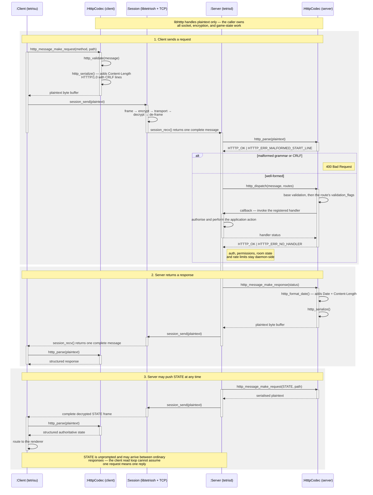

# libhtttp

`libhtttp` is the plaintext HTTTP/1.0 codec for tetriSH, sitting above `libtetrissh`. It owns structured messages, the one-shot parser, the canonical serialiser, header validation, and method dispatch.

This README carries the grammar and method table; `libstatusbody` documents the body formats.

---

## Table of Contents

- [Build And Test](#build-and-test)
- [Usage](#usage)
- [Layering](#layering)
- [Wire Grammar](#wire-grammar)
- [Method Table](#method-table)
- [Message Flow](#message-flow)
- [Headers And Bodies](#headers-and-bodies)
- [Validation](#validation)
- [Dispatch](#dispatch)
- [API Reference](#api-reference)
- [Status Mapping](#status-mapping)
- [Ownership And Thread Safety](#ownership-and-thread-safety)
- [Project Structure](#project-structure)

---

## Build And Test

```bash
make -C lib/libhtttp
make -C lib/libhtttp test
make -C lib/libhtttp test FILTER=parser
make -C lib/libhtttp memcheck
make -C lib/libhtttp clean
make -C lib/libhtttp fclean
make -C lib/libhtttp re
```

Build output is `lib/libhtttp/libhtttp.a`

```bash
cc ... -I lib/libhtttp/include lib/libhtttp/libhtttp.a
```

C11 with `-Wall -Wextra -Werror -pedantic`

---

## Usage

```c
#include "htttp.h"

t_htttp_message	message;
unsigned char	*wire;
size_t		wire_len;

/* inbound: one complete decrypted frame from session_recv() */
htttp_message_init(&message);
if (htttp_parse(frame, frame_len, &message) == HTTTP_OK
    && htttp_validate(&message, HTTTP_VALIDATE_AUTHENTICATED_REQUEST) == HTTTP_OK)
{
    htttp_dispatch(&message, routes, route_count, ctx, &handler_result);
}
htttp_message_free(&message);

/* outbound: build, serialise, hand the bytes to session_send() */
htttp_message_init(&message);
htttp_message_make_response(&message, 200, htttp_reason_phrase(200));
htttp_message_set_header(&message, "Date", date_buf);
htttp_message_set_body(&message, body, body_len);
if (htttp_serialize(&message, &wire, &wire_len) == HTTTP_OK)
{
    session_send(&sess, wire, wire_len);
    free(wire);                       /* caller owns the serialised buffer */
}
htttp_message_free(&message);
```

---

## Layering

```text
session_recv()  ->  htttp_parse()  ->  htttp_validate()  ->  htttp_dispatch()  ->  handler
handler  ->  message builders  ->  htttp_validate()  ->  htttp_serialize()  ->  session_send()
```

One `libtetrissh` frame carries exactly one complete HTTTP message. No sockets,
no encryption, no stream reassembly, no authentication, no body schemas, no
game rules.

---

## Wire Grammar

```text
REQUEST      ::= REQUEST-LINE *(HEADER CRLF) CRLF [BODY]
REQUEST-LINE ::= METHOD SP PATH SP "HTTTP/1.0" CRLF

RESPONSE     ::= STATUS-LINE *(HEADER CRLF) CRLF [BODY]
STATUS-LINE  ::= "HTTTP/1.0" SP STATUS-CODE SP REASON-PHRASE CRLF

HEADER       ::= FIELD-NAME ":" OWS FIELD-VALUE OWS
FIELD-NAME   ::= 1*(ALPHA / DIGIT / "-")
FIELD-VALUE  ::= *(HTAB / SP / VCHAR)
OWS          ::= *(SP / HTAB)
BODY         ::= exactly Content-Length opaque bytes
```

| Rule | Constraint |
|---|---|
| `METHOD` | Starts `A-Z`; later bytes `A-Z`, `0-9`, `_`, or `-` |
| `PATH` | Starts `/`, visible ASCII except spaces; meaning belongs to handlers |
| `STATUS-CODE` | Exactly three digits, `100`–`599` |
| `REASON-PHRASE` | Non-empty visible ASCII plus spaces |
| Line endings | CRLF everywhere — bare LF and stray CR are rejected |
| Header folding | Rejected, as are case-insensitive duplicate names |
| `Content-Length` | One or more decimal digits, no sign or spaces |
| Size limits | `HTTTP_MAX_MESSAGE_SIZE` (65,536 bytes), `HTTTP_MAX_HEADERS` (64) |

Input is an explicit pointer and length — no NUL terminator required.

---

## Method Table

Only `STATE` is server-originated, pushed in *request* form and arriving
between ordinary replies. Every other method is client-initiated
request/response. Auth means a non-empty `Player-Id` header.

| Method | Path | Auth | Purpose |
|---|---|:---:|---|
| `SIGNUP` | `/account` | — | Register an account |
| `LOGIN` | `/session` | — | Authenticate and bind the session |
| `LIST` | `/rooms` | ✓ | Browse open rooms |
| `JOIN` | `/room/<id>` | ✓ | Create or join a room |
| `LEAVE` | `/room/<id>` | ✓ | Leave a room |
| `START` | `/room/<id>` | ✓ | Owner starts the game |
| `CHAT` | `/room/<id>` | ✓ | Broadcast a room message |
| `MOVE` | `/room/<id>/player/<pid>` | ✓ | Translate the falling piece |
| `ROTATE` | `/room/<id>/player/<pid>` | ✓ | Rotate the falling piece |
| `DROP` | `/room/<id>/player/<pid>` | ✓ | Soft or hard drop |
| `ABILITY` | `/room/<id>/player/<pid>` | ✓ | Activate a Gaiden ability |
| `STATE` | `/room/<id>/player/<pid>` | ✓ | **Server-pushed** authoritative game state; the path names its subject |
| `BUY` | `/store/character/<cid>`, `/store/theme/<tid>` | ✓ | Purchase a catalogue item |
| `EQUIP` | `/player/<pid>/character/<cid>`, `/player/<pid>/theme/<tid>` | ✓ | Set a default character or theme |
| `PROFILE` | `/player/<pid>` | ✓ | Fetch the ProfileView body |
| `LEADERBOARD` | `/leaderboard` | ✓ | Fetch ranked rows |
| `STATUS` | `/admin` | ✓ | `tetrisctl` — server status |
| `ROOMS` | `/admin` | ✓ | `tetrisctl` — list rooms |
| `PLAYERS` | `/admin` | ✓ | `tetrisctl` — list players |
| `KICK` | `/admin/player/<pid>` | ✓ | `tetrisctl` — remove a player |
| `LOGS` | `/admin` | ✓ | `tetrisctl` — dropped-log counter |
| `SHUTDOWN` | `/admin` | ✓ | `tetrisctl` — graceful shutdown |

Valid extension methods parse without a library change — see
[Dispatch](#dispatch). A `STATE` push on the wire, escaped:

```text
STATE /room/S-01/player/7 HTTTP/1.0\r\nContent-Type: application/tetris-state\r\nContent-Length: 3\r\n\r\nabc
```

---

## Message Flow



---

## Headers And Bodies

- Names are ASCII letters, digits, and hyphens; lookup and duplicate detection
  are case-insensitive. Whitespace before `:` is rejected.
- Values are trimmed of leading and trailing SP/HTAB, embedded whitespace kept.
- Parsing splits at the **first** colon, so `Trace: room:a:join` keeps
  `room:a:join`. Unknown headers are retained.
- Bodies are opaque bytes and may contain NUL, CR, or LF.
- A non-empty body needs a decimal `Content-Length` equal to all remaining frame
  bytes; an empty body may omit it or declare `0`.
- Serialisation ignores any stored `Content-Length` and emits its own from
  `body_len`, omitting it for an empty body. That generated header counts
  against the 64-header limit, leaving a body at most 63 others.

---

## Validation

Parsing checks wire syntax; `htttp_validate()` applies contextual requirements,
without mutating the message.

| Message | Requirement |
|---|---|
| Response | RFC 1123 UTC `Date` naming a real Gregorian date whose weekday matches |
| Request with body | `Content-Type: application/tetris-command` |
| `STATE` request with body | `Content-Type: application/tetris-state` |
| Authenticated request | Non-empty `Player-Id`, when `HTTTP_VALIDATE_AUTHENTICATED_REQUEST` is set |

`SIGNUP`, `LOGIN`, the initial `JOIN`, and server-originated `STATE` omit the
authenticated-request flag. `htttp_format_date()` writes a deterministic
29-byte RFC 1123 UTC string plus NUL into `HTTTP_DATE_BUFSIZE`.

---

## Dispatch

Routing is exact and case-sensitive; the first match runs, an unknown method
returns `HTTTP_ERR_NO_HANDLER`. `htttp_dispatch()` checks the whole table, then
applies base validation, then the matched route's `validation_flags` — so a
malformed request, a body missing its `Content-Type`, or an authenticated route
with an empty `Player-Id` never reaches application code.

```c
static int handle_pause(const t_htttp_message *message, void *context)
{
    (void)message;
    (void)context;
    return (200);
}

static const t_htttp_route routes[] = {
    {"PAUSE", HTTTP_VALIDATE_AUTHENTICATED_REQUEST, handle_pause}
};

int handler_result;

if (htttp_dispatch(&message, routes, sizeof(routes) / sizeof(routes[0]),
        context, &handler_result) != HTTTP_OK) {
    /* INVALID_ARGUMENT, INVALID_MESSAGE, MISSING_REQUIRED_HEADER,
     * or NO_HANDLER — malformed requests never reach handlers. */
}
```

Adding `PAUSE` needs no library change: register a route with zero flags for a
public method or `HTTTP_VALIDATE_AUTHENTICATED_REQUEST` for a player one.

That flag only checks the header is *present*. The daemon must still compare
`Player-Id` against the player bound to the connection — `libtetrissh`
authenticates the server and the frame bytes, not the client's claimed identity.

---

## API Reference

Single public header, `include/htttp.h`. Handler signature is
`int (*)(const t_htttp_message *message, void *context)`.

### Message (`message.c`)

| Function | Description |
|---|---|
| `htttp_message_init(m)` | Reset caller storage to an empty request; NULL ignored. Free first if it still owns fields |
| `htttp_message_free(m)` | Release every owned field; NULL and repeat calls are safe |
| `htttp_message_make_request(m, method, path)` | Deep-copy a request into an empty message; failure preserves existing contents |
| `htttp_message_make_response(m, status_code, reason)` | Deep-copy a response; same failure contract |
| `htttp_message_set_header(m, name, value)` | Add or case-insensitively replace one header, trimming SP/HTAB; failure preserves all headers |
| `htttp_message_get_header(m, name)` | Borrowed value by case-insensitive name, or `NULL`; valid until the message changes |
| `htttp_message_set_body(m, body, body_len)` | Replace the body with an owned copy, `0` clears it; failure preserves the previous body |
| `htttp_reason_phrase(status_code)` | Borrowed default reason text, or `NULL` if unknown |
| `htttp_result_string(result)` | Borrowed diagnostic text, or `NULL` if unknown |

### Parser, Serialiser, Validation, Dispatch

| Function | Description |
|---|---|
| `htttp_parse(data, data_len, out)` | Parse one complete frame into an empty message; every failure leaves `out` empty |
| `htttp_serialize(m, out, out_len)` | Emit exact wire bytes, at most `HTTTP_MAX_HEADERS` including the generated `Content-Length`; caller `free()`s `*out` |
| `htttp_validate(m, flags)` | Check structure and required headers; a missing or wrong value returns `HTTTP_ERR_MISSING_REQUIRED_HEADER` |
| `htttp_format_date(timestamp, out)` | Write 29-byte RFC 1123 UTC plus NUL into `HTTTP_DATE_BUFSIZE`; failure stores an empty string |
| `htttp_dispatch(m, routes, route_count, context, handler_result)` | Validate, match, apply route flags, invoke the handler; `handler_result` is zeroed on entry and stays zero on error |

### Result Types

| Type | Values |
|---|---|
| `t_htttp_message_type` | `HTTTP_MESSAGE_REQUEST`, `HTTTP_MESSAGE_RESPONSE` |
| `t_htttp_result` | `HTTTP_OK`, `HTTTP_ERR_INVALID_ARGUMENT`, `HTTTP_ERR_TOO_LARGE`, `HTTTP_ERR_NO_MEMORY`, `HTTTP_ERR_MALFORMED_START_LINE`, `HTTTP_ERR_UNSUPPORTED_VERSION`, `HTTTP_ERR_MALFORMED_HEADER`, `HTTTP_ERR_TOO_MANY_HEADERS`, `HTTTP_ERR_DUPLICATE_HEADER`, `HTTTP_ERR_INVALID_CONTENT_LENGTH`, `HTTTP_ERR_LENGTH_MISMATCH`, `HTTTP_ERR_MISSING_REQUIRED_HEADER`, `HTTTP_ERR_INVALID_MESSAGE`, `HTTTP_ERR_NO_HANDLER` |
| `t_htttp_message` | `type`, `method`, `path`, `status_code`, `reason`, `headers`, `header_count`, `body`, `body_len` |
| `t_htttp_route` | `method`, `validation_flags`, `handler` |

| Constant | Value |
|---|---|
| `HTTTP_VERSION` | `"HTTTP/1.0"` |
| `HTTTP_MAX_MESSAGE_SIZE` | `65536` |
| `HTTTP_MAX_HEADERS` | `64` |
| `HTTTP_DATE_BUFSIZE` | `30` |
| `HTTTP_CONTENT_TYPE_COMMAND` | `"application/tetris-command"` |
| `HTTTP_CONTENT_TYPE_STATE` | `"application/tetris-state"` |
| `HTTTP_VALIDATE_AUTHENTICATED_REQUEST` | `0x01` |

---

## Status Mapping

`t_htttp_result` reports *local* codec, validation, and dispatch outcomes. The
caller maps protocol failures onto wire responses:

| Condition | Response |
|---|---|
| Malformed grammar, headers, or body length | `400 Bad Request` |
| Unknown method | `400 Bad Request` |
| Authentication failure | `401 Unauthorized` |
| Authenticated but forbidden | `403 Forbidden` |
| Missing room or player | `404 Not Found` |
| Invalid game transition | `409 Conflict` |
| Message larger than one secure frame | `413 Payload Too Large` |
| Application rate limit | `429 Too Many Requests` |
| Internal application failure | `500 Internal Server Error` |

Default reason phrases ship for `200`, `201`, `400`, `401`, `403`, `404`, `409`, `413`, `429`, and `500`. 

---

## Ownership And Thread Safety

The caller owns `t_htttp_message` storage and every successful parse or builder
result. Constructors and `htttp_parse()` require initialised, empty output;
builders deep-copy every field. A parse failure leaves the output empty.
`htttp_message_free()` releases everything and is safe to repeat.
`htttp_serialize()` returns an exact-length buffer released with `free()`.

The library keeps no parser, dispatch, transport, or global state, so
independent messages can be handled from different threads. The caller must not
concurrently mutate one message, route table, context, or handler state.

Codec calls perform no blocking IPC, but `htttp_dispatch()` invokes its handler
synchronously and inherits that handler's blocking and locking. Daemon handlers
copy state under the lock, unlock, then make any blocking syscall — no mutex is
held across network or IPC backpressure.

---

## Project Structure

```text
libhtttp/
├── include/htttp.h         Public header — the whole API
├── src/
│   ├── message.c           Message lifecycle, headers, body, reason/result text
│   ├── parser.c            One-shot frame parser
│   ├── serialiser.c        Canonical wire-byte emitter
│   ├── validation.c        Contextual header rules and RFC 1123 dates
│   └── dispatch.c          Route matching and handler invocation
├── assets/                 Sequence-diagram sources and renders
├── tests/test_*.c          Unit tests, one per module, plus fuzz and hardening
├── scripts/run_tests.sh    Formatted test runner
├── obj/                    Generated objects
└── libhtttp.a              Generated archive
```
