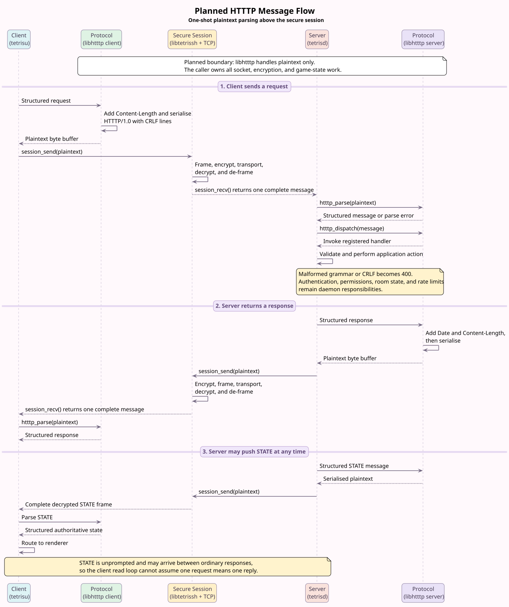

# libhtttp — Planned Design

> **Status:** planning only. `libhtttp` has not been implemented yet; the API
> names and data structures below remain design proposals.

`libhtttp` will provide the plaintext HTTTP parser, serialiser, header helpers,
status definitions, and method dispatch table. It will not open sockets or call
`session_send()` / `session_recv()`. Instead, each daemon or client will compose
it with `libtetrissh`.

## Planned Message Flow

The proposed flow is intentionally simple:

1. The sender gives `libhtttp` a structured message. The serialiser adds the
   required headers and produces an `HTTTP/1.0` plaintext buffer using `\r\n`.
2. The caller passes that buffer to `session_send()`. On the other side,
   `session_recv()` returns one complete decrypted message to the caller.
3. The caller gives the complete plaintext buffer to the one-shot parser, then
   passes the resulting structure to the dispatch table and registered handler.
4. Responses follow the same path in reverse. A server-originated `STATE` uses
   the same framing but may arrive without a matching client request.

The editable diagram source is
[`assets/libhtttp-sequence.puml`](assets/libhtttp-sequence.puml).

## Planned Boundaries

- **Plaintext only:** `libhtttp` parses and serialises bytes above the secure
  session. It has no socket or cryptographic code and no inter-library link
  dependency.
- **One-shot parser:** the normal caller supplies one complete decrypted frame.
  A proposed `HTTTP_INCOMPLETE` result remains useful as a defensive response
  when the caller passes a truncated buffer.
- **Caller-owned messages:** parsed structures and body storage belong to the
  caller; the library retains no state between calls.
- **Strict grammar:** the version literal is `HTTTP/1.0`, line endings are CRLF,
  headers split on their first colon, and body length must match
  `Content-Length`.
- **Extensible dispatch:** methods map to registered handler functions, keeping
  application rules in `tetrisd`, `tetrisu`, `chatd`, or `marketd`.

## Planned Error Ownership

| Layer | Planned responsibility |
|---|---|
| `libtetrissh` | Enforce the encrypted-frame limit and reject oversized frames with `413` |
| `libhtttp` | Detect malformed grammar, CRLF, headers, methods, and body lengths for `400` |
| Calling daemon | Decide `401`, `403`, `404`, `409`, `429`, and `500` from application state |

The exact public header, fixed array limits, ownership rules, and error-cleanup
contract must be finalised before implementation begins.
