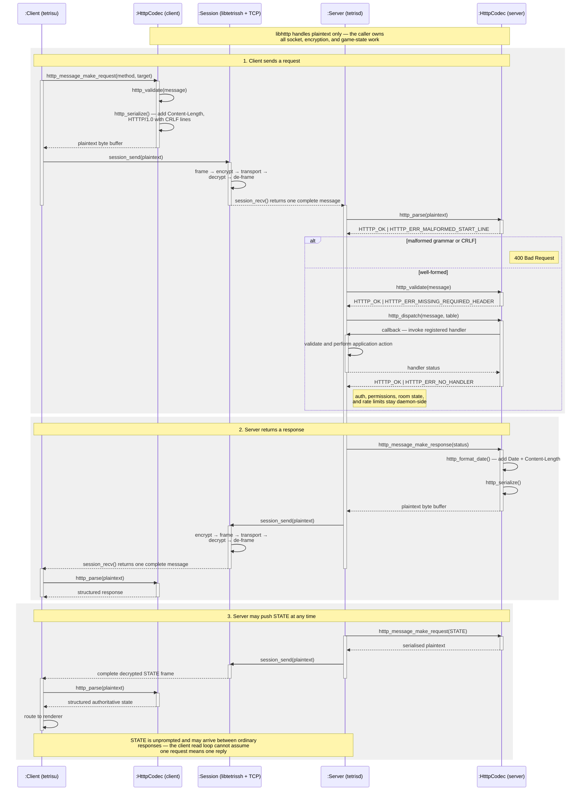

# libhtttp — Planned Message Flow

One-shot plaintext parsing above the secure session. Mermaid counterpart to
`libhtttp-sequence.puml`.

```mermaid
sequenceDiagram
    participant CU as :Client (tetrisu)
    participant CH as :HtttpCodec (client)
    participant S as :Session (libtetrissh + TCP)
    participant SD as :Server (tetrisd)
    participant SH as :HtttpCodec (server)

    note over CH,SH: libhtttp handles plaintext only — the caller owns<br/>all socket, encryption, and game-state work

    rect rgb(240, 240, 240)
        note over CU,SH: 1. Client sends a request

        CU->>CH: htttp_message_make_request(method, target)
        activate CU
        activate CH
        CH->>CH: htttp_validate(message)
        CH->>CH: htttp_serialize() — add Content-Length,<br/>HTTTP/1.0 with CRLF lines
        CH-->>CU: plaintext byte buffer
        deactivate CH

        CU->>S: session_send(plaintext)
        activate S
        S->>S: frame → encrypt → transport →<br/>decrypt → de-frame
        S-->>SD: session_recv() returns one complete message
        deactivate S
        deactivate CU

        activate SD
        SD->>SH: htttp_parse(plaintext)
        activate SH
        SH-->>SD: HTTTP_OK | HTTTP_ERR_MALFORMED_START_LINE
        deactivate SH

        alt malformed grammar or CRLF
            note right of SH: 400 Bad Request
        else well-formed
            SD->>SH: htttp_validate(message)
            activate SH
            SH-->>SD: HTTTP_OK | HTTTP_ERR_MISSING_REQUIRED_HEADER
            deactivate SH

            SD->>SH: htttp_dispatch(message, table)
            activate SH
            SH->>SD: callback — invoke registered handler
            activate SD
            SD->>SD: validate and perform application action
            SD-->>SH: handler status
            deactivate SD
            SH-->>SD: HTTTP_OK | HTTTP_ERR_NO_HANDLER
            deactivate SH
            note right of SD: auth, permissions, room state,<br/>and rate limits stay daemon-side
        end
    end

    rect rgb(240, 240, 240)
        note over CU,SH: 2. Server returns a response

        SD->>SH: htttp_message_make_response(status)
        activate SH
        SH->>SH: htttp_format_date() — add Date + Content-Length
        SH->>SH: htttp_serialize()
        SH-->>SD: plaintext byte buffer
        deactivate SH

        SD->>S: session_send(plaintext)
        activate S
        S->>S: encrypt → frame → transport →<br/>decrypt → de-frame
        S-->>CU: session_recv() returns one complete message
        deactivate S
        deactivate SD

        activate CU
        CU->>CH: htttp_parse(plaintext)
        activate CH
        CH-->>CU: structured response
        deactivate CH
        deactivate CU
    end

    rect rgb(240, 240, 240)
        note over CU,SH: 3. Server may push STATE at any time

        SD->>SH: htttp_message_make_request(STATE)
        activate SD
        activate SH
        SH-->>SD: serialised plaintext
        deactivate SH

        SD->>S: session_send(plaintext)
        activate S
        S-->>CU: complete decrypted STATE frame
        deactivate S
        deactivate SD

        activate CU
        CU->>CH: htttp_parse(plaintext)
        activate CH
        CH-->>CU: structured authoritative state
        deactivate CH
        CU->>CU: route to renderer
        deactivate CU

        note over CU,SD: STATE is unprompted and may arrive between ordinary<br/>responses — the client read loop cannot assume<br/>one request means one reply
    end
```
