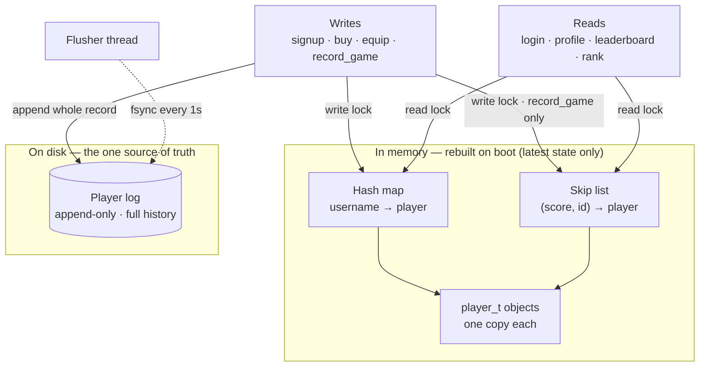
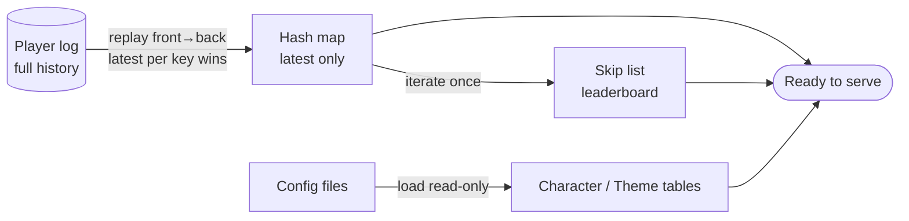

# libmacminidb

A single-node, in-memory NoSQL store for tetriSH — *NoSQLite*. Keeps player, character, and theme state in memory for fast reads and writes, durably backs every write with a Last-Writer-Wins append-only log, and rebuilds state by replaying that log on boot.

---

## Table of Contents

- [Features](#features)
- [Build](#build)
- [Using the Library](#using-the-library)
- [Data Model](#data-model)
- [API Reference](#api-reference)
- [Result Codes](#result-codes)
- [Design Constraints](#design-constraints)
- [Architecture](#architecture)
- [Boot / Recovery](#boot--recovery)
- [Project Structure](#project-structure)
- [Testing](#testing)

---

## Features

- In-memory player index: hash map (`username → player`) for point lookups, skip list (`(score, id) → player`) for the leaderboard
- Append-only player log with whole-record Last-Writer-Wins replay for crash recovery
- Background flusher thread `fdatasync`s the log every second — bounded data loss, no blocking syscall under the store's lock
- Static character and theme catalogues loaded once from `config/*.cfg` at open
- Read–write lock guarding the in-memory index; every public call takes exactly one lock
- Player, character, and theme documents fit comfortably in RAM at the ~300-user target scale

---

## Build

Build the static archive with `make`:

```bash
make -C lib/libmacminidb
```

This compiles every `.c` under `src/` and archives them into `libmacminidb.a`. Compiled with `-Wall -Wextra -Werror`; links `-lpthread` for the rwlock, condvar, and flusher thread.

Makefile targets:

| Command       | Description                                         |
|---------------|------------------------------------------------------|
| `make`        | Build `libmacminidb.a`                                |
| `make test`   | Build the archive and run the unit tests              |
| `make clean`  | Remove object files and test binaries                 |
| `make fclean` | Remove object files, test binaries, and the archive    |
| `make re`     | Full rebuild (`fclean` + `all`)                        |

---

## Using the Library

Link the archive and add its include path when compiling your own code:

```bash
gcc my_program.c lib/libmacminidb/libmacminidb.a -I lib/libmacminidb/include -lpthread -o my_program
```

Then include the single public header, open the store, and drive it through the operations:

```c
#include "macminidb.h"

t_db *db;
t_player_id id;

db_open("data/", "lib/libmacminidb/config/", &db);
db_signup(db, "amber", hashed_password, salt, &id);
db_buy_character(db, id, 2);
db_equip_character(db, id, 2);
db_record_game(db, id, /* score_delta */ 120, /* points_delta */ 50, /* won */ true);

t_rank_entry top[10];
size_t count;
db_leaderboard(db, top, 10, &count);

db_close(db);
```

---

## Data Model

| Document | Fields |
|---|---|
| **Player** | `player_id`, `username`, `password_hashed`, `salt`, `leaderboard_score`, `wallet_points`, `current_equipped_character`, `current_equipped_theme`, `owned_characters`, `owned_themes`, `games_played`, `games_won` |
| **Character** | `character_id`, `name`, `abilities` (bitfield), `cost_points` |
| **Theme** | `theme_id`, `name`, `description` |

Characters and themes are read-only catalogues loaded from `config/characters.cfg` and `config/themes.cfg` — `id | name | abilities(hex) | cost_points` and `id | name | description` respectively, `|`-separated, `#` comments and blank lines ignored. Item `1` is the free starter in both catalogues.

---

## API Reference

### Lifecycle (`db.c`)

| Function | Description |
|---|---|
| `db_open(data_dir, config_dir, out)` | Replay the log into memory, load the catalogues, start the flusher |
| `db_close(db)` | Stop the flusher (final fsync) and free every owned resource; NULL-safe |

### Writes

| Function | Description |
|---|---|
| `db_signup(db, username, password_hashed, salt, out_id)` | Create a player record; `DB_EXISTS` if the username is taken |
| `db_buy_character(db, id, cid)` | Deduct `cost_points` and add a character to `owned_characters`; `DB_INSUFFICIENT` if the wallet is short |
| `db_buy_theme(db, id, tid)` | Deduct `cost_points` and add a theme to `owned_themes`; `DB_INSUFFICIENT` if the wallet is short |
| `db_equip_character(db, id, cid)` | Set `current_equipped_character`; `DB_NOT_OWNED` if the player lacks it |
| `db_equip_theme(db, id, tid)` | Set `current_equipped_theme`; `DB_NOT_OWNED` if the player lacks it |
| `db_record_game(db, id, score_delta, points_delta, won)` | Post-game update: leaderboard score, wallet points, games played/won — the only write that touches the skip list |

### Reads

| Function | Description |
|---|---|
| `db_login(db, username, password_hashed, out)` | Verify credentials; `DB_BAD_CREDS` on mismatch |
| `db_get_player(db, id, out)` | Fetch a player document by id |
| `db_player_owns_character(db, id, cid)` | Test membership in `owned_characters` |
| `db_player_owns_theme(db, id, tid)` | Test membership in `owned_themes` |
| `db_leaderboard(db, out, cap, out_count)` | Top entries by `(score, id)`, capped at `cap` |
| `db_rank(db, id, out_rank)` | Player's 1-based leaderboard rank |
| `db_get_character(db, cid)` | Look up a catalogue character by id, or `NULL` |
| `db_get_theme(db, tid)` | Look up a catalogue theme by id, or `NULL` |

---

## Result Codes

Functions that can succeed or be rejected return `t_db_result`:

`DB_OK`, `DB_NOT_FOUND`, `DB_EXISTS`, `DB_BAD_CREDS`, `DB_INSUFFICIENT`, `DB_NOT_OWNED`, `DB_IO_ERROR`, `DB_FULL`, `DB_INVALID`

---

## Design Constraints

- **Single source of truth on disk.** The append-only player log is authoritative; the in-memory hash map and skip list are a rebuildable cache of its latest state.
- **Whole-record LWW, not a command log.** Every write appends the full player document — recovery replays front-to-back and the latest record per key wins, with no command sequence to reapply.
- **Flush every second.** The flusher thread `fdatasync`s on a 1 s timer (`DB_FLUSH_INTERVAL_S`), bounding data loss on crash without flushing on every write.
- **No blocking syscall under the rwlock.** The log append is a page-cache write only; the flusher's `fdatasync` runs on its own thread, never while `db.c` holds the lock.
- **One rwlock, one owner.** `pthread_rwlock_t` in `t_macminidb` is acquired only in `db.c` — a read lock for reads, a write lock for writes — with lock order documented and never held across the flusher's syscall.
- **Frame cap.** Log records are bounded by `DB_FRAME_MAX` (64 KiB) with a fixed `DB_FRAME_HDR` (magic + key length + value length).
- **No hard-coded paths.** `data_dir` and `config_dir` are passed into `db_open`; both ultimately come from `.tetrishrc`.

---

## Architecture



The hash map and skip list share `t_player` objects by reference — the hash map owns them, the skip list only points into them — so a `record_game` write updates one object visible from both indexes.

---

## Boot / Recovery



`db_open` runs recovery (log replay) and catalogue loading before starting the flusher, so the flusher never races the replay.

---

## Project Structure

```
libmacminidb/
├── config/
│   ├── characters.cfg      Static character catalogue (id|name|abilities|cost)
│   └── themes.cfg          Static theme catalogue (id|name|description)
├── docs/
│   └── macminidb.md        Design doc — scale assumptions, trade-offs, references
├── include/
│   ├── macminidb.h         Public header — the whole API (-I include)
│   └── internal.h          Private declarations shared across src/*.c
├── src/
│   ├── db.c                Lifecycle + rwlock-guarded shared helpers
│   ├── db_signup.c         db_signup
│   ├── db_buy.c            db_buy_character / db_buy_theme
│   ├── db_equip.c          db_equip_character / db_equip_theme
│   ├── db_record.c         db_record_game
│   ├── db_read.c           db_login / db_get_player / owns-checks
│   ├── db_query.c          db_leaderboard / db_rank
│   ├── db_owned.c          owned_add / owned_has helpers
│   ├── hashmap.c           Hash map lifecycle + foreach
│   ├── hashmap_ops.c       hashmap_get / hashmap_put / hashmap_find
│   ├── skiplist.c          Skip list lifecycle + node allocation
│   ├── skiplist_ops.c      Insert / remove / seek
│   ├── skiplist_read.c     Rank / top-N / score update
│   ├── player_write.c      player_serialise
│   ├── player_read.c       player_deserialise
│   ├── log.c               Log open/close/fsync
│   ├── log_append.c        log_append
│   ├── log_replay.c        log_replay
│   ├── flusher.c           1s fsync worker thread
│   ├── recovery.c          Boot-time replay into hash map + skip list
│   ├── catalogue.c         Catalogue lifecycle + lookups
│   ├── catalogue_chars.c   characters.cfg parsing
│   ├── catalogue_themes.c  themes.cfg parsing
│   └── catalogue_parse.c   Shared line-parsing helpers
├── tests/
│   └── test_*.c            Unit tests, one per module (each with its own main)
├── scripts/
│   └── run_tests.sh        Formatted test runner
├── obj/                    Generated objects
└── libmacminidb.a          Generated archive
```

---

## Testing

```bash
make test
```

Each module has a matching `tests/test_<module>.c` with its own `main()`, linked against the archive and run through the formatted runner.

### Filtering tests

Use `FILTER` to build and run only suites whose name contains a substring:

```bash
make test FILTER=skiplist   # only tests/test_skiplist.c
make test FILTER=recovery   # only tests/test_recovery.c
```
