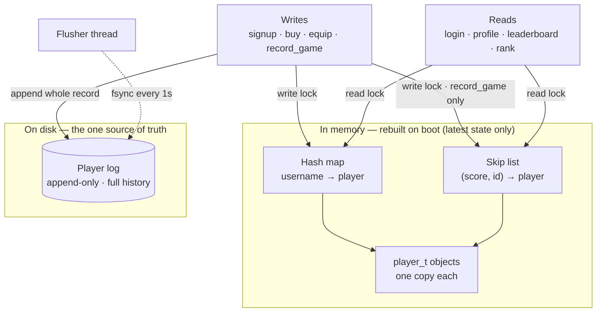
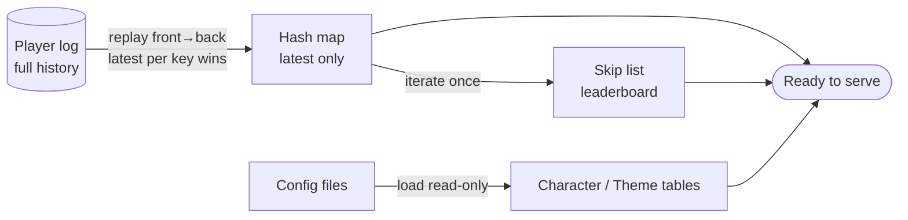

# MacMiniDB — *NoSQLite*

A lightweight, single-node, in-memory NoSQL store for the tetriSH, durably backed by a Last-Writer-Wins (LWW) append-only log on disk.

---

## 1. Overview

MacMiniDB keeps all live player state in memory for fast reads and writes, and persists every write to an append-only log file. On boot, the log is replayed (LWW) to rebuild the in-memory structures. Static catalogues (characters, themes) are loaded from config files.

---

## 2. Scale Assumptions

At our expected **~300 users**, everything fits in RAM with enormous headroom.

---

## 3. Database Operations

### Writes

- `signup` — create a player record
- `buy` — purchase a character or theme (money path)
- `equip` — set current character / current theme
- `record_game` — post-game write: update leaderboard score, wallet points, games/wins. **The only write that touches the skip list.**

### Reads

- `login` — verify credentials, return player
- `profile` — `get_player_info` for the settings / loadout page; also serves `does_player_own_*`
- `leaderboard` — top *N* players
- `rank` — player's rank (`"you're #N"`)

---

## 4. Document Schema

| Document | Fields |
|---|---|
| **Player** | `player_id`, `username`, `password_hashed`, `salt`, `leaderboard_score`, `wallet_points`, `current_equipped_character`, `current_equipped_theme`, `owned_characters`, `owned_themes` |
| **Character** | `character_id`, `name`, `abilities`, `cost_points` |
| **Theme** | `theme_id`, `name`, `description` |

---

## 5. Architecture

---

## 6. Boot / Recovery

---

## 7. Design Decisions
 
### 7.1 SQL vs NoSQL
 
After listing out all of the database operations, NoSQL is considerably easier to implement than SQL for our case. SQL is more robust and more loosely coupled, but it is overkill here. Given the time and effort available, a simple NoSQLite store built on an LWW append-only file comfortably meets our requirements.
 
**Trade-off:** the design is more tightly coupled, and recovery requires reading through the entire log at boot.
 
### 7.2 Log Record Format — Command Log (Redis AOF) vs Whole-Record LWW (Bitcask-style)
 
Because our records are tiny and every write updates exactly one player's document, whole-record LWW simplifies the entire operation. There is no need to replay a sequence of mutating commands, the latest record for a key simply wins.
 
### 7.3 Durability
 
| Policy | Effect |
|---|---|
| Flush every write | Safest, but slow. |
| **Flush every second (chosen)** | Best balance — lose at most ~1 s of data on a crash. |
| Never flush | Fastest, but all data is lost on a crash. |
 
**Chosen: flush every second.**
 
### 7.4 Leaderboard Data Structure
 
| Operation | Max Heap | B+ Tree | AVL Tree | Skip List |
|---|---|---|---|---|
| Insert | O(log n) | O(log n) | O(log n) | O(log n) |
| Update score | O(n) | O(log n) | O(log n) | O(log n) |
| Delete player | O(n) | O(log n) | O(log n) | O(log n) |
| Top K | O(k log n) | O(log n + k) | O(log n + k) | O(log n + k) |
| Rank of a player | O(n) | O(log n) | O(log n) | O(log n) |
| Player at rank r | O(n) | O(log n) | O(log n) | O(log n) |
| Range [a, b] | O(n) | O(log n + k) | O(log n + k) | O(log n + k) |

 
**Reasoning:**
 
Max heap is ruled out: it is a fixed-size array, whereas the other three are dynamically allocated. It is also poor at rank, range, and "player at rank r" queries (all O(n)), which we need for the leaderboard.
 
The remaining three (B+ tree, AVL tree, skip list) have effectively the same time complexity for insert, update, delete, and read. So the deciding factors become implementation complexity and space complexity. Skip list has the easiest implementation of the three. It uses a little more space than an AVL tree, but for read–write locking it is simpler than both the B+ tree and the AVL tree, since it has no rotation operations to coordinate.
 
**Chosen: skip list.**
 
### 7.5 Concurrency
 
| Strategy | Verdict |
|---|---|
| Global mutex | Simple. |
| **Read–write lock (chosen)** | Best fit. |
| Lock-free reads + copy-on-write (COW / RCU) | Most complex. |
 
**Chosen: read–write lock.**
 
---

## 8. References

**SQLite**
- DB tutorial — https://cstack.github.io/db_tutorial/

**NoSQL / Persistence**
- Redis — Persistence and durability — https://redis.io/tutorials/operate/redis-at-scale/persistence-and-durability/
- Redis — Persistence — https://redis.io/docs/latest/operate/oss_and_stack/management/persistence/
- Bitcask: a log-structured fast KV store — https://medium.com/@arpitbhayani/bitcask-a-log-structured-fast-kv-store-c6c728a9536b

**Skip List**
- Redis sorted sets and skip lists — https://mecha-mind.medium.com/redis-sorted-sets-and-skip-lists-4f849d188a33
- GeeksforGeeks — Skip List — https://www.geeksforgeeks.org/dsa/skip-list/
- UMD CMSC420 — Skip lists notes — https://www.math.umd.edu/~immortal/CMSC420/notes/skiplists.pdf
- Why Redis chose the skip list for its sorted sets (ZSet) — https://www.linkedin.com/pulse/why-redis-chose-skip-list-its-sorted-sets-zset-jisan-ahmed-uubdc/

**Read and Write Locks**
- Read and Write Lock in DBMS — https://medium.com/@ansari.rizwan3459/read-and-write-lock-in-dbms-1637671cf7b4
- Multithreaded Programming with pthreads (UCSB CS140), pp. 99–103 — https://sites.cs.ucsb.edu/~tyang/class/140s14/slides/Chapt4-pthreads.pdf
- Oracle — Using Read-Write Locks (Multithreaded Programming Guide) — https://docs.oracle.com/cd/E19455-01/806-5257/6je9h032u/index.html
