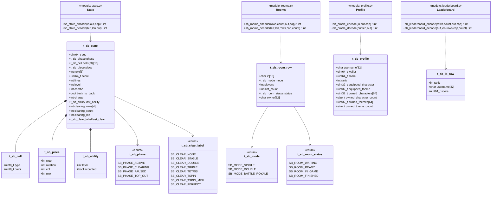

# libstatusbody

The shared HTTTP message-body codec library for tetriSH, implemented in C.
Encodes and decodes the plaintext bodies `tetrisd` sends and `tetrisu`
receives — gameplay `STATE` snapshots, `LIST /rooms` rows, the UC-20 profile
view, and UC-21 leaderboard rows — with no sockets, no brain/room/db headers,
and no I/O.

---

## Table of Contents

- [Features](#features)
- [Build](#build)
- [Using the Library](#using-the-library)
- [Codec Contract](#codec-contract)
- [Wire Formats](#wire-formats)
- [Class Diagram](#class-diagram)
- [API Reference](#api-reference)
- [Design Constraints](#design-constraints)
- [Project Structure](#project-structure)
- [Testing](#testing)

---

## Features

- Four self-contained body codecs: gameplay `STATE`, room-list rows, profile view, leaderboard rows
- Every codec follows one shared encode/decode contract with the same error-code meanings
- Round-trip law enforced by construction: `decode(encode(x)) == x`, field-for-field
- Deterministic encoding — identical input always produces identical bytes
- Bounds-checked in both directions: encoders never write past `cap`, decoders never read past `len`
- Empty-list bodies (no rooms, no leaderboard entries) are valid, not errors — they're real UI states (UC-03, UC-21 ext 2a)
- Wire-facing structs only — the daemons map their own domain types into these, so this library never depends on `libtetrisbrain`, `libtetrisroom`, or `libmacminidb`

---

## Build

Build the static archive with `make`:

```bash
make
```

This compiles every `.c` under `src/` and archives them into
`libstatusbody.a`. Compiled with `-std=c11 -Wall -Wextra -Werror -pedantic`;
no dependencies beyond a C compiler and the C standard library.

Makefile targets:

| Command       | Description                                          |
|---------------|-------------------------------------------------------|
| `make`        | Build `libstatusbody.a`                                |
| `make test`   | Build the archive and run the unit tests                |
| `make clean`  | Remove object files and test binaries                   |
| `make fclean` | Remove object files, test binaries, and the archive     |
| `make re`     | Full rebuild (`fclean` + `all`)                         |

---

## Using the Library

Link the archive and add its include path when compiling your own code:

```bash
gcc my_program.c lib/libstatusbody/libstatusbody.a -I lib/libstatusbody/include -o my_program
```

Then include the single public header and encode/decode a body:

```c
#include "statusbody.h"

t_sb_state	frame;
char		body[4096];
int			len;

memset(&frame, 0, sizeof(frame));
frame.seq = 42;
frame.phase = SB_PHASE_ACTIVE;
frame.piece = (t_sb_piece){ .type = 3, .rotation = 1, .col = 4, .row = 0 };
frame.charge = 7;
// ... fill remaining fields (board cells, next queue, score/lines/level) ...

len = sb_state_encode(&frame, body, sizeof(body));
if (len < 0) {
    // errno == EINVAL (bad field) or ERANGE (buffer too small)
}

// tetrisu, on receipt of the HTTTP response body:
t_sb_state	decoded;
if (sb_state_decode(body, (size_t)len, &decoded) == 0) {
    // decoded now mirrors frame field-for-field
}
```

`tetrisd` builds a `t_sb_state`/`t_sb_room_row`/`t_sb_profile`/`t_sb_lb_row`
from its own server-owned state, snapshotted **after** releasing the room
mutex (see `docs/tetrisu-local-to-tetrisd.md`), then encodes it into the
HTTTP response or `STATE` push body.

---

## Codec Contract

Every `sb_*_encode`/`sb_*_decode` pair shares one contract (from the header's
top comment):

| Call | Success | Failure |
|---|---|---|
| `sb_*_encode(in, out, cap)` | bytes written | `-1`, `errno = EINVAL` (bad field value or NULL) or `ERANGE` (`cap` too small) — never writes past `cap` |
| `sb_*_decode(buf, len, out)` | `0` | `-1`, `errno = EBADMSG` (missing key, malformed/out-of-range value, trailing junk) or `EINVAL` (NULL) — never reads past `len` |

**Round-trip law:** for every valid value `x`, `decode(encode(x)) == x`
field-for-field, and `encode` is deterministic — the same input always
produces the same bytes.

**Empty lists are not errors.** `sb_rooms_decode`/`sb_leaderboard_decode` on
an empty buffer succeed with `count == 0` (an empty lobby or leaderboard is a
real state, per UC-03 and UC-21 ext 2a). The single-object codecs
(`sb_state_decode`, `sb_profile_decode`) do require their full fixed key set,
so an empty buffer there is `EBADMSG`.

---

## Wire Formats

All bodies are plaintext `key value` lines, one HTTTP body per codec.

### `application/tetris-state` (`state.c`)

Fixed key order, exactly as encoded:

```
seq 42
phase active
piece 3 1 4 0
next 0 1 2
score 1200
lines 14
level 2
combo 3
b2b 1
charge 7
ability 2 1
clear tetris
clearing 2 350 18 19
board
00000000000000000000
00000000000000000000
...                     (exactly 20 rows)
```

- `piece <type> <rotation> <col> <row>`; `next <t0> <t1> <t2>` (`SB_NEXT_COUNT` = 3)
- `ability <level> <0|1>` — last activation feedback, level `0` = none
- `clear <none|single|double|triple|tetris|tspin|tspin_mini|perfect>`
- `clearing <count> <ms> [<rows>...]` — animation state, `count` 0–4
- `board` block: exactly `SB_BOARD_ROWS` (20) lines of `SB_BOARD_COLS` (10) hex-pair cells — one hex nibble for `t_sb_cell.type` (0–2), one for `color` (0–15)

### `LIST /rooms` rows (`rooms.c`)

One line per room:

```
<id> <mode> <players>/<slots> <status> <owner>
```

- `mode` ∈ `SINGLE | DOUBLE | BATTLE_ROYALE`
- `status` ∈ `WAITING | READY | IN_GAME | FINISHED`
- An empty room list is a valid empty body (zero lines), not an error

### UC-20 ProfileView (`profile.c`)

Fixed key order, one key per line; owned lists are count-prefixed
(`<count> <id>...`):

```
username alice
wallet 1200
score 4800
rank 3
equipped_character 2
equipped_theme 1
owned_characters <count> <id>...
owned_themes <count> <id>...
```

Owned-list counts are capped at `SB_OWNED_MAX` (64) in both directions.

### Leaderboard rows (UC-21) (`leaderboard.c`)

One line per rank, ascending:

```
<rank> <username> <score>
```

An empty leaderboard is a valid empty body (zero lines), not an error.

---

## Class Diagram



---

## API Reference

### STATE (`state.c`)

| Function | Description |
|---|---|
| `sb_state_encode(in, out, cap)` | Serialise one gameplay snapshot; validates ranges (`phase`, `charge` 0–10, `clearing_count` 0–4, cell type/color nibbles) before writing |
| `sb_state_decode(buf, len, out)` | Parse a snapshot back; strict on key order, requires every key, exactly 20 board rows of 20 hex chars, and no trailing bytes |

### Rooms (`rooms.c`)

| Function | Description |
|---|---|
| `sb_rooms_encode(rows, count, out, cap)` | Serialise `LIST /rooms`; `count == 0` yields a valid empty body |
| `sb_rooms_decode(buf, len, rows, cap, count)` | Parse room rows; an empty buffer decodes to `count == 0`, not an error; more rows than `cap` fails `ERANGE` |

### Profile (`profile.c`)

| Function | Description |
|---|---|
| `sb_profile_encode(in, out, cap)` | Serialise the UC-20 ProfileView body; owned-character/theme lists written as `<count> <id>...` |
| `sb_profile_decode(buf, len, out)` | Parse a profile body; enforces `SB_NAME_MAX` on `username` and `SB_OWNED_MAX` on both owned lists |

### Leaderboard (`leaderboard.c`)

| Function | Description |
|---|---|
| `sb_leaderboard_encode(rows, count, out, cap)` | Serialise UC-21 leaderboard rows, rank ascending; `count == 0` yields a valid empty body |
| `sb_leaderboard_decode(buf, len, rows, cap, count)` | Parse leaderboard rows; an empty buffer decodes to `count == 0`, not an error |

---

## Design Constraints

- **No I/O or hidden state.** Every codec is a pure function over caller-owned buffers/structs; no `malloc`, mutable globals, or syscalls.
- **No dependency on domain libraries.** `libstatusbody` never includes `tetrisbrain.h`, `tetrisroom.h`, or `macminidb.h` — the daemons map their own structs into these wire-facing ones at the boundary.
- **Bounded in both directions.** Encoders never write past `cap`; decoders never read past `len`, even on hostile/truncated input (verified under valgrind, see `test_hardening.c`).
- **Deterministic encode, strict decode.** Same struct in → same bytes out, every time. Decode requires the exact fixed key order for single-object bodies and rejects anything out of range, malformed, or trailing.
- **Empty is a valid state, not an error.** Room lists and leaderboards can legitimately be empty (UC-03, UC-21 ext 2a); only the single-object bodies (`STATE`, profile) require their full key set.
- **Frame size cap.** Every codec's worst-case output (full board, 99 rooms, 64+64 owned ids, 10 leaderboard rows) stays under the project-wide 64 KiB HTTTP frame cap — no body this library produces can trigger a `413` on its own.
- **Verdicts are dedicated enums, and errors are `errno`-style.** No boolean overloading of a richer outcome; `EINVAL` vs. `EBADMSG` vs. `ERANGE` distinguish "caller misuse," "bad wire data," and "buffer too small" respectively.

---

## Project Structure

```
libstatusbody/
├── include/
│   └── statusbody.h        Public header — the whole API (-I include)
├── src/
│   ├── state.c              application/tetris-state encode/decode
│   ├── rooms.c               LIST /rooms row encode/decode
│   ├── profile.c              UC-20 ProfileView encode/decode
│   └── leaderboard.c          UC-21 leaderboard row encode/decode
├── tests/
│   ├── test_state.c          WT-01..WT-10
│   ├── test_rooms.c          WT-11..WT-16
│   ├── test_profile.c        WT-17..WT-20
│   ├── test_leaderboard.c    WT-21..WT-23
│   └── test_hardening.c      WT-24..WT-27, cross-codec
├── scripts/
│   └── run_tests.sh          Formatted test runner
├── obj/                      Generated objects
└── libstatusbody.a           Generated archive
```

---

## Testing

```bash
make test
```

Each body type has a matching `tests/test_*.c` with its own `main()`, plus a
cross-codec `test_hardening.c` mirroring `libhtttp`'s hardening suite. Every
test binary is expected to exit `0` under
`valgrind --leak-check=full --error-exitcode=1`.

The full test matrix (WT-01 … WT-27) lives in
[`docs/test_plan_libs.md`](../../docs/test_plan_libs.md), each row traced back
to a use case or the round-trip/frame-cap laws above.

### Filtering tests

Use `FILTER` to build and run only suites whose name contains a substring:

```bash
make test FILTER=state         # only tests/test_state.c
make test FILTER=hardening     # only tests/test_hardening.c
```
