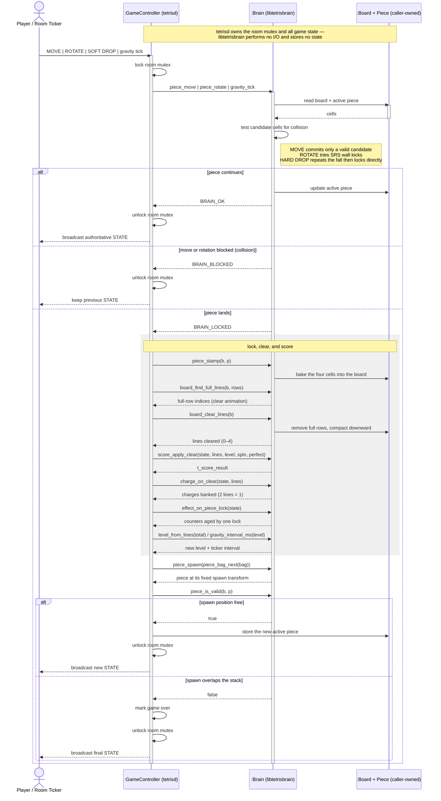

# libtetrisbrain

`libtetrisbrain` is the pure game-logic library for tetriSH. It owns the board model, SRS piece movement, gravity, line clearing, Guideline scoring, the seven-bag randomiser, the ability charge meter, and the Gaiden status effects.

---

## Table of Contents

- [Build And Test](#build-and-test)
- [Usage](#usage)
- [Board Model](#board-model)
- [Game Step](#game-step)
- [Character Abilities](#character-abilities)
- [API Reference](#api-reference)
- [Project Structure](#project-structure)

---

## Build And Test

```bash
make -C lib/libtetrisbrain
make -C lib/libtetrisbrain test
make -C lib/libtetrisbrain test FILTER=abilities
make -C lib/libtetrisbrain clean
make -C lib/libtetrisbrain fclean
make -C lib/libtetrisbrain re
```

Build output is `lib/libtetrisbrain/libtetrisbrain.a`. Consumers link the archive
and add the public include directory:

```bash
cc ... -I lib/libtetrisbrain/include lib/libtetrisbrain/libtetrisbrain.a
```

C11 with `-Wall -Wextra -Werror -pedantic`; no dependencies beyond libc.

---

## Usage

```c
#include "tetrisbrain.h"

t_board			board;
t_score_state	scoring;
t_piece_bag		bag;
t_piece			p;

board_init(&board);
score_state_init(&scoring);
piece_bag_init(&bag, seed);          /* caller owns the RNG; no globals */

p = piece_spawn(piece_bag_next(&bag));
piece_move(&board, &p, -1, 0);       /* shift left  */
piece_rotate(&board, &p, 1);         /* rotate CW, with SRS wall kicks */

if (gravity_tick(&board, &p) == BRAIN_LOCKED) {
    piece_stamp(&board, &p);
    int lines = board_clear_lines(&board);
    score_apply_clear(&scoring, lines, level_from_lines(total),
        T_SPIN_NONE, board_is_empty(&board));
}
```

`tetrisd` holds the room mutex around every call; this library never allocates,
takes a lock, blocks, or touches the network.

---

## Board Model

- `BOARD_WIDTH` (`10`) columns × `BOARD_HEIGHT` (`20`) rows, indexed
  `board_get(b, col, row)`.
- Coordinates are **row-down**: `row 0` is the top, `row 19` the floor. Piece
  shape offsets and the pre-converted SRS kick tables follow the same
  convention.
- Out-of-bounds reads return `CELL_FILLED` (a solid wall), so collision checks
  need no per-caller range guards; out-of-bounds writes are ignored.
- A cell carries a `t_cell_type` (`CELL_EMPTY`, `CELL_FILLED`, `CELL_GARBAGE`)
  and an 8-bit `color`; a stamped piece records its `t_piece_type` as the colour.
- A piece with an out-of-range `type` or `rotation` — say, from a malformed
  network message — fails validation instead of indexing the shape tables out of
  bounds.

---

## Game Step

`tetrisd` owns the board, active piece, score, and lifecycle; the library only
evaluates or transforms the values passed in. A blocked spawn is the server's
call — `piece_is_valid` reports it, and `tetrisd` decides the game is over.



Battle Royale ability transforms are applied out of band — see [Character Abilities](#character-abilities).

---

## Character Abilities

Selection, targeting, and event publication belong to `tetrisd`. The library supplies three stateless halves of the mechanic: the cost/charge arithmetic (`charge.c`), the board transform (`abilities.c`), and the effect countdown (`effects.c`).

| Character | Ability | Call | Board effect |
|---|---|---|---|
| Wolfman | Cut Top | `board_cut_top(b, n)` | Discard the top `n` rows; the stack shifts up |
| Wolfman | Level 4 Gravity | `board_apply_gravity(b)` | Drop suspended cells to the floor per column, order preserved |
| Mirurun | Cut Bottom | `board_cut_bottom(b, n)` | Discard the bottom `n` rows; the stack shifts down |
| Halloween | Dark | `board_invert(b)` | Swap empty ↔ garbage for every cell |
| Halloween | Burn | `board_fill_rows(b, n, hole_col)` | Overwrite the bottom `n` rows with garbage, gap at `hole_col`; no shift |
| Halloween | Bomb | `board_clear_cells(b, cols, rows, count)` | Clear a scattered set of cells; out-of-range targets ignored |
| Princess | Laser | `board_delete_columns(b, start, end)` | Clear the inclusive, bounds-clamped column range across every row |

```mermaid
sequenceDiagram
    actor In as Player / Game Event
    participant AC as :AbilityController (tetrisd)
    participant CM as :charge.c
    participant AB as :abilities.c
    participant EF as :effects.c
    participant Bd as :Board[target] (caller-owned)

    In->>AC: activate ability(level)
    activate AC
    AC->>AC: resolve character, level, and target
    AC->>CM: charge_can_afford(state, level)
    activate CM
    note right of CM: ability_cost(level) = 2 / 4 / 6 / 8

    alt not enough charge
        CM-->>AC: false
        AC-->>In: 409 Conflict — no charge spent and no effect applied
    else affordable
        CM-->>AC: true
        AC->>CM: charge_deduct(state, level)
        CM-->>AC: charge updated
        deactivate CM

        AC->>AC: lock target room mutex

        alt Wolfman — Cut Top
            AC->>AB: board_cut_top(b, n)
            AB->>Bd: drop the top n rows, shift the stack up
        else Wolfman lvl 4 — Gravity
            AC->>AB: board_apply_gravity(b)
            AB->>Bd: settle suspended cells per column
        else Mirurun — Cut Bottom
            AC->>AB: board_cut_bottom(b, n)
            AB->>Bd: drop the bottom n rows, shift the stack down
        else Halloween — Dark
            AC->>AB: board_invert(b)
            AB->>Bd: swap empty ↔ garbage
        else Halloween — Burn
            AC->>AB: board_fill_rows(b, n, hole_col)
            AB->>Bd: overwrite the bottom n rows, gap at hole_col
        else Halloween — Bomb
            AC->>AB: board_clear_cells(b, cols, rows, count)
            AB->>Bd: clear the listed cells only
        else Princess — Laser
            AC->>AB: board_delete_columns(b, start, end)
            AB->>Bd: clear the clamped column range
        else Wolfman — Thwack
            AC->>AB: board_cascade_clear(b)
            AB->>Bd: clear, settle, re-clear until stable
            AB-->>AC: running sum of lines cleared
        end

        note right of AB: every transform mutates the caller-owned t_board<br/>in place and returns void<br/>bad sizes are clamped and stray targets ignored

        opt ability applies a status effect
            AC->>EF: effect_apply(state, effect)
            activate EF
            EF-->>AC: duration armed — 3 or 4 pieces, or until cleared
            deactivate EF
        end

        AC->>AC: copy authoritative state, unlock room mutex
        AC-->>In: broadcast updated STATE
    end
    deactivate AC
```



---

## API Reference

Single public header, `include/tetrisbrain.h`.

### Board (`board.c`)

| Function | Description |
|---|---|
| `board_init(b)` | Zero every cell to `CELL_EMPTY` |
| `board_get(b, col, row)` | Read a cell; off-board reads return `CELL_FILLED` |
| `board_set(b, col, row, cell)` | Write a cell; off-board writes are ignored |
| `board_in_bounds(col, row)` | Test whether a coordinate lies on the board |
| `board_inject_garbage(b, lines, hole_col)` | Shift the stack up and add `lines` garbage rows with a gap at `hole_col` |
| `board_copy(dst, src)` | Copy one board over another |

### Pieces (`pieces.c`)

| Function | Description |
|---|---|
| `piece_spawn(type)` | Return a piece at its centred spawn position and rotation |
| `piece_is_valid(b, p)` | Test whether all four cells are empty and in range |
| `piece_cells(p, cols, rows)` | Export the four occupied coordinates, for rendering |
| `piece_move(b, p, dcol, drow)` | Translate the piece; `BRAIN_BLOCKED` if it would collide |
| `piece_rotate(b, p, dir)` | Rotate `+1` CW / `-1` CCW with SRS wall kicks; `BRAIN_BLOCKED` if no kick fits |
| `piece_rotate_with_kick(b, p, dir, kick_index)` | Rotate and report which SRS kick test succeeded, for T-Spin classification |
| `piece_t_spin_type(b, p, kick_index)` | Apply the three-corner/pointing-side rule: `T_SPIN_NONE`, `T_SPIN_MINI`, `T_SPIN_FULL` |
| `piece_stamp(b, p)` | Write the four cells into the board as `CELL_FILLED` |

### Bag (`bag.c`)

| Function | Description |
|---|---|
| `piece_bag_init(bag, seed)` | Initialise caller-owned deterministic seven-bag state; `seed 0` falls back to `BAG_FALLBACK_SEED` |
| `piece_bag_next(bag)` | Deal one type; reshuffle one of each when the bag empties |

### Gravity (`gravity.c`)

| Function | Description |
|---|---|
| `gravity_tick(b, p)` | Fall one row; `BRAIN_LOCKED` when it lands |
| `piece_soft_drop(b, p)` | Player-triggered fall-by-one; same rule as `gravity_tick` |
| `piece_hard_drop(b, p)` | Fall until it lands |
| `piece_drop_distance(b, p)` | Rows the piece would fall before landing, without mutating it — the ghost/drop preview |

### Line Clear (`lineclear.c`)

| Function | Description |
|---|---|
| `board_clear_lines(b)` | Remove full rows and compact downward; returns lines cleared (`0–4`) |
| `board_find_full_lines(b, rows)` | Report full-row indices without mutating the board, for the clear animation |
| `board_is_empty(b)` | Detect a perfect clear |

### Scoring (`scoring.c`)

| Function | Description |
|---|---|
| `score_state_init(state)` | Start at zero score, no combo, no back-to-back |
| `score_apply_clear(state, lines, level, spin, perfect)` | Award clear/T-Spin, combo, back-to-back, and perfect-clear points; returns the `t_score_result` breakdown |
| `score_add_drop(state, cells, hard_drop)` | Add 1 point per cell soft-dropped, 2 per cell hard-dropped |
| `score_on_clear(lines_cleared, level)` | Plain clear table (`100 / 300 / 500 / 800`) × displayed level |
| `level_from_lines(total_lines)` | Displayed level; starts at `1` and rises every ten lines |
| `gravity_interval_ms(level)` | Tetris Worlds-style interval; `0` means caller-applied 20G at level 19+ |

### Abilities (`abilities.c`)

Every call is a `void` in-place `t_board` transform — see
[Character Abilities](#character-abilities) for the mapping — except:

| Function | Description |
|---|---|
| `board_cascade_clear(b)` | Clear, settle, and re-clear until stable; returns the running sum, which can exceed `BRAIN_MAX_CLEAR_LINES` |

### Charge (`charge.c`)

| Function | Description |
|---|---|
| `charge_state_init(state)` | Reset to zero charges and zero banked lines |
| `charge_on_clear(state, lines_cleared)` | Bank cleared lines at `LINES_PER_CHARGE` (2) per charge, carrying the odd line as remainder |
| `ability_cost(level)` | Price a level `1–4` at `2/4/6/8`; `-1` when out of range |
| `charge_can_afford(state, level)` | Pure read: enough charge for that level |
| `charge_deduct(state, level)` | Deduct on success; an unaffordable or invalid level consumes nothing |
| `charge_transfer(from, to)` | Move all whole charges (Halloween "Vampire"); each side keeps its own remainder |

### Effects (`effects.c`)

Piece-counted status effects. The library owns the canonical durations and the lock-time countdown, so `tetrisd`'s input checks and `tetrisu`'s prediction agree on which piece an effect expires on.

| Function | Description |
|---|---|
| `effect_state_init(state)` | Set every effect inactive |
| `effect_apply(state, effect)` | (Re)start an effect at its full duration — Paralysis/Inversion 3 pieces, Nue/Thwack 4, Fry 3 rows on the next lock; Dark/Pals/Mirror stay on until cleared |
| `effect_clear(state, effect)` | Deactivate one effect immediately |
| `effect_on_piece_lock(state)` | Age every counter by one lock and consume Fry's pending burn — read `effect_fry_rows` first if the burn still needs forwarding; Dark/Pals/Mirror are untouched |
| `effect_rotation_blocked(state)` | Paralysis is blocking rotation |
| `effect_fastdrop_blocked(state)` | Nue is blocking soft/hard drop |
| `effect_controls_inverted(state)` | Inversion is active |
| `effect_thwack_active(state)` | Thwack is active |
| `effect_fry_rows(state)` | Rows Fry burns on the next lock; `0` when inactive |

### Result Types

| Type | Values |
|---|---|
| `t_brain_result` | `BRAIN_OK`, `BRAIN_BLOCKED`, `BRAIN_LOCKED`, `BRAIN_GAME_OVER`, `BRAIN_CLEARED` |
| `t_spin_type` | `T_SPIN_NONE`, `T_SPIN_MINI`, `T_SPIN_FULL` |
| `t_status_effect` | `EFFECT_PARALYSIS`, `EFFECT_INVERSION`, `EFFECT_NUE`, `EFFECT_THWACK`, `EFFECT_FRY`, `EFFECT_DARK`, `EFFECT_PALS`, `EFFECT_MIRROR` |
| `t_score_result` | `action_points`, `combo_points`, `perfect_clear_points`, `total_awarded`, `difficult` |

---

## Project Structure

```text
libtetrisbrain/
├── include/tetrisbrain.h   Public header — the whole API
├── src/
│   ├── board.c             Board model, cell access, garbage injection
│   ├── pieces.c            Tetromino shapes, SRS rotation, wall kicks, T-Spin rule
│   ├── bag.c               Caller-owned deterministic seven-bag randomiser
│   ├── gravity.c           Gravity tick, soft drop, hard drop, drop distance
│   ├── lineclear.c         Full-row detection and compaction
│   ├── scoring.c           Clear/combo/back-to-back scoring, level, gravity ramp
│   ├── abilities.c         Battle Royale ability board transforms
│   ├── charge.c            Ability charge meter and level costs
│   └── effects.c           Gaiden status effects and their lock countdown
├── assets/*.puml, *.svg    Sequence-diagram sources and renders
├── tests/test_*.c          Unit tests, one per module (each with its own main)
├── scripts/run_tests.sh    Formatted test runner
├── obj/                    Generated objects
└── libtetrisbrain.a        Generated archive
```
