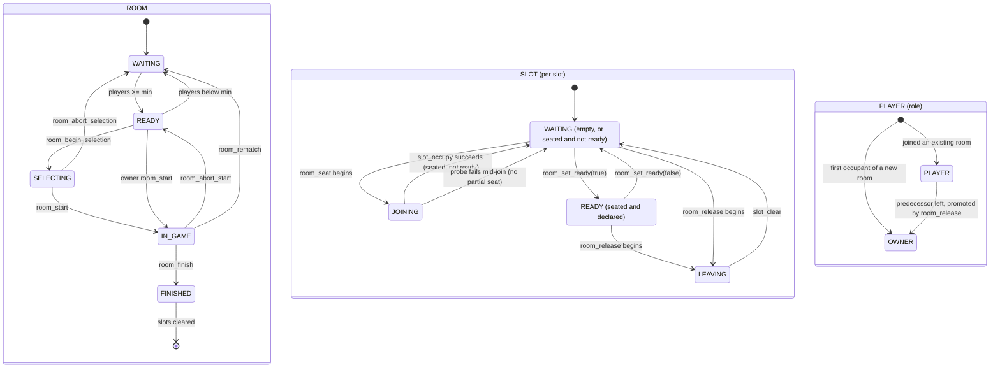

# libtetrisroom

`libtetrisroom` is the pure lobby/room/slot domain library for tetriSH.

---

## Table of Contents

- [Build And Test](#build-and-test)
- [Usage](#usage)
- [Room Identity](#room-identity)
- [Status Model](#status-model)
- [The Connection Probe Seam](#the-connection-probe-seam)
- [API Reference](#api-reference)
- [Project Structure](#project-structure)

---

## Build And Test

```bash
make -C lib/libtetrisroom
make -C lib/libtetrisroom test
make -C lib/libtetrisroom test FILTER=lobby
make -C lib/libtetrisroom clean
make -C lib/libtetrisroom fclean
make -C lib/libtetrisroom re
```

Build output is `lib/libtetrisroom.a`. Consumers link the archive and add the public include directory:

```bash
cc ... -I lib/libtetrisroom/include lib/libtetrisroom/libtetrisroom.a
```

C11 with `-Wall -Wextra -Werror -pedantic`; no dependencies beyond libc.

## Usage

```c
#include "tetrisroom.h"

t_lobby	lobby;
t_room	*room;

lobby_init(&lobby, LOBBY_MAX_ROOMS, 8 /* default BR slot count */);
lobby_create_room(&lobby, MODE_DOUBLE, &room);   /* creates D-01, seats nobody */

room_seat(room, /* pid */ 17, "alice", NULL, NULL);  /* slot 1, becomes owner */
room_seat(room, 22, "bob", NULL, NULL);              /* slot 2, room READY */

if (room_start(room, 17) == START_ACCEPTED) {
    /* tetrisd drives gameplay via libtetrisbrain from here */
}

t_release_result out;
room_release(room, 17, NULL, NULL, &out);   /* owner leaves; bob is promoted */
```

`tetrisd` holds the room mutex around every call; this library never takes a
lock, blocks, or touches the network.

## Room Identity

`t_lobby` keeps one monotonic counter per mode and hands the next id to `room_init`, which derives the name as `"<prefix>-<id>"`. 

    S-01, D-02, BR-10

## Status Model

All three modes share one state machine; only `slot_count` and `min_to_start` differ:

| Mode | `slot_count` | `min_to_start` |
|---|---|---|
| Single | 1 | 1 |
| Double | 2 | 2 |
| Battle Royale | 4–99 (clamped) | 4 |

- Only *crossing* `min_to_start` flips `WAITING ⇄ READY`, so status never flaps on every join and leave. 
- Like a Battle Royale room dropping 5→3 goes `WAITING`, and is `READY` again back at 4. 



## The Connection Probe Seam

`room_seat`, `room_release`, and `room_select_successor` take a
Readiness is a seat's own fact, moved only by `room_set_ready`. Occupying a
seat leaves it `WAITING`, because a room whose every occupant was ready by
definition could never be told that one of them was not — which is what left a
player unable to withdraw a readiness they had never declared.

`bool (*probe)(void *ctx, t_player_id pid)` callback plus an opaque `ctx`;
`NULL` means "everyone is connected". It is the library's only I/O-adjacent
seam.

- **Join:** a disconnected joiner reverts the slot to `WAITING`, so no
  `JOINING` slot survives a failed probe and no partial membership is left.
- **Leave:** successor selection skips disconnected candidates, so ownership
  never lands on a dead session.

## API Reference

Single public header, `include/tetrisroom.h`. Slot indices are 1-based.

### Membership (`membership.c`)

| Function | Description |
|---|---|
| `membership_make(pid, username, role)` | Build a membership value; truncates `username` to `ROOM_USER_MAX - 1`; `muted` defaults `false` |
| `membership_set_role(m, role)` | Change role in place (owner succession); identity fields untouched |
| `membership_is_owner(m)` | Test whether `m->role == ROLE_OWNER` |

### Slot (`slot.c`)

| Function | Description |
|---|---|
| `slot_init(s, index)` | Reset to `SLOT_WAITING`, unoccupied, with its fixed 1-based `index` |
| `slot_occupy(s, m)` | Store `m` and mark `SLOT_READY`; rejected (`-1`, unchanged) unless the slot is `SLOT_JOINING` |
| `slot_clear(s)` | Drop the occupant and reset to `SLOT_WAITING`; `index` is preserved |

### Room (`room.c`)

| Function | Description |
|---|---|
| `room_init(r, mode, id, br_slots)` | Set slot count/`min_to_start` from `mode` (BR `br_slots` clamped 4–99) and derive the name; `-1` on NULL room, bad mode, or `id < 1` |
| `room_can_accept(r)` | Pure read: `JOIN_ACCEPTED`, `JOIN_FULL`, or `JOIN_IN_GAME` — status is checked before occupancy, so an in-game room with a free slot still refuses |
| `room_seat(r, pid, username, probe, ctx)` | Seat into the first free slot (`WAITING → JOINING → READY`); first player becomes `ROLE_OWNER`; returns the 1-based slot index, or `-1` on full/in-game/duplicate pid/failed probe |
| `room_recompute_status(r)` | Flip `WAITING ⇄ READY` only when the count crosses `min_to_start` |
| `room_find_member(r, pid)` | Stored membership by identity, or `NULL` if `pid` is not seated |

### Release (`release.c`)

| Function | Description |
|---|---|
| `room_release(r, pid, probe, ctx, out)` | Release a seated player; an owner's successor is promoted *before* the slot is cleared, so `out` never describes an ownerless room; `-1` if `pid` is not seated |
| `room_select_successor(r, probe, ctx)` | First occupied slot in order, skipping the owner and any disconnected candidate; pure read |

### Start (`start.c`)

| Function | Description |
|---|---|
| `room_can_start(r, requester)` | `START_ACCEPTED`, `START_NOT_OWNER`, `START_TOO_FEW_PLAYERS`, or `START_ALREADY_STARTED`. A `SELECTING` room is startable, because starting is what closes the window |
| `room_start(r, requester)` | Re-runs `room_can_start`; flips to `ROOM_IN_GAME` only on `START_ACCEPTED`, unchanged on every rejection |
| `room_abort_start(r)` | Undo a start the caller could not carry out: `ROOM_IN_GAME` back to `WAITING`/`READY`, slots untouched. Only `IN_GAME` is undone, so a finished room stays finished |
| `room_begin_selection(r)` | Open the character-select window on a `READY` room: `ROOM_SELECTING`, nobody playing. `-1` from any other status, so the window cannot be opened on a room that could not have started |
| `room_abort_selection(r)` | Close a window the room can no longer see through — a player leaving can take it below its minimum. Recomputes back to `WAITING`/`READY` |
| `room_finish(r)` | Set `ROOM_FINISHED`, clear every slot, reset the count to `0`. The room is being handed back |
| `room_rematch(r)` | End the match and keep everyone seated for another: straight back to `WAITING`/`READY`, memberships and owner untouched, readiness withdrawn. Never `FINISHED` in between |
| `room_state_message(r)` | Map `t_room_status` to its fixed UI string |

### Lobby (`lobby.c`)

| Function | Description |
|---|---|
| `lobby_init(l, max_rooms, br_slot_count)` | Initialise an empty lobby; `max_rooms` clamped to `1..LOBBY_MAX_ROOMS` |
| `lobby_create_room(l, mode, out)` | Register a new empty room with a generated id/name; seats nobody (the caller seats afterwards); `-1` at capacity or on a bad mode |
| `lobby_find_room(l, name)` | Look up by name, by identity; `NULL` on a miss, which never mutates the lobby |
| `lobby_destroy_room(l, name)` | Remove a room and clear its slots; `-1` on an unknown name. Chat teardown is the caller's job |
| `lobby_list_open(l, out, cap)` | `WAITING`/`READY` rooms as summaries, up to `cap`; `IN_GAME`/`FINISHED` excluded |
| `lobby_list_all(l, out, cap)` | Every room as an admin snapshot, up to `cap`, regardless of status |
| `lobby_room_count(l)` | Count currently registered rooms |

### Projection (`projection.c`)

| Function | Description |
|---|---|
| `room_to_summary(r, out)` | Pure read: project into a lobby row (id, name, mode, players/slots, status, owner name) |
| `room_to_snapshot(r, out)` | Pure read: project into an admin row, adding every seated player id in slot order |

### Result Types

| Type | Values |
|---|---|
| `t_join_verdict` | `JOIN_ACCEPTED`, `JOIN_FULL`, `JOIN_IN_GAME` |
| `t_start_verdict` | `START_ACCEPTED`, `START_NOT_OWNER`, `START_TOO_FEW_PLAYERS`, `START_ALREADY_STARTED` |
| `t_release_result` | `released`, `owner_changed`, `new_owner`, `new_owner_name`, `room_empty` — filled *after* any role change, so a caller's broadcast can never show an ownerless room |

## Project Structure

```text
libtetrisroom/
├── include/tetrisroom.h    Public header — the whole API
├── src/
│   ├── membership.c        Membership value, role changes, owner test
│   ├── slot.c              Per-slot occupancy state machine
│   ├── room.c              Init, join verdicts, seating, status recompute
│   ├── release.c           Leave + owner succession
│   ├── start.c             Start verdicts, game finish, STATE message
│   ├── lobby.c             Room registry: create/find/destroy/list
│   └── projection.c        Room -> summary/snapshot read-only views
├── tests/test_*.c          Unit tests, one per module (each with its own main)
├── scripts/run_tests.sh    Formatted test runner
├── obj/                    Generated objects
└── libtetrisroom.a         Generated archive
```
