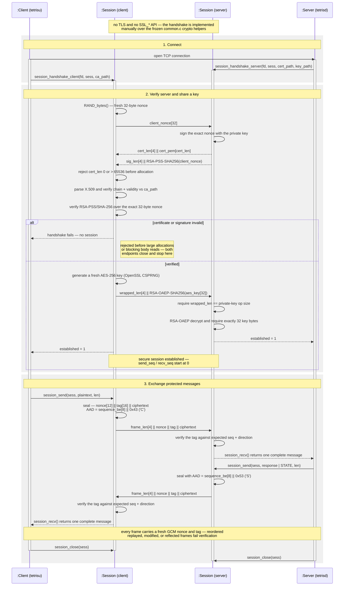

# libtetrissh

`libtetrissh` is the authenticated secure-session layer for tetriSH, sitting between a connected stream socket and HTTTP. It owns server authentication, RSA-wrapped session-key exchange, and one-message-per-frame AES-256-GCM I/O.

Both endpoints link the same implementation, so the handshake and frame format cannot drift apart. This is a project-specific transport, not TLS — see [Security Scope](#security-scope).

---

## Table of Contents

- [Build](#build)
- [Tes](#test)
- [Usage](#usage)
- [API Reference](#api-reference)
- [Secure Session](#secure-session)
- [Handshake Wire Protocol](#handshake-wire-protocol)
- [Frame Format](#frame-format)
- [Ownership And Concurrency](#ownership-and-concurrency)
- [Error Handling](#error-handling)
- [Security Scope](#security-scope)
- [Project Structure](#project-structure)

---

## Build

```bash
make -C lib/libtetrissh
make -C lib/libtetrissh test
make -C lib/libtetrissh test FILTER=session
make -C lib/libtetrissh clean
make -C lib/libtetrissh fclean
make -C lib/libtetrissh re
```

Build output is `lib/libtetrissh/libtetrissh.a`

```bash
cc ... -I lib/libtetrissh/include lib/libtetrissh/libtetrissh.a -lssl -lcrypto
```

C11 with `-std=c11 -D_POSIX_C_SOURCE=200809L -Wall -Wextra -Werror -pedantic`.

---

## Test
`make test` builds every `tests/test_*.c` and runs each binary:

| Test file | Coverage |
|---|---|
| `test_io.c` | Exact read/write, partial EOF, u32/u64 big-endian encoding |
| `test_handshake_socketpair.c` | Real client/server handshake, bidirectional frames, wrong CA |
| `test_handshake_failures.c` | Stale-state wipe, oversized certificate, wrong RSA signature/wrapped lengths |
| `test_session_frames.c` | Both frame directions, replay, oversized plaintext, closed-peer `SIGPIPE` |
| `test_session_security.c` | Tag tamper, reflection, zero/max boundary, malformed lengths, cleanup |


```bash
make -C lib/libtetrissh fclean
```
```
make -C lib/libtetrissh test
```
```
valgrind --leak-check=full --error-exitcode=1 ./tests/bin/test_session_security
```

---

## Usage

Both snippets begin after `connect()` or `accept()` has produced a connected descriptor. Socket setup, timeouts, logging, and HTTTP parsing stay with the caller.

```c
#include "tetrissh.h"

/* server: authenticate, then serve one request */
t_session       sess;
unsigned char   request[TETRISSH_MAX_PLAINTEXT];
ssize_t         len;

memset(&sess, 0, sizeof(sess));
if (session_handshake_server(fd, &sess, cert_path, key_path) != 0)
    return (-1);                       /* sess already wiped */
len = session_recv(&sess, request, sizeof(request));
if (len > 0)
    session_send(&sess, response, response_len);
session_close(&sess);                  /* wipes keys; does NOT close(fd) */
close(fd);
```

```c
/* client: verify the server against the project CA, then exchange */
if (session_handshake_client(fd, &sess, ca_path) != 0)
    return (-1);
session_send(&sess, request, request_len);
session_recv(&sess, response, sizeof(response));
session_close(&sess);
close(fd);
```

---

## API Reference

Single public header, `include/tetrissh.h`. Every call takes the caller's `t_session`; the library allocates no session state of its own.

| Function | Description |
|---|---|
| `session_handshake_server(fd, sess, cert_path, key_path)` | Run the server side on a connected descriptor; `0` on success, `-1` on failure — which wipes and resets a non-NULL `sess` |
| `session_handshake_client(fd, sess, ca_path)` | Run the client side, including certificate-chain and nonce-signature verification; same return and wipe-on-failure contract |
| `session_send(sess, buf, len)` | Encrypt and write exactly one frame; returns the plaintext byte count, or `-1` on invalid state, oversized input, or crypto/socket failure. Increments `send_seq` only on a fully written frame |
| `session_recv(sess, buf, max_len)` | Read and authenticate exactly one frame; returns the plaintext byte count, `0` at clean EOF before the next prefix, or `-1` on a malformed frame, failed authentication, or too-small `max_len`. Increments `recv_seq` only on a fully accepted frame |
| `session_close(sess)` | Cleanse the AES key, clear counters and `established`, set `fd` to `-1`. **Does not** `close(2)` — the caller owns the descriptor |

`session_recv` adds no NUL terminator; treat the output as binary and use the returned length.

| Type | Values |
|---|---|
| `t_tetrissh_role` | `TETRISSH_ROLE_NONE`, `TETRISSH_ROLE_CLIENT`, `TETRISSH_ROLE_SERVER` |
| `t_session` | `fd`, `role`, `aes_key[32]`, `send_seq`, `recv_seq`, `established` |

| Constant | Value | Meaning |
|---|---:|---|
| `TETRISSH_KEY_LEN` | 32 | AES-256 session-key length |
| `TETRISSH_MAX_PLAINTEXT` | 65536 | Largest plaintext one frame carries |

---

## Secure Session



| Property | Implementation |
|---|---|
| Server authentication | X.509 certificate verified against the configured CA |
| Proof of key possession | RSA-PSS/SHA-256 signature over a fresh client nonce |
| Session-key exchange | 32-byte random AES key wrapped with RSA-OAEP/SHA-256 |
| Frame confidentiality | AES-256-GCM |
| Frame integrity | 16-byte GCM tag |
| Replay and ordering | Per-direction sequence number authenticated as AAD |
| Reflection | Direction marker authenticated as AAD |
| Hostile lengths | Certificate capped at 65,536; RSA blobs must match key size |
| Closed-peer writes | `MSG_NOSIGNAL` — returns `-1` instead of killing the process |

---

## Handshake Wire Protocol

Every variable-length field carries an unsigned 4-byte big-endian prefix; the
certificate body is PEM.

```text
Client                                            Server
  |                                                  |
  | client_nonce[32]                                 |
  |------------------------------------------------->|
  |                                                  |
  | cert_len[4] || cert_pem[cert_len]                |
  |<-------------------------------------------------|
  |                                                  |
  | sig_len[4] || RSA-PSS-SHA256(client_nonce)       |
  |<-------------------------------------------------|
  |                                                  |
  | wrapped_len[4] || RSA-OAEP-SHA256(aes_key[32])   |
  |------------------------------------------------->|
  |                                                  |
```

The bounds below reject a hostile peer before any large allocation or blocking
body read; valid handshakes are byte-for-byte unaffected.

| Endpoint | Checks, in order |
|---|---|
| Client | Reject `cert_len` of `0` or above 65,536 → parse the X.509 from PEM → verify chain and validity against `ca_path` → require `sig_len` to equal the certified public-key operation size → verify RSA-PSS/SHA-256 over the exact 32-byte nonce → generate a fresh 32-byte AES key → wrap it with RSA-OAEP/SHA-256 |
| Server | Reject a local certificate above 65,536 → sign the exact client nonce → require `wrapped_len` to equal the private-key operation size → RSA-OAEP decrypt and require exactly 32 plaintext key bytes |

---

## Frame Format

Every frame carries exactly one application message:

```text
frame_len[4] || nonce[12] || tag[16] || ciphertext
```

| Field | Size | Meaning |
|---|---:|---|
| `frame_len` | 4 | Big-endian length of everything after this prefix |
| `nonce` | 12 | Fresh random AES-GCM nonce |
| `tag` | 16 | GCM authentication tag |
| `ciphertext` | 0–65,536 | Encrypted HTTTP message |

Plaintext caps at `TETRISSH_MAX_PLAINTEXT` (65,536), so `frame_len` caps at
65,564 and a complete wire frame at 65,568 bytes.

The GCM additional authenticated data binds each frame to its position and
direction:

```text
sequence_be[8] || direction[1]
```

`direction` is `0x43` (`C`) client-to-server and `0x53` (`S`)
server-to-client. The receiver authenticates against its own expected sequence
and the *opposite* endpoint's marker, so a reordered, replayed, modified, or
reflected frame fails tag verification.

Zero-length frames are accepted, but `session_recv` returns `0` for both an
authenticated empty frame and a clean EOF. HTTTP messages are never empty —
callers should not send zero-length application frames.

---

## Ownership And Concurrency

The caller owns the descriptor for the whole session lifetime, including after
a failed handshake:

```c
session_close(&sess);   /* wipes cryptographic state */
close(fd);              /* releases the caller-owned socket */
```

The handshake, `session_send`, and `session_recv` all perform blocking exact
I/O and may wait on the peer or on TCP backpressure. Set `SO_RCVTIMEO` and
`SO_SNDTIMEO` where a deadline is required — the library has no internal
timeout, cancellation, or non-blocking state machine.

**Never hold a room, player, or registry mutex across any of these calls.** The
required daemon pattern is:

```text
lock -> copy into a local buffer -> unlock -> session_send
```

One slow client must not stall unrelated game state under a shared lock.

`t_session` has mutable sequence counters and no internal mutex. One sending
thread and one receiving thread may run concurrently — they use separate socket
directions and separate counters — provided `session_close` cannot race either.

- Serialise all sends on one session; serialise all receives on one session.
- Never race `session_close` against a send, receive, or handshake.
- If a response thread and a broadcast thread can both send, give the
  connection a per-session write mutex — and release game-state locks before
  taking it.

Operations on different `t_session` objects are fully independent.

---

## Error Handling

Treat any `-1` from a handshake or a frame call as connection-fatal: the stream
may be partially written, partially consumed, unauthenticated, or
sequence-desynchronised. Never retry a failed frame on the same connection.

```c
if (session_recv(&sess, buf, sizeof(buf)) < 0)
{
    session_close(&sess);
    close(fd);
    return (-1);
}
```

| Condition | Result |
|---|---|
| Short, oversized, or malformed `frame_len` | `-1` |
| GCM tag, replay, ordering, or direction mismatch | `-1` |
| `max_len` smaller than the authenticated plaintext | `-1` *after* the frame is consumed — close the connection |
| Socket EOF mid-frame | `-1` |
| Clean EOF before the next frame prefix | `0` |
| Write to a closed peer | `-1`, never a process-fatal `SIGPIPE` |

Certificate diagnostics printed during tests come from the frozen `common.c`.

---

## Security Scope

- **Server authentication only** — the client has no certificate or
  cryptographic identity at this layer.
- **No hostname matching.** The public API takes no expected-hostname
  parameter, so SAN/CN matching is not performed; the chain and validity period
  are checked against a dedicated project CA. Use controlled certificate
  distribution.
- **No explicit key confirmation.** The client marks the session established
  once it has written the wrapped key; the first authenticated response is what
  proves the server unwrapped it.
- **No version negotiation or cipher agility**, and no TLS, `SSL_*` API, TLS
  record layer, or TLS interoperability.
- **Sequence counters are 64-bit and must never wrap** — replace a connection
  long before `UINT64_MAX` frames.
- **Random 96-bit GCM nonces** rely on OpenSSL CSPRNG quality and on each
  session key being fresh.
- The library authenticates frame *bytes*, not HTTTP semantics. Authorization,
  request validation, and server-authoritative game rules stay with `tetrisd`.

---

## Project Structure

```text
libtetrissh/
├── include/
│   ├── tetrissh.h          Public header — the whole API
│   ├── internal.h          Private constants and declarations
│   └── libs/common.h       Frozen course-provided crypto helper
├── src/
│   ├── handshake.c         Nonce, certificate, RSA-PSS, RSA-OAEP
│   ├── session.c           AES-256-GCM frame send/receive
│   ├── io.c                Exact socket I/O and endian helpers
│   └── common.c            Frozen course-provided crypto helper
├── assets/                 Sequence-diagram sources and renders
├── tests/test_*.c          Unit tests, one per module (each with its own main)
├── scripts/
│   ├── generate_test_certs.sh   Temporary certificates for the suite
│   └── run_tests.sh             Formatted test runner
├── obj/                    Generated objects
└── libtetrissh.a           Generated archive
```
