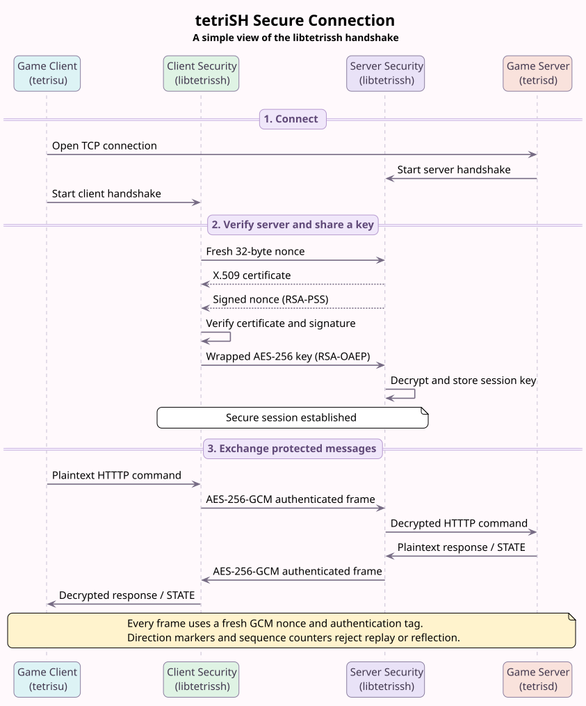

# libtetrissh

`libtetrissh` provides tetriSH's authenticated secure-session layer between an
already connected stream socket and HTTTP. It implements server authentication,
RSA-wrapped session-key exchange, and one-message-per-frame AES-256-GCM I/O.

Both endpoints use this library. Linking the same implementation into clients
and daemons prevents handshake and frame-format drift.

## Secure Session Sequence



Connection has three stages:

1. **Connect:** `tetrisu` opens TCP and both endpoints start their handshake
   functions.
2. **Authenticate and exchange a key:** client sends fresh 32-byte nonce. Server
   returns its X.509 certificate and RSA-PSS signature over that nonce. After
   verification, client sends fresh AES-256 key wrapped with RSA-OAEP.
3. **Exchange protected messages:** `session_send()` and `session_recv()` use
   AES-256-GCM frames for HTTTP commands, responses, and server-pushed `STATE`.

Editable diagram source:
[`assets/libtetrissh-sequence.puml`](assets/libtetrissh-sequence.puml).

## Security At A Glance

| Property | Implementation |
|---|---|
| Server authentication | X.509 certificate verified against configured CA |
| Proof of private-key possession | RSA-PSS/SHA-256 signature over fresh client nonce |
| Session-key exchange | 32-byte random AES key wrapped with RSA-OAEP/SHA-256 |
| Frame confidentiality | AES-256-GCM |
| Frame integrity | 16-byte GCM tag |
| Replay and ordering defense | Per-direction sequence number authenticated as AAD |
| Reflection defense | Direction marker authenticated as AAD |
| Frame size limit | 65,536 bytes plaintext |
| Hostile handshake lengths | Certificate capped; RSA blobs must match key size |
| Closed-peer writes | `MSG_NOSIGNAL`, returning `-1` instead of killing process |

This is a project-specific secure transport, not TLS. See
[Security Scope And Limitations](#security-scope-and-limitations) before using it
outside tetriSH.

## Requirements

- Linux or compatible POSIX environment
- C11 compiler
- OpenSSL development headers and `libssl`/`libcrypto`
- POSIX sockets
- POSIX threads for integration tests
- OpenSSL command-line tool for temporary test certificates

Library-owned sources compile with:

```text
-std=c11 -D_POSIX_C_SOURCE=200809L -Wall -Wextra -Werror -pedantic
```

`src/common.c` and `include/libs/common.h` are course-provided crypto helpers and
must not be modified.

## Build And Link

From repository root:

```bash
make -C lib/libtetrissh
make -C lib/libtetrissh test
make -C lib/libtetrissh clean
make -C lib/libtetrissh fclean
```

Build output:

```text
lib/libtetrissh/libtetrissh.a
```

Example static link:

```bash
cc -std=c11 app.c \
  lib/libtetrissh/libtetrissh.a \
  -Ilib/libtetrissh/include \
  -lssl -lcrypto -o app
```

Include only public header:

```c
#include "tetrissh.h"
```

`src/internal.h` is private and may change without notice.

## Quick Start

These examples begin after TCP `connect()` or `accept()` has produced a
connected descriptor. Socket creation, timeouts, logging, and application
protocol parsing remain caller responsibilities.

### Server

```c
#include "tetrissh.h"
#include <string.h>
#include <unistd.h>

int serve_client(int fd, const char *cert_path, const char *key_path)
{
    static const char response[] = "HTTTP/1.0 200 OK\r\n\r\n";
    t_session sess;
    unsigned char request[TETRISSH_MAX_PLAINTEXT];
    ssize_t request_len;
    int result;

    memset(&sess, 0, sizeof(sess));
    result = -1;
    if (session_handshake_server(fd, &sess, cert_path, key_path) != 0)
        goto cleanup;
    request_len = session_recv(&sess, request, sizeof(request));
    if (request_len <= 0)
        goto cleanup;
    if (session_send(&sess, response, sizeof(response) - 1)
        != (ssize_t)(sizeof(response) - 1))
        goto cleanup;
    result = 0;
cleanup:
    session_close(&sess);
    close(fd);
    return result;
}
```

### Client

```c
#include "tetrissh.h"
#include <string.h>
#include <unistd.h>

int exchange_request(int fd, const char *ca_path)
{
    static const char request[] = "JOIN /arena/main HTTTP/1.0\r\n\r\n";
    t_session sess;
    unsigned char response[TETRISSH_MAX_PLAINTEXT];
    int result;

    memset(&sess, 0, sizeof(sess));
    result = -1;
    if (session_handshake_client(fd, &sess, ca_path) != 0)
        goto cleanup;
    if (session_send(&sess, request, sizeof(request) - 1)
        != (ssize_t)(sizeof(request) - 1))
        goto cleanup;
    if (session_recv(&sess, response, sizeof(response)) <= 0)
        goto cleanup;
    result = 0;
cleanup:
    session_close(&sess);
    close(fd);
    return result;
}
```

## Public API

Exact declarations live in `include/tetrissh.h`.

### `session_handshake_server`

```c
int session_handshake_server(int fd, t_session *sess,
    const char *cert_path, const char *key_path);
```

Runs server side of handshake on connected descriptor. Returns `0` on success
or `-1` on failure. Failure wipes and resets any non-null `sess`.

### `session_handshake_client`

```c
int session_handshake_client(int fd, t_session *sess, const char *ca_path);
```

Runs client side, including certificate and nonce-signature verification.
Returns `0` on success or `-1` on failure. Failure wipes and resets any non-null
`sess`.

### `session_send`

```c
ssize_t session_send(t_session *sess, const void *buf, size_t len);
```

Encrypts and writes exactly one frame. Returns plaintext byte count on success
or `-1` on invalid state, oversized input, crypto failure, or socket failure.
Successful calls increment `send_seq` once.

### `session_recv`

```c
ssize_t session_recv(t_session *sess, void *buf, size_t max_len);
```

Reads and authenticates exactly one frame. Returns plaintext byte count, `0` if
peer closes before next frame prefix, or `-1` on invalid state, malformed frame,
authentication failure, insufficient output capacity, or socket failure.
Successful calls increment `recv_seq` once.

No NUL terminator is added. Treat received data as binary bytes and use returned
length.

### `session_close`

```c
void session_close(t_session *sess);
```

Wipes AES key, clears counters and establishment state, and sets `fd` to `-1`.
It does **not** call `close(2)`. Caller owns descriptor and must close it.

## Handshake Wire Protocol

All variable-length handshake fields use unsigned 4-byte big-endian prefixes.
Certificate body is PEM encoded.

```text
Client                                            Server
  |                                                  |
  | client_nonce[32]                                 |
  |------------------------------------------------->|
  |                                                  |
  | cert_len[4] || cert_pem[cert_len]                |
  |<-------------------------------------------------|
  |                                                  |
  | sig_len[4] || RSA-PSS-SHA256(client_nonce)       |
  |<-------------------------------------------------|
  |                                                  |
  | wrapped_len[4] || RSA-OAEP-SHA256(aes_key[32])   |
  |------------------------------------------------->|
  |                                                  |
```

Client checks:

1. Reject certificate length `0` or above 65,536 bytes before allocation.
2. Parse X.509 certificate from PEM bytes.
3. Verify chain and validity period against `ca_path`.
4. Require signature length to equal certified public-key operation size.
5. Verify RSA-PSS/SHA-256 signature over exact 32-byte nonce.
6. Generate fresh 32-byte AES key with OpenSSL CSPRNG.
7. Wrap AES key using RSA-OAEP/SHA-256.

Server checks:

1. Reject local certificate above 65,536 bytes.
2. Sign exact client nonce with configured private key.
3. Require wrapped-key length to equal private-key operation size.
4. RSA-OAEP decrypt and require exactly 32 plaintext key bytes.

Successful wire bytes are unchanged by these bounds. Invalid peers are rejected
before large allocations or blocking body reads.

## Encrypted Frame Format

Every frame carries exactly one application message:

```text
frame_len[4] || nonce[12] || tag[16] || ciphertext
```

`frame_len` counts bytes after its own 4-byte prefix.

| Field | Size | Meaning |
|---|---:|---|
| `frame_len` | 4 | Big-endian encrypted body length |
| `nonce` | 12 | Fresh random AES-GCM nonce |
| `tag` | 16 | GCM authentication tag |
| `ciphertext` | 0..65,536 | Encrypted HTTTP message |

Maximum plaintext is 65,536 bytes. Maximum `frame_len` is 65,564 bytes, and
maximum complete wire frame including prefix is 65,568 bytes.

GCM additional authenticated data:

```text
sequence_be[8] || direction[1]
```

Direction markers:

| Direction | Marker |
|---|---:|
| Client to server | `0x43` (`C`) |
| Server to client | `0x53` (`S`) |

Receiver authenticates expected sequence and opposite endpoint direction.
Reordered, replayed, modified, or reflected frames fail tag verification.

Zero-length frames are accepted, but `session_recv()` returns `0` for both an
authenticated empty frame and clean EOF. HTTTP messages are non-empty; callers
should not send zero-length application frames.

## Ownership, Blocking, And Concurrency

### Descriptor ownership

Caller owns socket descriptor throughout session lifetime:

```c
session_close(&sess); /* wipes cryptographic state */
close(fd);            /* releases caller-owned socket */
```

Handshake failure also resets session but does not close descriptor.

### Blocking behavior

Handshake, `session_send()`, and `session_recv()` use blocking exact I/O. They
may wait for peer or TCP backpressure. Caller should configure `SO_RCVTIMEO` and
`SO_SNDTIMEO` where deadlines are required.

Never hold room, player, registry, or other shared-state mutex across these
calls. Required daemon pattern:

```text
lock -> copy into local buffer -> unlock -> session_send
```

One slow client must not stall unrelated game state under a shared lock.

### Thread safety

`t_session` has mutable sequence counters and no internal mutex. One sending
thread and one receiving thread may operate concurrently because they use
separate socket directions and counters, provided `session_close()` cannot race.
Same-direction operations require caller serialization.

- Serialize all sends on one session.
- Serialize all receives on one session.
- Do not race `session_close()` against send, receive, or handshake.
- If response thread and broadcast thread can both send, protect connection with
  per-session write mutex. Release game-state locks before taking write mutex.

Concurrent operations on different `t_session` objects are independent.

## Error Handling

Treat any handshake or frame `-1` as connection-fatal. Stream may be partially
written, partially consumed, unauthenticated, or sequence-desynchronized.

```c
if (session_recv(&sess, buf, sizeof(buf)) < 0)
{
    session_close(&sess);
    close(fd);
    return -1;
}
```

Do not retry failed frame on same connection. In particular:

- Short/oversized/malformed frame lengths return `-1`.
- GCM tag, replay, order, or direction failure returns `-1`.
- Output buffer smaller than authenticated plaintext returns `-1` after frame is
  consumed; close connection.
- Partial socket EOF returns `-1`; EOF before next frame prefix returns `0`.
- Closed-peer writes return `-1` rather than raising process-fatal `SIGPIPE` on
  Linux.

Certificate diagnostics printed during tests originate from frozen
course-provided `common.c`.

## Tests

`make test` builds every `tests/test_*.c` file and executes each binary.

| Test file | Coverage |
|---|---|
| `test_io.c` | Exact read/write, partial EOF, u32/u64 big-endian encoding |
| `test_handshake_socketpair.c` | Real client/server handshake, bidirectional frames, wrong CA |
| `test_handshake_failures.c` | Stale-state wipe, oversized certificate, wrong RSA signature/wrapped lengths |
| `test_session_frames.c` | Both frame directions, replay, oversized plaintext, closed-peer `SIGPIPE` |
| `test_session_security.c` | Tag tamper, reflection, zero/max boundary, malformed lengths, cleanup |

Strict suite:

```bash
make -C lib/libtetrissh fclean
make -C lib/libtetrissh test
```

ASan/UBSan suite:

```bash
make -C lib/libtetrissh fclean
make -C lib/libtetrissh test \
  CFLAGS='-std=c11 -D_POSIX_C_SOURCE=200809L -Wall -Wextra -Werror -pedantic -g -O1 -fsanitize=address,undefined -fno-omit-frame-pointer' \
  COMMON_CFLAGS='-std=c11 -D_POSIX_C_SOURCE=200809L -Wall -Wextra -g -O1 -fsanitize=address,undefined -fno-omit-frame-pointer'
```

Valgrind example, run from `lib/libtetrissh` after normal build:

```bash
valgrind --leak-check=full --show-leak-kinds=all --track-origins=yes \
  --error-exitcode=1 ./tests/bin/test_session_security
```

Current development host has Valgrind 3.25.1 instruction-decoding failure on an
AVX-512 `memset` inside `vgpreload_memcheck`, before library code executes.
Rerun Valgrind on compatible checkoff host; this tooling failure is separate
from ASan/UBSan and functional results.

## File Layout

```text
lib/libtetrissh/
|-- Makefile
|-- README.md
|-- include/
|   |-- tetrissh.h             public API
|   `-- libs/common.h          frozen course helper
|-- src/
|   |-- handshake.c            nonce, certificate, RSA-PSS, RSA-OAEP
|   |-- session.c              AES-256-GCM frame send/receive
|   |-- io.c                   exact socket I/O and endian helpers
|   |-- internal.h             private constants and declarations
|   `-- common.c               frozen course helper
|-- tests/
|   `-- test_*.c
`-- scripts/
    |-- generate_test_certs.sh
    `-- run_tests.sh
```

## Security Scope And Limitations

- Server authentication only. Client has no certificate or cryptographic
  identity in this layer.
- Certificate chain and validity period are checked against dedicated CA.
- Public API has no expected hostname parameter, so hostname/SAN matching is not
  performed. Use dedicated project CA and controlled certificate distribution.
- Client marks session established after writing wrapped key. Protocol has no
  explicit server key-confirmation message; first authenticated response proves
  server successfully unwrapped key.
- No protocol version negotiation or cipher agility.
- No TLS, `SSL_*` API, TLS record layer, or standard TLS interoperability.
- No internal timeout, cancellation, or non-blocking state machine.
- No internal synchronization for shared `t_session` use.
- Sequence counters are 64-bit and must never wrap. Replace connection long
  before `UINT64_MAX` frames.
- Random 96-bit GCM nonces rely on OpenSSL CSPRNG quality and fresh session keys.
- Library authenticates frame bytes, not HTTTP semantics. Authorization,
  request validation, and server-authoritative game rules remain daemon duties.
