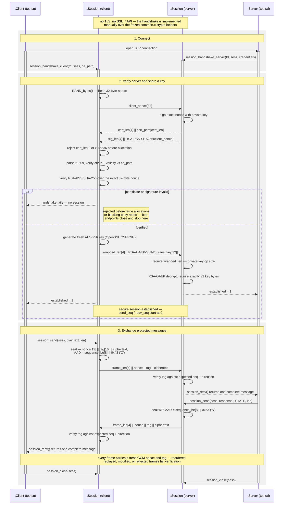

# libtetrissh — Secure Session

The `libtetrissh` handshake and encrypted framing. Mermaid counterpart to
`libtetrissh-sequence.puml`.

```mermaid
sequenceDiagram
    participant CU as :Client (tetrisu)
    participant CS as :Session (client)
    participant SS as :Session (server)
    participant SD as :Server (tetrisd)

    note over CS,SS: no TLS, no SSL_* API — the handshake is implemented<br/>manually over the frozen common.c crypto helpers

    rect rgb(240, 240, 240)
        note over CU,SD: 1. Connect

        CU->>SD: open TCP connection
        activate CU
        activate SD
        SD->>SS: session_handshake_server(fd, sess, credentials)
        activate SS
        CU->>CS: session_handshake_client(fd, sess, ca_path)
        activate CS
    end

    rect rgb(240, 240, 240)
        note over CU,SD: 2. Verify server and share a key

        CS->>CS: RAND_bytes() — fresh 32-byte nonce
        CS->>SS: client_nonce[32]

        SS->>SS: sign exact nonce with private key
        SS-->>CS: cert_len[4] || cert_pem[cert_len]
        SS-->>CS: sig_len[4] || RSA-PSS-SHA256(client_nonce)

        CS->>CS: reject cert_len 0 or > 65536 before allocation
        CS->>CS: parse X.509, verify chain + validity vs ca_path
        CS->>CS: verify RSA-PSS/SHA-256 over the exact 32-byte nonce

        alt certificate or signature invalid
            CS-->>CU: handshake fails — no session
            note right of CS: rejected before large allocations<br/>or blocking body reads — both<br/>endpoints close and stop here
        else verified
            CS->>CS: generate fresh AES-256 key (OpenSSL CSPRNG)
            CS->>SS: wrapped_len[4] || RSA-OAEP-SHA256(aes_key[32])

            SS->>SS: require wrapped_len == private-key op size
            SS->>SS: RSA-OAEP decrypt, require exactly 32 key bytes
            SS-->>SD: established = 1
            CS-->>CU: established = 1
            note over CS,SS: secure session established —<br/>send_seq / recv_seq start at 0
        end
    end

    rect rgb(240, 240, 240)
        note over CU,SD: 3. Exchange protected messages

        CU->>CS: session_send(sess, plaintext, len)
        CS->>CS: seal — nonce[12] || tag[16] || ciphertext,<br/>AAD = sequence_be[8] || 0x43 ('C')
        CS->>SS: frame_len[4] || nonce || tag || ciphertext
        SS->>SS: verify tag against expected seq + direction
        SS-->>SD: session_recv() returns one complete message

        SD->>SS: session_send(sess, response | STATE, len)
        SS->>SS: seal with AAD = sequence_be[8] || 0x53 ('S')
        SS->>CS: frame_len[4] || nonce || tag || ciphertext
        CS->>CS: verify tag against expected seq + direction
        CS-->>CU: session_recv() returns one complete message

        note over CU,SD: every frame carries a fresh GCM nonce and tag — reordered,<br/>replayed, modified, or reflected frames fail verification

        CU->>CS: session_close(sess)
        deactivate CS
        deactivate CU
        SD->>SS: session_close(sess)
        deactivate SS
        deactivate SD
    end
```
